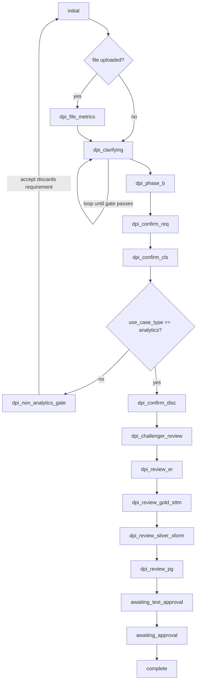

# Current State — GOLD product (`data_product_assistant`) agentic flow

Source: `GOLD DATA PRODUCT/data_product_assistant (1)/data_product_assistant`
Mapped: 2026-09-18. This documents the **real** flow as implemented, not the declared architecture. Where the two disagree, that is called out.

---

## 0. The headline

The declared architecture (an LLM orchestrator sequencing 15 agents via a `flow_routing` contract) and the implemented architecture (a hand-written `if/elif` state machine in `server.py` driving 11 live LLM agents + 2 deterministic Python agents) have **drifted far apart**.

`server.py`'s step machine is the only authoritative spec. `prompts/orchestrator/SKILL.md`, the `flow_routing` field, and `backend/.skills/*.md` are aspirational documents.

---

## 1. Phases

| Phase | Expands to | Job |
|---|---|---|
| **DPI** | Data Product Identifier | Understand requirement → classify use case → discover what exists in catalog → challenge the result |
| **DDI** | **Ambiguous** — "Data Designer" (`orchestrator/SKILL.md:18`, `challenger.py:11`, `server.py:1605`) vs "Data Design Initiative" (all four `DDI/*/SKILL.md:5`) | Design the target model: Gold ER → Silver→Gold STTM → Bronze→Silver transformation → final Gold artifact |
| **DPB** | Data Product Builder | Generate SQL → validate → publish to BigQuery |

> **Decision needed for the unified product:** pick one DDI expansion.

---

## 2. End-to-end step machine

Single `POST /chat` endpoint. State is `session["step"]`. Brackets = conditional/transient steps.



**Non-analytics is a hard stop.** Classification supports 6 use-case types, but `server.py:2713` gates anything ≠ `analytics` into `dpi_non_analytics_gate`, whose accept path **discards the requirement and restarts**. Only `analytics` / `star_schema` is wired end to end.

---

## 3. Stage-by-stage contract

| # | Step | Agent | Input | Output | Prompt | Tools | Model |
|---|---|---|---|---|---|---|---|
| 1 | `initial` / `dpi_clarifying` / `dpi_phase_b` | `requirement_understanding.run` | NL text (or file summary) + `agent_history` | `use_case_name, domain, consumer_role, data_freshness, data_points[], granularity[], data_sources[], filters[], field_status{}, handoff_ready, display_output` | `DPI/requirement-understanding/SKILL.md` v2.9 (789 lines) | `domain_scope.classify_domain`, `requirements_gate` | flash |
| 2 | `dpi_confirm_req` | `use_case_classification.run` | confirmed requirement | `use_case_type, schema_design_pattern, confidence, rationale, signals_matched[], overridden_by_user` | `DPI/use-case-classification/SKILL.md` (header v2.3, changelog v2.4) | `pdf_report.generate_classification_pdf` | flash |
| 3 | `dpi_confirm_cls` | `discovery.run` — **pure Python, no LLM** | requirement ∪ classification | `gold_matches[], silver_matches[], bronze_matches[], conflicts[], cascade_trace, summary, architecture_diagram, discovery_view` | *(none — see §7)* | `catalog_tool.CatalogPlugin.match_requirements_to_catalog` over `data/utility_catalog.json` | — |
| 3b | *(flagged off)* | `kpi_derivation.enrich` | discovery result | enriched columns | `DPI/kpi-derivation/SKILL.md` | — | flash |
| 4 | `dpi_confirm_disc` | `challenger.run` | requirement + classification + discovery | `verdict(clean/concerns/blockers), checks[5], summary, design_queue{curated,enriched}` | `DPI/challenger/SKILL.md` v1.0 | `pdf_report.generate_challenger_pdf` | flash |
| 5 | `dpi_challenger_review` | `gold_layer_agent.build_er` | discovery (trimmed) + bronze fixture | `layer, style:"star-schema", use_case, target_table, domain, source_tables[], tables[], relationships[], design_notes[], mermaid` | `DDI/gold-er/SKILL.md` | `_load_bronze_fixture` | **pro** |
| 6 | `dpi_review_er` | `silver_layer_agent.build_sttm` | discovery + `gold_er` (+`feedback`, `previous_sttm`) | `source_layer:silver→gold, target_table, proposed_silver_tables[], required_columns[], required_transformations[], mappings[], unmapped_sources[], mapping_gaps[]` | `DDI/silver-sttm/SKILL.md` | `template_loader.detect_and_load` (GCS), bronze fixture | **pro** |
| 7 | `dpi_review_gold_sttm` | `silver_layer_agent.build_silver_transformation` **‖** `gold_layer_agent.finalize` *(asyncio.gather)* | er + sttm + discovery | xform: `source_layer:bronze→silver, narrative, lineage_summary[], silver_tables[], mappings[], broken_links[], dq_rules[]`<br>final: `validation, data_catalog, pipeline_spec, flow_routing` | `DDI/silver-transformation/SKILL.md`, `DDI/gold-final/SKILL.md` | `ddi_pipeline.extract_pipeline_spec` | **pro** |
| 8 | `dpi_review_silver_xform` | `pipeline_generator.run` | `pipeline_spec` | `generated_code` (BigQuery SQL), `target_tables`, `statement_count` | `DPB/pipeline-generator/SKILL.md` v2.0 | `schema_inspector.inspect_tables` (live BQ), `utility_catalog.json` | **pro** |
| 9 | `dpi_review_pg` | `_run_generate_and_test` → `test_agent.run` ⇄ `pipeline_generator.run` | code + spec | `test_status, failures[], passed_checks[], iteration, sample_query_result` | `DPB/test-agent/SKILL.md` v3.0 | `utility_catalog.json` sample-data enforcement; `MAX_TEST_ITERATIONS=5` | flash |
| 10 | `awaiting_test_approval` | `publisher_agent.analyze` | code + spec | `transformations[], joins[], aggregations[], sample_data{}, gold_column_descriptions[]` | `DPB/publisher/SKILL.md` v4.0 | — | flash |
| 11 | `awaiting_approval` | `publisher_agent.execute` — **no LLM** | validated SQL | `publish_status, published_tables[], executed_statements[], failed_statements[], actual_table_data` | — | `bigquery_tool.BigQueryPublisher.publish`, `query_table`, `_rewrite_sql_to_bq` | — |

Models: `gemini-2.5-pro` for the five design/codegen agents; `gemini-2.5-flash` for the rest. `ThinkingConfig(thinking_budget=2048)` capped on flash only — uncapped thinking was eating the output budget and truncating JSON.

---

## 4. Orchestration: the orchestrator does not orchestrate

`_handle_dpi_chat` (`server.py:2132-3553`, ~1400 lines) and `_handle_ddi_chat` (`:1772-2130`) are giant `if step == …/elif` chains. Next step is literal assignment (`"step": "dpi_confirm_cls"`).

`prompts/orchestrator/SKILL.md` v5.1 declares 5 modes. Three are live:

- **Mode D — `_classify_gate_intent()`** (`:97`): confirm vs reject on typed free text. Fails closed to `reject`. **Genuinely load-bearing.**
- **Mode E — `_dispatch_via_orchestrator()`** (`:127`): asks the LLM for `next_agent` + `input_payload`. **The `next_agent` answer is discarded** — server.py runs its hard-coded next agent and logs `[DISPATCH WARN] unexpected next_agent …; running X anyway` (`:2524, :2686, :2785, :2996, :3932`). Only `input_payload` is merged.
- **Mode B — `_relay()`** (`:1529`): every user-facing string is laundered through the LLM so prose has one voice. **Genuinely load-bearing.**

Two documented inconsistencies:

1. The SKILL.md "canonical chain" is **factually wrong about the live flow** — it omits `challenger` and `silver-transformation` entirely and includes a `discovery → data-product → gold-er` hop that server.py deliberately skips (`server.py:2980`). The orchestrator is being asked to sequence a flow it has the wrong map of.
2. `_WELCOME_CHIP_ROUTES` maps the "design" card to `pipeline_type="ddi"` (→ `_handle_ddi_chat`), but Mode A's `route_design` sets `pipeline_type="design"`, which `server.py:3871` routes to `_handle_dpi_chat`. **Same user intent, two different handlers** depending on chip vs free text.

`flow_routing` — called "the single source of truth for what comes next" (`gold-final/SKILL.md:314`) and emitted by three agents — **appears in zero Python files**. The entire declared sequencing contract is inert.

---

## 5. State

- `_sessions = SessionStore(prefix="dp:session:")` (`server.py:83`) — Redis when `REDIS_URL` is set, else **in-process dict**. `REDIS_URL` is **not set in `cloudbuild.yaml`** ⇒ production is in-memory, held together by `--min-instances=1 --workers 1`. `--max-instances=10` means a second instance loses all sessions.
- Flat dict, written whole-object: `step, pipeline_type, conversation_history[], agent_history[], clarification_pass, original_input, data, requirement, classification, challenger_result, discovery_input, gold_er, gold_sttm, gold_sttm_view, silver_transformation, silver_transform_view, gold_final, ddi_blueprint, spec, generated_code, pipeline_result, pipeline_state, flow_track, last_correction, adk_sessions{}`.
- **Second, independent store:** `agents/base.py:163` `_histories: {(skill_name, session_id): [Content]}` — per-agent LLM history, **process-local, never in Redis**. Its own docstring flags this as unfixed.
- Run artifacts: `backend/output/<stage>_output_<sessionid[:8]>.json`. Downloadables: `tools/gcs_file_store` → GCS `GCS_UPLOADS_BUCKET`, with in-process dict fallback.

---

## 6. The requirements gate — the one piece of real engineering discipline

`backend/requirements_gate.py` — dependency-free pure logic, with `tests/test_requirements_gate.py` asserting a golden invariant. `MANDATORY_FIELDS = ("use_case_name", "domain", "data_points")`, accepts legacy alias `kpis`.

Two enforcement points:

1. **Advance decision** (`server.py:2312`) — `decide_next_step(result, clarification_pass)` → `show_card` | `clarify` | `clarify_with_escape` (≥2 passes forces an Edit escape hatch). **Deliberately ignores the model's own `handoff_ready` flag** — that combination caused a dead-end demo bug, documented at length in the module docstring.
2. **Handoff block** (`server.py:2499`) — on confirm, `get_blocking_mandatories(session["data"])` must be empty. A field marked `unknown_per_user` or `needs_clarification` blocks with an `Edit` chip and **no bypass**.

**This module should survive the merge largely intact.** It is the best-tested code in either product.

---

## 7. Human-in-the-loop, and the editing gap

12 gates, all chip-driven. **There is no artifact-edit capability.**

| Gate | Chips | Posts back |
|---|---|---|
| Starting point | 3 cards | `/chat {message}` |
| `dpi_file_metrics` | `Yeah, those are enough`, `Add <col>` | `/chat {message}` |
| `dpi_confirm_req` | `Yep, that reads right` / `Let me tweak this` | intercepted client-side (`App.jsx:197-205`) → opens `EditRequirementsForm` |
| `dpi_confirm_cls` | `Confirm` / `Override` | `/chat`; `use_case_classification.apply_override` |
| `dpi_confirm_disc` | `Confirm` / `Skip` / `Continue` | chips only — typed feedback **explicitly rejected** (`server.py:2882`) |
| `dpi_challenger_review` | `Proceed to Design` / `Let me think` | `/chat {message}` |
| `dpi_review_er` | `Design looks right` / `Adjust the model` | `TweakModal` → `/chat {action:"tweak_er"}` |
| `dpi_review_gold_sttm` | `STTM looks correct - lock it` / `Tweak the mapping` | `TweakModal` → `/chat {action:"tweak_sttm"}` |
| `dpi_review_silver_xform` | `Proceed to Pipeline` / `Cancel` | `/chat {message}` |
| `dpi_review_pg` | `Proceed to Test` / `Regenerate` / `Cancel` | `/chat {message}` |
| `awaiting_test_approval` | `Proceed` / `Regenerate` | `/chat {message}` |
| `awaiting_approval` | `Approve` / `Cancel` | `/chat {message}` |

### Exact state of "editing"

- **`EditRequirementsForm.jsx`** is the only structured editor, and it edits **pre-generation requirements**, not artifacts. Worse: `App.jsx:216-228` **flattens the form back into a prose bullet list** and posts `action:"edit"` — and **`server.py` has no `action=="edit"` branch**. It falls into the reject/rerun path. *The structured data is destroyed at the browser boundary.*
- **`TweakModal.jsx`** is a single free-text textarea reused for the ER and STTM gates. It posts prose; `build_er(..., feedback=, previous_er=)` / `build_sttm(..., feedback=, previous_sttm=)` **regenerate the whole artifact from prose via the LLM**. Nothing is patched, nothing diffed. No cell-level or column-level edit exists.
- **`STTMCard.jsx`** (585 lines) is strictly read-only — no `useState`, no `onChange`, no inputs, no API import. Same for `DiscoveryResultCard`, `ClassificationCard`, `ChallengerCard`.
- **`BusinessGlossaryCard.jsx:28` promises editing that does not exist** — "Edit any line, or accept all to lock the glossary". No inputs, no accept-all button.
- Generated SQL is a read-only fenced block; only recourse is `Regenerate`.

**Good news for the design:** every downstream stage reads `session["gold_er"]` / `session["gold_sttm"]` verbatim, so a structured edit-and-propagate path **slots in cleanly**. It just does not exist today.

---

## 8. Medallion coverage

- `silver_layer_agent.py` owns **both** silver-facing mappings despite its name: `build_sttm` = Silver→Gold (runs first, after ER approval), `build_silver_transformation` = Bronze→Silver (runs last).
- `gold_layer_agent.py` is two-pass: `build_er` (before the STTM) and `finalize` (after, emitting `data_catalog` + `pipeline_spec`). **Gold brackets silver:** gold-er → silver-sttm → silver-transformation ‖ gold-final.
- **Bronze exists as a read-only SOURCE layer only. Nothing produces bronze.**
  - `discovery.py` builds `bronze_matches[]` (65 bronze refs)
  - `silver-transformation/SKILL.md` does Bronze→Silver (34 refs)
  - both design agents inject `data/bronze_user_visit_events_data.json` as a fixture
  - `publisher_agent._LAYER_MAP` maps `acn_source → bronze` and `execute()` **skips** bronze tables ("source data, not output")
  - `cloudbuild.yaml` sets `BQ_DATASET_BRONZE=bronze`; `hydration/` can create the dataset via manual CLI
  - `DDI/gold-er/SKILL.md:45` has an explicit **"Bronze-only scenario"** branch — when gold and silver matches are both empty it derives the star schema straight from `bronze_matches` + fixture. **This is the path `output/ddi_output_6d79cc2d.json` actually took**, so bronze-as-source is more load-bearing than the publisher prompt admits.

**Three DPB agents contradict each other on whether bronze exists:**
- `DPB/publisher/SKILL.md:37` — *"There is no bronze layer… Never reference a bronze table — there is none."*
- `DPB/pipeline-generator/SKILL.md:18` — *"Creates all required BigQuery datasets (bronze, silver, gold)"*, `layers_covered: ["bronze","silver","gold"]`
- `DPB/test-agent/SKILL.md:92` — *"The dataset must be one of gold, silver, or bronze."*

`"medallion"` appears **zero** times in `prompts/`.

---

## 9. Artifacts produced

| Artifact | Stage | Mechanism |
|---|---|---|
| Requirement Summary JSON + PDF | `dpi_clarifying` → confirm | `_save_requirement_files`, `generate_requirements_pdf` |
| Business glossary | with requirement card | `_build_glossary` |
| Classification JSON + PDF | `dpi_confirm_req` | `generate_classification_pdf` |
| Discovery match set + `architecture_diagram` + PDF | `dpi_confirm_cls` / `_disc` | `generate_discovery_pdf` |
| Challenger review + `design_queue` + PDF | `dpi_confirm_disc` | `generate_challenger_pdf` |
| **Gold ER** (star schema + Mermaid erDiagram) | `dpi_challenger_review` | `gold_layer_agent.build_er` |
| **Silver→Gold STTM** | `dpi_review_er` | `silver_layer_agent.build_sttm` |
| **Bronze→Silver lineage** | `dpi_review_gold_sttm` | `build_silver_transformation` |
| **DDI Blueprint JSON** + `utility_catalog-<id>.json` + `pipeline_spec` | `dpi_review_gold_sttm` | `_build_synthetic_blueprint`, `extract_pipeline_spec` |
| **`pipeline-<id>.sql`** | `dpi_review_silver_xform` | `pipeline_generator` |
| Test report (11 checks + sample query result) | `dpi_review_pg` | `test_agent` |
| Publisher preview | `awaiting_test_approval` | `publisher_agent.analyze` |
| **Live BigQuery tables** + publish report | `awaiting_approval` | `publisher_agent.execute` |
| `generate_data_product_pdf` | — | exists at `pdf_report.py:881`, **never imported** |
| ER/lineage images | — | client-side Mermaid SVG only; no server-side diagram artifact |

---

## 10. Dead and orphaned code

| Item | Status |
|---|---|
| `agents/visual_diagram.py` | **Dead and broken** — calls `run_agent("visual-diagram")`, absent from `SKILL_REGISTRY` (`base.py:68-84`), and calls async `run_agent` without `await` |
| `agents/data_product.py` | Only used by legacy `/dpb/chat`. Live flow **explicitly bypasses it** (`server.py:2980`) |
| `agents/ddi_pipeline.run()` | The clean 3-pass DDI chain — reachable only via `POST /ddi/run`, never called by frontend. Live DDI is re-implemented inline in `server.py`. Only `validate_discovery_payload` + `extract_pipeline_spec` are live |
| `agents/orchestrator.py` | Live but advisory only (§4) |
| `backend/pipeline.py` | CLI, **broken** — `async` functions called synchronously |
| `backend/.skills/*.md` (5 files) | **Dead, and a different product** — Claude Code slash-commands (`user-invocable: true`, `$ARGUMENTS`) targeting Databricks Unity Catalog + Foundry IQ. Zero references tree-wide. Archaeology |
| `backend/hydration/` | Deliberately decoupled; own README says "Not wired into the app". Manual CLI |
| `tools/databricks_tool.py` | **Imported by nothing** |
| `DomainFrameworkModal.jsx` (302 lines) | Never imported ⇒ `GET /catalog/domains{,/{name}}` unreachable, tree-shaken out of `dist/` |
| `LeftPane.jsx`, `RightPane.jsx` | Unused |
| `/dpb/*` (6 endpoints), `/ddi/run`, `/health` | Never called by frontend |

**Three overlapping implementations of the same flow exist**: live `/chat` DPI+DDI inline in `server.py`; legacy `/dpb/chat` + 5 `/dpb/*` endpoints with duplicate step names; `pipeline.py` CLI (broken). Plus `ddi_pipeline.run()` as a fourth, cleaner-but-unused DDI chain.

---

## 11. GCP surface

- **Vertex AI / `google.genai`** (`agents/base.py`): `genai.Client(vertexai=True, project=$GOOGLE_CLOUD_PROJECT, location=$GOOGLE_CLOUD_LOCATION)`. `gemini-2.5-pro` / `gemini-2.5-flash` per §3.
- **BigQuery** — `tools/bigquery_tool.py` (`BigQueryPublisher`, `run_bq_query`, `query_table`), `tools/schema_inspector.py` (pre-flight existence check), `hydration/`. Datasets = medallion layers.
- **GCS** — `tools/gcs_file_store.py` (`GCS_UPLOADS_BUCKET`), `tools/template_loader.py` (`GCS_TEMPLATES_BUCKET`, domain silver frameworks + `registry.json`).
- **Cloud Run + Cloud Build + Artifact Registry** — `dp-assistant-v2-backend`, 2Gi/2cpu, min-instances 1, **workers 1**, SA `dp-assistant-sa@`. Frontend nginx with `VITE_API_URL` baked at build.
- **Cloud Trace** — OpenTelemetry `CloudTraceSpanExporter`, span per `agent.<skill>`.
- **Redis** — code path exists, `REDIS_URL` set nowhere.

### Non-GCP residue to strip (target is GCP-only)

- `tools/databricks_tool.py` — imported by nothing, but residue is everywhere: `publisher_agent._rewrite_sql_to_bq` exists **solely** to rewrite Databricks `acn_consumption/acn_aggregated/acn_source` FQNs to BQ; `pipeline_generator.py` docstring still says "executable Databricks SQL script"; `test_agent.py` still checks "Unity Catalog path format"; root `README.md` describes an entirely Databricks/Unity-Catalog product.
- **Azure:** `frontend/.env.production` points at `https://dataagents3-api.azurewebsites.net`, which is also the hard-coded `API_BASE` fallback in `src/api/chat.js:1`; `startup.sh` is Azure App Service `gunicorn -w 4`; `azure-pipelines-*.yaml` + `cicd.yaml` persist.
- `agents/base.py` docstrings still describe an ADK/MAF runtime that was ripped out; `gold_layer_agent.py:15` claims "MAF + Anthropic" — it's Gemini.

### 🔴 Security

`backend/.env` contains live-looking **`ANTHROPIC_API_KEY`, `AZURE_CLIENT_SECRET`, `DATABRICKS_TOKEN`** committed next to source, and no `GOOGLE_CLOUD_PROJECT`. **Rotate before the merge.**

---

## 12. Landmines

1. **`prompts/DPI/discovery/SKILL.md` is a config dependency, not just a prompt.** It is never sent to an LLM, but its fenced ` ```sample_data ``` ` block (lines 172-189) **is parsed at import time** by `catalog_tool.py:42` `_DISCOVERY_SKILL_PATH` → `:66 _load_sample_catalogue()`. Delete or reformat it and `catalog_tool` loses its sample-row source.
2. **`STTMCard.jsx:205-306` contains a hard-coded 11-entity `CAMPAIGN_FRAMEWORK` fake silver schema.** `detectFramework()` (`:308-318`) silently falls back to it whenever "campaign" appears anywhere in the mappings/narrative and the backend omitted `domain_framework`. **Users can be shown an invented schema as if it were generated.**
3. **Publisher prompt/code mismatch.** `DPB/publisher/SKILL.md` declares input `context.publish_results{...}` — it is written as a *post*-execution report generator. But `publisher_agent.analyze()` is called at `server.py:3901` **before** approval and **before** `execute()`, passing only `generated_code` + `spec`. The prompt asks for a field that never arrives. It also emits `gold_column_descriptions[]`, which no code consumes.
4. `silver-transformation` emits `dq_rules[]` but `is_silver_transformation_complete()` **does not validate it** — it can silently vanish.
5. `silver-sttm/SKILL.md` contains a large hard-coded **"Campaign Domain Guidance"** section (canonical `slv_*` spine, platform→entity table, channel enum). Domain logic is baked into the prompt, not just `template_loader`.
6. `_SKILL_MAX_TOKENS` (`base.py:86`) **omits** `orchestrator`, `use-case-classification`, `kpi_derivation` ⇒ they run at `_DEFAULT_MAX_TOKENS = 4096`. Given base.py's own comments about truncation-induced JSON parse failures on flash, `use-case-classification` is exposed.
7. `prompts/DDI/silver-transformation/SKILL.md` has **UTF-8 mojibake throughout** (`â†'` for →, `â€"` for —) — the only affected prompt file. Fed to Gemini as-is.
8. `output/dpb_output_6d79cc2d.json` is a **Databricks-era** artifact (`program_one_dev.dev_gold.…`, `DELTA_UNSUPPORTED_DROP_COLUMN`). Not the live contract — don't use it as a reference.
9. `publisher_agent.run()` (legacy combined path) calls `analyze()` **without `await`**. Only reachable from the broken CLI.
10. Test-loop cap contradiction: `test-agent/SKILL.md` says "up to 5 times", `orchestrator/SKILL.md:348` says "no cap". Code follows 5.

---

## 13. Prompt versions

`orchestrator` v5.1 · `requirement-understanding` v2.9 (789 lines, largest; changelog rows 3.0/3.1 out of order) · `use-case-classification` header v2.3 / changelog v2.4 · `challenger` v1.0 · `pipeline-generator` v2.0 · `test-agent` v3.0 · `publisher` v4.0.

**All four DDI SKILLs, plus `kpi-derivation`, `discovery` and `visual-diagram`, carry no version number.**

---

## 14. Unresolved

- Whether `GCS_TEMPLATES_BUCKET` / `GCS_UPLOADS_BUCKET` and the `dp-assistant-sa` service account are actually provisioned (only referenced as substitutions).
- Whether Cloud Run is currently deployed at all, given the frontend's production env still points at Azure.
