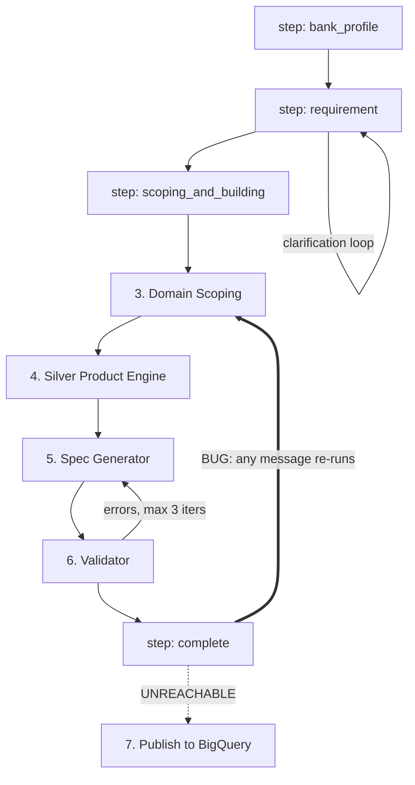

# Current State — SILVER product (`BFSI-Silver-Agent v1.1`) agentic flow

Source: `SILVER DATA PRODUCT/` (= `Downloads/BFSI-Silver-Agent_v1.1`, verified byte-identical 2026-09-18)
Mapped: 2026-09-18. Documents the **real** flow as implemented.

---

## 0. The headline

A tight, linear 6-agent BFSI silver-layer pipeline. Its unique asset is a **genuine banking domain-knowledge layer** (BIAN service domains, banking ontology, reusable typed schema blocks, standards crosswalk) that the GOLD product has no equivalent of.

Its weakness is that the last mile is **demo scaffolding**: STTMs are hardcoded dicts, validation is LLM self-report with no Python evaluation, and publish is unreachable from the UI.

---

## 1. End-to-end flow

There are **two** orchestrators. The frontend only ever calls `POST /chat`.

| # | Stage | Agent | Input | Output | Prompt | Knowledge injected |
|---|---|---|---|---|---|---|
| 1 | Bank Profile | `agents/bank_profile_agent.run` | free text / chip | `BankProfile` (bank_name, bank_code, regions, banking_type, active_products, regulatory_frameworks, data_standards, profile_complete) | `prompts/bank_profile.md` | **none** |
| 2 | Requirement Understanding | `agents/requirement_understanding_agent.run` | text + `{bank_profile, clarification_pass, prior_output}` | `StructuredRequirement` (§5) | `prompts/requirement_understanding.md` | **none** |
| 3 | Domain Scoping | `agents/domain_scoping_agent.run` | structured_req + bank_profile | `DomainScope`: `service_domains`, `required_tables[].selected_common_blocks`, `block_selection_rationale`, `additional_domain_columns`, `regulatory_columns_required` | `prompts/domain_scoping.md` | banking_ontology sub-domain keys, all 28 BIAN domains, common-block summary, `_DOMAIN_BLOCK_MAP`, regulatory reqs |
| 4 | Silver Product Engine | `agents/silver_product_engine.run` | domain_scope + bank_profile + structured_req | `SilverProductPlan`: `tables[].columns[]` with `bq_type`, `mode` | `prompts/silver_product_engine.md` | full typed common-block reference, crosswalk, naming_conventions, validation_rules (ids+names only) |
| 5 | Spec Generator | `agents/spec_generator_agent.run` | product_plan + bank_profile (+`prior_spec`, `feedback`) | `{ddl_script, specification}` | `prompts/spec_generator.md` | naming_conventions, crosswalk, block standards alignment |
| 6 | Validator | `agents/validator_agent.run` | ddl + spec + bank_profile + domain_scope | `ValidationReport` | `prompts/validator.md` | full `validation_rules.yaml` |
| 7 | Publish | `tools/bigquery_tool.BigQueryPublisher.publish` | ddl | publish report | — | — |

All 6 agents are wired. `base.py` is infrastructure, not a 7th agent (`PROMPT_REGISTRY` has exactly 6 entries).

**Step 7 is unreachable from the UI.** The "Publish to BigQuery" chip posts a literal string to `/chat` that matches no branch. `POST /v1/sessions/{id}/publish` exists (`server.py:274`) but the frontend never calls it.

---

## 2. Orchestration mechanics

- **`pipeline.py::run_pipeline`** — linear pipeline with typed retry loops. Used only by the CLI (`main.py pipeline`), `/v1/sessions/{id}/run`, `/v1/quick-run`. **It calls `input()` for clarification**, which would block a server thread. Not used by `/chat`.
- **`server.py::chat_endpoint`** — the real controller. A **step-string state machine** on `session["step"]`: `bank_profile` → `requirement` → `scoping_and_building` → `complete`. It reuses `pipeline.py`'s private helpers `_run_domain_scoping`, `_run_silver_product_engine`, `_run_spec_generator_with_validation` (`server.py:695-697`).
- Not LLM-routed. Next step is a Python `if` on the step string plus `is_complete` / `is_handoff_ready` shape checks.
- Retry: `_retry_agent` (`pipeline.py:56`) — 3 attempts with generated diagnostic feedback for stages 3–4; stages 5–6 are coupled for `MAX_SPEC_ITERATIONS=3`.

### 🔴 Critical defect: terminal-state fallthrough

Stage 3 (`server.py:684`) is **unguarded** — not inside any `if current_step == …`. Once `step == "complete"`, **any** subsequent message falls straight through and re-runs domain scoping + product engine + spec + validation from scratch, non-deterministically, **ignoring the message text entirely**.

This is the single most consequential bug to fix in the merge.

---

## 3. State & session

- `session_store.py::SessionStore()` is a factory → `InMemorySessionStore` (plain dict) or `RedisSessionStore` (key `bfsi:session:{id}`, 24h TTL). `SESSION_BACKEND=memory` in both `.env` and `deploy.ps1`. **No GCS, no Firestore anywhere** (verified by grep).
- Two *independent* state stores: the app session dict, and Google ADK's `InMemorySessionService` (`base.py:90`) holding LLM conversation history keyed by the same `session_id`.
- Shape: `{session_id, step, turns, bank_profile, requirement, all_generated_files[], ddl_script, contract_yaml, contract_dict}`.
- **Two incompatible shapes on the same store:** `/chat` writes `bank_profile` / `requirement` at top level, while `/v1/*` endpoints write under `steps.*`.
- Agents are threaded by **explicit function arguments**, not shared state — each gets a fresh `<context>` JSON dump (`base.py:302`).
- `FILE_STORE` is a module-level dict of **raw bytes** (`server.py:317`) — unbounded, process-local, lost on restart. With `max-instances=5` and no session affinity, **sessions and files break across replicas**.

---

## 4. The BFSI knowledge layer — real, but shallow

This is the product's crown jewel and the main thing GOLD lacks. Two loaders, both self-contained (relative paths, `json`/`csv`/`yaml`, **no GCP, no network**): `tools/knowledge_tool.py`, `tools/schema_loader.py`.

### Live
| Asset | How consumed |
|---|---|
| `banking_ontology.json` | sub-domain keys + `regulatory_entity_requirements` via the one real keyed lookup, `get_regulatory_requirements` (`kt:110`) |
| `bian_service_domains.json` | all 28 dumped into context |
| `naming_conventions.yaml` | dumped, stages 4–5 |
| `validation_rules.yaml` | ids+names to stage 4; full file to stage 6 |
| `common/*.yaml` (10 blocks) | `block_summary` (names only, stage 3) vs `block_column_reference` (full typed, stage 4) |
| `mappings/standards-crosswalk.csv` | **is** read — joined per-block on key `common/<name>` (`sl:241`) |

### Dead
- **`banking_standards.json`** — imported at `silver_product_engine.py:50` but **never invoked**. Its `bigquery_type_mappings` never reach an agent.
- `entity_to_domain_map`; crosswalk rows keyed `entities/*` (11 of 21 rows).
- ~9 loader functions: `knowledge_summary_for_agent`, `get_bian_domains_for_keywords`, `get_bigquery_type`, `get_technical_envelope_columns`, …
- `_DOMAIN_BLOCK_MAP` is dumped as prose guidance, **never used to pick blocks**.

### Mechanism
**No RAG, no embeddings, no tool-calling.** `base.py:302` serializes the whole context dict into the user turn. Selection is hand-written projection.

### Deterministic core worth porting
- `schema_loader._flatten_properties` — resolves `$ref` into prefixed columns.
- `_enrich_plan_with_block_columns` (`silver_product_engine.py:134`) — a real **code-based repair path** that expands blocks verbatim when the LLM returns no columns.

### Verdict
BIAN/standards grounding is **real but shallow** — injected as context, echoed by the LLM into descriptions and DDL `OPTIONS`, **never programmatically verified**. Highly portable as *data + 2 loader modules*. The agent wrapper (ADK + Vertex + hardcoded project `eogwapq-agbg-internal-data-mig` at `silver_product_engine.py:99`, `spec_generator_agent.py:42`) is not portable.

---

## 5. Requirement Understanding — exact contract

Needed verbatim for the unified requirements agent.

- `MANDATORY_FIELDS = ("domain", "data_points")` **only**. `use_case_name` is auto-synthesized by `ensure_use_case_name()` → `f"{Domain Title} Silver Schema & Analytics"`.
- Emits: `use_case_name, domain, secondary_domains, data_points, primary_consumers, source_systems, target_grain, latency_requirement, regulatory_drivers, volume_estimate, priority, handoff_ready, field_status{confirmed,inferred,missing}`.
- **`domain` is a closed enum of 12 values**, chosen by keyword rules in the prompt (KYC→`aml_kyc`, SWIFT/SEPA→`payments`, …).
- **Ambiguity handling is a dual-mode return**: plain-text questions (→ `{"raw_output": …}` via `parse_agent_output`) when clarifying; JSON when ready. Gates: `is_complete` (shape), `mandatory_complete`, `is_handoff_ready`.
- **`domain` vs `banking_domain` are accepted interchangeably throughout** — a naming inconsistency to normalize in the merge.

### 🔴 The server overrides the agent
`server.py:571` sets `is_ready = True` on the Confirm/Design chips. `req_data` (`server.py:580-592`) **hardcodes** `consumer_role`, `granularity` (Account/Customer/Date), `filters`, and default `data_points` / `data_sources`. **The card the user sees is partly fabricated.**

---

## 6. Validation — advisory in practice

Rules declared in `prompts/validator.md`: GR001–GR005 envelope, GR006–GR007 naming (`slv_` prefix, snake_case), BQ001–BQ004 BigQuery syntax, entity checks (party/account/transaction/payment/loan), regulatory guardrails (AML/KYC, GDPR, …).

**No rule is evaluated in Python.** `validator_agent.py:47` dumps `validation_rules.yaml` into context; the LLM **self-reports** `checks[]`; `get_errors`/`get_warnings` merely filter on `status == "FAILED"/"WARNING"` strings. No regex compiled, no `required_columns` diffed against the DDL.

On failure: loop back to Spec Generator with `feedback = "Fix these validation errors: …"`, max 3 iterations, then `"Max iterations reached — publishing anyway with warnings."` (`pipeline.py:332`). The pass gate (`pipeline.py:321`) is very permissive — **a malformed report with no `checks` key passes**.

**Latent bug:** GR001 requires `load_ts` / `source_system_id` / `dq_issues`, but `_flatten_technical_metadata` emits `silver_load_ts` / `source_record_id` / `failed_rules`. **The two envelopes disagree and nothing catches it**, because checking is LLM-side.

---

## 7. Artifacts produced

Generated at the end of `/chat` stage 3, stored in `FILE_STORE`, downloaded via `GET /files/{id}`.

| Artifact | Generator |
|---|---|
| Data contract YAML | `datacontract_generator.generate_data_contract_dict` + `_yaml` |
| BigQuery DDL `.sql` | Spec Generator agent output |
| STTM `.xlsx` | `artifact_generator.generate_sttm_excel` |
| Governance metadata `.xlsx` | `generate_metadata_excel` |
| Sample-run audit `.xlsx` | `generate_sample_audit_excel` |
| Dataplex manifest `.json` | `generate_dataplex_manifest_json` |
| Airflow DAG `.py` | `generate_airflow_dag_code` — generated but **deliberately hidden** from the UI (`server.py:826`) |
| 3 PDFs (bank profile, requirements brief, data availability) | `generate_bank_profile_pdf`, `generate_requirements_brief_pdf`, `generate_data_availability_pdf` |

### ⚠️ Contract spec divergence
SILVER emits **`dataContractSpecification: 0.9.3`** — that is **datacontract.com's Data Contract Specification, NOT ODCS/Bitol**. GOLD emits a `utility_catalog` JSON. **These are two different contract formats and must be reconciled.**

Also:
- **No classification artifact is produced at all.** `ClassificationCard.jsx` is wired in `MessageRow.jsx` but the backend never emits `classification_view`. Same for `challenger_view`, `discovery_view`, `sttm_view`.
- `generate_sttm_csv` is imported at `server.py:55` and **never called**.
- `physicalName` is hardcoded `banking_silver.{tname}` (`datacontract_generator.py:87`), ignoring the configured dataset. Quality rules and SLAs are fixed literals.

---

## 8. Human-in-the-loop & editing — no real edit capability

- **Only mutation path:** `EditRequirementsForm.jsx` → `App.jsx::handleEditSubmit` flattens edits into a **markdown bullet string** → `POST /chat {action:"edit"}` → server sets `current_step="requirement"` and the LLM **re-parses the English prose**. No field-level state patch. Then it falls through and regenerates everything.
- **`TweakModal.jsx` is broken.** It sends `action: "tweak_er"` / `"tweak_sttm"` — **neither string exists anywhere in `server.py`**. `user_msg` is never forwarded into stage 3. **The tweak text is silently discarded and the pipeline re-runs identically.**
- **Artifacts are read-only / download-only.** `DataContractCard` = 4 read-only tabs + clipboard copy. `STTMCard` = `<code>` cells, and its "PHYSICAL SILVER SCHEMA" block is a **hardcoded `BANKING_FRAMEWORK` constant inside the component** (lines 185-267). `BusinessGlossaryCard` renders plain `
` yet its own subtitle claims *"Edit any line, or accept all to lock the glossary"* — **that copy is a lie**. No save/patch/regenerate handlers, no write endpoints for artifacts.
- **Gates are chips only** (`Confirm Requirement` / `Edit` / `Design Silver Schema`; bank-profile chips). **No approve/reject before publish** — and publish is unreachable anyway.

---

## 9. Medallion scope

Silver-only in backend logic, but scaffolding exists:

- `BQ_GOLD_DATASET=banking_gold` is read and passed into Spec Generator context (`spec_generator_agent.py:44,58`) — **never used to generate gold**. `BigQueryPublisher.gold_dataset_ref` exists, unused.
- **`common/technical-metadata.yaml` has genuine bronze-boundary columns**: `bronze_ingest_ts`, `source_extract_ts`, `source_file_reference` (for replay), and `dq_status` with `QUARANTINE = held from Gold`. **This is the cleanest hook for adding bronze.**
- Frontend carries **inherited Gold/Bronze UI** from the GOLD prototype: `DiscoveryResultCard` (`LAYERS = ['silver','bronze']`), `STTMCard` with `variant='gold'` + Bronze→Silver→Gold Mermaid lineage, `StartingPointCards` mentioning Silver/Gold discovery. **All unfed by this backend.**
- Hardcoded STTM sources are `raw_core.*` — a de facto bronze layer named in strings only.

---

## 10. GCP surface

- **Vertex AI / Gemini** via Google ADK `LlmAgent` (`base.py:117-144`), temp 0.2, per-agent `max_output_tokens` 2048→24000. `GOOGLE_GENAI_USE_VERTEXAI=1`. Region `us-central1`.
  - 🔴 **Model IDs disagree three ways:** `.env` → `gemini-3.8-flash`; `deploy.ps1` → `gemini-2.5-flash`; `base.py` code default → `gemini-2.0-flash-001` (which `.env` comments say is *unavailable* in this project). **Verify which actually runs.**
- **BigQuery** — real client (`gcp_auth.get_bigquery_client`); `BigQueryPublisher` splits statements, `create_dataset(exists_ok=True)`, executes DDL. Modes `live|dry_run|auto`. 🔴 **`.env` says `live`, `deploy.ps1` sets `dry_run`.**
  - **No BigQuery *reads* anywhere.** The "Data Availability & Catalog Scan" PDF is **fabricated** — hardcoded "matched 100%", and called with `{}` at `server.py:654`.
- **Cloud Run** (`deploy.ps1`): backend `bfsi-silver-backend-v1-1` 2Gi/2cpu, max 5 instances, 300s timeout, `--allow-unauthenticated`; frontend `preview-bfsi-silver-frontend-v1-1`. Artifact Registry `us-central1-docker.pkg.dev/eogwapq-agbg-internal-data-mig/bfsi-silver`, tag `v1.1`.
- **No GCS, no Firestore, no Redis in deployment.** Cloud Trace + OpenTelemetry are in `requirements.txt` but have **zero imports** — same for `jsonschema`, `aiofiles`, `requests`.
- Auth: ADC or SA key via `GCP_CREDENTIALS_PATH`. No API keys/secrets beyond project IDs.

### 🔴 Security
`gcp_auth.py:29` **globally disables SSL verification for the whole process** (`ssl._create_default_https_context = ssl._create_unverified_context`), in code shipped to Cloud Run. Must not be carried into the merge.

---

## 11. Demo scaffolding — do not port, rebuild

1. **STTM mappings are 9 hardcoded dicts in `server.py:726-736`.** No agent produces them. **Every** STTM artifact (xlsx, audit, lineage) derives from that literal. `silver_view` (`:830`) is likewise hardcoded — table names, sources, narrative, all fixed regardless of domain.
2. **Hardcoded DDL fallback** (`server.py:700-724`) — if the Spec Generator fails, three canned `slv_customer` / `slv_account` / `slv_transaction_event` tables are served **as if generated**.
3. **`/catalog/domains` + `/catalog/domains/{name}` return hardcoded stubs** ignoring `domain_name` — and `DomainFrameworkModal.jsx`, their only consumer, **is imported nowhere**. Entirely dead.
4. `prompts/domain_scoping.md` emits `service_domains` but the agent docstring promises `bian_service_domains` — and **nothing downstream reads either programmatically**.
5. Version drift: FastAPI `version="1.0.0"`, images tagged `v1.1`.
6. Orphan endpoints never called by the frontend: `/health`, `POST /v1/sessions`, `/profile`, `/require`, `/run`, `/ddl`, `/specification`, `/contract`, `/publish`, `/v1/quick-run`. Frontend sends unhandled actions `tweak_er`, `tweak_sttm`, `use_file`. `api/chat.js:3-25` still ships self-described "temporary instrumentation".

---

## 12. Portability summary

**Take:**
- `knowledge/` + `common/` + `mappings/` (data — clean, no deps)
- `tools/knowledge_tool.py` + `tools/schema_loader.py` (loaders — no GCP, no network)
- `_flatten_properties` `$ref` resolution + `_enrich_plan_with_block_columns` deterministic expansion/repair logic
- The requirements-agent **contract** in §5 (note the 12-value closed `domain` enum and the `domain`/`banking_domain` aliasing)

**Rebuild, don't port:**
- All of `server.py` stage 3 — STTM dicts, `silver_view`, catalog endpoints, DDL fallback
- `validator_agent` — needs real Python rule evaluation
- The terminal-state fallthrough (§2)

**Never port:**
- `gcp_auth.py:29` SSL bypass
