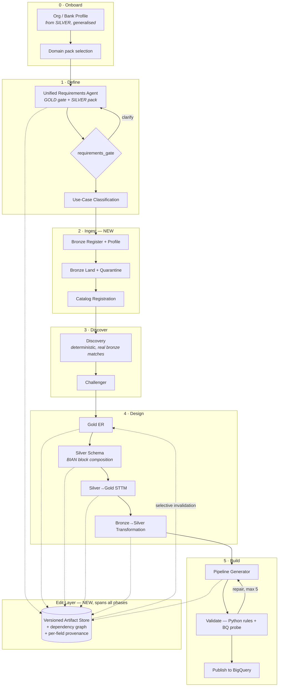

# Common Points, Seams & Gaps — GOLD ∪ SILVER

Input: [01-current-gold-flow.md](01-current-gold-flow.md), [02-current-silver-flow.md](02-current-silver-flow.md)
Target platform: **GCP only**

---

## 0. The single most important finding

**SILVER's frontend is a fork of GOLD's frontend.** Not merely similar — the same component names, the same layout, and *the same dead code in the same places*:

| Shared artefact | GOLD | SILVER |
|---|---|---|
| `DomainFrameworkModal.jsx` never imported | ✅ | ✅ |
| `BusinessGlossaryCard` subtitle promises editing that doesn't exist | ✅ | ✅ |
| `TweakModal` posts `action:"tweak_er"` / `"tweak_sttm"` | ✅ *(backend handles them)* | ✅ *(backend has no such branch — silently discarded)* |
| `LeftPane.jsx` / `RightPane.jsx` unused | ✅ | ✅ |
| `STTMCard` contains a hardcoded fake framework | `CAMPAIGN_FRAMEWORK` | `BANKING_FRAMEWORK` |
| `api/chat.js` "temporary instrumentation" | ✅ | ✅ |

SILVER forked the UI and did not port the backend handlers. **Consequence: the merge is far less UI work than the file counts suggest — there is one frontend lineage, and GOLD's is the superset** (it adds `ChatSidebar`, `FilesPanel`, `NavRail`, `PhaseStepper`, `icons.jsx`, `theme.js`).

---

## 1. Capability matrix — what to take from where

| Capability | GOLD | SILVER | Verdict |
|---|---|---|---|
| **Requirement understanding** | `requirement_understanding.run` + `requirements_gate.py`; mandatory `(use_case_name, domain, data_points)`; free-form domain via `domain_scope.classify_domain`; `field_status` has 4 states incl. `unknown_per_user` | `requirement_understanding_agent.run`; mandatory `(domain, data_points)`; **12-value closed enum**; `field_status` has 3 states; `bank_profile` upstream | **UNIFY** — §3 |
| **Requirements gate** | `requirements_gate.py` — pure logic, golden-invariant tests, deliberately ignores model's `handoff_ready` | *(none — server sets `is_ready=True` on a chip and fabricates fields)* | **TAKE GOLD verbatim.** Best-tested code in either product |
| **Org/bank profile** | *(none)* | `bank_profile_agent` | **TAKE SILVER**, generalise to an *org profile* stage |
| **Use-case classification** | `use_case_classification` + override | *(card wired, backend never emits)* | **TAKE GOLD** |
| **Discovery / catalog match** | `discovery.py` + `catalog_tool.py` (74KB) — deterministic Python over `utility_catalog.json`; emits gold/silver/**bronze** matches, conflicts, cascade trace | *(none — **zero BigQuery reads**; availability PDF is fabricated)* | **TAKE GOLD** |
| **Challenger** | `challenger.py` — 5 checks, verdict, `design_queue` | *(card wired, backend never emits)* | **TAKE GOLD** |
| **Domain knowledge grounding** | `template_loader` (GCS frameworks) + domain logic **baked into prompts** | `knowledge/` + `common/` + `mappings/` + 2 dependency-free loaders; BIAN 28 domains; typed reusable blocks; `$ref` flattening; deterministic block-expansion repair | **TAKE SILVER** — the one thing GOLD genuinely lacks |
| **Gold ER design** | `gold_layer_agent.build_er` (+ bronze-only branch) | *(none)* | **TAKE GOLD** |
| **STTM generation** | `silver_layer_agent.build_sttm` — real LLM, structured | **9 hardcoded dicts** in `server.py:726-736` | **TAKE GOLD** |
| **Bronze→Silver transformation** | `build_silver_transformation` + `dq_rules[]` | *(implied only — `raw_core.*` strings)* | **TAKE GOLD** |
| **Silver schema synthesis** | inside the STTM agent | `silver_product_engine` — block-composed, typed, with code repair path | **MERGE** — GOLD's flow position, SILVER's block composition |
| **Spec / DDL generation** | `pipeline_generator` (pro model) + live `schema_inspector` pre-flight | `spec_generator_agent` | **TAKE GOLD**, keep SILVER's naming-convention injection |
| **Validation** | `test_agent` — 11 checks, **real BQ sample query**, 5-iteration repair loop | `validator_agent` — LLM self-reports a YAML rule catalogue; nothing evaluated in Python; permissive pass gate | **TAKE GOLD's loop + SILVER's rule catalogue, but implement the rules in Python** — §4 |
| **Publish** | `BigQueryPublisher` + `_rewrite_sql_to_bq` + `query_table` + layer-aware skip | `BigQueryPublisher` + `dry_run\|live\|auto` modes | **TAKE GOLD**, keep SILVER's `dry_run` mode |
| **Data contract** | `utility_catalog-<id>.json` (bespoke) | `dataContractSpecification 0.9.3` (datacontract.com) | 🔴 **FORK — decision needed, §5** |
| **Agent runtime** | `base.py` — `google.genai` Vertex, per-skill model+token budgets, `ThinkingConfig`, Cloud Trace spans | `base.py` — Google ADK `LlmAgent`, `InMemorySessionService` | **TAKE GOLD** — strictly more mature |
| **PDF reporting** | `pdf_report.py` (40KB), 5 generators | 3 generators in `artifact_generator.py` | **TAKE GOLD**; port SILVER's Dataplex manifest + STTM/metadata XLSX |
| **Session store** | Redis-or-dict, `dp:session:` | Redis-or-dict, `bfsi:session:` | **REBUILD** — §4 |
| **Orchestration** | `if/elif` in `server.py` + an orchestrator whose verdict is discarded | `if/elif` in `server.py` | **REBUILD** — neither is sound |
| **Frontend** | 22 components (superset) | 18 components (fork) | **ONE frontend, from GOLD** |

---

## 2. Shared pathologies — fix once in the new design

Both products independently exhibit all nine. These are not merge conflicts; they are the design brief.

1. **Control lives in a monolithic `server.py` `if/elif` chain.** GOLD: `_handle_dpi_chat` is ~1400 lines. Declared orchestration is inert (`flow_routing` read by zero Python; dispatch verdict logged-and-ignored).
2. **Production state is in-process memory.** Neither sets `REDIS_URL`/`SESSION_BACKEND=redis` in deployment. GOLD survives only via `--min-instances=1 --workers 1`; SILVER's `max-instances=5` actively breaks sessions.
3. **Per-agent LLM history is a second, process-local store** never persisted (`base.py::_histories` / ADK `InMemorySessionService`). Both flag it as known debt.
4. **Declared contract ≠ implemented contract.** GOLD: `flow_routing`, orchestrator's "canonical chain", `.skills/`. SILVER: `bian_service_domains` promised, `service_domains` emitted, neither read programmatically.
5. **Validation is LLM self-report.** Neither compiles a regex or diffs required columns against actual DDL. SILVER's envelope rules (GR001) and its own emitter **disagree** and nothing catches it.
6. **Artifacts are read-only. Every "edit" is prose → full LLM regeneration.** — §6
7. **Hardcoded demo fallbacks are presented as generated output.** GOLD: `CAMPAIGN_FRAMEWORK` auto-substituted whenever "campaign" appears. SILVER: `BANKING_FRAMEWORK`, canned DDL fallback, 9 STTM dicts, fabricated availability PDF. **Users can be shown invented schemas as if produced by the pipeline.** Highest-severity trust issue in either product.
8. **Model IDs disagree across config files.** SILVER three ways (`gemini-3.8-flash` / `gemini-2.5-flash` / `gemini-2.0-flash-001`).
9. **Unhandled frontend actions fail silently.** `tweak_er`, `tweak_sttm`, `use_file`, `action:"edit"` — all posted, none branched on in at least one of the two backends.

### 🔴 Must not survive the merge
- `SILVER/tools/gcp_auth.py:29` — globally disables SSL verification process-wide, shipped to Cloud Run.
- `GOLD/backend/.env` — live-looking `ANTHROPIC_API_KEY`, `AZURE_CLIENT_SECRET`, `DATABRICKS_TOKEN`. **Rotate.**
- All Databricks/Unity-Catalog and Azure residue (target is GCP-only): `databricks_tool.py`, `_rewrite_sql_to_bq`'s raison d'être, `azure-pipelines-*.yaml`, `startup.sh`, `frontend/.env.production` → `dataagents3-api.azurewebsites.net`.

---

## 3. The unified requirements agent

The two contracts overlap on a core and diverge on domain specifics.

| Field | GOLD | SILVER |
|---|---|---|
| `use_case_name` | ✅ mandatory | auto-synthesised |
| `domain` | ✅ free-form + classifier | ✅ **closed enum ×12** |
| `data_points` | ✅ mandatory | ✅ mandatory |
| `consumer_role` | ✅ | `primary_consumers` |
| `data_freshness` | ✅ | `latency_requirement` |
| `granularity[]` | ✅ | `target_grain` |
| `data_sources[]` | ✅ | `source_systems` |
| `filters[]` | ✅ | — |
| `field_status` | 4 states (+`unknown_per_user`) | 3 states |
| `secondary_domains` | — | ✅ |
| `regulatory_drivers` | — | ✅ |
| `volume_estimate` | — | ✅ |
| `priority` | — | ✅ |

### Design: one agent, one core schema, pluggable domain packs

- **Core schema** = `use_case_name, domain, data_points, consumers, granularity[], freshness, sources[], filters[], field_status, handoff_ready`. Normalise the synonym pairs above to one name each.
- **Keep GOLD's 4-state `field_status`** — `unknown_per_user` is what makes `get_blocking_mandatories` able to block without a bypass. SILVER's 3-state cannot express "user told us they don't know".
- **Keep `requirements_gate.py` unchanged** so its golden-invariant tests stay valid against the core.
- **A domain pack** contributes: an optional closed domain enum, extra fields, a prerequisite profile stage, and knowledge assets. The **BFSI pack** supplies the 12-value enum, `regulatory_drivers`, `secondary_domains`, `volume_estimate`, `priority`, the `bank_profile` prerequisite, and `knowledge/` + `common/` + `mappings/`.
- **Normalise `domain` vs `banking_domain`** — SILVER accepts both interchangeably today.
- **Delete the server-side override.** `SILVER/server.py:571,580-592` forces `is_ready=True` and fabricates `consumer_role`/`granularity`/`filters`. GOLD's gate exists precisely to prevent this.

---

## 4. Rebuild targets (neither implementation is adequate)

**Orchestration.** Replace both `if/elif` chains with one explicit, declarative graph: nodes = agents, edges = transitions with guard predicates, and gates as first-class nodes. Two hard requirements from what went wrong: (a) every step must be **guarded** — SILVER's stage 3 is unguarded, so after `complete` *any* message silently re-runs the whole design phase; (b) if an LLM router is kept, its verdict must either be **authoritative or absent** — GOLD's log-and-ignore is the worst of both.

**State.** Move to **Firestore** (GCP-native, durable, no cluster to run). One document per session, artifacts as subcollection documents. This also kills the `_histories` process-local store, the cross-replica breakage, and SILVER's two-incompatible-shapes problem.

**Validation.** Keep GOLD's generate→test→repair loop (`MAX_TEST_ITERATIONS=5`), but evaluate SILVER's rule catalogue (GR001–007, BQ001–004, regulatory guardrails) in **Python** against the actual DDL and the actual BigQuery schema. Fix the GR001 envelope mismatch (`load_ts`/`source_system_id`/`dq_issues` vs emitted `silver_load_ts`/`source_record_id`/`failed_rules`) by defining the envelope **once** in `common/technical-metadata.yaml` and generating both the emitter and the check from it.

**Remove every silent fallback.** No `CAMPAIGN_FRAMEWORK`, no `BANKING_FRAMEWORK`, no canned DDL, no fabricated availability report. Fail visibly.

---

## 5. 🔴 Open decision: the data contract format

GOLD emits a bespoke `utility_catalog-<id>.json`; SILVER emits `dataContractSpecification: 0.9.3` (datacontract.com). They are different formats for the same job, and downstream code in each product reads only its own.

Options:
- **A — datacontract.com 0.9.3** (SILVER's): an actual public spec, already has a working generator and a Dataplex manifest emitter alongside it.
- **B — ODCS / Bitol** (neither has it): the more current open standard; would need writing from scratch. Worth it if anything downstream expects ODCS.
- **C — `utility_catalog` JSON** (GOLD's): keeps `discovery` + `catalog_tool` + `pipeline_generator` working unchanged; bespoke, not a standard.

Note these are not strictly either/or — the internal pipeline can keep `utility_catalog` as its working representation and **emit** a standard contract as a deliverable. That is probably the cheapest correct answer, but it needs confirming against what consumes these contracts downstream.

---

## 6. Gap A — structured edit + propagation (in neither product)

### What exists today
Every edit path in both products is **prose → full LLM regeneration**:
- `EditRequirementsForm` collects structured fields, then `App.jsx` **flattens them to a markdown bullet list**; GOLD's server has no `action=="edit"` branch at all, SILVER's re-parses the English.
- `TweakModal` is one free-text textarea; GOLD regenerates the entire ER/STTM from the prose, SILVER discards it.
- `STTMCard` (585 lines) has no `useState`, no `onChange`, no inputs.

### What the new design needs

1. **Artifacts as addressable, versioned, typed objects.** Today they are blobs inside a session dict (`session["gold_er"]`, `session["gold_sttm"]`). They need stable IDs, a schema, and a version chain.
2. **An explicit dependency graph** over artifacts: `requirement → classification → discovery → gold_er → silver_sttm → silver_xform → pipeline_spec → sql → tables`. Both products already run this order implicitly; making it data lets edits compute a blast radius.
3. **Field-level patch operations**, not prose. `PATCH /artifacts/{id}` with a typed path (`tables[2].columns[5].bq_type`).
4. **Selective invalidation.** A patch marks only *downstream* dependents stale — editing a column type in the STTM should not re-run discovery.
5. **Per-field provenance + a merge policy.** This is the crux: today a regeneration clobbers everything. Each field needs to record whether it is `llm_generated`, `human_edited`, or `human_confirmed`, and regeneration must **preserve human-edited fields** unless explicitly released. Without this, edit-then-regenerate silently destroys user work.
6. **Diff preview before apply.** Show what will change downstream, then confirm.

**The good news:** because every downstream stage in GOLD reads `session["gold_er"]` / `session["gold_sttm"]` verbatim, a structured edit-and-propagate layer slots in without rewriting the agents. The agents already take `(previous_artifact, feedback)` — they need to take `(previous_artifact, patch, locked_fields)` instead.

---

## 7. Gap B — bronze (in neither product)

**Neither product produces bronze.** Current state:

| | GOLD | SILVER |
|---|---|---|
| Bronze as a **read source** | ✅ extensive — `bronze_matches[]`, Bronze→Silver STTM, bronze fixture injected into two design agents, explicit **bronze-only ER branch** that a real sample run actually took | strings only (`raw_core.*`) |
| Bronze **dataset** provisioned | ✅ `BQ_DATASET_BRONZE=bronze`, `hydration/` can create it | — |
| Bronze **envelope columns defined** | — | ✅ `common/technical-metadata.yaml`: `bronze_ingest_ts`, `source_extract_ts`, `source_file_reference`, `dq_status` incl. `QUARANTINE` |
| Bronze **ingestion / generation** | ❌ `publisher_agent.execute()` explicitly **skips** bronze ("source data, not output") | ❌ |

Three GOLD prompts also **contradict each other** on whether bronze exists at all (`publisher`: "there is none"; `pipeline-generator`: creates all three datasets; `test-agent`: dataset must be one of the three). Resolve this explicitly.

### Nucleus already present
- GOLD's `tools/file_extractor.py` + the `dpi_file_metrics` step already do upload → profile → column metrics. That is the front half of bronze ingestion.
- SILVER's `technical-metadata.yaml` already defines the landing envelope, including a quarantine state.
- GOLD's `hydration/` can create datasets and hydrate catalogs from BigQuery — currently manual-CLI only, explicitly "not wired into the app".

### What a bronze function has to do
Register a raw source (uploaded file, GCS object, external table) → infer and profile its schema → land it as a bronze table carrying the standard envelope → route failures to a quarantine table via `dq_status` → **register it into the catalog so `discovery` returns real `bronze_matches` instead of a fixture**.

That last clause is what makes bronze worth building: it closes the loop so discovery stops reading `data/bronze_user_visit_events_data.json`.

---

## 8. Strawman target flow

Phases renamed to be layer-explicit rather than acronym-dependent (DPI/DDI/DPB were ambiguous — DDI expands two different ways inside GOLD).

The edit layer is deliberately drawn as orthogonal: it is not a stage, it is a property of every artifact.

---

## 9. Decisions needed before building

| # | Decision | Options |
|---|---|---|
| 1 | **Data contract format** (§5) | datacontract.com 0.9.3 · ODCS/Bitol · `utility_catalog` internal + standard export |
| 2 | **Port vs rebuild the backend** | Rebuild the orchestrator + state + validation, port the agents/prompts/knowledge (recommended) · or incrementally refactor GOLD's `server.py` in place |
| 3 | **LLM orchestrator** | Drop it and use a declarative graph · or make its verdict authoritative. Not log-and-ignore |
| 4 | **Phase naming** | Keep DPI/DDI/DPB (and fix the DDI ambiguity) · or layer-explicit names as in §8 |
| 5 | **Non-analytics use cases** | GOLD hard-stops everything ≠ `analytics` and discards the requirement. Widen, or keep the stop and say so in the UI |
| 6 | **Bronze scope** | Full ingestion (files + GCS + external tables) · or registration/profiling only, with landing left to existing pipelines |
| 7 | **Edit granularity** | Field-level patch on all artifacts · or start with requirement + STTM only |
| 8 | **Session store** | Firestore (recommended) · Redis via Memorystore · keep in-memory and pin to one instance |
