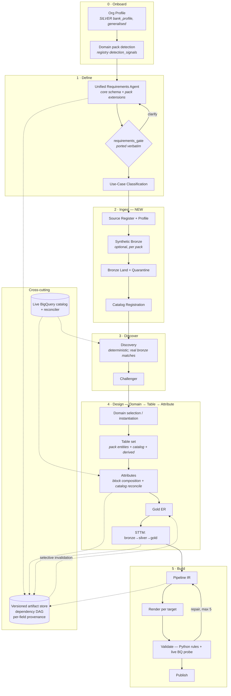

# Target Architecture — `data-product-assistant-final`

Supersedes the current-state maps in [01](01-current-gold-flow.md) / [02](02-current-silver-flow.md) and the seam analysis in [03](03-common-points-and-seams.md).

**Decisions taken:** new core, ported agents, cross-domain from the ground up.
**App platform:** GCP only. **Generated pipelines:** cloud- and platform-agnostic.

---

## 1. Design principles

1. **One canonical model: Domain → Table → Attribute.** Every agent reads and writes this tree. No agent invents its own shape. This is the product's spine, its edit surface, and its API.
2. **Cross-domain by construction.** No domain logic in core, prompts, or UI. Domains are *packs* — data + metadata, loaded at runtime. Adding an industry means adding a pack, never editing core.
3. **Provenance on every field.** Each attribute records where it came from and whether a human touched it. Regeneration must never silently clobber human work.
4. **The catalog is a first-class input.** The designed tree is continuously reconciled against live BigQuery. "This column exists but you didn't include it" is a product feature, not an error.
5. **Canonical types, rendered per target.** Nothing stores engine-native types. Platform-agnostic pipelines are impossible otherwise.
6. **No silent fallbacks.** Both predecessors show hardcoded fake schemas as if generated. Fail visibly instead.
7. **Guarded transitions only.** Every flow edge has an explicit guard. SILVER's unguarded stage 3 re-ran the whole design phase on any message after completion.

---

## 2. The canonical model

Formalises the `schema_version: 2.0` shape already used by GOLD's 11 domain frameworks, plus provenance, layer, and lineage.

```
DataProductDesign
 └── Domain[]                    name, industry, display_name, standards[], pack_ref, origin
      └── Table[]                name, layer, entity_type, grain, physical_ref, origin, locked
           └── Attribute[]       name, canonical_type, nullable, is_pk, fk_ref, description,
                                 origin, locked, block, standard_refs[], source_ref
```

| Field | Values | Why |
|---|---|---|
| `layer` | `BRONZE` · `SILVER` · `GOLD` | Medallion position. Bronze is now a produced layer, not just a source |
| `entity_type` | `DIMENSION` · `EVENT` · `AGGREGATE` · `RAW` | From `entity_types{}` in existing frameworks; `RAW` is new, for bronze |
| `origin` | `PACK_ENTITY` · `PACK_BLOCK` · `LLM` · `HUMAN` · `LIVE_CATALOG` | Provenance — drives the merge policy in §4 |
| `locked` | bool | Human-authored ⇒ regeneration preserves it |
| `block` | e.g. `money`, `identifier` | Which shared block contributed this attribute |
| `source_ref` | upstream table.column | Lineage: gold←silver←bronze←source |
| `canonical_type` | see §6 | Never an engine-native type |

### Type system correction
GOLD's frameworks store `data_type: "DOUBLE"` — a Spark/Databricks type that **is not valid BigQuery** (`FLOAT64`). This is Databricks residue in the data layer. The core stores `CanonicalType` and maps to each target at render time.

---

## 3. Domain packs — how cross-domain works

A pack is data and metadata. Zero code, zero core changes.

```
packs/
├── registry.json               industries → domains → {path, detection_signals[], standards[]}
├── _blocks/                    UNIVERSAL attribute blocks (not domain-specific)
│   ├── money.yaml  identifier.yaml  party-name.yaml  postal-address.yaml
│   ├── temporal.yaml  code-value.yaml  quantity.yaml  rate.yaml
│   ├── contact-point.yaml  technical-metadata.yaml
├── banking/
│   ├── retail_banking.json     schema_version 2.0 framework
│   ├── wealth_management.json
│   └── knowledge/              pack-specific grounding
│       ├── bian_service_domains.json      (28 domains)
│       ├── banking_ontology.json
│       ├── standards-crosswalk.csv
│       └── validation_rules.yaml
├── cpg/                        campaign, sales, loyalty, trade_promotions, pricing, digital_commerce
├── healthcare/                 patient_journey
├── retail/                     merchandise_planning
└── cross_industry/             supply_chain, finance
```

### What moved where, and why

| Asset | From | To | Rationale |
|---|---|---|---|
| 11 domain frameworks | GOLD `data/` + `data/*/` | `packs/<industry>/` | Already cross-industry; just needs one consistent location and naming |
| `gcs_registry.json` | GOLD | `packs/registry.json` | The **live** registry. `domain_registry.json` is dead — `template_loader` never reads it. Drop it |
| `common/*.yaml` (10 blocks) | SILVER | `packs/_blocks/` | **Universal, not BFSI.** money/identifier/temporal/address/contact/quantity/rate/code-value/party-name/technical-metadata apply to every industry |
| BIAN 28 domains, banking ontology, crosswalk | SILVER `knowledge/` | `packs/banking/knowledge/` | Genuinely banking-specific |
| `validation_rules.yaml` | SILVER | split: generic → `core/validation/rules/`, banking → `packs/banking/knowledge/` | GR006/GR007 naming and BQ001–004 syntax are universal; AML/KYC guardrails are not |

### Campaign hardcoding to remove
1. `STTMCard.jsx:205-306` — `CAMPAIGN_FRAMEWORK` + `detectFramework()` silent fallback
2. `prompts/DDI/silver-sttm/SKILL.md` — the "Campaign Domain Guidance" section (canonical `slv_*` spine, platform→entity table, channel enum) → becomes `packs/cpg/campaign.json` data
3. `data/domain_registry.json` — dead, CPG-only. Delete

Prompts receive the active pack as **context**, never as baked-in text.

---

## 4. The edit function

Three levels, matching the spine exactly. Each level has its own add/modify/remove semantics and its own sources.

| Level | Operations | Sources for an *add* |
|---|---|---|
| **Domain** | add · remove | pack framework · live catalog dataset · blank |
| **Table** | add · remove · rename · change grain | pack entity · live catalog table · block composition · blank |
| **Attribute** | add · remove · retype · re-describe · re-map | **live catalog column** · pack block · pack entity column · user-defined |

### The two flows you asked for

**(a) Missing attribute that already exists in BigQuery.**
`core/catalog/live.py` reads `INFORMATION_SCHEMA` for the relevant datasets. `core/catalog/reconcile.py` diffs the designed tree against the actual tree and emits a `Delta`. Any column present in BigQuery but absent from the designed table appears as an **addable** item with its real type, mode, and description already populated. Accepting it sets `origin = LIVE_CATALOG`, `locked = True`, and stamps the physical source into `source_ref`.

**(b) Missing domain.**
The same reconciliation at domain granularity. If the requirement implies a domain that isn't in the design, the matching pack framework is offered for **whole-domain instantiation** — all its entities and columns enter as `origin = PACK_ENTITY`. The user can then prune.

### Provenance merge policy — the part that makes edit safe

Today a regeneration overwrites everything. The rule going forward:

```
regenerate(table):
    for attribute in new_llm_output:
        if existing.locked:            keep existing, record llm_suggestion   # never clobber
        elif existing.origin == HUMAN:  keep existing                          # implicit lock
        elif existing.origin == LIVE_CATALOG: keep existing                    # ground truth
        else:                           replace
    report(preserved[], replaced[], suggestions_withheld[])
```

An agent that wants to change a locked field produces a **suggestion**, surfaced for review. It does not win by default.

### Propagation
`core/artifacts/graph.py` holds the dependency DAG:

```
requirement → classification → discovery → gold_er → silver_schema
           → silver_sttm → silver_xform → pipeline_spec → rendered_pipeline → published_tables
```

A patch marks only **downstream** dependents stale. Editing an attribute in the silver schema invalidates the STTM, transformation, spec and SQL — not discovery or the requirement. Stale nodes show a diff preview before regeneration is applied.

---

## 5. Bronze

Bronze becomes a **produced** layer. Neither predecessor produces it — GOLD reads it (and has a load-bearing bronze-only ER branch), SILVER only defines its envelope columns.

### Landing envelope
From SILVER's `common/technical-metadata.yaml`, which already has the right columns: `bronze_ingest_ts`, `source_extract_ts`, `source_file_reference` (replay), `dq_status` (incl. `QUARANTINE`). Defined **once** and used to generate both the emitter and the validation check — the GR001 mismatch in SILVER (rules expect `load_ts`/`source_system_id`/`dq_issues`; emitter writes `silver_load_ts`/`source_record_id`/`failed_rules`) existed because these were written twice.

### Synthetic bronze
A generator produces a realistic raw bronze dataset per domain pack — deliberately *raw*: inconsistent casing, nulls, string-typed numerics, duplicates, late-arriving rows. Purpose: give the pipeline something real to ingest and let the DQ/quarantine path be exercised. This replaces GOLD's single static fixture (`data/bronze_user_visit_events_data.json`) that two design agents currently depend on.

### Ingestion path
`register` (file / GCS object / external table) → `profile` (schema inference + column stats) → `land` (bronze table + envelope) → `quarantine` (rows failing DQ) → **`register into catalog`**.

That last step is the point. It closes the loop so `discovery` returns real `bronze_matches` instead of reading a fixture. GOLD's `file_extractor.py` + `dpi_file_metrics` are the front half of this; `hydration/bigquery_hydrator.py` already knows how to hydrate a catalog from BigQuery but is explicitly "not wired into the app".

### Prompt contradiction to resolve
Three GOLD prompts disagree on whether bronze exists (`publisher`: "there is none"; `pipeline-generator`: creates all three datasets; `test-agent`: must be one of three). Under this design bronze exists and is produced. All three get rewritten.

---

## 6. Platform-agnostic source→bronze pipelines

The final phase, and the reason the type system is canonical.

**Pipeline IR** — a declarative, engine-neutral spec:

```
PipelineSpec
├── sources[]      connection kind, format, location, schema, watermark
├── targets[]      layer, table ref, write mode, partitioning, clustering
├── steps[]        typed transforms: cast, rename, dedupe, filter, join,
│                  derive, explode, pivot, aggregate, scd2
├── dq[]           rule, severity, on_fail: QUARANTINE | FAIL | WARN
├── schedule       cron / event / manual
└── lineage        attribute-level source→target mapping
```

No SQL, no engine syntax. **Renderers** translate the IR to a target:

| Renderer | Status |
|---|---|
| BigQuery SQL + Dataform | first — matches the app platform |
| Airflow DAG | second — SILVER already has `generate_airflow_dag_code` to port |
| dbt models | planned |
| Spark / PySpark | planned |

This is the inverse of how both predecessors work today: they emit BigQuery SQL directly from an LLM, which is why `_rewrite_sql_to_bq` had to exist to undo Databricks FQNs. Generating IR then rendering makes the target a choice rather than a rewrite.

Attribute-level lineage in the IR is what lets the UI answer "where did this column come from" across all three layers.

---

## 7. Three representations — DECIDED

The bespoke `utility_catalog` JSON is dropped as a *published* format. There are
three representations, each with one job, because no single one can do all three.

| | Format | Job | Lives |
|---|---|---|---|
| **Design-time** | the canonical tree (§2) | edit, provenance, layers, lineage, pre-materialisation design | `core/model/` |
| **GCP-native** | **Knowledge Catalog data product** | governance, discovery, access control; the GCP-side source of truth | `core/publish/knowledge_catalog.py` |
| **Buyer-facing** | **ODCS v3.2.0** | the deliverable the purchasing organisation ingests directly | `core/contracts/odcs.py` |

### Why the canonical tree cannot be replaced by the catalog

Knowledge Catalog models a data product as *a grouping of assets that already
exist*, plus governance metadata. It has no notion of a pre-materialisation
design, a bronze→silver→gold mapping, or per-field edit provenance. Publishing
is therefore strictly a post-materialisation step, and design-time stays ours.

### Google Cloud Knowledge Catalog

Dataplex Universal Catalog, renamed **2026-04-10**. Data products are **GA**.

- `POST .../projects/{p}/locations/{l}/dataProducts?data_product_id={id}` —
  `display_name` and `owner_emails` required, plus `description`,
  `access_approval_config.approver_emails`, `icon`
- `POST .../dataProducts/{id}/dataAssets?data_asset_id={id}` with
  `{"resource": "//bigquery.googleapis.com/projects/…/datasets/…/tables/…"}`
- Aspects via `entries.patch`. System types include `overview`
  (`dataplex-types.global.overview`, field `content`), `refresh-cadence`
  (field `frequency`), plus `contact`, `contract`, `queries`
- **Custom aspect types** (`PROJECT.LOCATION.NAME`) carry what has no system
  slot: domain/pack provenance, medallion layer, attribute-level lineage
- Access groups map to Google Groups / service accounts → IAM
- Terraform: `google_dataplex_data_product`, `google_dataplex_data_product_data_asset`

**Constraints that shape the design:**

1. **Max 50 assets per data product.** A multi-domain design can exceed this, so
   granularity is a real decision — publish **one data product per domain**,
   consumer layers only. `plan_publish` enforces the limit up front rather than
   failing at call time.
2. **Assets must be co-located** with the data product (same GCP location).
3. **Assets must already exist**, hence post-materialisation only.
4. **Bronze is not published.** It is internal plumbing, and the predecessor
   publisher already skipped bronze as "source data, not output".
5. **Cost:** billed in Data Compute Units plus metadata per gibibyte-hour, and
   active billing for data insights starts **2026-10-27**. Auto-harvesting a
   whole estate is billable — scope the harvest deliberately.

Its BigQuery auto-harvest partially overlaps our own `INFORMATION_SCHEMA`
reconciler but does not replace it: the edit flow needs synchronous,
column-level truth during an interaction, and catalog harvest is asynchronous.

### ODCS v3.2.0 for the buyer

Vendor-neutral YAML under Bitol (Linux Foundation AI & Data, **graduated July
2026**). Chosen over SILVER's `dataContractSpecification 0.9.3`, which is
several major versions stale. Knowledge Catalog's own `contract` aspect is
GCP-shaped (refresh cadence, quality thresholds) so it cannot travel to a buyer
who may not be on GCP.

The mapping is near-lossless, and better than expected:

| Canonical tree | ODCS |
|---|---|
| `source_ref` (the STTM) | `transformSourceObjects`, `transformLogic`, `transformDescription` |
| `standard_refs` (BIAN/FIBO/ISO) | `authoritativeDefinitions` |
| `canonical_type` / rendered type | `logicalType` / `physicalType` |
| `is_pk` | `primaryKey`, `primaryKeyPosition` |
| `fk_ref` | `relationships` |
| `nullable` | `required` (inverted) |
| `grain` | `dataGranularityDescription` |
| `layer`, `entity_type` | `tags` |
| provenance, locked, source block | `customProperties` |

The STTM stops being a side artifact and becomes part of the contract itself.

`unresolved_lineage()` reports exported columns with no `source_ref` — a contract
that claims a column but cannot say where it came from is the first thing a
buyer will ask about.

**Unverified:** whether Knowledge Catalog natively imports or exports ODCS. The
mapping between the two is ours to write; treat any claim otherwise as
unconfirmed until checked.

---

## 8. Flow

Phases renamed layer-explicit. DPI/DDI/DPB are dropped — DDI expands two different ways *inside GOLD itself* ("Data Designer" vs "Data Design Initiative").



Design (P4) is now explicitly the three-level hierarchy rather than a single opaque "STTM" step, and the catalog feeds it directly.

---

## 9. Project layout

```
data-product-assistant-final/
├── core/                       domain-agnostic engine — no domain logic, ever
│   ├── model/                  tree · provenance · layers · types
│   ├── artifacts/              versioned store · dependency DAG · typed patches
│   ├── catalog/                live BQ introspection · reconciler  ← edit engine
│   ├── flow/                   declarative graph · runner · HITL gates
│   ├── llm/                    agent runtime (ported from GOLD base.py)
│   ├── validation/             Python rule engine + generic rules
│   └── state/                  Firestore session store
├── packs/                      domain packs — data only
├── agents/                     pipeline agents (ported, de-domained)
├── bronze/                     envelope · synth · ingest
├── pipelines/                  IR + renderers
├── api/                        FastAPI surface
├── frontend/                   from GOLD (superset of SILVER's fork)
└── tests/
```

---

## 10. Port / rebuild / drop

**Port largely as-is**
- `requirements_gate.py` — best-tested code in either product; keep its golden invariant
- `catalog_tool.py` + `discovery.py` — deterministic, no LLM, works
- `base.py` agent runtime — Vertex `google.genai`, per-skill token budgets, `ThinkingConfig`, Cloud Trace
- `pdf_report.py`; SILVER's Dataplex manifest + XLSX generators
- `schema_loader._flatten_properties` (`$ref` flattening) and `_enrich_plan_with_block_columns` (deterministic block expansion/repair)
- 11 domain frameworks; the 10 universal blocks; BIAN/ontology/crosswalk
- `hydration/bigquery_hydrator.py` — and actually wire it in this time

**Rebuild**
- Orchestration — declarative graph, guarded edges, no log-and-ignore router
- State — Firestore; kills the process-local `_histories` second store and the cross-replica breakage
- Validation — Python evaluation of the rule catalogue against real DDL and real BQ schema
- STTM generation — GOLD's agent is sound, but it must read/write the canonical tree
- Requirements agent — one core schema + pack extensions (§3 of [03](03-common-points-and-seams.md))

**Drop**
- `SILVER/tools/gcp_auth.py:29` SSL bypass 🔴
- `GOLD/backend/.env` secrets — **rotate** `ANTHROPIC_API_KEY`, `AZURE_CLIENT_SECRET`, `DATABRICKS_TOKEN` 🔴
- All Databricks residue: `databricks_tool.py`, `_rewrite_sql_to_bq`, Unity-Catalog checks in `test_agent`, `DOUBLE` types in frameworks
- All Azure residue: `azure-pipelines-*.yaml`, `startup.sh`, `dataagents3-api.azurewebsites.net` fallback
- Every silent fallback: `CAMPAIGN_FRAMEWORK`, `BANKING_FRAMEWORK`, canned DDL, 9 hardcoded STTM dicts, fabricated availability PDF
- Dead code: `visual_diagram.py`, `.skills/` (×5), `domain_registry.json`, `DomainFrameworkModal.jsx`, `LeftPane`/`RightPane`, `/dpb/*`, `pipeline.py` CLIs
- `flow_routing` — declared "single source of truth", read by zero Python

**Watch out:** `prompts/DPI/discovery/SKILL.md` is a **config dependency**, not just a prompt — `catalog_tool.py:66` parses its ` ```sample_data ``` ` fence at import time. Move that data to a real data file before touching the prompt.

---

## 11. Open items

| # | Item | Note |
|---|---|---|
| 1 | ~~Data contract format~~ | **Resolved — see §7.** Canonical tree design-time, Knowledge Catalog data product on GCP, ODCS v3.2.0 exported to the buyer |
| 1a | Data product granularity | One per domain keeps us under the 50-asset limit, but a broad domain could still breach it. Confirm against the widest real design |
| 2 | Non-analytics use cases | GOLD hard-stops everything ≠ `analytics` and discards the requirement. Widen, or keep and say so in the UI |
| 3 | Synthetic bronze realism | How adversarial should generated raw data be? Affects how much DQ surface gets exercised |
| 4 | Renderer priority after BigQuery | Airflow (port exists) vs dbt vs Spark |
| 5 | Pack authoring UX | Hand-edited JSON, or an authoring flow? Registry has 2 amber domains with no framework file — a natural first test |
