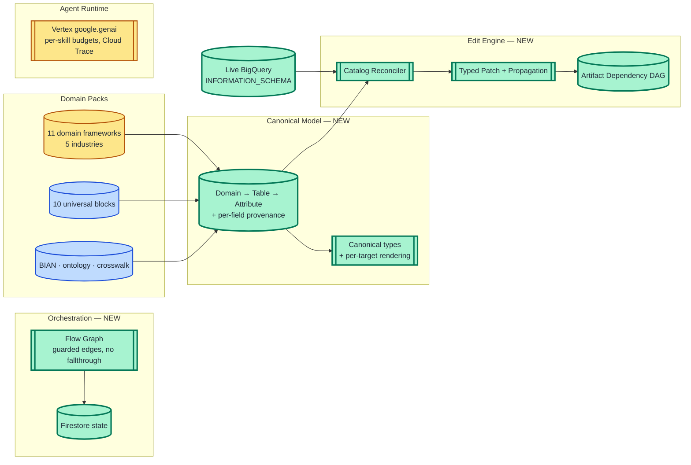

# Agentic Architecture — what we're building, and where each piece comes from

Provenance by **colour**. LLM vs deterministic by **shape**. One diagram for the
pipeline, one for the cross-cutting layers.

```mermaid
flowchart TD
    classDef gold   fill:#FDE68A,stroke:#B45309,stroke-width:2px,color:#1F2937
    classDef silver fill:#BFDBFE,stroke:#1D4ED8,stroke-width:2px,color:#1F2937
    classDef merged fill:#DDD6FE,stroke:#6D28D9,stroke-width:2px,color:#1F2937
    classDef new    fill:#A7F3D0,stroke:#047857,stroke-width:3px,color:#1F2937
    classDef gate   fill:#FFFFFF,stroke:#374151,stroke-width:2px,color:#1F2937

    START([User request]):::new

    subgraph P0["PHASE 0 · Onboard"]
        ORG["Org Profile"]:::silver
        PACKDET[["Pack Detection"]]:::gold
    end

    subgraph P1["PHASE 1 · Define"]
        REQ["Unified Requirements Agent"]:::merged
        RGATE[["requirements_gate"]]:::gold
        G1{{"Confirm requirement"}}:::gate
        CLS["Use-Case Classification"]:::gold
        G2{{"Confirm / override"}}:::gate
    end

    subgraph P2["PHASE 2 · Ingest — NEW"]
        SYNTH[["Bronze Synth"]]:::new
        SPROF["Source Register + Profile"]:::new
        LAND[["Bronze Land + Quarantine"]]:::new
        CREG[["Catalog Register"]]:::new
    end

    subgraph P3["PHASE 3 · Discover"]
        DISC[["Discovery"]]:::gold
        CHAL["Challenger"]:::gold
        G3{{"Proceed to design"}}:::gate
    end

    subgraph P4["PHASE 4 · Design — Domain to Table to Attribute"]
        DOM[["Domain Selection"]]:::silver
        TBL["Table Set"]:::gold
        ATTR[["Attribute Composition"]]:::silver
        G4{{"Edit tree"}}:::gate
        ER["Gold ER"]:::gold
        STTM["STTM bronze to silver to gold"]:::gold
        G5{{"Lock the mapping"}}:::gate
    end

    subgraph P5["PHASE 5 · Build"]
        PIR["Pipeline IR Generator"]:::merged
        REND[["Renderers"]]:::new
        VAL[["Validation Engine"]]:::merged
        TEST["Test Agent"]:::gold
        G6{{"Approve publish"}}:::gate
        PUBBQ[["Publish to BigQuery"]]:::gold
    end

    subgraph P6["PHASE 6 · Deliver — NEW"]
        KC[["Knowledge Catalog Publisher"]]:::new
        ODCS[["ODCS v3.2.0 Export"]]:::new
    end

    START --> ORG --> PACKDET --> REQ
    REQ --> RGATE
    RGATE -->|clarify| REQ
    RGATE --> G1 --> CLS --> G2 --> SPROF
    G2 --> SYNTH
    SYNTH --> LAND
    SPROF --> LAND --> CREG --> DISC
    DISC --> CHAL --> G3 --> DOM
    DOM --> TBL --> ATTR --> G4 --> ER --> STTM --> G5 --> PIR
    PIR --> REND --> VAL
    VAL --> TEST
    TEST -->|repair, max 5| PIR
    TEST --> G6 --> PUBBQ
    PUBBQ --> KC
    PUBBQ --> ODCS
```

## Cross-cutting layers

These are not stages. They span the whole flow, and all but the packs are new.

## Legend

| | |
|---|---|
| `[rectangle]` | LLM agent |
| `[[subroutine]]` | Deterministic — pure Python, no model call |
| `{{hexagon}}` | Human-in-the-loop gate |
| `[(cylinder)]` | Store or dataset |
| 🟨 amber | From **GOLD** |
| 🟦 blue | From **SILVER** |
| 🟪 purple | **Merged** from both |
| 🟩 green | **Built anew** |

---

## Where each agent comes from

### From GOLD — port largely as-is

| Agent / component | Kind | Note |
|---|---|---|
| `use_case_classification` | LLM · flash | + user override path |
| `discovery` + `catalog_tool` | **deterministic** | No LLM at all. 74KB matcher — surprises people |
| `challenger` | LLM · flash | 5 checks, verdict, design queue |
| `gold_layer_agent.build_er` | LLM · **pro** | Keeps the bronze-only branch a real run exercised |
| `silver_layer_agent.build_sttm` | LLM · **pro** | Silver→Gold |
| `silver_layer_agent.build_silver_transformation` | LLM · **pro** | Bronze→Silver, + `dq_rules` |
| `gold_layer_agent.finalize` | LLM · **pro** | Runs parallel to the transformation |
| `test_agent` | LLM · flash | 11 checks, live BQ probe, 5-iteration repair loop |
| `publisher_agent.execute` | deterministic | Layer-aware; already skips bronze |
| `requirements_gate` | **deterministic** | Port **verbatim** — best-tested code in either product |
| Agent runtime (`base.py`) | infra | Vertex `google.genai`, per-skill budgets, Cloud Trace |
| 11 domain frameworks, `template_loader` | data | Already cross-industry |
| `file_extractor`, `dpi_file_metrics` | infra | Front half of bronze profiling |
| `hydration/bigquery_hydrator` | infra | Exists but "not wired into the app" — finally wired |
| Frontend | UI | The superset; SILVER's is a fork of it |

### From SILVER

| Component | Becomes | Note |
|---|---|---|
| `bank_profile_agent` | Org Profile Agent | Generalised beyond banking |
| `requirement_understanding_agent` | → merged | See below |
| `domain_scoping_agent` | Domain Selection | Concept kept; pack registry does the detection |
| `silver_product_engine` | Attribute Composition | Its deterministic block-expansion repair path is the valuable part |
| `knowledge/` + `mappings/` | `packs/banking/knowledge/` | BIAN 28 domains, ontology, crosswalk |
| `common/*.yaml` | `packs/_blocks/` | **Universal, not BFSI** — so they sit in core |
| `schema_loader._flatten_properties` | `BlockLibrary.expand` | `$ref`/`$defs` flattening |
| `validation_rules.yaml` | Validation Engine input | Rules kept, engine rebuilt |
| `generate_airflow_dag_code` | An IR renderer | Phase 9 |

### Merged from both

| New agent | GOLD side | SILVER side |
|---|---|---|
| **Unified Requirements Agent** | 4-state `field_status`, `requirements_gate`, free-form domain classifier | 12-value domain enum, `regulatory_drivers`, profile prerequisite — become pack extensions |
| **Pipeline IR Generator** | `pipeline_generator` (pro), live `schema_inspector` pre-flight | `spec_generator`'s naming-convention injection |
| **Validation Engine** | generate→test→repair loop | The rule catalogue (GR001-007, BQ001-004, regulatory) |

### Built anew

| Component | Why it has to be new |
|---|---|
| **Flow Graph orchestrator** | GOLD's LLM orchestrator asked for `next_agent` then **discarded the answer** and logged `[DISPATCH WARN] … running X anyway`. Its `flow_routing` contract is read by zero Python |
| **Canonical model + provenance** | Neither had one — every agent invented its own JSON shape |
| **Catalog Reconciler** | SILVER performed **zero** BigQuery reads; GOLD only did pre-flight existence checks |
| **Typed patch + propagation** | Every "edit" in both was prose → full LLM regeneration |
| **Artifact dependency DAG** | Both regenerated everything on any change |
| **Firestore state** | Both ran in-process memory in production |
| **Bronze: synth / register / profile / land / quarantine / catalog-register** | Neither produced bronze. GOLD reads it; two design agents share **one static fixture** |
| **Pipeline IR + renderers** | Both emitted BigQuery SQL from an LLM — hence `_rewrite_sql_to_bq` to undo Databricks references after the fact |
| **Knowledge Catalog publisher** | Product went GA in 2026, after both were built |
| **ODCS v3.2.0 exporter** | SILVER's `dataContractSpecification 0.9.3` is several major versions stale |

### Dropped

| Dropped | Reason |
|---|---|
| GOLD `orchestrator` | Advisory only — verdict discarded. Replaced by the flow graph |
| GOLD `visual_diagram` | Dead and broken — missing from the registry, and calls an async fn without `await` |
| GOLD `data_product` | Live flow explicitly bypasses it |
| GOLD `ddi_pipeline.run`, `pipeline.py` | Unreachable / broken async |
| GOLD `.skills/` (×5) | A different product entirely — Claude Code commands targeting Databricks Unity Catalog |
| GOLD `databricks_tool`, `_rewrite_sql_to_bq` | GCP-only target; the IR removes the need |
| GOLD `kpi_derivation` | Gated off by an env var never set in deployment |
| SILVER `spec_generator_agent` | Superseded by the IR generator |
| SILVER `datacontract_generator` | Superseded by ODCS |
| SILVER's 9 hardcoded STTM dicts | Demo scaffolding presented as generated output |
| Bespoke `utility_catalog` **as a published format** | Knowledge Catalog is the GCP-native form |
| `CAMPAIGN_FRAMEWORK` / `BANKING_FRAMEWORK` fallbacks | Showed users invented schemas as if generated |

---

## Agent count

| | LLM agents | Deterministic | HITL gates |
|---|---|---|---|
| GOLD today | 11 live (+4 dead) | 2 | 12 |
| SILVER today | 6 | 1 | 3 |
| **Target** | **10** | **14** | **7** |

The ratio inverts deliberately. Both predecessors delegated work to a model that
Python should own — most consequentially validation, which neither evaluated:
SILVER dumped its rule catalogue into a prompt and let the model self-report
`checks[]`, so its envelope rule and its envelope emitter disagreed for the
product's whole life and nothing noticed.

## The three things this is for

1. **Cross-domain.** 12 domains, 5 industries, zero domain logic in core, prompts or UI.
2. **Edit.** Domain / table / attribute, reconciled against live BigQuery, with
   provenance so regeneration cannot clobber a human edit.
3. **Bronze, then platform-agnostic source→bronze pipelines.** The final phase.
