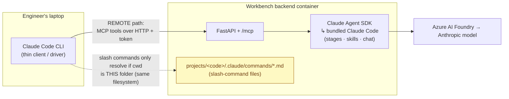

# Data Workbench

A web-based orchestrator for data engineering pipelines. Projects are containers holding multiple named workflows — discover source data, assess quality, enhance with domain knowledge, analyze gaps, test, remediate, and publish. Pipeline stages are executed by data agents (Claude agents run via the Claude Agent SDK), backed by a Neo4j knowledge graph.

The frontend is split into **two persona-scoped shells** over a shared backend:
- **Product Workbench** (`/product/*`) — Data Product Owner. New Product wizard, My Products, Ingest Existing Product, Marketplace.
- **Engineering Workbench** (`/engineer/*`) — Data Engineer. Project list, Incoming queue (PO submissions), per-project pipeline + reviews + chat.

Each shell has a chat assistant powered by data agents (Claude agents run via the Claude Agent SDK). The engineer-side **Ask** panel queries the project's knowledge graph in natural language and explains scores/results. The product-side **Guide me** panel coaches the PO through the wizard and can Apply structured suggestions (idea, name, schema columns, quality rules, column-level transforms, dataset-level Shape) directly into the form.

Both personas can also drive the workbench from **their own Claude Code** over MCP — two separate front doors on the same backend: `/mcp` for the **Data Engineer** (142 tools; `engineer-kit/`) and `/po-mcp` for the **Data Product Owner** (68 tools; `po-kit/`). No local skills or database credentials required. See [`docs/engineer-guide.md`](docs/engineer-guide.md) and [`docs/mcp-architecture.md`](docs/mcp-architecture.md) for setup; a one-prompt onboarding is served at `/api/bootstrap?persona=po|de`.

## Documentation

| Doc | What it covers |
|-----|----------------|
| [`docs/getting-started.md`](docs/getting-started.md) | **Start here** — from a folder/zip to a running instance via Docker Compose |
| [`CLAUDE.md`](CLAUDE.md) | Canonical, current description of the system internals — the source of truth |
| [`docs/architecture.md`](docs/architecture.md) | System diagrams + stable contracts |
| [`docs/userguide.md`](docs/userguide.md) | End-user walkthrough for both shells |
| [`docs/data-migration.md`](docs/data-migration.md) | Data Migration (`dmig`) user guide — raw lift-and-shift, the package, reconciliation, and where transformation fits |
| [`docs/code-migration.md`](docs/code-migration.md) | Code Migration (`cmig`) user guide — spec-first reverse→review→forward-engineering, the curated Platform SME corpora, linking to a `dmig` project, the package |
| [`docs/inbound-intake.md`](docs/inbound-intake.md) | Inbound intake — an external tool POSTs migration/modernization recommendations, an LLM parser normalizes them, a practitioner reviews, and a saga scaffolds `dmig` or `dpe-sa`+`dpe-cf` projects |
| [`docs/estate-discovery.md`](docs/estate-discovery.md) | Estate Discovery (Connected Estate) user guide — scan a live platform top-down, the per-platform connection-setup table, and top-down data-product feasibility |
| [`docs/connected-estate.md`](docs/connected-estate.md) | Connected Estate architecture deep-dive — the top-down feasibility bounded context, the `ready`/`adaptable`/`assemblable`/`absent` stoplight, and its separation from Pulse discovery |
| [`docs/engineer-guide.md`](docs/engineer-guide.md) | Driving a project from your own Claude Code via MCP |
| [`docs/mcp-architecture.md`](docs/mcp-architecture.md) | Canonical MCP tool reference — both front doors (`/mcp` engineer, `/po-mcp` PO) |
| [`docs/auth.md`](docs/auth.md) | Auth/RBAC reference — JWT sessions, `WB_AUTH_SECRET`, `WB_READ_ONLY`, seeding users |
| `docs/architecture/` | Per-subsystem deep dives (transformations, dataset-shape, view-DDL, marketplace, scoring, ingest) |

(The `research/` directory is dated scratch — design notes and half-finished proposals, not a current description of the system.)

## Prerequisites

- **Python 3.12+** with `venv`
- **Node.js 20+** and npm
- **Neo4j** (knowledge graph storage)
- **PostgreSQL** (source database to discover/profile)
- **Claude Agent SDK** installed (`claude-agent-sdk` Python package — drives server-side stage execution)

## Launch with `dwb` (recommended)

`dwb` is the purpose-built launcher — one tool, two launch modes, opt-in sample
databases, one-click quick-connect, graceful shutdown, and a layered reset. It's
stdlib-only Python (runs under the system `python3` before any venv exists) so
`dwb doctor` and `dwb up --mode host` can bootstrap the venv themselves.

```bash
# Preflight a fresh checkout (docker, compose, ports, venv/node, secrets).
./dwb doctor

# Compose mode (default, most reproducible): core stack + ALL Postgres samples
# (hr, banking, products_sales — each in its own DB) + the HR MySQL sample.
# Gitea is on by default (Push-to-Git demos) and auto-bootstrapped — no manual PAT.
./dwb up --with postgres,mysql
# ...or load just one: `./dwb up --pg-sample products_sales` (auto-enables postgres)
# ...or add the S3-compatible object store (SeaweedFS) to publish data artifacts:
./dwb up --with postgres,mysql,storage      # or: --with postgres,mysql --storage
# ...or add the reference OpenTelemetry collector (Grafana otel-lgtm) + wire the
# stack to it — traces/metrics/logs at http://localhost:3111:
./dwb up --with postgres,mysql,observability   # or: --with … --observability
#   (aliases: `--with otel` / `--with telemetry`)

# Host mode (hot-reload dev): reuses a compatible running Neo4j if it finds one,
# else compose-manages one; sample DBs + Gitea always run as containers.
./dwb up --mode host

./dwb status          # app + dependency health
./dwb logs backend    # tail a component
./dwb down            # graceful stop (add --volumes to nuke all named volumes)
./dwb reset           # interactive: soft (keep sample data) vs hard (blank everything)
```

| Command | What it does |
|---|---|
| `dwb up [--mode host\|compose] [--with postgres,mysql,storage,observability] [--pg-sample all\|<name>[,…]] [--mysql-sample all\|<name>[,…]] [--gitea\|--no-gitea] [--storage\|--no-storage] [--observability\|--no-observability] [--foreground]` | Launch; runs preflight first, writes the quick-connect manifest, auto-bootstraps Gitea. `--with storage` (or `--storage`) adds the S3-compatible object store; `--with observability` (or `--observability`) adds the reference OpenTelemetry collector (both off by default) |
| `dwb down [--volumes]` | Graceful stop; `--volumes` removes all named volumes |
| `dwb status` / `dwb doctor` | Resolved health / preflight checks |
| `dwb reset` | Interactive soft (blank graph+SQLite+projects+repos, keep sample DBs) vs hard (`down -v` + re-up + re-bootstrap Gitea) |
| `dwb logs [backend\|frontend\|neo4j\|postgres\|mysql\|gitea\|seaweedfs\|observability\|all]` | Tail logs |
| `dwb connect` | (Re)write the quick-connect manifest for launched sample DBs |
| `dwb restart [backend\|frontend\|all]` | Host mode: hot-restart app procs |

**Sample databases are opt-in and self-describing.** Each lives under
`samples/<name>/` with a `sample.json` manifest (platform, target database,
schemas, domain). `--with` toggles the `postgres` / `mysql` compose profiles and,
with no explicit sample flag, loads **all** of that engine's samples — each into
its own database (Postgres) or schema-set (MySQL) inside one container, so they
never collide. `--pg-sample` / `--mysql-sample` narrow the set (`all` or a comma
list) and auto-enable their engine. Loading is **idempotent** — re-running `dwb up`
skips samples already present and adds any new ones without a volume wipe. A
sample passed to the wrong engine's flag is rejected with a clear error. Launched
sample DBs appear (one connection per sample) as a **Quick connect** prefill in the
project data-source dialog and the Connections page — click to fill the form, then
Save (demo creds only).
**`--with storage`** (or the `--storage` flag) is a separate opt-in — it adds an
S3-compatible object store (SeaweedFS) for **publishing generated data artifacts**
(off by default): S3 API on `localhost:9000`, a file browser on `localhost:8888`,
dev creds `workbench` / `workbenchsecret`. See the Object-store publishing feature
below and [`docs/architecture/object-store.md`](docs/architecture/object-store.md).
**`--with observability`** (or the `--observability` flag; aliases `otel` /
`telemetry`) is another separate opt-in — it launches a bundled all-in-one
OpenTelemetry collector (Grafana **otel-lgtm**: OTLP in + Grafana UI with
Prometheus/Tempo/Loki) and **auto-wires the whole stack to it** by defaulting
`OTEL_EXPORTER_OTLP_ENDPOINT` at the in-network collector — Grafana on
`http://localhost:3111`, OTLP on `:4318` (HTTP) / `:4317` (gRPC). You then get
per-stage/chat/advisor **token-cost metrics, traces, and logs** end-to-end
(Claude Code CLI + FastAPI request spans). Telemetry is **off by default**;
naming this profile is all it takes locally. To point at your own OTLP backend
instead (Honeycomb / Datadog / Grafana Cloud / a self-hosted collector), skip the
profile and set `OTEL_EXPORTER_OTLP_ENDPOINT` (plus any `OTEL_EXPORTER_OTLP_HEADERS`)
in `.env` — an explicit endpoint always wins. Full env-var reference in the
[Deployment Guide → Observability](docs/deployment-guide.md#observability-opentelemetry).
The last-used mode + profiles persist to `.dwb/state.json` so `down`/`status`/`reset`
target the right stack. `./dev` is kept as a thin wrapper that forwards to
`dwb --mode host`.

## Run with Docker (manual)

You can still drive Compose directly. The whole stack — backend (FastAPI +
WebSocket + MCP at `/mcp` engineer and `/po-mcp` PO), Neo4j, and the nginx-served
frontend — runs from `docker-compose.yml`. The demo sample DBs (`postgres`,
`mysql-hr`) and `gitea` in `docker-compose.override.yml` are **profile-gated** —
pass `--profile postgres --profile mysql --profile gitea` (this is what `dwb`
does for you) or they stay off.

**Prerequisites:** Docker + Docker Compose. (The local-dev toolchain below is *not*
needed for this path.)

```bash
# 1. Secrets — create a gitignored .env next to docker-compose.yml
#    (or start from the committed .env.example: cp .env.example .env).
#    Three LLM routes: Azure Foundry (key + resource), Anthropic direct, or a
#    token from your own Claude Code subscription.
#    MCP is fail-closed unless a token is set.
cat > .env <<'EOF'
# Azure Foundry. RESOURCE is required — it has no default.
ANTHROPIC_FOUNDRY_API_KEY=<your-key>
ANTHROPIC_FOUNDRY_RESOURCE=<your-azure-foundry-resource>
# ...or go direct to Anthropic instead (leave the two Foundry vars unset):
# ANTHROPIC_API_KEY=<your-key>
# ...or, if you already run Claude Code here, bill your own subscription: run
# `claude setup-token` and paste the token (valid 1 year). Personal credential —
# your laptop only, never a shared deploy.
# CLAUDE_CODE_OAUTH_TOKEN=<token from `claude setup-token`>
# Bearer tokens for /mcp + /po-mcp ("token", "token:principal", or
# "token:principal:proj1|proj2", or "token:principal:projects:role").
# Comma-separated. REQUIRED for any shared deployment; for local-only use you
# may instead set WB_MCP_ALLOW_INSECURE=1.
WB_MCP_TOKENS=<token>
# WB_MCP_ALLOW_INSECURE=1

# REST API auth (HS256 JWT sessions). Unset = auth disabled (local dev).
# Generate a strong random value: python3 -c "import secrets; print(secrets.token_hex(32))"
# WB_AUTH_SECRET=<secret>
# WB_AUTH_REQUIRE=1   # fail-closed: refuse to start if WB_AUTH_SECRET is unset

# Global read-only mode — blocks all mutations for all users and personas.
# WB_READ_ONLY=1

# On a shared/remote deploy, set the backend's public origin so served kit
# installers register the MCP endpoint against a trusted origin (not the Host
# header). Unset = fall back to the request Host (fine for local dev).
# WB_PUBLIC_BASE_URL=https://workbench.example.com
EOF

# 2. Build + start (first build is slower — it bakes the embedding model).
docker compose up -d --build

# 3. Health check
curl http://localhost:8000/api/health
```

| Service | URL | Notes |
|---|---|---|
| Frontend | http://localhost:5173 | nginx-served Vite build |
| Backend | http://localhost:8000 | REST + WS + MCP at `/mcp` |
| Neo4j Browser | http://localhost:7475 | login `neo4j` / `workbenchpass` (bolt on `7688`) |

The backend reaches Neo4j internally at `neo4j:7687`. To reach a **source Postgres
running on your host**, set the project's connection host to `host.docker.internal`
instead of `localhost`. State persists in named volumes (`neo4j_data`, `wb_data` =
SQLite, `wb_projects` = per-project scratch).

```bash
docker compose up -d --build backend frontend   # rebuild after code changes
docker compose logs -f backend                  # tail logs
docker compose down                             # stop (volumes persist)
```

Then jump to [Configure](#3-configure) below.

## Quick Start (local dev, without containers)

### 1. Backend

```bash
python3 -m venv env
source env/bin/activate
pip install fastapi "uvicorn[standard]" sqlmodel websockets aiofiles neo4j pyyaml claude-agent-sdk

uvicorn workbench.backend.main:app --reload \
  --reload-exclude 'env/*' --reload-exclude 'projects/*'
```

Backend runs on http://localhost:8000.

### 2. Frontend

```bash
cd workbench/frontend
npm install
npm run dev
```

Frontend runs on http://localhost:5173.

### 3. Configure

1. Open http://localhost:5173 — the persona chooser lets you pick **Product Workbench** or **Engineering Workbench**. The header **Switch** button toggles between them.
2. From the Engineering Workbench, go to **Settings** — configure Neo4j connection
3. Create a new project (engineer side) or a new product (product-side: `NewProductWizard` auto-provisions a dpe-cf project, `NewSourceProductWizard` auto-provisions a dpe-sa project)
4. Run stages using the appropriate role personas

## Architecture

```
┌──────────────────────────────────┐  ┌──────────────────────────────────┐
│   Product Workbench (PO)         │  │  Engineering Workbench (DE)      │
│   Wizard · My Products · Ingest  │  │  Projects · Incoming · Pipeline  │
│   Marketplace · Guide-me chat    │  │  Reviews · Ask chat              │
└──────────────────┬───────────────┘  └──────────────────┬───────────────┘
                   └─────────────┬──────────────────────┘
                                 │  REST + WebSocket
                                 ▼
┌────────────────────────────────────────────────────────────────────────┐
│                          FastAPI Backend                                │
│  Pipeline state (SQLite)   │  Data agent execution (Claude Agent SDK)   │
│  Neo4j graph queries       │  Agent-to-user messaging                   │
│  Workflow catalog          │  Product chat + Apply protocol             │
└──────────────────┬─────────────────────────────────┬────────────────────┘
                   │ Claude Agent SDK                │ Neo4j / PostgreSQL
                   ▼                                 ▼
┌───────────────────────┐  ┌──────────────────────────────────────────────┐
│  Data agents + Skills │  │  Neo4j Knowledge Graph                       │
│  (workbench-skills/skills/)    │  │  DCAT-2, DQV, SHACL, PROV-O, ODCS, DPROD     │
│                       │  │  PostgreSQL Source DB                        │
└───────────────────────┘  └──────────────────────────────────────────────┘
```

## CLI Execution (Engineer Workflow)

A Data Engineer can drive the pipeline from their **own Claude Code**, not just the web UI. There are **two layers of "Claude Code" in play** — keep them separate:

- **Server-side execution engine** — the backend runs the **Claude Agent SDK** (`claude_agent_sdk`), which **bundles the Claude Code runtime** and spawns it as subprocesses to execute every stage / skill / chat. This is where the LLM + data work actually happens, with the server's Foundry/Anthropic credentials. In a containerized deploy this runs **inside the backend container** — the engineer never sees or installs it.
- **Client-side driver** — the engineer's **own Claude Code CLI on their laptop** is a *thin client*. It doesn't execute anything; it orchestrates (list projects, trigger a stage, review) by talking to the server.

There are two ways the client talks to the server, and they have **different topology requirements** — this is the #1 source of confusion:



### Path A — Remote (MCP) · the default for a containerized Workbench

Your laptop is a thin client; you drive **MCP tools** over HTTP with a bearer token — **no local files, no `cli-bootstrap`, no slash commands**. This is the supported path when the Workbench runs in Docker / on another host. Setup + the full tool surface live in **[`docs/engineer-guide.md`](docs/engineer-guide.md)** (install the `engineer-kit` plugin → set `WORKBENCH_MCP_URL=http://localhost:8000/mcp` + a token from `WB_MCP_TOKENS` → just *ask*: "list my projects", "run discovery on Customer Master"). You won't see `/run-stage`-style slash commands here — you describe what you want and the MCP tools do it server-side.

**Fastest setup — one-liner from the backend.** No git/plugin steps; installs MCP + the `workbench-guide` skill + `/workbench-*` commands straight into a project:
```bash
curl -fsSL http://<backend-host>:8000/api/engineer-kit/install.sh \
  | WORKBENCH_TOKEN=<token> bash -s -- ~/your-project
```

**Product Owner? Same idea, a different door.** The PO drives `/po-mcp` (68 tools — portfolio, the conversational product-authoring assistant, the validation gate, publish, Connected-Estate feasibility + offline extraction, the Blueprint Library of spec templates) via the `po-kit` installer:
```bash
export WORKBENCH_TOKEN=<token>
curl -fsSL http://<backend-host>:8000/api/po-kit/install.sh | bash
```
Both installers write config for Claude Code, Cursor, and Codex. **Not sure which?** Paste the output of `curl http://<backend-host>:8000/api/bootstrap` (or `?persona=po|de`) into a fresh Claude Code session and it self-drives the setup, then tells you to relaunch. Full PO tool surface: [`docs/mcp-architecture.md`](docs/mcp-architecture.md).

**Semantic Q&A from the CLI.** The same natural-language semantic-layer chat you get in the marketplace UI is available from your Claude Code via the `query_semantic_layer` MCP tool — e.g. *"using the workbench, how many customers are in each segment?"* It runs the concept-guided pipeline server-side (resolve concepts → SQL → execute → synthesize) and returns a markdown answer with a result table + the SQL. Same engine as the UI's `POST /api/marketplace/chat`.

**Not on Claude Code?** `/mcp` is a standard streamable-HTTP MCP server with bearer-token auth, so any MCP client works — e.g. OpenAI **Codex** connects with the same URL + token (no `engineer-kit` plugin). See [`docs/engineer-guide.md` §3c](docs/engineer-guide.md#3c-use-a-different-mcp-client-codex-etc).

### Path B — Co-located (slash commands) · local dev only

The slash commands below come from project-local `.claude/commands/*.md` files, and **Claude Code only auto-discovers them from its own working directory**. `cli-bootstrap` renders them into `projects/{code}/.claude/commands/` **on the server's filesystem**:

```bash
curl -X POST http://localhost:8000/api/projects/{ID}/cli-bootstrap   # {ID} is the numeric id, not the code
```

So they appear **only if your Claude Code session is running from that project directory on the same filesystem** — i.e. the backend running locally (non-Docker, `projects/` on your disk) or `docker exec`-ing into the container and launching `claude` there. If the Workbench is in a container and your Claude Code is on your laptop, these files are inside the container and **won't show up** — use Path A instead. (It also renders `projects/{code}/CLAUDE.md` as auto-loaded context; `/refresh-context` regenerates both.)

### Slash commands (Path B)

| Command | Purpose |
|---------|---------|
| `/run-stage <stage_id>` | Run a pipeline stage by stage_id (streams agent output); backend-driven stages auto-route to `/stages/{n}/complete` |
| `/pipeline-status` | Show per-workflow stage statuses for this project |
| `/workflow-list` | List workflows available in the catalog (with readiness) |
| `/workflow-add <workflow_id>` | Add a workflow from the catalog to this project |
| `/reviews-pending` | List pending review items across all review types |
| `/review-show <review_type> [<uri>]` | Pretty-print a single review item for triage |
| `/stage-log <stage_id>` | Show the latest transcript for a stage (read-only) |
| `/refresh-context` | Regenerate this project's CLAUDE.md + slash commands from current backend state |
| `/joins-override-get <output_dataset_uri>` | Read the current `:DatasetTransform.joins[]` for an output dataset |
| `/joins-override-set <output_dataset_uri> <joins_json>` | Override the inferred FK joins for an output dataset (Phase 4 escape hatch) |
| `/generate-report [<contract_id>]` | Generate a Markdown report (with Mermaid diagrams) for a data product |

### Limitations (Path B slash commands)

- **Review approvals are read-only via slash commands.** `/reviews-pending` and `/review-show` inspect pending items, but approve / edit / escalate / reject goes through the UI panels or **MCP tools** (`review_description`, `review_mapping`, `review_domain_rule`, `review_table_description`). The slash-command path doesn't render the transform editor's 15 kind-specific param forms.
- **CLI honors the role gate.** Only Data Engineer-owned stages run via `/run-stage`; PO / Steward / DQA stages stay in their respective UIs or the PO MCP front door.
- **DQ-test execution stages bypass the SSE endpoint.** Great Expectations / Pandera test runs are backend-driven subprocess stages, not SDK stages — run them from the UI.

## Project Archetypes

| Archetype | Status | Description |
|-----------|--------|-------------|
| Data Discovery (`dd`) | Implemented | Discover, profile, enrich, assess quality, domain analysis |
| Data Product Engineering — Source-aligned (`dpe-sa`) | Implemented | Discovery-first: engineer profiles a source DB, PO validates names / descriptions / rules / table classifications via a combined PO validation gate before materialization |
| Data Product Engineering — Consumer-aligned (`dpe-cf`) | Implemented | Contract-first: PO shapes the product (grain, schema, rules) in the wizard, then resolves which source products to `:CONSUMES` at the required submit gate (step 9); engineer maps the bound source products' columns to the declared contract |
| Data Quality (`dq`) | Implemented | Quality-only sub-flow (discovery + DQ stack, no product materialization) |
| Data Migration (`dmig`) | Implemented | Engineer-initiated platform-to-platform raw lift-and-shift. Sources: PostgreSQL, MySQL, Oracle, SQL Server / Azure SQL. Targets: Snowflake, Databricks. Runs a DLT-based migration package (`run_migration.py`) independently of the product graph — no marketplace entry, reconciliation-only DQ (row-count / checksum). Downloadable + pushable to Git. MCP tools cover configure / snapshot / reconcile / status / package plus the offline **schema-only** path (`set_intake_execution_mode`, `get`/`confirm_physical_schema`, `seed_migration_schema`, `flip_migration_to_live`). User guide: [`docs/data-migration.md`](docs/data-migration.md). |
| Code Migration (`cmig`) | Implemented | Engineer-initiated legacy-code → target-platform conversion via **spec-first reverse→review→forward engineering**. Links to a `dmig` project for the source→target schema, imports legacy code, reverse-engineers it into a reviewed use-case spec (a **blocking** review gate), then forward-engineers it against the target using two curated Platform SME corpora (source "what-to-identify" + target "patterns/anti-patterns"). Thin like `dmig` — no marketplace/product graph nodes; produces a downloadable, git-pushable package (`old/` + `new/` + conversion report). +11 DE MCP tools. User guide: [`docs/code-migration.md`](docs/code-migration.md). |
| Data Modernization (`dmod`) | Placeholder | Assess, plan, and migrate legacy platforms |

Two **sanctioned** cross-project graph edges exist; everything else is project-scoped via `{project_code}` URI prefixes. Both are MATCH-only against a deliberately-referenceable target (a typo drops the edge rather than spawning a phantom):
- **`:CONSUMES`** — links a consumer product's `:DataContract` to a published upstream product's `:DProdDataProduct` (source / aggregate / consumer), forming multi-hop DAG chains.
- **`:USES_DATASET`** — links a code-migration (`cmig`) project's `:CodeModule` to a data-migration (`dmig`) project's source/target `:Dataset`, built from the approved reverse-engineered spec.

## Workflow Groups

Projects contain multiple named workflow groups. Each archetype scaffolds default groups; users can add/remove groups from a catalog at creation time or later via **+ Add Workflow** on the project pipeline.

### DD (Data Discovery) — 1 default workflow

The `dd` archetype scaffolds only **Source Discovery & Profiling** by default. The other workflow groups below are addable from the catalog via **+ Add Workflow**.

| Workflow | Stages | Description | Default? |
|----------|--------|-------------|----------|
| **Source Discovery & Profiling** | Data Discovery, Data Profiling, Metadata Enrichment | Discover and document source data | Default |
| **Quality Assessment** | DQ Rule Generation, Data Quality Scoring | Baseline quality score from profiling | Addable |
| **Domain Quality Assessment** | Domain Rule Enhancement, Domain Impact Analysis | Apply domain knowledge, analyze gap | Addable |
| **Quality Testing** | DQ Testing (GX or Python) | Row-level validation against rules | Addable |
| **Quality Remediation** (repeatable) | Remediation Planning, Re-Profile & Re-Score | Fix issues, measure improvement | Addable |

### DPE-SA (Source-aligned) — default workflows

| Workflow | Stages | Description |
|----------|--------|-------------|
| **Source Discovery & Profiling** | Data Discovery, Data Profiling | Engineer profiles the raw source |
| **Metadata Enrichment** | Metadata Enrichment | Generates column + table descriptions with `relationshipKind` classification |
| **Source Naming Recommendations** | Column-Name Standardization | A data agent proposes consumer-facing column names |
| **PO Validation Gate** | Mark Discovery Complete, PO Source Validation | PO reviews names + descriptions + observation rules + table classifications in one combined panel; engineer can't proceed until cleared |
| **Materialization** | Synthesize ODCS from Graph, ODCS→dprod, Auto-Map Source Columns, Serving (Virtual View), Mark Engineering Complete | Synthesizes the ODCS contract from approved graph state, 1:1 auto-maps source columns to product columns, emits views |

### DPE-CF (Consumer-aligned) — lean default workflows

| Workflow | Stages | Description |
|----------|--------|-------------|
| **Product Definition** | Initiate, ODCS Specification | PO authors the contract in `NewProductWizard` — 10 steps, contract-first: Describe & Choose Domain → Shape (dataset-level) → Suggest candidate sources (optional) → Shape the Schema → Product Details → Operations & Support → Rule Coach → Readiness Review → **Confirm candidate sources** (required submit gate; `:CONSUMES` edges materialise here) → Submitted |
| **ODCS→dprod** | ODCS→dprod | Materialises the `:DataContract` into the dprod subgraph |
| **Integration** | Mapping & Transformation, Data Serving (Virtual View), Mark Engineering Complete | Engineer maps columns from CONSUMES'd source products' `:DProdColumn` to the consumer's `:DProdColumn` |

Discovery / profiling / enrichment / DQ workflows are intentionally **not** in the dpe-cf default — the consumer inherits that context from its CONSUMES'd source products. Engineer can add them from the catalog if needed.

## Roles

| Role | Can Run | Can Review |
|------|---------|------------|
| Data Product Owner | Initiate, ODCS Specification, marketplace **Deploy** + **Score OSI now**, **PO source validation** (SA flow) | Source product validation (names + descriptions + observation rules + table classifications), Domain rules |
| Data Engineer | Discovery, Profiling, ODCS→dprod, Mapping, Serving, Metadata Enrichment, Column-Name Standardization, Mark Discovery Complete, Synthesize ODCS from Graph, Auto-Map Source Columns, Mark Engineering Complete | Unmapped columns |
| Data Steward | Reflect on Reviews | Descriptions (non-SA only — PO owns descriptions for SA), Transformation Escalations |
| Data Quality Analyst | DQ Rules, DQ Testing, DQ Failure Analysis, Scoring, Domain Rules, Remediation, Rescore | Domain Rules |
| Reviewer | — | Descriptions, Mappings |

The PO's approve/reject decisions on the Rule Coach (in the wizard) ride along with the submitted ProductRequest, so the engineer's Domain Rules review only sees rules the PO didn't decide. For **dpe-sa**, the PO's combined validation panel approves column names, descriptions, observation rules, and `:TableDescription.relationshipKind` classifications in one place — the engineer's `Synthesize ODCS from Graph` stage is blocked until the PO clears the gate.

## Skills

Skills are vendored in-repo at `workbench-skills/skills/<name>/` (version-controlled, baked into the backend image) with `SKILL.md` (instructions) and `scripts/` (Python). All scripts that query Neo4j accept `--project-code` for project isolation.

### Pipeline Skills

| Skill | Workflow | Purpose |
|-------|----------|---------|
| `data-discovery` | Source Discovery | Extract PostgreSQL metadata to YAML |
| `data-discovery-to-dcat-neo4j` | Source Discovery | Load YAML as DCAT-2 graph nodes |
| `data-profiling` | Source Discovery | Profile column statistics from PostgreSQL |
| `data-profiling-to-dqv-neo4j` | Source Discovery | Load profiles as DQV graph nodes |
| `metadata-enrichment` | Source Discovery | Generate semantic column descriptions |
| `data-quality-rule-generation` | Quality Assessment | Derive observation-based SHACL rules |
| `data-scoring` | Quality Assessment | Compute 8-dimension quality scores (incl. Documentation, Grounding) |
| `domain-rule-enhancement` | Domain Quality Assessment | Generate rules from YAML reference files |
| `data-remediation-analysis` | Domain Quality Assessment | Analyze issues, estimate score impact |
| `data-remediation-planning` | Quality Remediation | Execute user-chosen remediation action |
| `data-mapping-neo4j` | Integration | Map source to product columns; `--source-mode {catalog,dprod}` (consumer-aligned mappings target `:DProdColumn` from CONSUMES'd source products, not raw catalog). Reads PO transform hints + steward transformation catalogs to seed derivations |
| `data-serving-virtual-view` | Integration | Generate `CREATE OR REPLACE VIEW` DDL per `:DProdOutputDataset`. Compiles structured `:ColumnMapping` transforms (direct / cast / lookup / bucket / mask / hash / **window**) + dataset-level `:DatasetTransform` (filter / dedupe / grouping / joins / SCD-1/2/snapshot / suppressedColumns). Multi-dialect: PostgreSQL / Snowflake / Databricks / BigQuery / ANSI via `--dialect`. Persists a sidecar summary JSON the UI renders as a "View-DDL signals" callout |
| `column-name-standardizer` | Source Naming (SA) | Proposes consumer-facing names for source columns; PO approves / edits in the validation gate |
| `data-quality-testing-gx` | Quality Testing | Great Expectations validations |
| `data-quality-testing-python` | Quality Testing | Pandera/Python validations |
| `playbook-reflector` | Active Learning | Analyze reviews, update domain playbook |
| `odcs-to-graph` | Product Definition | ODCS to dprod transformation |
| `project-chat-assistant` | Engineer Chat (Ask) | Project-scoped graph Q&A, score interpretation, workbench explainer |
| `product-authoring-assistant` | Product Chat (Guide me) | PO wizard coach; emits Apply suggestions for idea / domain / name / schema / rules / column transforms / dataset Shape |
| `data-product-name-advisor` | Product Chat sub-skill | Product name + dataset name suggestions when invoked from the wizard |
| `data-product-question-analyzer` | Marketplace Q&A | Reads schema + DQ rules + dataset-level Shape and either (generate mode) lists ~10–20 natural-language questions the product can answer + near-miss gaps, or (probe mode) classifies a free-form consumer question as `answerable` / `partially` / `no` with named gaps. Persists generate runs as a `:QAEvaluation` sidecar on `:DataContract`; probes are ephemeral |

### Domain Rule Reference Files

Domain rules are driven by structured YAML reference files in `workbench-skills/skills/domain-rule-enhancement/reference/`:

```
reference/
  common.yaml              # Universal rules (future dates, email format, etc.)
  hr.yaml                  # Human Resources domain
  customer.yaml            # Customer/CRM domain (Salesforce)
  guidance/
    hr.md                  # Free-form HR guidance
    customer.md            # Free-form Customer guidance
```

New domains are added by creating a YAML file — no code changes needed.

## Key Features

- **Two-workbench shell split** — Persona-scoped frontends over a shared backend, each with its own theme, browser tab title, and favicon so multi-tab demos stay unambiguous. **Switch** button in the header jumps directly between shells.
- **Capability-palette board (Engineering Workbench)** — The engineer's project view is a board, not a rigid staged rail. Every capability the project can run shows as a card, grouped into broad phases — **Discover & document**, **Validate**, **Materialize & serve**, and an optional **Data quality & scoring** — flattened across the underlying workflows. One capability the engineer hasn't run yet is highlighted as the **recommended next step**, but stage ordering is a recommendation, not a gate: the engineer can run any capability in any order (running ahead of the recommended order just warns that earlier steps haven't completed). Addable capabilities appear as cards in their phase, so there's no separate "Add Workflow" detour for the common path.
- **Product Workbench wizards** — Two flavors: **`NewProductWizard`** (consumer-aligned, 10 steps, contract-first: Describe & Choose Domain → Shape → **Suggest candidate sources** (optional) → Shape the Schema → Product Details → Operations & Support → Rule Coach → Readiness Review → **Confirm candidate sources** (required submit gate) → Submitted) auto-provisions a fresh `dpe-cf` project per product. Source binding is split across step 3 (optional pre-selection that feeds the schema advisor) and step 9 (required confirm that MERGEs `:CONSUMES` edges). **`NewSourceProductWizard`** (source-aligned, 3-step lightweight: idea + domain + name) auto-provisions a `dpe-sa` project — the engineer fills in the rest from profiling, and the PO closes the loop at the validation gate.
- **Apply protocol (Guide-me chat)** — The PO chat assistant emits structured suggestion blocks that the wizard can Apply directly into form fields: `idea` / `domain` / `name` / `dataset_name` / `description` / `purpose` (replace wizard field); `schema_add_columns` / `schema_pick_columns` (extend / replace the schema); `rule_decisions` / `rule_create` (PO-authored rules with `ruleSource='user'`); `column_transform_set` (column-level transform hint — kind / inputs / params); `shape_set` (dataset-level Shape — grain prose, filter, scd_policy with full SCD-2 sub-fields, grouping_keys, suppressed_columns); plus the OSI advisor's metric / relationship / context cards. Partial-update semantics across the board — absent fields preserve current state.
- **Ingest existing product** (`IngestExistingProductPage`) — Parallel entry point to the wizard at `/product/ingest` for registering pre-existing ODCS specs (source-aligned OR consumer-aligned). Four-step flow: **Source** (upload `.yaml`/`.json` or paste; deterministic `parse-odcs` + `_canonicalize_v3_1`), **Confirm** (the `data-product-archetype-classifier` skill detects source vs consumer with rationale; PO confirms or overrides via banner), **Resolve** (consumer-aligned only — per-slot marketplace candidate dropdowns ranked exact-URI → exact-name → semantic match, with **Mark as gap** + **Create now** buttons that spawn a `NewSourceProductWizard` from a missing source and link the spawned `ProductRequest` / project back into the draft), **Success**. State persists as an `IngestDraft` auto-saved on every step transition and slot change — the PO can leave to author a missing source product and resume via `?draft=<id>`. The Resolve step also exposes a manual-fire **Pre-flight gap analysis** that classifies each consumer column as `covered` / `derivable` / `ambiguous` / `gap` against the bound sources. Commit (`POST /from-odcs`) scaffolds `DPE_CF_WORKFLOW_TEMPLATES`, MERGEs `:CONSUMES` edges, and lands at `lifecycleState='submitted'` (no auto-publish). Quality rules embedded in the spec land as `:PropertyShape ruleSource='spec', status='approved'`.
- **Chat file attachments** — Both chat panels accept `.txt` / `.json` / `.csv` uploads (≤2MB, ≤10 per turn). The agent receives a markdown preamble with byte size + head() preview and can `Read` the full file for rule extraction.
- **Engineer Ask panel** — Right-side drawer inside each project. Queries the project's Neo4j graph through `project-chat-assistant`, interprets quality scores, explains workbench concepts. Read-only; every factual claim is backed by a scoped Cypher query visible as a tool-use event. Context-aware suggested prompts.
- **Multi-workflow projects** — Projects contain multiple named workflow groups, customizable at creation time and after. Add/remove groups from a catalog.
- **Project-scoped graph isolation** — All Neo4j nodes use project-scoped URIs (`dataset:{project_code}:{schema}.{table}`). Two projects discovering the same tables get completely independent graph substructures.
- **Domain quality assessment** — Structured YAML reference files define domain-specific rules (deterministic, not agent judgment). Gap analysis report shows what profiling missed.
- **Real-time streaming** — Watch the data agent's output live via WebSocket
- **Agent-to-user messaging** — Agents ask questions mid-workflow (yes/no, multiple choice, checklist, free text) with timeout support
- **ODCS data contracts** — Author and persist Open Data Contract Standard specs
- **OSI readiness scoring** — A product-level readiness score that asks "is this product semantically consumable?" — independent of the underlying data quality. It checks whether the contract carries enough semantic information for a downstream BI or AI consumer to use it without back-channelling the producer: do datasets have descriptions, do fields carry real expressions instead of bare passthroughs, are keys and relationships declared, is there an AI-context block. Produces a single Red / Amber / Green band plus a per-criterion "what to fix" checklist. The PO previews it in the wizard's **Readiness Review** step; the **Score OSI now** button (re)scores from the marketplace; and the band shows as a one-glance "is this safe to consume" badge on marketplace products.
- **Data marketplace** — Browse published data products with lineage. Source-aligned vs consumer-aligned products are distinguished at a glance with a kind chip and an All / Source / Consumer filter; `consumes` / `consumed_by` cross-references on the product detail tab pivot between linked products. Quality tab groups rules by table × category with severity / source / category filters.
- **Marketplace Semantic Q&A chat** — A first-class, domain-scoped natural-language chat surface (`MarketplaceChatPanel`) that answers free-form consumer questions by generating SQL across the deployed views of products in a domain. Backed by the `marketplace-product-chat-assistant` skill and curated `:BusinessConcept`s (an entity → attribute → value tree with predicate templates + column/dataset bindings + a join graph); returns a chat reply, a result table, suggested follow-ups, and an **Explain trace** (decompose → match concepts → resolve views → generate SQL → execute). Two **retrieval modes** the consumer can toggle: **Full Context** (every concept in the domain handed to the model) vs **Concept-Guided** (embedding-retrieve a relevant subset + neighbours). Each answer carries a self-explanatory badge (`mode · N in scope/retrieved → M referenced`) and per-question **token usage**, so the cost/precision tradeoff between the two modes is visible at a glance. Distinct from the per-product **Q&A** tab (which probes a single product) — this chat spans every deployed product in a domain. Same engine drives the MCP `query_semantic_layer` tool.
- **Semantic Discovery (Steward + Engineer)** — The `SemanticRecommenderPage` is the home for *building* the concept layer per domain, in three ordered, independently re-runnable steps: **Derive entities from schema** (deterministic entity/attribute/value spine + bindings + FK relationships), **Find cross-product concepts** (the `business-concept-advisor` proposes concepts spanning multiple products; proposals at/above a confidence threshold auto-promote, bound + parented, the rest queue for review), and **Enrich names & definitions** (LLM polish). A **Clear concepts** action soft-deprecates the domain for a clean rebuild. Each step shows run status, last-run time, and a **staleness** warning when the data products changed or an upstream step re-ran; a validation panel flags **stranded** concepts (no data-product binding). Three tabs: **Discovery** (the sequence), **Concepts** (manual add/edit/deprecate + the relationship diagram), **Review Queue** (triage queued proposals). The same sequence is drivable headlessly over MCP (`get_semantic_discovery_status` / `run_semantic_discovery_step` / `reset_semantic_discovery`). The data-product layer stays read-only — only `:BusinessConcept`s are written. **Phase A (cross-product entity coreference):** scaffold now anchors a consumer product's dataset to the *same* in-domain entity as the source dataset it maps to — provable via `:ColumnMapping` lineage only, strict-majority per consumer dataset (tie left unbound). This means a consumer product that re-exposes `Customer` columns shares the `Customer` entity with its source, so semantic Q&A queries span both products with no manual wiring. Tier-aware collision (`entity > attribute > value`) prevents a recommendation from clobbering a scaffolded entity of the same name; singular/plural + case normalization (`Employees → Employee`) is coreference-only, never destructive.
- **LLM token accounting** — Every LLM call across the system writes to a single usage ledger (`:LlmUsageEvent`), so token consumption is visible at three levels: **global** (a "LLM Token Usage" card on Settings with a per-source breakdown), **per data product** (a token strip on the engineer project dashboard), and **per Semantic-Q&A question** (in/out working tokens in the answer footer + retrieval badge). Headline figure is working tokens (uncached input + output); cached prompt overhead is tracked separately. Rollup endpoints under `/api/usage/*`, including a Full-vs-Concept-Guided comparison grouped by retrieval mode. Best-effort — accounting never breaks an LLM feature.
- **Q&A — questions a product can answer** — Sibling of OSI. The `data-product-question-analyzer` skill reads schema + DQ rules + dataset-level Shape (grain, joins, SCD policy, suppressed columns, window specs) and either generates a curated question set + near-miss gaps (the "what can this product answer?" surface) or probes a free-form consumer question for answerability and concrete gaps. Persists as a `:QAEvaluation` sidecar on `:DataContract` (append-only history; survives `_generate_dprod` rebuilds). A `lastSchemaChangeVersion` marker bumped on schema / rules / joins / shape changes drives a **stale — regenerate** badge so the marketplace surfaces when the analysis lags the contract. Mounted in the marketplace **Q&A** tab (consumer-facing read + owner-side regenerate + free-form probe), the engineer **Q&A** dashboard card, and the wizard's OSI Readiness step as an ephemeral pre-publish preview.
- **Structured rejection flow** — Engineer rejections carry a category (`missing_context` / `too_broad` / `unclear_purpose` / etc.) plus a reason; both persist as PROV-O on the `:DataContract` so the PO sees what to revise.
- **Active learning** — Playbook system learns from review outcomes
- **Remediation analysis** — Markdown report rendered in Results tab showing issues by category (auto-remediable, manual review, informational)
- **Bulk approve** — Quick approve-all links for descriptions and domain rules during demos
- **Persona-driven dashboard** — Tasks filtered by current role
- **Provenance tracking** — Full W3C PROV-O audit trail (rule reviews, contract revisions, rejections)
- **DQ Rules — four sources** — Quality rules come from four origins, each handled differently: **observation** (auto-discovered from profiling by a data agent — reviewed before it counts), **domain** (generated from the domain's reference catalogs), **user** (PO-authored in the wizard — auto-approved), and **spec** (carried in from an ingested ODCS contract). Author-asserted rules (user / domain in the wizard / spec) land approved on commit; machine-discovered observation rules wait for review (the PO in the source-aligned validation gate, or the DQA for the `dq` archetype). A Source filter and a shared table × category accordion span the engineer detail view and the marketplace Quality tab.
- **Transformations** — `:ColumnMapping` carries a structured DSL (`transformKind`, `transformInputs[]`, `transformParams`, `transformDecorators`) so derived columns are first-class, not free-text. Supported kinds: direct / cast / format / concat / split / substring / case / arithmetic / lookup (with `selection_strategy=equi|latest|aggregate|exists`) / literal / expression / **bucket** (continuous → bands) / **mask** (format-preserving redaction) / **hash** (md5 / sha1 / sha256) / **window** (LAG / LEAD / RANK / NTILE / aggregates over named `:DatasetTransform.window_specs`). Each transform records who authored it (`transformAuthor`), mirroring the four-source DQ pattern (`po_hint` ↔ spec, `steward_catalog` ↔ domain, `engineer` ↔ user, `ai_suggestion` ↔ observation). Authoring priority cascades **po_hint → steward_catalog → engineer → ai_suggestion**: a PO transform hint wins, then a steward catalog template, then an engineer edit, with the data agent's suggestion as the fallback when nothing else matches. The engineer's **Replace** overrides anything and always records a rejection reason. Engineers **Approve / Replace / Escalate** agent-suggested mappings — Replace covers any change to the mapping (transform fragments, sources, or remap to a different source column) in one form and always records a `:ProvRejectionReason`. The PO authors hints from a **Derive** affordance on each schema column.
- **Dataset-level shape** (`:DatasetTransform`) — Schema-level peer of column-level transforms. PO authors in the wizard's **Shape** + **Shape the Schema** steps; engineer overrides per-output-dataset on the project dashboard. Fields: `filter` (raw WHERE), `dedupe` (ROW_NUMBER over PK), `grouping_keys` (GROUP BY with per-column `aggregateFunction`), `joins[]` (explicit FROM/JOIN graph — bypasses FK auto-discovery), `scd_policy` (`latest_only` synthesizes a dedupe; `scd2` validates effective/expiration columns + optional derived `is_current`; `snapshot` synthesizes an as-of-date filter), `suppressed_columns` (drop from view; PK refusal), `window_specs` (named OVER clauses), `grain_prose`. Round-trips through ODCS YAML; lowered to SQL by `data-serving-virtual-view`.
- **Multi-dialect SQL emission** — `data-serving-virtual-view` ships a Dialect abstraction so the generated view-DDL targets PostgreSQL / Snowflake / Databricks / BigQuery / ANSI. Picks differ on cast syntax (`::` vs `CAST AS`), SHA hashing (pgcrypto vs `SHA2()` vs `TO_HEX(SHA256())`), and REGEXP_REPLACE flag conventions. Selected via the serving stage's dialect config picker; choice rides through to the persisted `:ServingDefinition.targetPlatform`.
- **Engineer override surfaces** — `JoinsOverridePanel` (per-row form with JSON escape hatch) lets engineers override FK auto-discovery by declaring explicit `joins[]` when the BFS picks a wrong bridge. Backed by a `PATCH /api/projects/{id}/dataset-transform/joins` endpoint that upserts both the schema-side `:DatasetTransform` (source of truth) and the ods-side parallel copy.
- **Table descriptions + RAG / classifications** — `:TableDescription` carries free-text + a `relationshipKind` classification ∈ {fact, lookup_dimension, general_membership, specialization, audit_log, configuration, unknown}. PO approves text + kind in the SA validation gate; the consumer-side bridge ranker prefers `general_membership` junctions when multiple FK paths exist. Surfaced as a shared `RelationshipKindChip` on marketplace cards, project dashboard, source-pickers, and the chat assistant.
- **Auto-bridge + multiplication warnings** — Consumer-side view-DDL BFS-discovers unmapped junction tables connecting mapped tables, ranked by name similarity + `relationshipKind`. History-shaped bridges (with `to_date`/`from_date`-style columns) auto-wrap in `ROW_NUMBER() OVER (...) = 1` to suppress row multiplication. Non-bridge temporal sources can't be silently dedup'd — they land in `summary['multiplication_warnings']` so the engineer is prompted to author `:DatasetTransform.dedupe`. All signals surface in the **ServingWarningsCallout** on both the engineer dashboard and the marketplace serving tab.
- **Auth / RBAC / read-only mode** — Optional request-level authentication for the REST API and WebSockets (`WB_AUTH_SECRET` → HS256 JWT sessions, 12 h TTL, pbkdf2 password hashing). Two server-enforced account roles: `owner` (Data Product Owner) and `engineer`; per-role stage + review gating at the choke-point. Seed users via `scripts/seed_users.py`; OIDC seam in `AuthProvider` for future SSO. `WB_READ_ONLY=1` is a global kill-switch that blocks every mutation for every persona (REST 403 + WS reject + MCP `_deny_write`) and drives a frontend banner + disabled Pipeline Run control — the primary safeguard for a hosted/shared demo box, togglable without a restart. Auth is **off by default** so local dev is unchanged. Full reference in [`docs/auth.md`](docs/auth.md).
- **Serving packages — downloadable execution units** — The DWB runs every serving path (virtual view, dbt-materialized, lakehouse Parquet+DuckDB) by executing a **self-contained package** (`run.py` + all artifacts + README). The same package is what an engineer downloads and runs. Download via `GET /serving/{view-package,dbt-project,lakehouse-package}?format=zip|json` or the MCP tools `get_view_package` / `get_lakehouse_package` / `get_dbt_project`. Packages carry a stdlib-only runner script (no `workbench.*` imports), env-var secrets (never written to disk), and a prescriptive 7-section README (title → artifact inventory → How it works → **How the technology works** — a concise under-the-hood mechanics block describing what the engine actually does + an orchestration mermaid → Configuration → Usage → Outputs). The "How the technology works" section is grounded in a `reference/tech/*.md` corpus bundled in each documenter skill.
- **Git integration — push to a per-product repo** — Serving packages + OKF docs + ODCS spec can be pushed to a per-product Gitea or GitHub repo (one repo per product, named after `project_code`). Configure in **Settings → Git Integration** (`AppSettings.git_provider|git_base_url|git_token|git_org|git_auto_push`). Push via `POST /api/projects/{id}/serving/push-to-git` (tagging each commit with the contract version), the MCP `push_to_git` tool, or automatic on a successful deploy / full dbt build (`git_auto_push`). The pushing uses the Gitea/GitHub Contents API over stdlib + httpx — no `git` binary, no clone. A local Gitea is included in `docker-compose.override.yml` for local testing.
- **Object-store publishing — push data artifacts to S3** — The complement of Git integration: Git carries the recipe (view/dbt/lakehouse **code** + docs), the object store carries the **data**. A project's generated data artifacts (Parquet + TransferBatch manifests) can be published to any S3-compatible store — bind one on the project's serving card (a registered `s3` connection + bucket + key prefix), then publish via the **"Publish to Object Store"** button (dashboard serving card or pipeline serving stage), `POST /api/projects/{id}/serving/push-to-storage`, or the MCP `push_to_object_store` tool. Each publish lands under an **immutable run prefix** (`<prefix>/runs/<run_id>/…`) with a `latest.json` pointer flipped last (no half-published snapshots; idempotent retries) and returns **presigned download URLs**. An `s3` connection is registered on the Connections page like any other platform (endpoint host/port, bucket, access key, secret; internal-vs-public endpoint split for presigning). The reference local fixture is **SeaweedFS** (Apache-2.0), added by `--with storage` — S3 on `localhost:9000`, a file browser on `localhost:8888`. The provider is vendor-neutral (`gcs` / `azure_adls` manifests are registered for future siblings); DuckDB/Spark read the same objects (`read_parquet('s3://…')` / `s3a://`). Design + decisions in [`docs/architecture/object-store.md`](docs/architecture/object-store.md) (ADR-14).
- **Marketplace Datasets sub-tab** — Discovered `:Dataset` nodes (from any `dd`, `dmig`, or in-flight `dpe-sa` project) are now browsable in the marketplace under a **Datasets** sub-tab alongside the existing **Data Products** tab. Datasets appear as soon as discovery runs; a dataset whose columns are mapped into a product is automatically excluded from the Datasets list and appears under Data Products instead — the lifecycle transition falls out of the graph with no status flag. Each dataset card shows its owning project, profiling metrics, FK relationships, and a "Discovered → Data Product" lifecycle badge.
- **Marketplace Sankey view** — An additive **Sankey view** sub-tab renders a left→right layered value-flow across five fixed columns: **Source Schemas → Source-Aligned → Aggregate/Derived → Consumer-Aligned → Use Cases**. It always shows the full 5-column story — filling real columns from what exists (the `:CONSUMES` DAG populates the middle three; each source-aligned product's raw-catalog mappings populate the leftmost, grouped per project-scoped catalog so a Postgres `public` shows as "sales · public" not one global node) and rendering ghost placeholders where data doesn't exist yet (the Use Cases column is a v1 placeholder — the live path doesn't persist use-cases). Uniform node boxes carry a `×N` count badge + status dot; click a node to highlight its up/downstream path; a "links on select" mode hides cross-column links until a node is picked (avoids a hairball); a reuse-heat toggle recolors products by downstream fan-out. Backed by `GET /api/marketplace/flow` (a normalized, context-agnostic `FlowPayload` from the pure `backend/flow_payload.py`); the same payload + component are the frame for the fast-follow Estate/Feasibility "reconcile source systems vs. products" mount. Details in [`docs/architecture/marketplace.md`](docs/architecture/marketplace.md).
- **Databricks serving + platform namespace model** — Virtual views can now target **Databricks** (backtick-quoted identifiers, `SHA2()` hashing, REGEXP_REPLACE flag convention) or **Snowflake** in addition to PostgreSQL / BigQuery / ANSI. The target namespace for a virtual view is a per-project `SourceBinding.view_target_namespace` (`catalog.schema` for 3-level targets like Databricks Unity Catalog), configured in the serving stage's **Configure Serving** picker. For token-based auth (Databricks, Snowflake), the password field carries the personal-access token.
- **Lakehouse serving — Parquet + DuckDB** — A third serving mode alongside virtual views and dbt. `run_lakehouse.py --mode export|query` uses **DuckDB ATTACH→COPY** to materialize a product's view to Parquet files plus a `catalog.duckdb` catalog file and a valid `TransferBatch v1` manifest (`operation_encoding=full_load`). Downloaded as a self-contained package. The lakehouse package is also pushed to Git alongside the view / dbt artifacts.
- **Data Migration (`dmig`)** — An engineer-initiated, thin subsystem for raw platform-to-platform data movement (does not create marketplace entries). Sources: PostgreSQL, MySQL, Oracle, SQL Server / Azure SQL. Targets: Snowflake, Databricks. Follows the same "package IS the execution unit" doctrine — `run_migration.py` (stdlib + DLT) reads a `migration.json` and runs `--mode load|verify|plan`. For Oracle and SQL Server, `--reflect` enumerates tables + PKs via SQLAlchemy so thin sources need no data-discovery skill. The migration package is downloadable and pushable to Git. Stages: `dmig_configure` → `dmig_assess_plan` (LLM) → `dmig_generate_pipeline` (LLM) → `dmig_execute_transfer` → `dmig_reconcile`. DQ = reconciliation-only (row-count / checksum); the full DQ suite is addable from the workflow catalog. An **offline / schema-only** variant can be scaffolded with no live source (confirm a physical schema → deterministic seeder → flip to live). A reconciled migration also materializes its target as isolated `:Dataset:MigrationTarget` graph nodes — the anchor a `cmig` project links to. Full walkthrough in [`docs/data-migration.md`](docs/data-migration.md); the transformation roadmap (where a transform should run — extractor vs. target) is analyzed in [`research/2026-08-03-migration-transformation-gap-analysis.md`](research/2026-08-03-migration-transformation-gap-analysis.md).
- **Code Migration (`cmig`)** — An engineer-initiated, thin subsystem (like `dmig` — no marketplace / product-graph nodes) that converts legacy code to run on a target platform via **spec-first reverse→review→forward engineering**. Six stages: link to a `dmig` project (for the source→target schema) → import legacy code (lands immutable, SHA-256-manifested, sandboxed — AI stages run with no Bash) → configure → **reverse-engineer** into a reviewed use-case spec → **forward-engineer** against the target → package. The reverse-engineered spec is gated by a **blocking review** — forward engineering is refused server-side (even via MCP `force=true`) until the spec hash, source manifest, linked `dmig` graph nodes, and corpus hashes all line up. Grounding is corpus-in-skill: two vendored, client-tweakable Platform SME corpora (source "what-to-identify" + target "patterns/anti-patterns"). Produces a downloadable, git-pushable package (`old/` + `new/` + conversion report). Sample legacy code in `samples/code-migration/`. Full walkthrough in [`docs/code-migration.md`](docs/code-migration.md).
- **Connected Estate — top-down feasibility** — A top-down Product-Workbench entry point and a **separate bounded context** from the Pulse-backed estate discovery (the Pulse surface is untouched). DW connects to a live platform *itself*, scans the estate **deterministically** (provider-driven — postgres / mysql / snowflake / databricks / parquet — *not* the LLM discovery skill), and grades a catalog of desired **reference data-product specs** with a stoplight: `ready` (a published product already satisfies it) · `adaptable` (a published product with light changes) · `assemblable` (buildable from raw estate datasets) · `absent` (a gap). A scan is a versioned, leased snapshot with rescan diffing (added / changed / tombstoned); feasibility runs pin to a scan and span every enabled catalog in the estate. Matching is tiered — a schema-level shortlist scopes an unrelated schema out before column-level scoring — and entity/authority-aware (an FK-carrier `customer_id` resolves to `customers.customer_id`, not the fact table's copy), with a grain-key hard gate and live progress. **Act-on-green** routes each verdict: `ready`→marketplace, `adaptable`→CF wizard seed (CONSUMES the matched product), `assemblable`→a *proposed* intake portfolio the PO approves, `absent`→gap. +14 PO MCP tools. Honest gaps: single connected database/catalog per source, deferred coherent joinable source-plan selection, and profiling-based authority / real FK edges. End-user guide: [`docs/estate-discovery.md`](docs/estate-discovery.md); architecture deep-dive: [`docs/connected-estate.md`](docs/connected-estate.md).
- **Inbound intake** — The integration point for an *external* assessment tool. It POSTs unstructured migration / modernization recommendations to `/api/intake/submit` (a scoped machine credential, not a user JWT — `source_system` is derived from the token, never the body); an isolated, tool-less LLM parser normalizes them into a strict, confidence-graded blueprint (a discriminated union on `scenario`, no default-fill of required fields); a practitioner reviews / edits it in a dedicated **Intake** surface in each shell (engineer = migration, PO = modernization); and an idempotent, resumable scaffold saga creates a `dmig` project (migration) or a `dpe-sa`+`dpe-cf` portfolio (modernization). Discovery stays authoritative — no speculative `:Dataset`/`:Column` writes. MCP review parity on both front doors. Full walkthrough in [`docs/inbound-intake.md`](docs/inbound-intake.md).
- **Manual mappings for unmapped columns** — When the mapping agent can't find a confident source candidate (score < 0.60), the engineer's Reviews tab exposes an Unmapped Columns panel for hand-creating a `:ColumnMapping` (with the same `TransformEditor`). The Mappings dashboard card has a mapped/unmapped toggle that deep-links into it.
- **Mapping review experience** — `MappingReviewPanel` is the day-to-day surface for working through pending mappings:
  - **Replace flow** unifies what used to be Reject + inline-Edit into one action. Editing an AI default always records a rejection category (defaults to "Edited the default") and a `:ProvRejectionReason` linked to the activity. The reviewer sees an **"Original AI suggestion (replaced)"** disclosure on any mapping the engineer overrode, plus an "Engineer (replaced AI suggestion)" badge. Categories include `edited_default`, `incorrect_mapping`, `incomplete_transformation`, `wrong_target_column`, `too_low_confidence`, `no_match_exists`, `duplicate_mapping`, `other`.
  - **Lookup-arm pickers** — `TransformEditor`'s lookup fields (`lookup_table`, `key_column`, `value_column`, `order_by_column`) render `<datalist>` autocompletes backed by discovered source tables + columns. Freeform typing still works as an escape hatch for reference tables that haven't been discovered yet.
  - **Mapping graph polish** — Hovering an edge shows a tooltip with the transform's kind / expression / params / literal / similarity score, so the reviewer can scan transformation details without leaving the canvas. Clicking any column row (either side) isolates that column's edges — all unrelated edges dim and a "Showing only edges for *X* · Clear" callout appears. Click empty canvas or the same column again to clear.
  - **Back-navigation** — Prev / Next buttons in the panel header let the engineer step back through reviewed mappings; a per-item "Already actioned this session" banner surfaces prior outcomes so re-actioning to change one's mind is a first-class flow rather than a back-button gamble.
  - **Re-run from the panel** — A **↻ Re-run mapping** button opens an inline modal with two modes: **Refresh** (just reset + re-run; existing approved decisions stay put) or **Start over** (POST `/reviews/mappings/wipe` first — soft-marks every project-scoped `:ColumnMapping` as `status='superseded'` with a `mapping_wipe` `:ProvActivity`, then reset + re-run). Audit history is preserved either way; the marketplace listing on the deployed contract version is unaffected because it pins to a different `:DataContract`.
  - **💬 Guide me** — A button per mapping opens the project chat drawer pre-populated with a column-scoped question (product col + sources + current kind + expression) so the engineer can edit + send without retyping context. Pure prefill into the existing project chat — no new chat session shape.

## Project Directories

Each project gets `projects/{archetype}-MMDDYYYY-NN/` containing `workflow.json`, `data_discovery/`, `data_profiling/`, `metadata/`, `cypher_scripts/`, `remediation/`.
