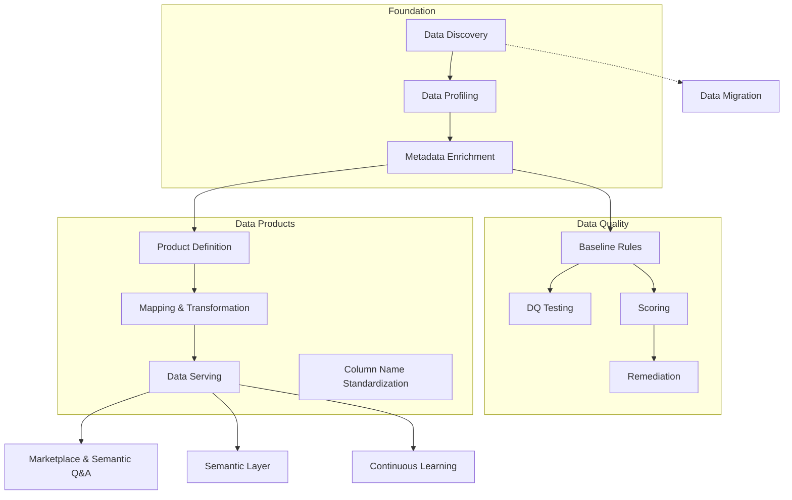

# Agent Capabilities

A business/functional map of the **capabilities** the Data Workbench offers — the outcomes users
actually see and talk about — and the **agent skills** that compose each one. For the per-skill
detail (dependencies, and whether a skill queries the knowledge graph itself vs. is fed a data
snapshot), see the companion **[agent-skills-reference.md](agent-skills-reference.md)**.

> Related reading: [harness-vs-workbench-engineering.md](harness-vs-workbench-engineering.md) frames
> *who is responsible for what* (the harness vs. the Workbench); this document is the concrete
> *inventory of what the Workbench can do* and how skills roll up into it.

---

## Capability vs. skill

- An **agent skill** is a single, packaged unit of agent instruction + scripts (e.g. `data-profiling`,
  `data-quality-rule-generation`). It does one job. There are 59 of them; each is catalogued in
  [agent-skills-reference.md](agent-skills-reference.md).
- An **agent capability** is a **user-facing outcome** — "profile my data", "score data quality",
  "serve this product as a view". A capability is delivered by running **one or more skills** as the
  ordered stages of a workflow (the `_WF_*` workflow groups in `archetypes.py`), or, for the
  supporting capabilities, by a single skill invoked behind an API endpoint.

In short: **skills are the parts; capabilities are what users buy.**

---

## Overview

| Capability | What it produces for the user | Skills involved | Appears in |
|---|---|---|---|
| **Data Discovery** | A catalogued schema (tables, columns, keys) as a DCAT-2 knowledge graph | discovery (per source) + `data-discovery-to-dcat-neo4j` | dd, dq, dpe-sa, dmig |
| **Data Profiling** | Column-level statistics (nulls, distincts, ranges, top values) in the graph | discovery + profiling (per source) + `data-profiling-to-dqv-neo4j` | dd, dq, dpe-sa |
| **Metadata Enrichment** | Natural-language descriptions for every column | `metadata-enrichment` | dd, dq, dpe-sa |
| **Column Name Standardization** | Recommended standardized physical names, PO-reviewed | `column-name-standardizer` | dpe-sa |
| **Data Quality** | DQ rules, executable tests, quality scores, remediation | rule-generation, domain-rule-enhancement, testing-gx/python, failure-analysis, scoring, remediation(+analysis/planning) | dq, dpe-sa, dpe-cf |
| **Mapping & Transformation** | Approved source→product column mappings with lineage | `data-mapping-neo4j` + `data-mapping-rationale-summarizer` | dpe-sa, dpe-cf |
| **Data Serving** | A deployed view / dbt project / lakehouse export of a product | `data-serving-virtual-view`, the three documenters, `data-export-parquet` | dpe-sa, dpe-cf |
| **Data Products** | A defined, contract-backed, materialized data product | spec-writer, spec-to-dprod, odcs-to-graph, the authoring advisors | dpe-sa, dpe-cf |
| **Data Migration** | A downloadable, runnable platform-to-platform migration package | assessment-advisor, pipeline-generator-dlt, package-documenter, export-parquet | dmig |
| **Marketplace & Semantic Q&A** | Natural-language questions answered over deployed products | question-analyzer/executor, marketplace-chat, semantic-qa-router | marketplace (all product archetypes) |
| **Semantic Layer** | Curated business concepts over the products | `business-concept-advisor` | semantic layer (cross-project) |
| **Continuous Learning** | Refined playbooks + improvement proposals from past runs | deployment-reflector, playbook-curator/reflector, skill/chat-reflector | all (behind endpoints) |

*Archetype codes: **dd** Data Discovery · **dq** Data Quality · **dpe-sa** Data Product Engineering
(source-aligned) · **dpe-cf** Data Product Engineering (consumer-aligned) · **dmig** Data Migration.*

### Capability → skills map

---

## Per-capability detail

Each section gives the functional purpose, the ordered skills it runs, the knowledge-graph
information it needs and where that comes from, and the outcome.

### Data Discovery

- **Purpose.** Catalogue a source system's *structure* — tables, columns, data types, keys, and
  constraints — and represent it as a knowledge graph.
- **Skills, in order.** A source-specific discovery skill (`data-discovery` for Postgres, or the
  MySQL / Snowflake / Databricks / Parquet variant, chosen automatically by platform routing) →
  `data-discovery-to-dcat-neo4j` to load the result into Neo4j.
- **Graph information needed.** *None on entry* — this is the seeding step. The discovery skill
  reads the source database's own catalog directly; the loader creates the DCAT-2 `:Dataset` /
  `:Column` nodes that every later capability builds on.
- **Outcome.** A DCAT-2 catalogue graph for the project — the foundation for everything else.

### Data Profiling *(composite of discovery + profiling)*

- **Purpose.** Understand what's *actually in* the data, not just its shape — null rates, distinct
  counts, value distributions, ranges, top values, string/percentile stats.
- **Skills, in order.** Discovery (as above) must exist first; then the matching profiling skill
  (`data-profiling` / `-mysql` / `-snowflake` / `-databricks` / `data-profile-parquet`) reads live
  table contents → `data-profiling-to-dqv-neo4j` attaches the stats to the existing graph nodes as
  DQV measurements.
- **Graph information needed.** The DCAT-2 nodes from discovery (so the stats attach to the right
  columns). The statistics themselves come from a live read of the source data.
- **Outcome.** A DCAT-2 + DQV graph — the evidence base for rules, enrichment, and scoring.

### Metadata Enrichment

- **Purpose.** Give every column a plain-language description so humans and downstream agents know
  what it means.
- **Skills.** `metadata-enrichment`.
- **Graph information needed.** Column structure (DCAT-2), and — for best results — profiling stats
  (DQV) and any DQ rules already present, all read from the project graph. Richer context yields
  better descriptions.
- **Outcome.** `:ColumnDescription` nodes attached to columns.

### Column Name Standardization

- **Purpose.** Propose consistent, standardized physical column names (snake_case, optional domain
  prefix, expanded abbreviations) for a source-aligned product, for PO review.
- **Skills.** `column-name-standardizer`.
- **Graph information needed.** The project's `:Column` nodes and their domain; the skill reads and
  writes the graph directly, recording recommendations as `pending_review`.
- **Outcome.** Reviewable recommended names, approved in the `dpe-sa` `po_source_validation` gate.

### Data Quality

A family of related capabilities. Which sub-flow runs depends on the scenario (dataset vs.
source-aligned vs. consumer-aligned); see [data-quality-testing.md](data-quality-testing.md).

- **Baseline Rules.** `data-quality-rule-generation` derives SHACL-inspired rules from the enriched
  graph (DCAT-2 + DQV + top-values); `domain-rule-enhancement` layers in domain-specific rules from
  reference files + guidance. *Needs:* enriched graph + profiling evidence. *Produces:*
  `:PropertyShape` rule nodes (`pending_review`).
- **DQ Testing.** `data-quality-testing-gx` (Great Expectations) or `data-quality-testing-python`
  (Pandera) generates test code from the graph rules and **runs it against the live database**;
  `data-quality-failure-analysis` narrates the failures with graph context and top unexpected
  values. *Needs:* the rule nodes + a live DB connection. *Produces:* pass/fail results + a
  human-readable failure report. Tests default to full data (no sample cap).
- **Scoring.** `data-scoring` computes quality scores from the enriched graph and persists
  `:QualityScore` nodes. *Needs:* DCAT-2 + DQV + SHACL. *Produces:* a quality baseline over time.
- **Remediation.** `data-remediation` (or the split `data-remediation-analysis` +
  `data-remediation-planning`) compares profiling vs. rules, estimates score impact, and generates
  SQL fixes for user-controlled execution. *Needs:* scores + domain rules. *Produces:* a
  remediation report and optional SQL.

### Mapping & Transformation

- **Purpose.** Establish which source columns feed which product columns, with reviewable lineage.
- **Skills.** `data-mapping-neo4j` (creates the mappings) + `data-mapping-rationale-summarizer`
  (explains each one in the downloadable report).
- **Graph information needed.** Source `:Column` descriptions and the target product's columns; the
  mapper reads the graph itself and writes `:ColumnMapping` nodes with PROV-O provenance, gated on
  human approval.
- **Outcome.** Approved column mappings — the input to serving.

### Data Serving

- **Purpose.** Expose a defined product for consumption, in the mode/pattern that fits the
  platforms involved.
- **Skills.** `data-serving-virtual-view` generates the view DDL **and** a dbt project from the
  approved mappings; the three documenters (`view` / `dbt` / `lakehouse`) write the README for the
  respective downloadable package; `data-export-parquet` handles the file/transfer path.
  `serving-strategy-advisor` and `transform-placement-advisor` advise the choice (see Supporting).
- **Graph information needed.** Approved column mappings + source-table relationships from the
  project graph (read by the virtual-view skill). The documenters are *fed* a snapshot and write no
  graph state.
- **Outcome.** A deployed virtual view, a materialized dbt project, or a lakehouse (Parquet+DuckDB)
  export — each as a runnable, downloadable, git-pushable package.

### Data Products

- **Purpose.** Define a data product, back it with a contract, and register it in the graph — the
  through-line of the `dpe-sa` and `dpe-cf` archetypes.
- **Skills.** `data-product-spec-writer` (source-aligned spec YAML, derived from the graph) →
  `data-product-spec-to-dprod-neo4j` (DPROD graph registration); `odcs-to-graph` for ODCS contract
  persistence; the authoring advisors (`product-authoring-assistant` + its sub-skills) guide the PO
  through the wizard; `data-product-archetype-classifier` supports contract import/ingest.
- **Graph information needed.** For the spec-writer: DCAT-2 discovery + DQV profiling + SHACL rules,
  read from the graph, so it can pre-fill defaults. The advisors are *fed* the relevant snapshot by
  the backend.
- **Outcome.** A registered `:DataProduct` / DPROD subgraph + ODCS contract, ready to map and serve.

### Data Migration

- **Purpose.** Lift-and-shift raw data from one platform to another (engineer-initiated `dmig`); see
  [data-migration.md](data-migration.md).
- **Skills, in order.** Discovery of the source → `migration-assessment-advisor` (plan: keys,
  cursors, write mode, lossy-type flags) → `migration-pipeline-generator-dlt` (migration.json +
  DLT artifacts) → `migration-package-documenter` (README); `data-export-parquet` supports the
  file-transfer path.
- **Graph information needed.** Discovered source table metadata. Migration is a *thin* subsystem —
  no product graph — so the assessment advisor and generator work from discovered metadata rather
  than the full enriched graph, and DQ here means reconciliation only.
- **Outcome.** A downloadable, executable migration package.

### Marketplace & Semantic Q&A

- **Purpose.** Let a consumer ask natural-language questions and get answers computed over deployed
  products.
- **Skills.** `data-product-question-analyzer` (curates answerable questions / classifies a
  question) → `data-product-question-executor` (authors + runs the SELECT for a curated question);
  `marketplace-product-chat-assistant` (free-form NL→SQL over a domain's deployed views +
  `:BusinessConcept` tree); `semantic-qa-conversation-router` (orchestrates a conversational turn:
  query / clarify / reject / chat).
- **Graph information needed.** Deployed-view metadata, product schemas + DQ rules, and the curated
  business-concept ontology — all assembled by the backend and *fed* to these skills, which hold no
  DB access and only emit SQL for the backend to run.
- **Outcome.** Answered questions with SQL provenance, plus suggested follow-ups.

### Semantic Layer / Business Concepts

- **Purpose.** Curate reusable business concepts (e.g. "Customer Tier", "Order Status") over the
  products so Q&A can reason in business terms.
- **Skills.** `business-concept-advisor` (proposes ranked candidate concepts with column-level
  evidence); see [semantic-layer.md](architecture/semantic-layer.md) for the full model.
- **Graph information needed.** A cross-project snapshot — data products with their columns +
  approved descriptions, table relationship kinds, domains, and per-domain keywords — *fed* by the
  backend. The advisor is read-only and does not mutate the graph; a Data Steward reviews its
  output.
- **Outcome.** Reviewed candidate `:BusinessConcept`s for the semantic layer.

### Continuous Learning

- **Purpose.** Improve the platform and the domain playbooks from accumulated run evidence; see the
  [continuous-learning initiative](architecture/) notes.
- **Skills.** `data-product-deployment-reflector` (reflects on a deployed product vs. its declared
  shape + preview rows); `playbook-curator` / `playbook-reflector` (inspect/refine domain playbook
  versions in the graph); `skill-reflector` / `chat-reflector` (mine past pipeline/chat runs from
  the Workbench operational store and propose improvements).
- **Graph information needed.** The reflectors over playbooks read Neo4j directly; the deployment
  reflector is *fed* a graph snapshot + preview rows; the skill/chat reflectors read the Workbench
  SQLite store (`workbench.db`), **not** Neo4j.
- **Outcome.** Refined playbooks and *proposals* for skill/prompt improvements. **Reflection
  proposals are review artifacts — never auto-applied.**

---

## Supporting capabilities

These are delivered by a single skill invoked behind an API endpoint (not as a pipeline stage), and
mostly follow the "spoon-fed context" pattern.

- **Chat assistants.** `project-chat-assistant` (scoped Q&A over one project's graph — the one chat
  agent that queries Neo4j itself, backing every claim with scoped Cypher) and
  `marketplace-product-chat-assistant` (fed; NL→SQL over deployed views).
- **Advisors.** `data-product-discovery-advisor`, `data-product-schema-advisor`,
  `data-product-name-advisor`, `data-product-gap-analyzer`, `data-product-osi-advisor`,
  `serving-strategy-advisor`, `transform-placement-advisor`, `filter-intent-interpreter`,
  `migration-assessment-advisor` — all fed a snapshot; they *enrich or recommend*, never override a
  hard backend decision.
- **Classifiers.** `data-product-archetype-classifier` (source vs. consumer, source matching, seed
  synthesis) and `intake-scaffold-parser` (the tool-less, isolated parser for untrusted inbound
  intake — see [inbound-intake.md](inbound-intake.md)).
- **Documenters.** `data-serving-view-documenter`, `data-serving-dbt-documenter`,
  `data-serving-lakehouse-documenter`, `migration-package-documenter` — each writes one package
  README from a fed snapshot.
- **Reflectors.** `data-product-deployment-reflector`, `skill-reflector`, `chat-reflector`,
  `playbook-curator`, `playbook-reflector` (also listed under Continuous Learning).
- **Status.** `pipeline-progress-checker` — reads the graph to report how far a pipeline has
  progressed.

---

## See also

- **[agent-skills-reference.md](agent-skills-reference.md)** — per-skill purpose, dependency
  classification, and the Workbench↔skill data seam.
- **[harness-vs-workbench-engineering.md](harness-vs-workbench-engineering.md)** — the
  responsibility-split framing.
- **[mcp-architecture.md](mcp-architecture.md)** — the MCP control-plane tools an external engineer
  drives the Workbench with.
