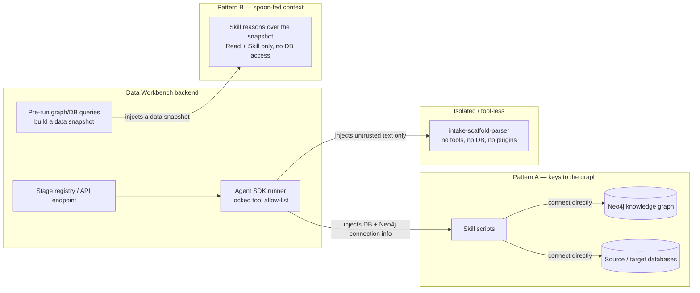

# Agent Skills Reference

A per-skill inventory of every **agent skill** in the Data Workbench, described at a
business/functional level. For the rolled-up, audience-facing view of how these skills combine
into the **capabilities** users actually see (Data Profiling, Metadata Enrichment, …), read
**[agent-capabilities.md](agent-capabilities.md)** first, then come back here for detail.

> **Scope.** This is the concrete skill/capability inventory and the *Workbench↔skill data seam*.
> It is a companion to — not a replacement for — the conceptual framing in
> [harness-vs-workbench-engineering.md](harness-vs-workbench-engineering.md) (the responsibility
> split) and the control-plane tool reference in [mcp-architecture.md](mcp-architecture.md) (the
> MCP tools, which are a *different* surface — see the note below).

---

## What an agent skill is

A **skill** is a self-contained, versioned unit of agent instruction plus (optionally) helper
scripts. Skills are vendored in-repo under `workbench-skills/skills/<skill-name>/` (the
`workbench-skills/` plugin), so they ship inside the backend image and are version-controlled with
the code. Each skill is a directory containing:

- a **`SKILL.md`** — the natural-language instructions the agent reads (purpose, triggers, the
  exact steps and output contract), and
- optional **`scripts/`** — deterministic Python helpers the agent runs (database queries, Neo4j
  loaders, file writers) so that the reasoning stays in the model and the plumbing stays in code.

The Workbench runs a skill by launching a Claude agent (via the Claude Agent SDK) with a **locked
tool allow-list** and a prompt that names the skill. There are three run shapes:

| Run shape | Tools handed to the agent | Used by |
|---|---|---|
| **Pipeline stage** | `Read, Write, Edit, Bash, Glob, Grep, Skill` | Discovery, profiling, DQ, mapping, serving, migration, graph loaders — the skills that *do work* |
| **Advisory / programmatic** | `Read, Skill` only | The advisors, reflectors, documenters, marketplace Q&A — pure-text reasoners |
| **Project chat** | `Read, Bash, Grep, Glob, Skill` | The project chat assistant (needs `Bash` to run its scoped Cypher script) |

> **Skills are not MCP tools.** No MCP tools are handed to skills. The 100+ MCP tools documented in
> [mcp-architecture.md](mcp-architecture.md) are the *control plane* an external engineer's Claude
> Code drives the Workbench with; the skills here are what the Workbench runs *internally* on the
> engineer's behalf. Different surface, different audience.

---

## The Workbench↔skill seam

The single most important functional distinction is **how a skill gets its data**. Every skill
either reaches out to a data source itself, or is handed a pre-built snapshot. This is what the
"queries graph itself vs. fed by Workbench" column in the inventory means.

**Pattern A — "keys to the graph."** The Workbench injects connection info (database DSNs, Neo4j
credentials) into the stage prompt (`pipeline.build_prompt`) or the chat runner
(`chat_runner.py`), and the skill's own scripts open connections and query Neo4j and/or the source
databases directly. These are the skills that discover, profile, load the graph, generate and run
DQ, map columns, serve views, and answer scoped project questions. They read *and sometimes write*
the graph.

**Pattern B — "spoon-fed context."** The Workbench runs the graph/database queries *itself* ahead
of time, assembles a compact data snapshot (schema, mappings, profile stats, DQ verdicts, preview
rows, ontology, …), and injects that snapshot into the prompt. The skill runs with a locked-down
`Read, Skill` toolset and **no database access** — it only reasons over what it was given and
returns text (a narrative, a ranked list, structured "Apply" cards, or a single SQL statement the
backend later executes). This covers the advisors, the reflectors, the marketplace/semantic Q&A
agents, and the four package documenters. Backend entry points include
`deployment_reflection.py`, `qa_execute.py`, `semantic_recommender.py`, `marketplace_chat.py`, and
`serving_docs.py`.

**Isolated / tool-less variant.** Because inbound intake content is *untrusted external input*,
`intake-scaffold-parser` is run tool-less by `intake_parser.py`: the backend loads the `SKILL.md`
body as a system prompt and runs the model with `allowed_tools=[]`, no plugins, and no skills. It
sees only the envelope text and emits exactly one JSON blueprint.

**One exception to "graph = Neo4j":** the two reflectors that mine usage logs
(`skill-reflector`, `chat-reflector`) read the Workbench operational store (`workbench.db`,
SQLite) — not Neo4j — to analyze past runs.

---

## Dependency classification key

Each skill entry classifies dependencies two ways, because "what the skill needs to run" and "what
the artifact it produces targets" are different things.

**(a) Does-work dependencies** — what must be present in the runtime for the skill to execute:

- **DB drivers** — Postgres (`psycopg2`), MySQL, Snowflake, Databricks, or DuckDB + `pyarrow`
  (Parquet). The skill opens a live connection.
- **Neo4j driver** — the skill connects to the knowledge graph.
- **Great Expectations** — GX Core, for the GX DQ tester.
- **Pandera** — for the Python DQ tester.
- **Workbench SQLite (`workbench.db`)** — for the two log-mining reflectors.
- **none** — pure-text skill; all grounding arrives in the prompt.

**(b) Output-artifact dependencies** — frameworks or standards the *produced artifact* targets even
though the skill itself does **not** run them:

- **dbt** — a dbt project the user (or the Workbench serving runner) later builds.
- **DLT** — a `dlt`-based migration pipeline reference implementation (the skill emits the code; it
  does not import `dlt`).
- **ODCS / DPROD** — Open Data Contract Standard YAML / DPROD data-product graph shape.
- **Ontologies** — DCAT-2, DQV, SHACL, PROV-O — the graph vocabularies loaders/rules conform to.
- **Parquet / TransferBatch v1** — the file + manifest format for lakehouse/transfer.
- **GX / Pandera suites** — the executable test suites the DQ testers write out.

> No skill depends on `sqlglot` or `fastembed`; dialect rendering and embeddings live in the
> backend, and mapping similarity is model-reasoned rather than vector-computed.

---

## Master inventory (all 59 skills)

Graph column legend: **Neo4j** = the skill queries/writes the graph itself · **DB** = queries a
source/target database itself · **files** = reads Parquet via DuckDB · **SQLite** = reads
`workbench.db` · **fed** = spoon-fed a snapshot, no data access · **isolated** = tool-less.

| Skill | Purpose (one sentence) | Capability | Does-work deps | Output deps | Graph |
|---|---|---|---|---|---|
| data-discovery | Extract PostgreSQL schema metadata (tables, columns, keys, constraints). | Data Discovery | Postgres driver | — | DB |
| data-discovery-mysql | Extract MySQL schema metadata. | Data Discovery | MySQL driver | — | DB |
| data-discovery-snowflake | Extract Snowflake schema metadata. | Data Discovery | Snowflake driver | — | DB |
| data-discovery-databricks | Extract Databricks/Unity-Catalog schema metadata. | Data Discovery | Databricks driver | — | DB |
| data-discovery-parquet | Extract Parquet-file schema via DuckDB. | Data Discovery | DuckDB | — | files |
| data-profiling | Profile PostgreSQL table contents into per-column stat YAML. | Data Profiling | Postgres driver | — | DB |
| data-profiling-mysql | Profile MySQL table contents. | Data Profiling | MySQL driver | — | DB |
| data-profiling-snowflake | Profile Snowflake table contents. | Data Profiling | Snowflake driver | — | DB |
| data-profiling-databricks | Profile Databricks table contents. | Data Profiling | Databricks driver | — | DB |
| data-profile-parquet | Profile Parquet files via DuckDB and cross-verify row counts with pyarrow. | Data Profiling | DuckDB + pyarrow | Parquet / TransferBatch | files |
| data-export-parquet | Snapshot one table to Parquet + a TransferBatch v1 manifest. | Data Serving / Migration | Source DB driver + pyarrow | Parquet / TransferBatch | DB |
| data-discovery-to-dcat-neo4j | Load discovery YAML into Neo4j as a DCAT-2 graph. | Data Discovery (graph load) | Neo4j driver | DCAT-2 | Neo4j |
| data-profiling-to-dqv-neo4j | Load profiling YAML into Neo4j as DQV measurements. | Data Profiling (graph load) | Neo4j driver | DQV | Neo4j |
| odcs-to-graph | Persist ODCS YAML ↔ graph and derive a DPROD subgraph. | Data Products | Neo4j driver | ODCS / DPROD | Neo4j |
| data-product-spec-to-dprod-neo4j | Register a product spec YAML as a DPROD graph. | Data Products | Neo4j driver | DPROD | Neo4j |
| metadata-enrichment | Generate NL column descriptions from graph context, store as nodes. | Metadata Enrichment | Neo4j driver | DCAT-2 | Neo4j |
| column-name-standardizer | Recommend standardized snake_case physical names per column. | Column Name Standardization | Neo4j driver | — | Neo4j |
| data-quality-rule-generation | Derive SHACL-inspired DQ rules from the enriched graph. | Data Quality (Baseline Rules) | Neo4j driver | SHACL | Neo4j |
| domain-rule-enhancement | Add domain-aware DQ rules from reference files + guidance. | Data Quality (Baseline Rules) | Neo4j driver | SHACL | Neo4j |
| data-scoring | Compute quality scores from the enriched graph, persist as nodes. | Data Quality (Scoring) | Neo4j driver | DQV | Neo4j |
| pipeline-progress-checker | Report pipeline completion stats (approval rates, coverage) from the graph. | (supporting) | Neo4j driver | — | Neo4j (read) |
| data-quality-testing-gx | Generate + run Great Expectations validations from graph rules. | Data Quality (DQ Testing) | Neo4j driver + DB driver + Great Expectations | GX suite | Neo4j + DB |
| data-quality-testing-python | Generate + run Pandera validations from graph rules. | Data Quality (DQ Testing) | Neo4j driver + DB driver + Pandera | Pandera suite | Neo4j + DB |
| data-quality-failure-analysis | Summarise failing GX tests with graph context + top unexpected values. | Data Quality (DQ Testing) | Neo4j driver (read) | — | Neo4j (read) |
| data-remediation | Analyse DQ issues and generate SQL fix scripts for user-run execution. | Data Quality (Remediation) | Neo4j driver + DB driver | — | Neo4j + DB |
| data-remediation-analysis | Analyse DQ issues and estimate score impact (report only, no SQL). | Data Quality (Remediation) | Neo4j driver | — | Neo4j |
| data-remediation-planning | Act on a remediation report — apply, generate SQL, or skip. | Data Quality (Remediation) | DB driver | — | DB / report |
| data-mapping-neo4j | Map source columns to product columns by semantic similarity, store as nodes. | Mapping & Transformation | Neo4j driver | PROV-O | Neo4j |
| data-mapping-rationale-summarizer | Write one rationale paragraph per column mapping. | Mapping & Transformation | none | — | fed |
| data-serving-virtual-view | Generate view DDL (and a dbt project) from approved mappings in the graph. | Data Serving | Neo4j driver | dbt | Neo4j |
| data-serving-view-documenter | Write the README for a virtual-view serving package. | Data Serving | none | — | fed |
| data-serving-dbt-documenter | Write the README for a dbt (materialized) serving package. | Data Serving | none | dbt | fed |
| data-serving-lakehouse-documenter | Write the README for a lakehouse (Parquet + DuckDB) serving package. | Data Serving | none | Parquet | fed |
| data-product-spec-writer | Guide authoring of a source-aligned product spec YAML; register the node. | Data Products | Neo4j driver | ODCS / DPROD | Neo4j |
| data-product-discovery-advisor | Rank similar products + ODCS templates for a new product idea. | Data Products | none | — | fed |
| data-product-schema-advisor | Recommend a curated catalog-column subset for a consumer product. | Data Products | none | — | fed |
| data-product-name-advisor | Suggest product/dataset names + descriptions. | Data Products | none | — | fed |
| data-product-gap-analyzer | Pre-flight per-column coverage check for consumer authoring. | Data Products | none | — | fed |
| data-product-osi-advisor | Narrate an OSI semantic-model evaluation + emit Apply cards. | Data Products | none | — | fed |
| data-product-question-analyzer | Generate answerable questions / classify a question against a product. | Marketplace & Semantic Q&A | none | — | fed |
| data-product-question-executor | Author + run a SELECT that answers a curated product question. | Marketplace & Semantic Q&A | none | — | fed |
| data-product-archetype-classifier | Classify a spec source/consumer, match sources, synthesize a seed. | Data Products (ingest) | none | ODCS | fed |
| product-authoring-assistant | Guide a PO through authoring a product in the wizard; call sub-skills. | Data Products | none | — | fed |
| serving-strategy-advisor | Recommend serving mode/pattern and explain the drivers. | Data Serving | none | — | fed |
| transform-placement-advisor | Explain where each transform should run (extract/target/hybrid). | Data Serving | none | — | fed |
| filter-intent-interpreter | Compile a plain-language row filter into a grounded SQL predicate. | Data Products / Serving | none | — | fed |
| business-concept-advisor | Propose candidate business concepts with column-level evidence. | Semantic Layer | none | — | fed |
| semantic-qa-conversation-router | Orchestrate a semantic-Q&A turn (query / clarify / reject / chat). | Marketplace & Semantic Q&A | none | — | fed |
| data-product-deployment-reflector | Reflect on a deployed product vs. its declared shape + preview rows. | Continuous Learning | none | — | fed |
| project-chat-assistant | Scoped Q&A over one project's graph, every claim backed by scoped Cypher. | Chat assistants | Neo4j driver | — | Neo4j |
| marketplace-product-chat-assistant | Free-form NL→SQL marketplace chat over deployed views + concepts. | Marketplace & Semantic Q&A | none | — | fed |
| playbook-curator | Inspect/compare domain playbook versions in the graph, recommend one. | Continuous Learning | Neo4j driver | — | Neo4j |
| playbook-reflector | Refine domain playbooks in the graph from run evidence. | Continuous Learning | Neo4j driver | — | Neo4j |
| skill-reflector | Mine pipeline stage transcripts and propose SKILL.md/prompt revisions. | Continuous Learning | Workbench SQLite | — | SQLite |
| chat-reflector | Mine chat sessions and propose chat-stack improvements. | Continuous Learning | Workbench SQLite | — | SQLite |
| migration-assessment-advisor | Assess a discovered source and produce a migration plan. | Data Migration | none | — | fed |
| migration-pipeline-generator-dlt | Emit migration.json + DLT pipeline artifacts for a dmig project. | Data Migration | none | DLT | none (reads discovered metadata) |
| migration-package-documenter | Write the README for a migration package. | Data Migration | none | — | fed |
| intake-scaffold-parser | Normalize an untrusted inbound assessment into a scaffold blueprint. | Inbound Intake | none | — | isolated |

*Count: 59 — matches `ls workbench-skills/skills/ | wc -l`.*

---

## Per-skill detail, by functional group

### 1. Discovery — read a source's structure

The five discovery skills each extract schema metadata (tables, columns, types, keys, constraints)
from one source kind and write machine-readable YAML. They are **Pattern A**: the Workbench injects
the source connection info and the skill's scripts query the source directly. They do **not** touch
Neo4j — a separate loader does that.

- **data-discovery** — PostgreSQL. Does-work: Postgres driver. Graph: DB.
- **data-discovery-mysql** — MySQL. Does-work: MySQL driver. Graph: DB.
- **data-discovery-snowflake** — Snowflake. Does-work: Snowflake driver. Graph: DB.
- **data-discovery-databricks** — Databricks (Unity Catalog 3-level + legacy Hive). Does-work:
  Databricks driver. Graph: DB.
- **data-discovery-parquet** — a directory of Parquet files, read through DuckDB. Does-work:
  DuckDB. Graph: files.

Platform routing (`stage_execution.py:_PLATFORM_SKILL_OVERRIDES` + `routers/connections.py`) picks
the right variant for the bound source, so a single "discovery" stage transparently runs the
Postgres, MySQL, Snowflake, Databricks, or Parquet skill.

### 2. Profiling — read what's actually in the data

The five profiling skills build on discovery: they compute column-level statistics (null rates,
distinct counts, min/max, top values, string-length/percentile stats) and emit YAML in a shared
format. **Pattern A**, same DB-per-source routing as discovery.

- **data-profiling** (Postgres), **data-profiling-mysql**, **data-profiling-snowflake**,
  **data-profiling-databricks** — each needs its source's DB driver. Graph: DB.
- **data-profile-parquet** — profiles Parquet (or a TransferBatch manifest's files) via DuckDB and
  cross-verifies the row count with an independent pyarrow reader, so the output matches the other
  profilers' format and can be loaded by `data-profiling-to-dqv-neo4j`. Does-work: DuckDB +
  pyarrow. Graph: files.

### 3. Export / migration movers — move data out

- **data-export-parquet** — snapshots one table to a Parquet file plus a **TransferBatch v1**
  manifest for lakehouse ingestion or cross-platform transfer. Does-work: source DB driver +
  `pyarrow>=19`. Output: Parquet / TransferBatch. Graph: DB.
- **migration-assessment-advisor** — reads discovered table metadata for a `dmig` project and
  reports per-table keys, incremental-cursor candidates, a recommended write mode, and flags
  lossy/ambiguous type conversions against a bundled per-platform corpus. **Pattern B** (fed the
  discovered metadata). Framework-neutral — it describes the source, not the mover. Does-work:
  none. Graph: fed.
- **migration-pipeline-generator-dlt** — reads the discovered source metadata and emits a
  framework-neutral **migration.json** contract plus **DLT** pipeline artifacts, ready to assemble
  into a downloadable, executable package. It emits DLT code but does **not** import `dlt`
  (verified: no `dlt` import in `scripts/`). Does-work: none. Output: DLT. Graph: reads discovered
  metadata, no live query.
- **migration-package-documenter** — pure-text; writes the package README from the migration
  contract. **Pattern B**. Does-work: none. Graph: fed.

### 4. Graph loaders — turn artifacts into the knowledge graph

These are the **Pattern A** writers: they open Neo4j and load or reshape graph state. This is where
the ontologies enter the graph.

- **data-discovery-to-dcat-neo4j** — loads discovery YAML as a **DCAT-2** graph (`:Dataset`,
  `:Column`, keys). Does-work: Neo4j driver. Output: DCAT-2. Graph: Neo4j.
- **data-profiling-to-dqv-neo4j** — enriches those nodes with **DQV** measurements from profiling
  YAML. Requires the DCAT load first. Does-work: Neo4j driver. Output: DQV. Graph: Neo4j.
- **odcs-to-graph** — persists **ODCS** contract YAML to the graph, re-materializes YAML from the
  graph, and derives a **DPROD** subgraph. Does-work: Neo4j driver. Output: ODCS / DPROD. Graph:
  Neo4j.
- **data-product-spec-to-dprod-neo4j** — reads a spec YAML (from the spec-writer) and registers the
  formal **DPROD** node structure. Does-work: Neo4j driver. Output: DPROD. Graph: Neo4j.

### 5. Graph-driven DQ, enrichment & scoring

All **Pattern A** over Neo4j — they read enriched graph context and write derived nodes back.

- **metadata-enrichment** — generates NL column descriptions from graph context and stores them as
  `:ColumnDescription` nodes. Best after profiling + rules exist. Output: DCAT-2. Graph: Neo4j.
- **column-name-standardizer** — recommends standardized snake_case physical names (+ optional
  domain prefix, abbreviation expansion) per `:Column`, writing `recommendedName` +
  `recommendedNameStatus='pending_review'`; idempotent. Reviewed in the `dpe-sa`
  `po_source_validation` gate. Graph: Neo4j.
- **data-quality-rule-generation** — queries the enriched graph (DCAT-2 + DQV + top-values) and
  generates **SHACL**-inspired rules as `:PropertyShape` nodes. Output: SHACL. Graph: Neo4j.
- **domain-rule-enhancement** — adds domain-aware rules from structured reference files + free-form
  guidance, `ruleSource='domain'`, `status='pending_review'`. Requires rule-generation +
  enrichment first. Output: SHACL. Graph: Neo4j.
- **data-scoring** — computes quality scores from the enriched graph (DCAT-2 + DQV + SHACL) and
  persists `:QualityScore` nodes. Output: DQV. Graph: Neo4j.
- **pipeline-progress-checker** — a read-only status reporter: description/mapping approval rates,
  DQ-rule counts, enrichment coverage. Used to decide whether a pipeline is ready to advance.
  Graph: Neo4j (read).

### 6. DQ testing & remediation

- **data-quality-testing-gx** — generates **Great Expectations** (GX Core) validation code from
  graph rules and **runs it** against the bound relational DB, capturing top unexpected values.
  Does-work: Neo4j driver + DB driver + Great Expectations. Output: GX suite. Graph: Neo4j + DB.
- **data-quality-testing-python** — the same, but generates + runs **Pandera** schemas in pure
  Python. Does-work: Neo4j driver + DB driver + Pandera. Output: Pandera suite. Graph: Neo4j + DB.
- **data-quality-failure-analysis** — reads a GX run's result JSON, pulls column/rule context from
  Neo4j, and produces a narrative markdown report grouped by table/column with the top-N unexpected
  values. Does-work: Neo4j driver (read). Graph: Neo4j (read).
- **data-remediation** — compares profiling vs. domain rules, estimates score impact, and generates
  SQL fix scripts for user-controlled execution. Requires scoring + domain-rule-enhancement first.
  Does-work: Neo4j driver + DB driver. Graph: Neo4j + DB.
- **data-remediation-analysis** — the analysis half only: report (JSON + markdown) with estimated
  score improvement, **no** SQL, no execution. Does-work: Neo4j driver. Graph: Neo4j.
- **data-remediation-planning** — the action half: reads the analysis report and applies fixes,
  emits SQL only, or skips per the user's choice. Does-work: DB driver (to apply). Graph:
  DB / report file.

### 7. Serving — expose a product for consumption

- **data-serving-virtual-view** — reads approved column mappings + source-table relationships from
  Neo4j and generates a **view DDL** (`CREATE VIEW`) that composes the product logically over the
  sources with no data copy; it also emits a **dbt** project (`scripts/generate_dbt_project.py`,
  verified) for the materialized path. Does-work: Neo4j driver. Output: dbt. Graph: Neo4j.
- **data-serving-view-documenter / data-serving-dbt-documenter / data-serving-lakehouse-documenter**
  — three **Pattern B** documenters that each return the README *content* (as JSON) for the
  respective downloadable serving package; the backend (`serving_docs.py`) writes it into the
  package. Invoked once, no chat, no graph or filesystem writes. Does-work: none. Graph: fed. (The
  dbt documenter's output targets dbt; the lakehouse documenter's targets Parquet.)

### 8. Product advisors & authoring helpers

All **Pattern B** pure-text reasoners invoked programmatically from Product-Workbench endpoints;
they receive a snapshot and return narratives, ranked lists, structured Apply cards, or SQL. None
touch a database. The one exception in this group is the spec-writer.

- **product-authoring-assistant** — the umbrella wizard guide; calls the specialist sub-skills
  below. Graph: fed.
- **data-product-discovery-advisor** — ranks similar existing products + matching ODCS templates
  for a new idea (wizard Step 1→2). Graph: fed.
- **data-product-schema-advisor** — recommends a curated catalog-column subset for a consumer
  product from the idea, domain, shape, and consumed sources. Graph: fed.
- **data-product-name-advisor** — suggests product/dataset names + descriptions; no graph or
  filesystem deps at all. Graph: fed.
- **data-product-gap-analyzer** — pre-flight per-column coverage (covered / derivable / ambiguous /
  gap) for consumer authoring; falls back to a Python heuristic when the skill isn't installed.
  Graph: fed.
- **data-product-osi-advisor** — narrates an OSI semantic-model evaluation and emits `osi_*` Apply
  cards. Graph: fed.
- **data-product-archetype-classifier** — classifies a spec as source/consumer-aligned, ranks
  marketplace sources against a consumer input slot, and synthesizes a source-product seed when no
  match exists (three caller-selected modes). Output: ODCS. Graph: fed.
- **serving-strategy-advisor** — explains the serving-**mode** (Virtual vs Materialized) and
  capability-gated serving-**pattern** choice; enriches the backend's deterministic decision, never
  contradicts a hard requirement. Graph: fed.
- **transform-placement-advisor** — explains where each cross-platform transform should run
  (extract / target / hybrid); enriches the backend's per-op assignment, never flips it or moves a
  governance-forced mask off the extract side. Graph: fed.
- **filter-intent-interpreter** — compiles a plain-language row filter into a single grounded SQL
  boolean predicate using bound columns + profiled top-values + descriptions; heuristic fallback.
  Graph: fed.
- **data-product-spec-writer** — **the group's Pattern A exception.** Guides authoring of a
  source-aligned spec YAML, deriving defaults from the graph (DCAT-2 + DQV + SHACL) and registering
  a `:DataProduct` node linked to its datasets. Does-work: Neo4j driver. Output: ODCS / DPROD.
  Graph: Neo4j.

### 9. Chat agents

- **project-chat-assistant** — **Pattern A.** Scoped Q&A over a single project's graph; read-only,
  but *every* factual claim must be backed by a `run_cypher.py` call scoped to the project (hence
  the `Bash` tool in its allow-list). Does-work: Neo4j driver. Graph: Neo4j.
- **marketplace-product-chat-assistant** — **Pattern B.** Free-form NL→SQL over the selected
  domain's deployed views + curated `:BusinessConcept` tree + conversation history; emits a SELECT
  + reply + follow-ups. `Read, Skill` only; the backend runs the SQL. Graph: fed.

### 10. Reflection & continuous learning

- **playbook-curator** — inspects/compares domain playbook versions in Neo4j (baseline vs refined)
  and recommends which to use. Does-work: Neo4j driver. Graph: Neo4j.
- **playbook-reflector** — refines domain playbooks in the graph from accumulated run evidence.
  Does-work: Neo4j driver. Graph: Neo4j.
- **data-product-deployment-reflector** — **Pattern B.** Reads a deployed product's declared shape
  (graph snapshot) + a sample of preview rows from the live view and emits a
  verdict/narrative/surprises/recommendations report. Invoked after `deploy_virtual_view`. Graph:
  fed.
- **skill-reflector** — mines pipeline stage transcripts (`workbench.db` `StageExecution` rows) and
  proposes evidence-backed revisions to a skill's `SKILL.md`, a stage prompt template, or the
  runner's system prompt. Does-work: Workbench SQLite. Graph: SQLite. *(Proposals only — never
  auto-applied.)*
- **chat-reflector** — sibling that mines chat sessions (`workbench.db` `ChatSession` /
  `ChatMessage` rows) and proposes chat-stack improvements. Does-work: Workbench SQLite. Graph:
  SQLite. *(Proposals only.)*

### 11. Mapping, spec & intake (misc)

- **data-mapping-neo4j** — **Pattern A.** Maps source columns to product columns by semantic
  similarity of descriptions, stores `:ColumnMapping` nodes with **PROV-O** provenance, and gates
  on human approval. Similarity is model-reasoned (no vector library). Does-work: Neo4j driver.
  Output: PROV-O. Graph: Neo4j.
- **data-mapping-rationale-summarizer** — **Pattern B.** Writes one human-readable rationale
  paragraph per mapping for the downloadable report; deterministic heuristic fallback. Graph: fed.
- **intake-scaffold-parser** — **isolated / tool-less.** Normalizes an untrusted inbound assessment
  envelope into a strict, confidence-graded scaffold blueprint (one fenced JSON), run with no
  tools/plugins/skills because the input is untrusted external content. Graph: isolated.

---

## See also

- **[agent-capabilities.md](agent-capabilities.md)** — the capability rollup that composes these
  skills into user-facing outcomes.
- **[harness-vs-workbench-engineering.md](harness-vs-workbench-engineering.md)** — the
  responsibility-split framing lens.
- **[mcp-architecture.md](mcp-architecture.md)** — the MCP control-plane tool reference (a
  different surface from the skills here).
