# Data Workbench — Architecture Document

> **Source of truth for evolving details: [CLAUDE.md](../CLAUDE.md).**
> This document captures the architecture in pictures and stable contracts. For the latest list of stages, routers, role permissions, transformation kinds, dialect support, SCD policies, wizard surfaces, and graph properties, prefer CLAUDE.md — it's compressed and load-bearing. Sections here that fall behind are flagged inline.
>
> **Per-subsystem deep dives** (this file links to them rather than duplicating their detail):
> - [`architecture/ontologies.md`](architecture/ontologies.md) — the cross-cutting graph-schema reference: every node label, relationship, property, enum, and URI prefix across all layers, plus the ontology-to-skill matrix.
> - [`architecture/transformations.md`](architecture/transformations.md) — column-level transform DSL, `transformParams` schemas, `:LOOKUP_VIA` lineage edge, view-DDL SELECT emission, steward escalation.
> - [`architecture/dataset-transform.md`](architecture/dataset-transform.md) — dataset-level `:DatasetTransform` shape (filter / dedupe / grouping / joins / SCD / window / dialect), CTE assembly.
> - [`architecture/view-ddl-fk-bridges.md`](architecture/view-ddl-fk-bridges.md) — FK BFS, bridge ranker, temporal wrapping for the serving view.
> - [`architecture/consumer-ingest.md`](architecture/consumer-ingest.md) — `/api/ingest-products` router, archetype classifier, gap analysis, resolve-and-bind component.
> - [`architecture/marketplace.md`](architecture/marketplace.md) — marketplace projection, latest-deployed pinning, dprod-leak mitigation, lineage canvas.
> - [`architecture/data-product-scoring.md`](architecture/data-product-scoring.md) — OSI readiness scoring + quality scoring model.
> - [`architecture/serving-materialized-dbt.md`](architecture/serving-materialized-dbt.md) — dbt-materialized serving path, sample→approve→full gate, `MaterializationTarget`, one-core/two-emitters.
> - [`architecture/semantic-layer.md`](architecture/semantic-layer.md) — `:BusinessConcept` semantic layer, the Discovery sequence (scaffold→recommend→enrich), local embeddings, the Steward Discovery/Concepts/Review-Queue UI.
> - [`architecture/semantic-qa.md`](architecture/semantic-qa.md) — marketplace Semantic Q&A deep dive: full vs concept-guided retrieval, the Explain trace, NL→SQL workflow, per-question token accounting.
> - [`architecture/value-resolution.md`](architecture/value-resolution.md) — instance value resolution for record-level lookups: probe-first matching, auto-resolve vs disambiguation, `grounded_values` injection into NL→SQL.
> - [`architecture/qa-and-reflection.md`](architecture/qa-and-reflection.md) — `:QAEvaluation` (question analyzer / executor) feeding the AI-Ready OSI predicate, and post-deploy `:DeploymentReflection`.
>
> **End-user / persona docs:** [`userguide.md`](userguide.md) (both shells, PO + engineer UX), [`engineer-guide.md`](engineer-guide.md) (driving the Workbench from your own Claude Code over MCP).
>
> **Capability strategy guides:** [`mapping-and-transformation.md`](mapping-and-transformation.md) — the platform-independent transform DSL → per-platform SQL strategy (author once, compile to target), the transform-kind catalog, and per-kind × per-platform rendering matrices; the accessible peer to [`architecture/transform-portability.md`](architecture/transform-portability.md).

## 1. System Overview

```mermaid
graph TB
    subgraph ProductShell["Product Workbench (/product/*)"]
        NPW[NewProductWizard<br/>10-step contract-first flow]
        NSPW[NewSourceProductWizard<br/>idea + domain + name]
        MPD[My Products Dashboard]
        ING[Ingest Existing Product]
        MKT[Marketplace<br/>+ ProductKindChip + consumes / consumed_by]
        POV[PoValidationPage<br/>SA combined gate]
        PCP[Product Chat<br/>Guide-me + Apply protocol]
    end

    subgraph EngShell["Engineering Workbench (/engineer/*)"]
        ENG_DB[Project List]
        INC[Incoming queue]
        PP[Pipeline + Reviews]
        PD[Project Dashboard<br/>Summary + ServingWarningsCallout + JoinsOverridePanel]
        ECP[Engineer Chat<br/>Ask drawer]
        ST[Settings]
    end

    subgraph Backend["FastAPI Backend"]
        ARC[archetypes / projects / stages]
        DTR[dataset_transform<br/>Phase 4 joins[] PATCH]
        SU[summary / dashboard]
        RR[reviews<br/>incl. source_product_validation]
        MK[marketplace]
        ING_R[ingest_products]
        OC[odcs<br/>canonicaliser + _generate_dprod]
        OS[osi advisor]
        SA[sa_pipeline<br/>synthesize_odcs_from_graph + auto_mapping_sa]
        ED[edits]
        WS[websocket]
        CH[chat / product_chat]
        SR[SDK runner]
        CRR[Chat runner]
        MCP[mcp_server<br/>/mcp control plane]
    end

    subgraph PeerClients["MCP peer clients"]
        ECC[Engineer's own Claude Code<br/>+ workbench-guide skill]
        ENGINE[Headless engine]
    end

    subgraph Storage["Storage Layer"]
        SQ[(SQLite<br/>Project, Workflow, StageRun, StageExecution,<br/>ProductRequest, Chat sessions/messages)]
        FS[/Project Directories<br/>workflow.json, artifacts/]
    end

    subgraph External["External Systems"]
        CC[Claude Agent SDK<br/>bundles + runs Claude Code<br/>+ Skills, server-side]
        N4[Neo4j<br/>Knowledge Graph]
        PG[PostgreSQL<br/>Source Database]
    end

    ProductShell -->|REST| Backend
    EngShell -->|REST| Backend
    ECC -->|MCP / bearer token| MCP
    ENGINE -->|MCP / bearer token| MCP
    MCP --> ARC
    MCP --> N4
    PP -->|WebSocket| WS
    ECP -->|WebSocket| CH
    PCP -->|WebSocket| CH
    WS --> SR
    CH --> CRR
    CRR --> CC
    SR --> CC
    CC --> PG
    CC --> N4
    RR --> N4
    SU --> N4
    MK --> N4
    OC --> N4
    OS --> N4
    SA --> N4
    DTR --> N4
    ED --> N4
    ARC --> SQ
    ARC --> FS
```

Two persona-scoped shells over one backend. Same React app, same router, but different navigation entrypoints + theme tokens + favicon. Header **Switch** button jumps shell-to-shell. Routers added since v1: `dataset_transform` (engineer joins[] override), `sa_pipeline` (source-aligned synthesis + auto-mapping), `osi` (OSI scoring), `ingest_products`, `edits` (engineer edit-diff banner).

The same FastAPI process also mounts an **MCP control plane** at `/mcp` (`mcp_server.py`), so a data engineer can drive the Workbench from their own Claude Code without the browser. The web UI and MCP clients are peers over one service — see [§10. MCP Control Plane](#10-mcp-control-plane).

The Data Workbench is a two-process system: a Python FastAPI backend and a React SPA frontend. The backend manages pipeline state in SQLite, executes stages via the **Claude Agent SDK** (`claude_agent_sdk` — the successor to the older `claude-code-sdk`; it **bundles the Claude Code runtime and spawns it as headless subprocesses** to run every stage/skill/chat, server-side), and queries Neo4j directly for reviews, summaries, and configuration options. The frontend communicates via REST for CRUD operations and WebSocket for real-time stage streaming.

> **Two layers of "Claude Code."** (1) *Server-side engine* — the Agent SDK runs the bundled Claude Code runtime inside the backend (in the container, with the server's Foundry/Anthropic credentials) to execute the pipeline. (2) *Client-side driver* — a Data Engineer's **own Claude Code CLI** is a thin client that drives the Workbench over the MCP control plane (§10); it orchestrates but never executes the data work. Don't conflate them — see [`README.md` → CLI Execution](../README.md#cli-execution-engineer-workflow) for the topology diagram.

---

## 2. Data Model

### 2.1 SQLite Schema (via SQLModel)

```mermaid
erDiagram
    Project ||--o{ Workflow : "has workflows"
    Project ||--o{ StageRun : "has stage runs"
    Project ||--o{ StageExecution : "has stage executions"
    Project ||--o{ DQTestRun : "has DQ test runs"
    Project ||--o{ ProductRequest : "has product requests"
    Project ||--o{ IngestDraft : "(via committed_project_id)"
    AppSettings ||--|| AppSettings : "singleton"
    Project ||--o{ ChatSession : "has engineer chat sessions"
    ChatSession ||--o{ ChatMessage : "has chat messages"
    ProductChatSession ||--o{ ProductChatMessage : "has product chat messages"

    Project {
        int id PK
        string project_code UK "dpe-sa-05122026-01"
        string name
        string archetype "dd | dq | dpe-sa | dpe-cf | dmod | dmig | cmig"
        string domain "e.g. Human Resources"
        string product_idea "free-form PO prose (SA)"
        datetime discovery_complete_at "set by mark_discovery_complete"
        bool multi_workflow "true for new projects"
        string workflow_json "legacy flat workflow JSON"
        string pg_connection
        string neo4j_host
        int neo4j_port
        string neo4j_user
        string neo4j_password
        string neo4j_database
        int current_stage
        string role_assignments "JSON"
        datetime published_at
        datetime created_at
    }

    StageExecution {
        int id PK
        int project_id FK
        string workflow_id
        int stage_number
        string status "pending|running|awaiting_review|complete|failed"
        string log_json "SDK message stream, capped ~2MB"
        datetime started_at
        datetime completed_at
    }

    ProductRequest {
        int id PK
        int project_id FK
        string kind "new | edit | ingest | source-rediscovery | consumer-pushback | source-candidates-needed"
        string status "submitted | accepted | rejected | …"
        string rejection_category "structured rejection enum"
        string rejection_reason
        int parent_ingest_draft_id "cross-link to the spawning ingest draft"
        string gap_column_uri "engineer→PO escalation context"
        string gap_reason
        datetime submitted_at
    }

    IngestDraft {
        int id PK
        string owner_email "not project-scoped — ingest works pre-project"
        string source_filename
        string parsed_spec_json "canonical ODCS spec"
        string classification_json "archetype classifier output"
        string archetype_choice "PO override of classifier"
        string input_selections_json "per-slot matched dprod_uri OR gap"
        string status "in_progress | committed"
        int committed_project_id "stamped on commit"
        datetime created_at
        datetime updated_at
    }

    DQTestRun {
        int id PK
        int project_id FK
        string workflow_id
        string framework "gx | python"
        string status
        datetime started_at
    }

    ProductChatSession {
        int id PK
        string owner_email "not project-scoped — chat works pre-project"
        datetime created_at
    }
    ProductChatMessage {
        int id PK
        int session_id FK
        string role
        string content
        datetime created_at
    }

    Workflow {
        int id PK
        int project_id FK
        string workflow_id "e.g. source_discovery"
        string name "Source Discovery and Profiling"
        string description
        string workflow_json "JSON stage definitions"
        int order "display order"
        bool repeatable "can run multiple times"
        datetime created_at
    }

    StageRun {
        int id PK
        int project_id FK
        string workflow_id "which workflow this belongs to"
        int stage_number "order position within workflow"
        string stage_name
        string status "pending|running|awaiting_review|complete|failed"
        datetime started_at
        datetime completed_at
        string error_message
        string session_id
        float cost_usd
        datetime created_at
    }

    AppSettings {
        int id PK
        string neo4j_host "default: localhost"
        int neo4j_port "default: 7687"
        string neo4j_user "default: neo4j"
        string neo4j_password
        string neo4j_database "default: neo4j"
        string neo4j_browser_url "default: http://localhost:7474"
    }

    ChatSession {
        int id PK
        int project_id FK
        string title "first user message, truncated"
        datetime created_at
        datetime updated_at
    }

    ChatMessage {
        int id PK
        int session_id FK
        string role "user|assistant"
        string content "accumulated assistant text or user prompt"
        string tool_events_json "list of tool_use events for this turn"
        datetime created_at
    }
```

SQLite stores workbench operational state — not the data being engineered. `AppSettings` is a singleton row for global Neo4j configuration. Projects use the multi-workflow model: each `Workflow` row holds its own `workflow_json` with stage definitions. Legacy projects with `multi_workflow=False` use the flat `workflow_json` on the Project model. `StageRun.workflow_id` links executions to their parent workflow. `StageRun.stage_number` is the positional order within the workflow, not a global stage identifier. `ChatSession` and `ChatMessage` persist project-scoped chat transcripts indefinitely; `ChatMessage.content` is the accumulated assistant text for a turn and `tool_events_json` is the list of `tool_use` events observed during that turn.

### 2.2 Neo4j Knowledge Graph Schema

```mermaid
graph LR
    subgraph "DCAT-2 (Data Catalog)"
        PRJ[Project<br/>projectCode]
        CAT[Catalog<br/>name, uri]
        DS[Dataset<br/>schema, name, row_count, uri]
        COL[Column<br/>name, dataType, ordinal, nullable, primaryKey, uri]
    end

    subgraph "DQV (Profiling)"
        MET[Metric<br/>e.g. metric:null_rate]
        QM[QualityMeasurement<br/>value]
        TV[TopValue<br/>value, count, frequency]
    end

    subgraph "Metadata"
        CD[ColumnDescription<br/>text, status, isCurrent, uri]
        TD[TableDescription<br/>text, relationshipKind, status, isCurrent]
    end

    subgraph "SHACL (DQ Rules)"
        NS[NodeShape<br/>uri]
        PS[PropertyShape<br/>ruleType, severity, description,<br/>ruleSource:observation/domain/user/spec, status, confidence]
    end

    subgraph "Quality Scoring"
        QD[QualityDimension<br/>name, weight]
        QS[QualityScore<br/>score, level, dimension, batchId]
    end

    subgraph "ODCS (Data Contract)"
        DC[DataContract<br/>id, name, version, productKind:source/aggregate/consumer,<br/>currentVersion, currentLifecycleState, lastSchemaChangeVersion]
        DCI[DataContractInfo<br/>title, description, purpose]
        DCO[DataContractOwner<br/>username, role, email]
        DCS[DataContractSchema<br/>name, physicalName]
        DCP[DataContractProperty<br/>name, dataType, primaryKey, required,<br/>transformHint (po_hint)]
        DCQ[DataContractQuality<br/>type, dimension, severity, rule]
        DCSLA[DataContractSLA<br/>property, value, unit]
        DT[DatasetTransform<br/>filterPredicate, dedupeJson, joinsJson,<br/>groupingKeysJson, scdPolicyJson,<br/>suppressedColumnsJson, windowSpecsJson, grainProse]
    end

    subgraph "DPROD (Data Product)"
        DP[DProdDataProduct<br/>name, productKind, domain, status, uri]
        OPort[DProdOutputPort]
        ODS[DProdOutputDataset<br/>physicalName, description, relationshipKind]
        PC[DProdColumn<br/>name, dataType, isPrimaryKey, transformHint, uri]
    end

    subgraph "Mapping & Serving"
        CM[ColumnMapping<br/>status, isCurrent, similarityScore, rationale, uri,<br/>transformKind, transformExpression, transformInputs,<br/>transformParams, transformDecorators, transformAuthor,<br/>transformConfidence, transformEscalationReason,<br/>aggregateFunction, groupingKey]
        SV[ServingDefinition<br/>servingMode, viewName, viewSchema, ddl,<br/>targetPlatform:postgres/snowflake/databricks/bigquery,<br/>summaryJson]
    end

    subgraph "Cross-product"
        CONS["(consumer DataContract)<br/>-[CONSUMES]-><br/>(source DProdDataProduct)"]
    end

    subgraph "OSI Scoring"
        OE[OsiEvaluation<br/>band, completeness, conformancePass, evaluatedAt]
        OSIM[OsiMetric / OsiRelationship / OsiAiContext]
    end

    subgraph "Provenance (PROV-O)"
        PA[ProvActivity<br/>activityType, outcome, quality, occurredAt]
        AG[ProvAgent<br/>agentType, name]
        RR[ProvRejectionReason<br/>category, detail]
    end

    subgraph "Active Learning"
        DOM[Domain<br/>name]
        PB[Playbook<br/>phase, domain]
        PBI[PlaybookItem<br/>rule, version, isCurrent]
        PBV[PlaybookVersion<br/>version, summary, createdAt]
    end

    PRJ -->|HAS_CATALOG| CAT
    CAT -->|DCAT_DATASET| DS
    DS -->|HAS_COLUMN| COL
    DS -->|REFERENCES| DS

    COL -->|HAS_QUALITY_MEASUREMENT| QM
    QM -->|ON_METRIC| MET
    COL -->|HAS_TOP_VALUE| TV
    COL -->|HAS_DESCRIPTION| CD
    DS -->|HAS_TABLE_DESCRIPTION| TD

    DS -->|HAS_SHAPE| NS
    NS -->|PROPERTY| PS
    PS -->|ON_COLUMN| COL
    PS -->|ON_DPROD_COLUMN| PC
    PS -->|ALLOWED_VALUE| TV

    COL -->|HAS_QUALITY_SCORE| QS
    DS -->|HAS_QUALITY_SCORE| QS
    CAT -->|HAS_QUALITY_SCORE| QS
    QS -->|SCORED_ON_DIMENSION| QD

    DC -->|HAS_INFO| DCI
    DC -->|HAS_OWNER| DCO
    DC -->|HAS_SCHEMA| DCS
    DCS -->|HAS_PROPERTY| DCP
    DCS -->|HAS_DATASET_TRANSFORM| DT
    DC -->|HAS_QUALITY_RULE| DCQ
    DC -->|HAS_SLA| DCSLA
    DC -->|MATERIALISES_AS| DP
    DC -->|CONSUMES| DP

    DP -->|DPROD_OUTPUT_PORT| OPort
    OPort -->|DPROD_OUTPUT_DATASET| ODS
    ODS -->|HAS_PRODUCT_COLUMN| PC
    ODS -->|HAS_DATASET_TRANSFORM| DT
    ODS -->|REFERENCES| ODS
    DP -->|SERVED_BY| SV
    DP -->|HAS_OSI_EVALUATION| OE

    CM -->|MAPS_SOURCE_COLUMN| COL
    CM -->|MAPS_SOURCE_COLUMN| PC
    CM -->|MAPS_TO_PRODUCT_COLUMN| PC

    CD -->|PROV_WAS_GENERATED_BY| PA
    CD -->|PROV_WAS_DERIVED_FROM| CD
    CM -->|PROV_WAS_GENERATED_BY| PA
    CM -->|PROV_WAS_DERIVED_FROM| CM
    PA -->|PROV_WAS_ASSOCIATED_WITH| AG
    PA -->|PROV_USED| CD
    PA -->|PROV_USED| CM
    PA -->|HAS_REJECTION_REASON| RR

    DOM -->|HAS_PLAYBOOK| PB
    PB -->|HAS_ITEM| PBI
    PB -->|HAS_VERSION| PBV
    PBI -->|PROV_WAS_GENERATED_BY| PA
```

The knowledge graph uses six W3C and community ontologies:
- **DCAT-2** — datasets and columns discovered from PostgreSQL, scoped by project
- **DQV** — profiling measurements (null rates, distinct counts, percentiles, top values) attached to columns
- **SHACL** — data quality rules as PropertyShape nodes with `ruleSource` (one of four: observation / domain / user / spec — see [§5.8](#58-four-source-dq-rules-model)) and `status`
- **PROV-O** — provenance tracking for all human review actions (descriptions, mappings, domain rules)
- **ODCS** — Open Data Contract Standard specifications stored as graph nodes
- **DPROD** — data product vocabulary with output ports, datasets, and product columns

Plus custom extensions for quality scoring (`QualityScore`, `QualityDimension`), column mappings, serving definitions (dialect-tagged), dataset-level transforms, table descriptions with `relationshipKind` classification, OSI evaluations, and active learning playbooks. The `isCurrent` flag on ColumnDescription / ColumnMapping / PlaybookItem / DataContract enables versioning — rejected/superseded items keep history while new versions become current.

**Project-scoped isolation**: All operational nodes use project-scoped URIs (e.g., `dataset:{project_code}:{schema}.{table}`, `column:{project_code}:…`). Product-graph nodes (`:DataContract`, `:DProdDataProduct`, `:DProdOutputDataset`, `:DProdColumn`) use a `{project_code}-contract` URI prefix — globally referenceable so consumer products can `:CONSUMES` source products from other projects without breaking isolation. Chat agents enforce the rule at the `run_cypher.py` choke point: any query whose text and params don't both reference the project code is rejected.

**Dual-source mapping** (`:ColumnMapping`): the source of a mapping is either a catalog `:Column` (source-aligned / legacy dpe-cf) or a `:DProdColumn` (consumer-aligned: source rows come from another product's already-published view). Both edges share the same `MAPS_SOURCE_COLUMN` rel type — queries `OPTIONAL MATCH` both and `coalesce` in the RETURN. `literal`-kind mappings carry no source edge.

**`:DataContractProperty`** replaced the older `:DataContractColumn` so column properties have a stable identity across schema iterations and can carry `transformHint` (from the PO's wizard hint or chat assistant). `_generate_dprod` propagates the hint to `:DProdColumn.transformHint` so the engineer's mapping queue surfaces it with `transformAuthor='po_hint'`.

**`:CONSUMES`** is one of **two** sanctioned cross-project edges (the other is `:USES_DATASET`, cmig `:CodeModule` → dmig `:Dataset` — see §3.2). It's synced from `_save_odcs_to_graph`'s `inputs[]` handling on every consumer save — **diff-aware soft-expire** (drop = set `toVersion`, re-add = reactivate), NOT wipe-and-rebuild, and DAG-guarded + atomic within one write tx.

**`:DatasetTransform`** lives on both the `:DataContractSchema` (source of truth, survives `_generate_dprod`) and the parallel `:DProdOutputDataset` (read side, rebuilt on every `_generate_dprod` via `DPROD_COPY_DATASET_TRANSFORM`). Carries the dataset-level shape fields: filterPredicate, dedupeJson, joinsJson, groupingKeysJson, scdPolicyJson, suppressedColumnsJson, windowSpecsJson, grainProse.

---

## 3. Archetype & Workflow System

### 3.1 Multi-Workflow Architecture

Projects are containers holding multiple named workflows. Each archetype scaffolds default workflow groups; users can add/remove workflows from a catalog at creation time or later.

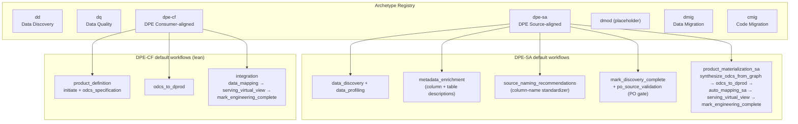

Discovery / profiling / enrichment / DQ workflows are intentionally NOT in the dpe-cf default — the consumer inherits that context from its `:CONSUMES`'d source products. They can be added from the catalog if the engineer wants them.

### 3.2 Registries (`archetypes.py`)

**ARCHETYPE_REGISTRY** maps archetype slugs to metadata:
```python
{
    "dd":     {"name": "Data Discovery",                          "prefix": "dd",     "implemented": True},
    "dq":     {"name": "Data Quality",                            "prefix": "dq",     "implemented": True},
    "dpe-sa": {"name": "Data Product Engineering - Source-aligned","prefix": "dpe-sa","implemented": True},
    "dpe-cf": {"name": "Data Product Engineering - Consumer-aligned","prefix":"dpe-cf","implemented":True},
    "dmod":   {"name": "Data Modernization",                      "prefix": "dmod",   "implemented": False},
    "dmig":   {"name": "Data Migration",                          "prefix": "dmig",   "implemented": True},
    "cmig":   {"name": "Code Migration",                          "prefix": "cmig",   "implemented": True},
}
```

**Code Migration (`cmig`)** is the code sibling of `dmig`: an engineer-initiated,
project-keyed subsystem that converts legacy code (queries/jobs/reports) to a target
platform via spec-first reverse→review→forward engineering grounded on curated Platform
SME corpora. It links to a completed `dmig` project for the source→target schema (the
second sanctioned cross-project edge, `:USES_DATASET`) and produces a downloadable
`old/`+`new/` package. See `docs/code-migration.md`.
Both `dpe-sa` and `dpe-cf` are **filtered out** of the engineer's "New Project" archetype list — source/consumer products are PO-initiated only.

**STAGE_REGISTRY** defines every possible stage keyed by string ID. Each entry contains:
- `stage_id`, `name`, `skill` (Claude Code skill name or None)
- `owner_role` — which persona can execute this stage
- `requires_llm` — whether the stage needs Claude Code SDK
- `has_review`, `review_type` — whether the stage includes human review
- `config_fields` — dynamic configuration fields (text/select/multiselect)
- `prompt_template` — parameterized prompt string
- `sub_stages` — for composite stages, the list of constituent stage IDs

**All stages in the registry:**

| Stage ID | Skill | Owner Role | Review |
|----------|-------|-----------|--------|
| `initiate` | — | Data Product Owner | — |
| `data_discovery` | data-discovery | Data Engineer | — |
| `load_schema` | data-discovery-to-dcat-neo4j | Data Engineer | — |
| `data_profiling` | data-profiling | Data Engineer | — |
| `load_profiles` | data-profiling-to-dqv-neo4j | Data Engineer | — |
| `metadata_enrichment` | metadata-enrichment | Data Steward (non-SA) / Data Engineer (SA) | descriptions (non-SA only — PO owns descriptions for SA) |
| `source_naming_recommendations` | column-name-standardizer | Data Engineer | (output reviewed inside `po_source_validation`) |
| `mark_discovery_complete` | — | Data Engineer | — |
| `po_source_validation` | — | Data Product Owner | source_product_validation |
| `synthesize_odcs_from_graph` | (`sa_pipeline` backend logic) | Data Engineer | — |
| `auto_mapping_sa` | (`sa_pipeline` backend logic) | Data Engineer | — |
| `mark_engineering_complete` | — | Data Engineer | — |
| `dq_rule_generation` | data-quality-rule-generation | Data Quality Analyst | — |
| `data_scoring` | data-scoring | Data Quality Analyst | — |
| `rescore_composite` | (composite: profiling + load + scoring) | Data Quality Analyst | — |
| `domain_rule_enhancement` | domain-rule-enhancement | Data Quality Analyst | domain_rules |
| `domain_impact_analysis` | data-remediation-analysis | Data Quality Analyst | — |
| `data_remediation_planning` | data-remediation-planning | Data Quality Analyst | — |
| `data_mapping` | data-mapping-neo4j (`--source-mode catalog\|dprod`) | Data Engineer | mappings + unmapped_columns + transformation_escalations |
| `serving_virtual_view` | data-serving-virtual-view | Data Engineer | — |
| `serving_physical_copy` | (backend-driven dbt build via `materialization.py`) | Data Engineer | — |
| `deploy_virtual_view` | — (backend deploy of the view DDL) | Data Engineer | — |
| `deployment_reflection` | data-product-deployment-reflector | Data Engineer | — |
| `dq_test_generation_gx` | (backend subprocess: data-quality-testing-gx) | Data Quality Analyst | — |
| `dq_test_generation_python` | (backend subprocess: data-quality-testing-python) | Data Quality Analyst | — |
| `dq_test_execution` | (backend subprocess; writes `:TestRun`/`:TestResult`) | Data Quality Analyst | — |
| `dq_failure_analysis` | data-quality-failure-analysis | Data Quality Analyst | — |
| `odcs_specification` | — | Data Product Owner | — |
| `odcs_to_dprod` | odcs-to-graph | Data Product Owner | — |
| `publish` | — | Data Product Owner | — |
| `reflect_on_reviews` | playbook-reflector | Data Steward | — |

> The DQ test-gen / test-execution stages carry `skill: None` in the registry because they **bypass the SDK** — `pipeline.py` spawns the GX/Pandera/execution skill scripts as subprocesses (5/30-min ceilings) and writes `:TestRun` / `:TestResult` to Neo4j on success, rather than loading a skill into an agent turn. `serving_physical_copy` and `deploy_virtual_view` are likewise backend-driven (no agent); `serving_physical_copy` runs the dbt build via `routers/materialization.py` — see [`serving-materialized-dbt.md`](architecture/serving-materialized-dbt.md).

`serving_virtual_view` has one config field: `dialect` (postgres / snowflake / databricks / bigquery / ansi) — picker pre-fills postgres. The choice rides into the skill via `--dialect` and lands on `:ServingDefinition.targetPlatform` via the sidecar summary.

**Composite stages** combine two operations into one SDK call by concatenating prompts:
- `data_discovery_composite` = `data_discovery` + `load_schema`
- `data_profiling_composite` = `data_profiling` + `load_profiles`
- `rescore_composite` = `data_profiling` + `load_profiles` + `data_scoring`
- `product_definition` (dpe-cf) = `initiate` + `odcs_specification`
- `integration` (dpe-cf) = `data_mapping` + `serving_virtual_view` + `mark_engineering_complete`
- `product_materialization_sa` (dpe-sa) = `synthesize_odcs_from_graph` + `odcs_to_dprod` + `auto_mapping_sa` + `serving_virtual_view` + `mark_engineering_complete`

**Non-agent (backend-driven) stages**: `initiate`, `odcs_specification`, `odcs_to_dprod`, `publish`, `mark_discovery_complete`, `mark_engineering_complete`, `synthesize_odcs_from_graph`, `auto_mapping_sa`, `po_source_validation`. These do not invoke a data agent — they complete via `POST /stages/{n}/complete`; the frontend's `Pipeline.tsx` non-agent-actions map wires each to its specific button label + post-action. **Omitting an entry hangs the stage** because it has no skill or prompt.

### 3.3 Dependency Graph

Cross-workflow dependencies — a stage in one workflow can depend on a stage in another:

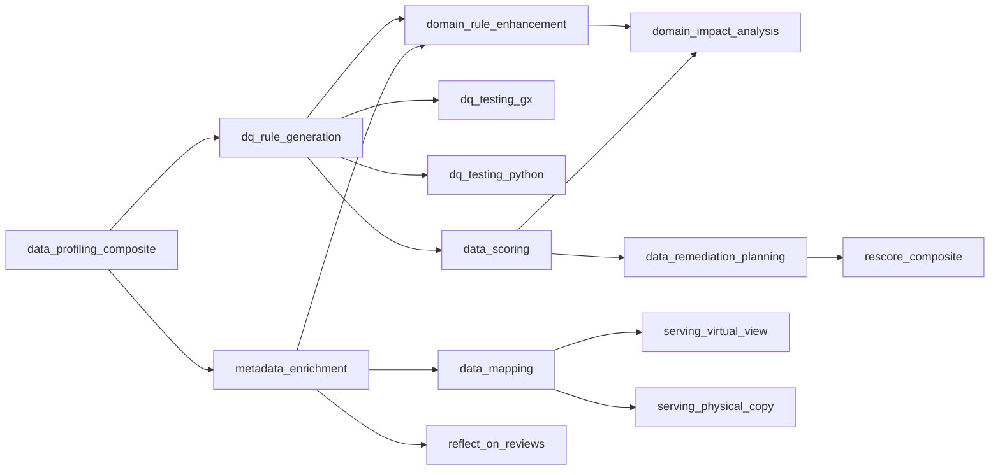

`validate_workflow(steps)` checks:
1. Every enabled stage's dependencies are also enabled (resolved across all workflows)
2. At most one stage per exclusive group is enabled

### 3.4 Source-aligned (`dpe-sa`) vs Consumer-aligned (`dpe-cf`)

The two data-product-engineering archetypes differ along an authoring axis: source-aligned is **discovery-first** (profile a source DB, then validate), consumer-aligned is **contract-first** (shape the product, then bind upstream sources). Both are PO-initiated and **filtered out** of the engineer's New Project list.

| | `dpe-sa` (source-aligned) | `dpe-cf` (consumer-aligned) |
|---|---|---|
| Wizard | `NewSourceProductWizard` (idea + domain + name, 3 steps) | `NewProductWizard` — contract-first 10-step flow |
| Authoring direction | Discovery-first: engineer profiles a source DB, PO validates names/descriptions/rules | Contract-first: PO shapes the product before binding upstream sources |
| Engineer sources | Project's own raw `:Catalog` / `:Dataset` / `:Column` | `:DProdColumn` from `:CONSUMES`'d source products (cross-project URI references) |
| ODCS spec | Synthesized from approved graph state at materialization time (`synthesize_odcs_from_graph`) | Authored in the wizard, persisted to graph on each save |
| `:DataContract.productKind` | `'source'` | `'aggregate'` \| `'consumer'` (3-valued, decoupled from archetype; aggregate rides the same dpe-cf machinery) |
| Default workflows | discovery → enrichment → naming → mark_discovery_complete → **po_source_validation** → product_materialization_sa | **lean**: product_definition → odcs_to_dprod → integration |

`dpe-cf` defaults are intentionally **lean** — discovery / profiling / enrichment / DQ are **not** scaffolded; the consumer inherits that context from its `:CONSUMES`'d source products and can add those workflows from the catalog. The mapping stage for `dpe-cf` gets an archetype-aware directive (`--source-mode dprod --target-contract <id>`) so it maps from consumed `:DProdColumn`s rather than raw catalog.

**`:CONSUMES` is one of two sanctioned cross-project graph edges** (the other is `:USES_DATASET` from code migration — see §3.2). It links `(consumer:DataContract)-[:CONSUMES]->(source:DProdDataProduct)` (any published upstream — source / aggregate / consumer, forming multi-hop DAG chains). Everything else is project-scoped via `{project_code}` URI prefixes; product-graph nodes use a `{project_code}-contract` prefix so they're globally referenceable while still tagged with their owning project. The consumer-aligned 10-step wizard binds sources at the **end** of the flow (step 3 optional pre-selection → step 9 required confirm + pre-flight gap check), not up front. See [`consumer-ingest.md`](architecture/consumer-ingest.md) for the parallel ODCS-ingest entry point and the shared `ResolveAndBindSourcesStep`.

### 3.5 Workflow Lifecycle

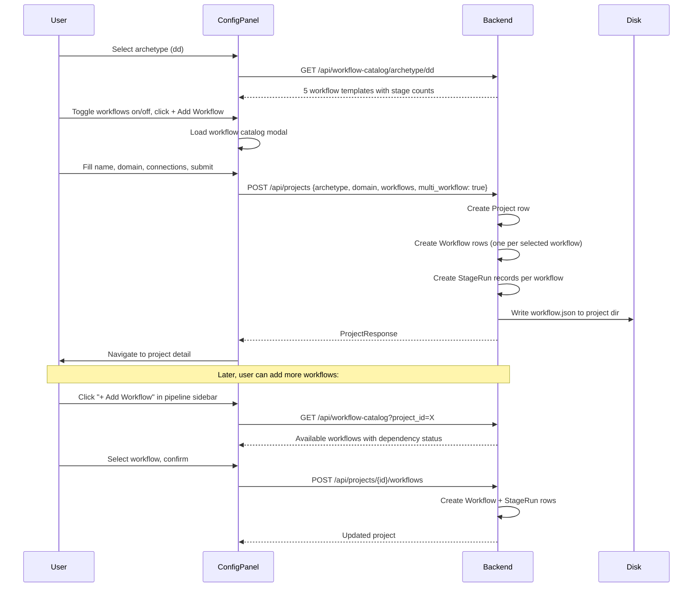

---

## 4. Stage Execution Flow

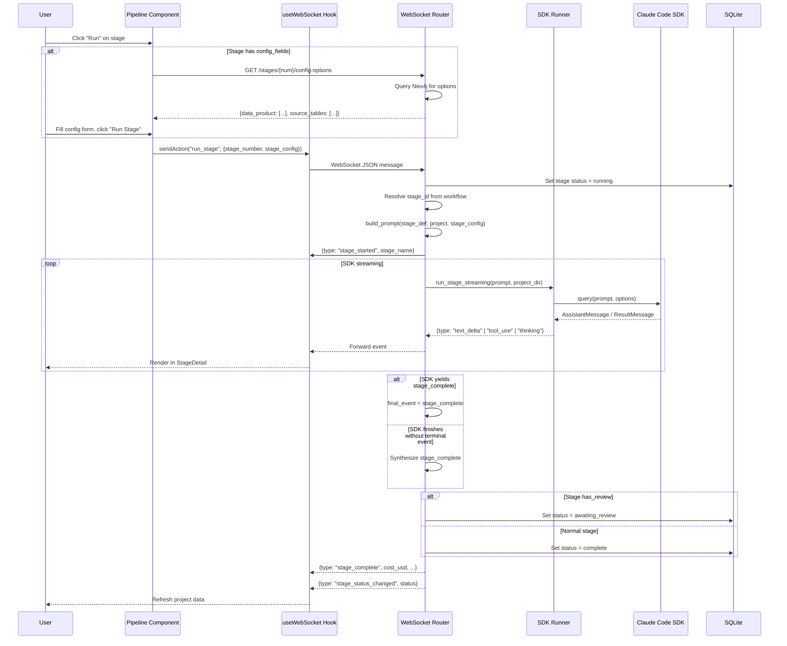

### 4.1 SDK Runner Details

The SDK runner (`sdk_runner.py`) drives the **Claude Agent SDK** (`claude_agent_sdk`, which bundles the Claude Code runtime — see §1) and handles three concerns:

**1. SDK Monkey-Patch**: The Agent SDK's `parse_message` raises `MessageParseError` for unknown message types like `rate_limit_event`. The runner patches both `claude_agent_sdk._internal.message_parser.parse_message` and `client.parse_message` to return `None` for "Unknown message type" errors, then skips `None` messages in the iteration.

**2. Type-safe Message Processing**: SDK dataclasses (`AssistantMessage`, `ResultMessage`, `TextBlock`, `ToolUseBlock`, `ThinkingBlock`) don't have a `type` attribute. The runner uses `isinstance` checks to categorize messages and yields typed dict events for WebSocket transmission.

**3. Stuck Stage Prevention**: If the async generator completes without yielding a `stage_complete` or `error` event, the WebSocket handler synthesizes a `stage_complete` fallback. A `POST /stages/{num}/reset` endpoint allows manual recovery.

### 4.2 Prompt Template System

`build_prompt(stage_def, project, stage_config)` substitutes parameters:
```python
params = {
    "pg_connection": project.pg_connection,
    "neo4j_host": project.neo4j_host,
    "neo4j_port": project.neo4j_port,
    "neo4j_user": project.neo4j_user,
    "neo4j_password": project.neo4j_password,
    "neo4j_database": project.neo4j_database,
}
if stage_config:
    params.update(stage_config)  # e.g. data_product, source_tables
return template.format(**params)
```

All prompts include "Do not ask which tables — do all of them" to prevent the data agent from prompting for user input during unattended execution.

### 4.3 Chat Runner

The chat panel runs through a parallel, simpler code path. `chat_runner.py` mirrors `sdk_runner.py` but with narrower tooling and a chat-specific system prompt — no shared execution between them.

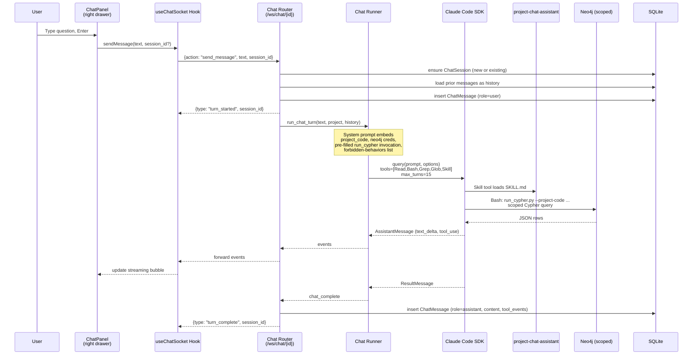

Key differences from stage execution:

- **Tool set**: `[Read, Bash, Grep, Glob, Skill]` — no `Write` or `Edit`. The chat is read-only by construction.
- **Turn budget**: `max_turns = 15` (stages use 50). Chat turns resolve fast or not at all.
- **System prompt**: embeds `project_code`, Neo4j host/port/user/password/database verbatim, and a pre-filled `run_cypher.py` invocation for the agent to copy. A **Forbidden** section explicitly bans reading `workbench.db`, grepping the codebase for credentials, brute-forcing passwords, `--help` roundtrips, and echoing the password — an early iteration without credentials in the prompt triggered a credential-hunting loop, so these rules are load-bearing.
- **Graph access**: the agent runs `workbench-skills/skills/project-chat-assistant/scripts/run_cypher.py` via `Bash`. The runner refuses any query whose text and params do not both mention the project code — a single enforcement point independent of prompt adherence.
- **Multi-turn**: the chat router reconstructs history from `ChatMessage` rows on each turn and passes it as pre-populated conversation context in the turn prompt. The SDK remains stateless per invocation; state lives in SQLite.
- **No StageRun linkage**: chat turns do not create `StageRun` / `StageExecution` rows. They persist to `ChatSession` / `ChatMessage` instead.

The skill (`workbench-skills/skills/project-chat-assistant/SKILL.md`) carries the ontology reference — every node label, relationship, enum value — plus a query pattern library per topic (catalog inventory, profiling, rules, scoring, tests, descriptions, mappings, contracts/products). Its purpose is to let the agent write correct project-scoped Cypher without trial and error.

---

## 5. Review System

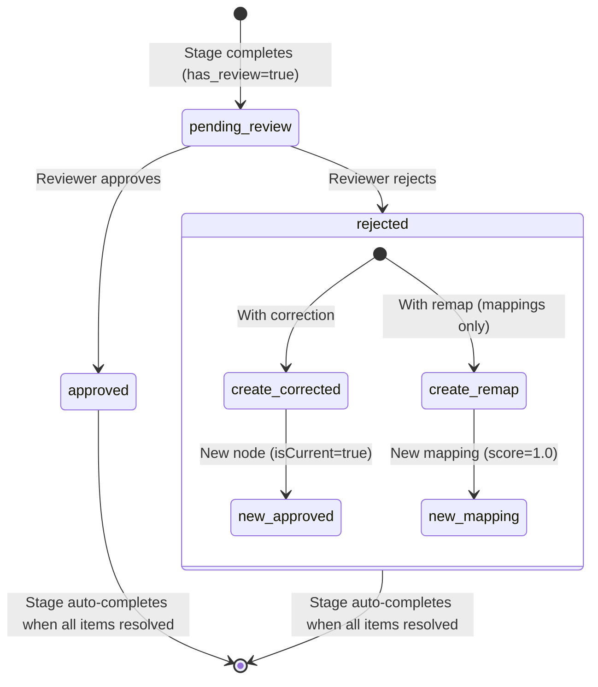

### 5.1 Description Review Flow

When Metadata Enrichment completes, the stage transitions to `awaiting_review`. The frontend queries Neo4j for `ColumnDescription` nodes with `status='pending_review'` and `isCurrent=true`.

**Approve**: Sets `status='approved'` on the description, creates a `ProvActivity` node with `outcome='approved'` linked to a `ProvAgent` (human reviewer).

**Reject with correction**: Marks the original as `rejected` and `isCurrent=false`. Creates a new `ColumnDescription` with the corrected text, `status='approved'`, `isCurrent=true`. Links the new description to the original via `PROV_WAS_DERIVED_FROM`. Creates `ProvActivity`, `ProvAgent`, and `ProvRejectionReason` nodes with full provenance chain.

**7 rejection categories**: incorrect_meaning, too_vague, too_specific, incorrect_constraint, incorrect_values, incorrect_fk_reference, other.

### 5.2 Mapping Review Flow

`MappingReviewPanel` offers three first-class actions on an AI-suggested mapping — **Approve**, **Replace**, **Escalate** (`reviews.py`):

- **Approve** signs the mapping off as-is, carrying a quality rating (Acceptable / Good / Excellent).
- **Replace** is the single **unified override** — it covers transform-fragment edits, source-set edits, and remap-to-a-different-source-column in one `Save Replacement` POST (`action: "replace_mapping"`). It requires a rejection category (defaults to `edited_default`) and writes a `:ProvRejectionReason` linked to the activity, so changing the AI's default ALWAYS records *why*. View mode is read-only; the engineer must click Replace to mutate anything. Backend `replace_mapping` branches on `remap_source_uri`: present → `REJECT_MAPPING_QUERY` + `REMAP_MAPPING_QUERY`; absent → `REPLACE_TRANSFORM_QUERY`. Source-set reconciliation reuses `WIPE_MAPPING_SOURCE_EDGES` + `ATTACH_MAPPING_SOURCE_EDGE_{COLUMN,DPRODCOLUMN}` (label dispatched by URI prefix).
- **Escalate** sends the mapping to the Data Steward (review type `transformation_escalations` — see §5.3).

> The legacy `edit_transform` / `reject` / `remap` actions still exist in the `reviews.py` handler for back-compat, but the frontend **no longer emits them** — `replace_mapping` subsumes all three.

**8 rejection categories** (`MAPPING_REJECTION_CATEGORIES` in `types.ts`): `edited_default`, `incorrect_mapping`, `incomplete_transformation`, `wrong_target_column`, `too_low_confidence`, `no_match_exists`, `duplicate_mapping`, `other`.

**Transformation DSL**: derived mappings carry a structured DSL on `:ColumnMapping` (`transformKind`, `transformInputs[]`, `transformParams`, `transformDecorators`, plus a free-text `transformExpression` that's the source of truth for the DDL generator). The frontend's `TransformEditor` drives the kind dropdown, kind-specific param fields, decorator checkboxes, and a raw-SQL escape hatch. A Replace re-emits the mapping with `transformAuthor='engineer'` plus a `:ProvActivity {activityType: 'transformation_authoring'}` for audit. Multi-source mappings emit one `[:MAPS_SOURCE_COLUMN]` edge per URI in `transformInputs[]`. Pending rows also include `original_ai_suggestion` (the earliest `transformation_authoring` activity with `priorAuthor: 'ai_suggestion'`); when present alongside `transform_author === 'engineer'`, the panel renders a collapsible "Original AI suggestion (replaced)" disclosure.

**`transformAuthor`** mirrors the four-source DQ-rule pattern: `po_hint` (ODCS `transform` block, propagated via `:DProdColumn.transformHint`), `steward_catalog` (matched from `playbook/transformation_catalogs/{domain}.yaml`), `engineer` (hand-edited), `ai_suggestion` (data-agent fallback). The mapping skill's prompt template enforces priority order: hint → catalog → agent suggestion. See [`architecture/transformations.md`](architecture/transformations.md) for the per-kind `transformParams` schemas, the `:LOOKUP_VIA` lineage edge, and view-DDL SELECT emission.

### 5.3 Transformation Escalations Review Flow

When the engineer can't resolve a transformation alone, "Escalate to Steward" posts `action: "escalate_to_steward"` which flips `:ColumnMapping.status='steward_review'` and stores a `transformEscalationReason`. A new review type `transformation_escalations` (owner role: Data Steward) surfaces these in `TransformationEscalationsPanel` under the Reviews tab. Steward actions: **Answer inline** (writes a SQL expression back; `transformAuthor='steward_catalog'`, status returns to `pending_review`), **Add to catalog** (appends a template to `playbook/transformation_catalogs/{domain}.yaml`), or **Bounce to PO** (flips `:DataContract.lifecycleState='revision_requested'` reusing the structured-rejection plumbing).

### 5.4 Unmapped Product Columns

The `data_mapping` skill skips product columns whose best source candidate scores below 0.60 — without a separate path, those gaps would force a full stage rerun. `GET /reviews/unmapped_columns` returns those columns; `UnmappedColumnsPanel` (review type `unmapped_columns`, engineer-owned) lets the engineer hand-create a `:ColumnMapping` via the same `TransformEditor`. `POST /reviews/unmapped_columns` writes it with `status='pending_review'` and `transformAuthor='engineer'`, so it still flows through the regular Mappings review queue. The `ProjectDashboard` Mappings card has a mapped/unmapped toggle whose unmapped view deep-links into this panel pre-focused on the chosen column.

### 5.5 Source Product Validation (dpe-sa)

The PO's combined gate for source-aligned products. Mounted on the `po_source_validation` stage AND at the standalone `/product/validate/:projectId` route. `SourceProductValidationPanel` has five tabs in one place:

- **Names** — engineer-proposed `:Column.recommendedName` values from `column-name-standardizer`. Approve / reject / edit. Rejections write `:ProvRejectionReason {category, detail}` with categories like `synonym_clash`, `unclear`, etc.
- **Descriptions** — `:ColumnDescription` queue. SA archetype intentionally suppresses the engineer-side `descriptions` review surface so the PO owns this.
- **Tables** — `:TableDescription` text + `relationshipKind` classification (fact / lookup_dimension / general_membership / specialization / audit_log / configuration / unknown). The classification rides through `_generate_dprod` to `:DProdOutputDataset.relationshipKind` and drives the consumer-side bridge ranker on view-DDL generation.
- **Relationships** — `:RelationshipDescription` queue (FK-edge semantics between datasets); approve / reject / edit text + kind.
- **Rules** — observation-source `:PropertyShape` queue.

`_check_review_complete` flips the head materialization stage (`synthesize_odcs_from_graph`) from `pending` → `complete` when the PO clears the queue. The engineer's pipeline UI renders a "Pending PO validation" amber state on `synthesize_odcs_from_graph` until the gate is cleared.

### 5.6 Domain Rule Review Flow

When Domain Rule Enhancement completes, domain-generated `PropertyShape` nodes (created via the API endpoint outside the wizard) have `ruleSource='domain'` and `status='pending_review'`. The review flow is similar to descriptions — approve or reject each rule. Bulk approve is available via `POST .../reviews/domain_rules/approve-all`. Domain rules accepted *inside* the consumer-aligned wizard instead land directly at `status='approved'` (author-asserted). See [§5.8](#58-four-source-dq-rules-model) for the full four-source lifecycle.

### 5.7 Auto-Completion

After each review action, `_check_review_complete()` walks ALL stages whose `review_type` matches the just-approved type and looks for `pending` / `awaiting_review` / `failed` status; flips them to `complete` when remaining count = 0. `pending` is included so PO-only gates (`po_source_validation`) — which never get a Run click — still close. The `GET /reviews/source_product_validation` handler also calls `_check_review_complete` so opening an already-empty panel resolves stale state.

### 5.8 Four-Source DQ Rules Model

Data quality rules are `:PropertyShape` nodes carrying a `ruleSource` that records **where the rule came from** — and the source determines its review lifecycle:

| `ruleSource` | Origin | Anchored to | Lands at |
|---|---|---|---|
| `observation` | Auto-discovered by `data-quality-rule-generation` from profiling | `:Column` | `status='pending_review'` |
| `domain` | Generated from `playbook/domain_catalogs/{domain}.yaml` | `:DProdColumn` | `pending_review` (API) / `approved` (wizard) |
| `user` | PO-authored via wizard chat (`applies_to: rule_create`) | product column | `status='approved'` (auto) |
| `spec` | Embedded in ingested ODCS `quality[]`, materialised in `_generate_dprod` | product column | `status='approved'` |

**Lifecycle by category** — categorise once, all downstream filters follow:
- **Author-asserted** (`user`, `domain`-in-wizard, `spec`) → land at `approved` on the authoring commit. The wizard pre-approves every catalog-suggested rule and the PO rejects what doesn't fit before submit; `finalize()` approves the rest.
- **Machine-discovered** (`observation` from profiling) → land at `pending_review`, reviewed by the PO in the SA validation gate (`dpe-sa`) or by the DQA (`dq` archetype) before they affect anything downstream.

**Downstream filters key on `status='approved'`**: marketplace Quality tab, DQ test generation (GX + Pandera, scoped + unscoped variants), and the scoring `grounding` dimension. The engineer's DQ Rules summary card intentionally counts ALL statuses per-source (`summary.py:DQ_RULE_COUNT`) so triage state stays visible. Review actions are idempotent — `APPROVE/REJECT_DOMAIN_RULE_QUERY` gate on `coalesce(ps.status,'pending_review') <> '<target>'`, so the wizard's blind re-POST of the whole `approvedRules` set is a true no-op.

**Marketplace dual-encoding caveat**: each `spec` rule lives twice — as `:DataContractQuality` (verbatim severity) and as a SHACL `:PropertyShape {ruleSource='spec'}`. Marketplace `PRODUCT_DETAIL` excludes the `spec` PropertyShape so consumers see each rule once; engineer-facing surfaces see both.

---

## 6. Frontend Architecture

### 6.1 Component Hierarchy

```mermaid
graph TD
    App["App<br/>(RoleContext.Provider)"]
    App --> Layout["Layout<br/>(Header + Outlet)"]
    Layout --> PLP["ProjectListPage"]
    Layout --> EngShell["EngineerShell (/engineer/*)"]
    Layout --> ProdShell["ProductShell (/product/*)"]
    EngShell --> PLP["ProjectListPage"]
    EngShell --> NPP["NewProjectPage"]
    EngShell --> PDP["ProjectDetailPage"]
    EngShell --> INC["IncomingQueuePage"]
    EngShell --> SP["SettingsPage"]
    ProdShell --> MPD["MyProductsDashboard"]
    ProdShell --> NPW["NewProductWizard<br/>10 steps (dpe-cf)"]
    ProdShell --> NSPW["NewSourceProductWizard<br/>3 steps (dpe-sa)"]
    ProdShell --> POV["PoValidationPage<br/>SA combined gate"]
    ProdShell --> ING["IngestExistingProductPage"]
    ProdShell --> MktPg["MarketplacePage<br/>+ ProductKindChip"]

    PLP --> PDash["PersonaDashboard"]
    NPP --> CP["ConfigPanel<br/>(3-step wizard)"]

    PDP --> Pipeline["Pipeline<br/>(multi-workflow groups + Run)"]
    PDP --> ProjDash["ProjectDashboard<br/>stat cards + ServingWarningsCallout + JoinsOverridePanel"]
    PDP --> QSPanel["QualityScorePanel"]
    PDP --> StgDet["StageDetail<br/>(streaming output)"]
    PDP --> ArtBr["ArtifactBrowser"]
    PDP --> ResView["ResultsViewer"]
    PDP --> RevPan["ReviewPanel<br/>per-stage scoped via review_type"]
    PDP --> ODCSEd["ODCSEditor"]
    PDP --> ChatP["ChatPanel<br/>(Ask drawer)"]
    PDP --> POBan["ProductOwnerContextBanner<br/>(reads Project.product_idea for SA)"]
    PDP --> EditBan["ProjectEditBanner + EditDiffPanel<br/>(when PO has an open edit request)"]

    NPW --> PCP["ProductChatPanel<br/>(Guide me + Apply protocol)"]
    NPW --> EDP["EditDiffPanel (edit mode)"]
    NPW --> SHP["ShapePanel + Scd2PolicyPanel + WindowSpecsEditor"]
    NPW --> TXE["TransformEditor<br/>(column transform hints)"]
    POV --> SPV["SourceProductValidationPanel<br/>tabs: Names / Descriptions / Tables / Relationships / Rules"]

    RevPan --> DescRev["DescriptionReviewPanel"]
    RevPan --> MapRev["MappingReviewPanel"]
    RevPan --> DomRev["DomainRuleReviewPanel"]
    RevPan --> UnmapPan["UnmappedColumnsPanel"]
    RevPan --> EscPan["TransformationEscalationsPanel"]
    RevPan --> SPVI["SourceProductValidationPanel<br/>(mounted on po_source_validation)"]
    MapRev --> TxEd["TransformEditor<br/>kind dropdown incl. bucket/mask/hash/window"]
    UnmapPan --> TxEd
    MapRev --> RKChip["RelationshipKindChip<br/>(source-picker context)"]

    ProjDash --> SWC["ServingWarningsCallout<br/>warnings + auto-bridge + SCD + suppressed + windows"]
    ProjDash --> JOP["JoinsOverridePanel<br/>per-row form + JSON escape hatch"]
    MktPg --> MktSrv["Marketplace Serving tab<br/>renders ServingWarningsCallout"]

    style App fill:#1e293b,color:#fff
    style Layout fill:#334155,color:#fff
```

### 6.2 State Management

```mermaid
graph LR
    subgraph "Global State"
        RC[RoleContext<br/>current role]
    end

    subgraph "Page State (ProjectDetailPage)"
        P[project: ProjectInfo]
        AS[activeStage: number | null]
        RS[runningStage: number | null]
        TAB[stageTab: output|artifacts|reviews]
    end

    subgraph "WebSocket State (useWebSocket)"
        MSG[messages: WSMessage array]
        STAT[status: disconnected|connected|running]
        SA[sendAction function]
    end

    RC -->|useRole| Pipeline
    RC -->|useRole| ReviewPanel
    RC -->|useRole| PersonaDashboard
    P --> Pipeline
    P --> ProjDash
    P --> ReviewPanel
    MSG --> StageDetail
    SA --> Pipeline
```

No external state management library — React `useState` + `useContext` handles all state. The `RoleContext` provides the current persona globally. `useWebSocket` manages the WebSocket lifecycle and message accumulation.

### 6.3 Page Modes (ProjectDetailPage)

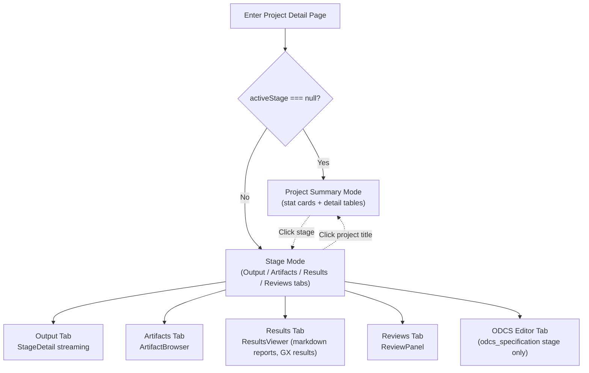

### 6.4 Project Creation Wizard

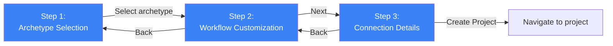

**Step 1**: Fetches `GET /api/archetypes`. Renders cards per archetype — **DD, DQ, DMIG (Data Migration), and CMIG (Code Migration) are clickable** (only `dmod` still shows "Coming Soon"); `ConfigPanel.tsx` filters out **both** `dpe-cf` AND `dpe-sa` because source/consumer products are PO-initiated only, never created by an engineer here. On select, fetches the archetype's workflow templates.

**Step 2**: Displays workflow groups as a customization screen. Each workflow shows name, stage count, and "Repeatable" badge if applicable. Workflows can be toggled on/off. An "+ Add Workflow" button opens a catalog modal for selecting additional workflows. Exclusive groups (DQ testing) render within their workflow.

**Step 3**: Project name, domain selector (dropdown with "Custom..." option), and PostgreSQL connection (required). Neo4j connection is hidden by default behind an "Override Neo4j Connection" checkbox — the global settings are used unless overridden.

---

## 7. Persona Dashboard & Role System

### 7.1 Role Permissions

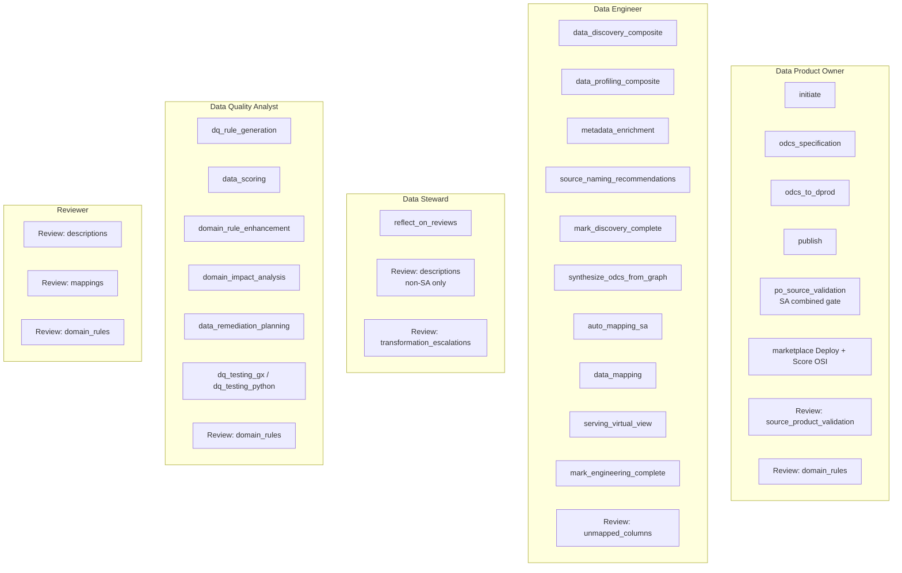

Permissions are enforced at two levels:
- **Frontend**: `canRunStage(role, stageNumber, stageId)` disables Run buttons. `canReview(role, reviewType)` shows warning banners.
- **Backend**: Dashboard API filters tasks and reviews by role.

### 7.2 Dashboard Task Classification

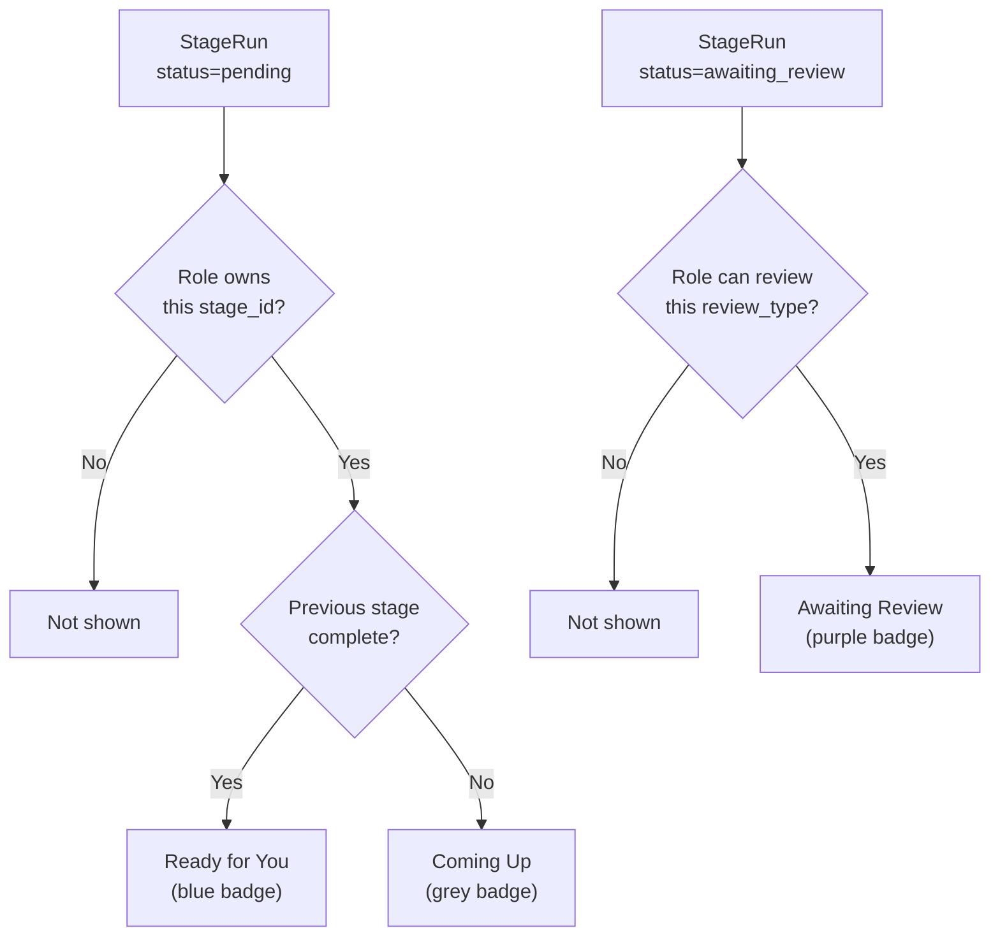

---

## 8. Summary Dashboard & Neo4j Queries

### 8.1 Stat Cards

| Card | Query Target | Filters | Provenance |
|------|-------------|---------|------------|
| Datasets | `Dataset` nodes | table | No |
| Columns | `Column` nodes | table, column | No |
| Graph Nodes | All nodes | — | No |
| Descriptions | `ColumnDescription {isCurrent:true}` | table, column | No |
| Final Descriptions | `ColumnDescription {isCurrent:true}` | table, column | Yes (per column) |
| Mappings | `ColumnMapping {isCurrent:true}` | table, column | Yes (per mapping) |
| Data Serving | `ServingDefinition` nodes | — | No |
| Data Profiling | `QualityMeasurement` + profiled columns | table, column | No |
| DQ Rules | `PropertyShape` nodes (observed vs domain) | table, column, severity, source | No |
| Allowed Values | `Column` with TopValue coverage >95% | table, column | No |
| Quality Score | `QualityScore` nodes (composite %) | — | No |
| Domain Playbook | `PlaybookItem {isCurrent:true}` | — | No |
| Learning History | `PlaybookVersion` count | — | No |
| **Inputs** (dpe-cf only) | CONSUMES'd source products (count + dataset + column count via `:CONSUMES`) | — | No |

**Per-archetype card filtering** (`ProjectDashboard.tsx`): `CONSUMER_HIDDEN_CARDS` (`datasets`, `columns`, `descriptions`, `final_descriptions`, `profiling`, `dq_rules`, `allowed_values`, `quality_score`) are hidden for `dpe-cf` projects — a consumer product doesn't own raw catalog data, so none of those cards have rows. Conversely the **Inputs** card is shown ONLY for consumer projects (it surfaces the upstream source products consumed via `:CONSUMES`; each row links `target=_blank` to that source product's marketplace detail) and hidden for every other archetype. Mapping-related detail queries (`/summary/detail?card=...`) anchor on the project's own `:DProdColumn` so consumer projects show real rows.

### 8.2 Cypher Query Viewer

Every detail table includes a collapsible "Cypher Query" block. The backend's `_display_query()` function:
1. Takes the parameterized Cypher and the actual parameter values
2. Removes `AND ($param IS NULL OR ...)` lines where the param is `None` (not filtered)
3. Substitutes actual values for active filter parameters
4. Returns a clean, copy-pasteable Cypher string

This allows users to click "Copy" and paste the exact query into Neo4j Browser for further exploration.

### 8.3 Provenance Drill-Down

For Final Descriptions and Mappings, each row has a "View" provenance button. This queries the PROV-O subgraph:

```cypher
-- Generated-by activities (creation, correction)
MATCH (node)-[:PROV_WAS_GENERATED_BY]->(act:ProvActivity)
      -[:PROV_WAS_ASSOCIATED_WITH]->(agent:ProvAgent)
OPTIONAL MATCH (act)-[:HAS_REJECTION_REASON]->(reason)

UNION

-- Used-by activities (reviews)
MATCH (act:ProvActivity)-[:PROV_USED]->(node)
MATCH (act)-[:PROV_WAS_ASSOCIATED_WITH]->(agent)
OPTIONAL MATCH (act)-[:HAS_REJECTION_REASON]->(reason)
```

Displays: activity type, outcome (approved/rejected), timestamp, agent name and type (human/system), description/rationale, rejection category.

---

## 9. API Reference

### 9.1 REST Endpoints

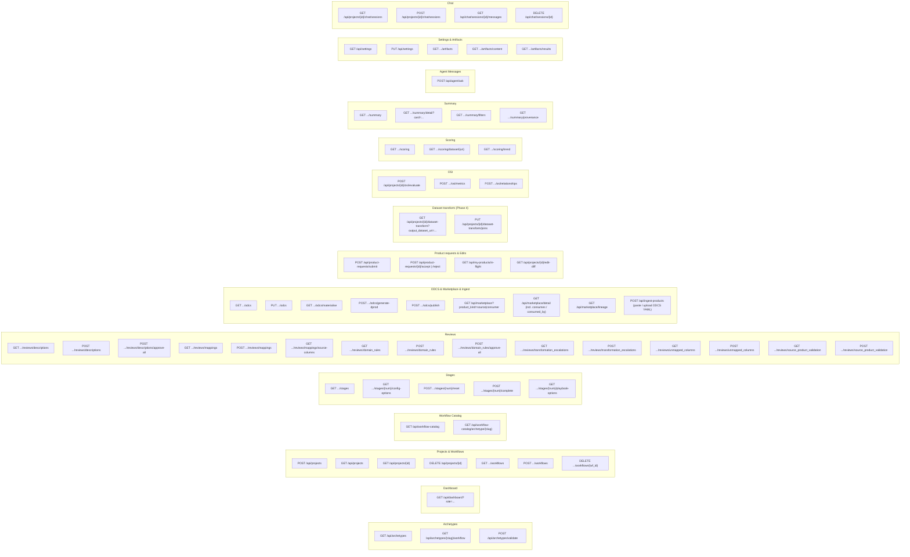

### 9.2 WebSocket Protocol

**Endpoint**: `ws://localhost:8000/ws/pipeline/{project_id}`

**Client → Server**:
```json
{"action": "run_stage", "stage_number": 3, "workflow_id": "source_discovery", "stage_config": {"data_product": "employee_product"}}
```
```json
{"action": "agent_response", "run_id": "uuid", "question_id": "uuid", "value": "user response"}
```

**Server → Client events**:
| Event | Fields | When |
|-------|--------|------|
| `stage_started` | stage_number, stage_name, run_id, workflow_id | Stage execution begins |
| `text_delta` | text | Claude generates text |
| `tool_use` | tool, id, input | Claude invokes a tool |
| `thinking` | text | Claude's reasoning (ThinkingBlock) |
| `agent_question` | run_id, question_id, message_type, prompt, options, default_value, timeout | Agent asks user for input |
| `agent_timeout` | run_id, question_id | Agent question timed out |
| `stage_complete` | cost_usd, duration_ms, session_id, is_error | SDK yields ResultMessage |
| `stage_status_changed` | stage_number, workflow_id, status | DB status committed |
| `error` | message | Any error occurs |

The backend commits DB status updates **before** sending `stage_complete` and `stage_status_changed` to prevent race conditions where the frontend fetches stale data.

**Chat endpoint**: `ws://localhost:8000/ws/chat/{project_id}`

**Client → Server**:
```json
{"action": "send_message", "text": "Top null-rate columns?", "session_id": 12}
```
`session_id` is optional — if omitted, the router creates a new `ChatSession` and returns its id in the `turn_started` event.

**Server → Client events**:
| Event | Fields | When |
|-------|--------|------|
| `turn_started` | session_id, project_code | Router has persisted the user message and is about to invoke the SDK |
| `text_delta` | text | Assistant emits text (same payload shape as pipeline stream) |
| `tool_use` | tool, id, input | Assistant invokes a tool (typically `Bash` running `run_cypher.py` or `Skill`) |
| `thinking` | text | ThinkingBlock text |
| `chat_complete` | cost_usd, duration_ms, session_id, is_error | SDK yields ResultMessage |
| `turn_complete` | session_id, is_error | Assistant message persisted to `ChatMessage` |
| `error` | message | Any error occurs |

The chat WebSocket runs independently of the pipeline WebSocket — both can be open at once on the same project. Chat turns do not interact with `StageRun` state.

### 9.3 Chat REST Endpoints

| Method | Path | Purpose |
|--------|------|---------|
| `GET` | `/api/projects/{id}/chat/sessions` | List sessions for a project, newest first |
| `POST` | `/api/projects/{id}/chat/sessions` | Create a new empty session; body `{title?: string}` |
| `GET` | `/api/chat/sessions/{id}/messages` | List persisted messages (user and assistant) with tool events |
| `DELETE` | `/api/chat/sessions/{id}` | Delete a session and its messages |

Sessions are kept indefinitely — they are small (text + JSON tool events) and users routinely revisit prior reasoning about a score trend or a rule decision.

---

## 10. MCP Control Plane

The same FastAPI process that serves the web UI also mounts an **MCP control plane** at `/mcp` (`workbench/backend/mcp_server.py`, a `FastMCP` server mounted in `main.py`). It exposes a slice of the backend control plane as MCP tools so a **data engineer can drive the Workbench from their own Claude Code** — no browser, no local skills, no database credentials. The web UI, the headless engine, and the engineer's CLI are **peer clients of one service over one port**: REST/WebSocket on `/api/*`, MCP on `/mcp`.

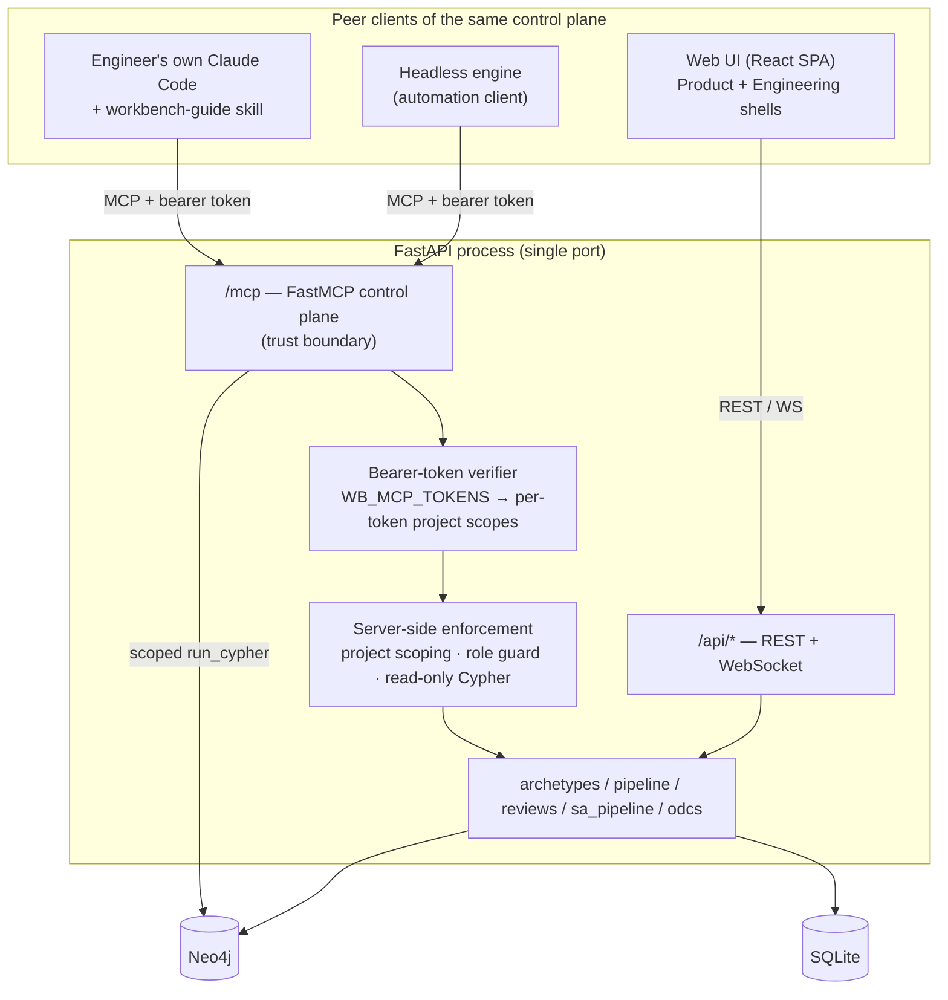

**The MCP server is the trust boundary.** Every tool enforces project scoping, role permissions, and read-only Cypher **server-side**, regardless of what the client sends — client-side `.mcp.json` / Claude Code permissions are not trusted. Authentication is a **plain static bearer** (`Authorization: Bearer <token>`), validated by a thin ASGI middleware (`_BearerAuthMiddleware` in `mcp_server.py`) against `WB_MCP_TOKENS` (comma-separated `token`, `token:principal`, or `token:principal:p1|p2` entries). This is deliberately **not** OAuth: FastMCP's `AuthSettings` resource-server mode advertises RFC-9728 protected-resource metadata, which makes static-bearer clients (e.g. OpenAI Codex) report `Auth: Unsupported` and import zero tools. Plain bearer is what every MCP HTTP client supports, so the endpoint is client-agnostic — no `/.well-known/oauth-protected-resource`, no `resource_metadata` in the 401 challenge. Auth is **gated**: enforced when `WB_MCP_TOKENS` is set, open when it isn't (mirroring the local-dev unauthenticated-REST posture; tools still fail closed via `_serving_guard` unless `WB_MCP_ALLOW_INSECURE=1`). On a valid token the middleware stashes `{principal, projects}` in a request-scoped contextvar; `_authorized_projects()` reads the project ACL back (`None` = unrestricted) and `_deny_project()` rejects out-of-scope calls. The token's `principal` is recorded as the acting human in PROV-O provenance.

> The MCP surface spans the full lifecycle (reads, stage execution, configuration, semantic discovery, and five review writes), all behind the role/scoping guards. The count grows as tools are added — regenerate the registry below straight from `mcp_server.py`'s `@mcp.tool()` decorators rather than trusting a hand-maintained number; `docs/mcp-architecture.md` is the canonical, categorized reference.

**142 MCP tools** (`@mcp.tool()` in `mcp_server.py`). The **canonical tool reference is [`mcp-architecture.md`](mcp-architecture.md)** (142 tools, with per-tool args + guards) — this file only summarises the groups so the count stays honest (`test_docs_consistency.py` fails the suite if this number drifts from the decorator count):

- **Read / status** — `list_projects`, `get_project_state` (per-stage `execution_kind`), `get_plan_summary`, `get_stage_results`, `get_stage_config_options`, `run_cypher` (scoped read-only choke point), `get_dataset_filter`, `get_dataset_transform`, `query_semantic_layer` (domain-scoped Semantic Q&A — see [§12.4](#124-semantic-layer--semantic-qa)), `get_semantic_discovery_status` (per-domain concept-layer discovery state).
- **Mapping / serving diagnostics (read)** — `get_mapping_graph`, `get_unmapped_columns`, `get_stale_mappings`, `get_mapping_rationale_report`, `get_join_preflight` (disconnected-component detection — see [`view-ddl-fk-bridges.md`](architecture/view-ddl-fk-bridges.md)), `get_upstream_drift`, `get_okf_bundle` (Open Knowledge Format export), `get_dbt_project` (no-secrets dbt scaffold export).
- **Semantic discovery (mutate)** — `run_semantic_discovery_step` (scaffold → recommend → enrich), `reset_semantic_discovery`. Domain-scoped + role-gated (Steward / Engineer / PO); lets an engineer build a domain's concept layer headlessly (see [§12.4](#124-semantic-layer--semantic-qa)).
- **Stage lifecycle (mutate)** — `run_stage` (async, same SDK runner as the WS path but with a no-op event sink), `reset_stage`, `complete_stage` (returns a `_completion_summary`), `get_pending_questions` / `answer_question` (parked-question analogue of the WS `agent_question` / `agent_response` exchange).
- **Workflow catalog (mutate)** — `list_available_workflows`, `add_workflow`, `remove_workflow`, `select_exclusive_group` (e.g. the serving group).
- **Materialization gate** — `get_materialization_status`, `build_materialization_sample`, `approve_materialization_full`, `reject_materialization_sample` (the sample → inspect → approve → full flow; see [`serving-materialized-dbt.md`](architecture/serving-materialized-dbt.md)).
- **Requests / assignments (the PO ↔ engineer loop)** — `list_assignments`, `get_assignment`, `accept_request` (flips a `dpe-sa` `ProductRequest` `submitted → accepted` so the PO gate unlocks), `reject_request`, `list_rejection_categories`, `request_source_candidates`, `send_upstream_pushback`.
- **Configuration (mutate)** — `set_data_source`, `set_serving_mode` (flips the serving exclusive group — see [`serving-materialized-dbt.md`](architecture/serving-materialized-dbt.md)), `set_dataset_filter`, `set_dataset_joins`, `set_materialization_target`, `rebind_stale_mapping`.
- **Review writes** — `review_description`, `review_mapping`, `review_domain_rule`, `review_table_description`, `review_relationship_description`. Each requires a declared `role` and is rejected server-side if that role can't act on the surface (e.g. "switch from Data Engineer to Data Steward"). `_call_review` dispatches to the same `reviews.py` handlers the web UI uses, so MCP review writes carry identical PROV-O provenance — only the acting agent's `principal` differs.
- **Consumer-product authoring (mutate)** — `create_consumer_product`, `save_odcs_spec`, `submit_product_spec`, `ingest_odcs_spec`, `match_inputs`, `run_gap_analysis`, `suggest_domain_rules`, `interpret_filter_intent`, `bulk_approve_mappings`, `deploy_virtual_view`, `trigger_osi_score`, `complete_product_request`, `reject_product_request`. Lets a consumer engineer drive the full `dpe-cf` lifecycle from the CLI. `run_stage` / `complete_stage` gained `force` + three pre-flight gates (`_dependency_gate` archetype-aware, `_required_config_gate`, `_serving_mappings_gate`).
- **Marketplace / DQ / OSI / QA reads** — `list_marketplace_products`, `get_marketplace_detail`, `get_marketplace_lineage`, `list_marketplace_gaps`, `log_marketplace_gap`, `get_odcs_spec`, `get_osi_evaluation`, `get_dq_score`, `get_dq_test_runs`, `get_deployment_reflection`, `preview_serving_view`, `run_readonly_sql`, `get_product_report`, `get_stage_output`, `get_stage_executions`, `get_edit_diff`, `get_provenance`, `get_usage_summary`, `get_available_actions`, `list_ingest_drafts`, `probe_qa_question`, `execute_qa_question`.

**A second front door for the Product Owner** — `/po-mcp` (68 tools in `po_mcp_server.py`) — mounts alongside `/mcp` and gives the PO their own authoring/validation/publish surface; every PO tool delegates to an existing router handler (zero raw Cypher) and reuses the engineer server's bearer-auth middleware. Full reference in [`mcp-architecture.md`](mcp-architecture.md).

The companion `workbench-guide` skill (installed in the **engineer's** Claude Code, not the server) teaches the lifecycle and which tool to call when. End-to-end setup and a guided first session live in [`engineer-guide.md`](engineer-guide.md).

**Semantic Q&A from the CLI.** `query_semantic_layer(domain, question, retrieval_mode?)` lets an engineer run the marketplace **Semantic Q&A** from their own Claude Code — the same concept-guided pipeline (`marketplace_chat.answer_question`) the web UI calls via `POST /api/marketplace/chat`, returning a markdown answer (synthesized text + result table + SQL). It executes server-side against the domain's deployed views; the engineer just asks in natural language. See [§12.4](#124-semantic-layer--semantic-qa).

---

## 11. Capability-Palette Engineer Board

`Pipeline.tsx` renders the engineer's project board as a **capability palette**, not a linear staged rail. The older sequential stage rail has been **replaced** — the board now groups every stage into one of four broad lifecycle **phases** and lets the engineer run capabilities in any order.

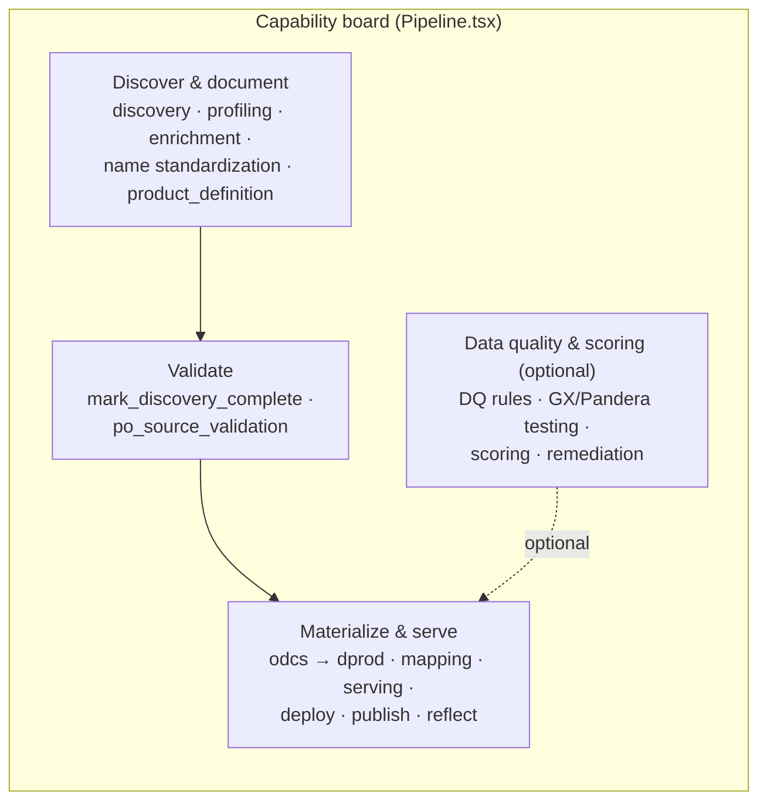

**Phases** (`CAPABILITY_PHASES`, lifecycle order):
- **Discover & document** — `select_data_source`, discovery/profiling (composite + load), `metadata_enrichment`, `source_naming_recommendations` / `column_name_standardization`, `product_definition`.
- **Validate** — `mark_discovery_complete`, `po_source_validation`.
- **Materialize & serve** — `initiate`, `odcs_specification`, `synthesize_odcs_from_graph`, `odcs_to_dprod`, `auto_mapping_sa`, `data_mapping`, `serving_virtual_view` / `serving_physical_copy`, `deploy_virtual_view`, `deployment_reflection`, `mark_engineering_complete`, `publish`, `reflect_on_reviews`.
- **Data quality & scoring** (`optional: true`) — DQ rule generation, GX/Pandera test generation + execution, scoring/rescore, remediation, `domain_rule_enhancement`, failure analysis.

`PHASE_BY_STAGE` flattens the granular per-workflow stages into these four buckets; `phaseOf(stageId)` defaults unknown stages to `materialize`.

**Full palette, freeform order.** Every addable capability shows as a card in its phase — including capabilities not yet on the board (drawn from the catalog and decomposed from bundled workflows so the palette shows per-capability granularity, one card per capability rather than one per bundled workflow). There is no separate "Add Workflow" step in the board flow; PO-only stages and already-added stages are filtered/deduped by `stage_id`. The engineer is free to run any runnable card in any order.

**Single recommended-next highlight.** Exactly one card across the whole board is flagged `RECOMMENDED` (`recommendedKey`, keyed by `stage_number` + `workflow_id`) — the first runnable step in lifecycle order. It renders with a blue border + glow. Running a card whose recommended-prior step isn't complete is still allowed, but surfaces a warning ("Ahead of the recommended order … the result may be thin") rather than disabling the button. This is the **show-recommended, run-freely** model: guidance without gating.

**Smart default focus.** On first load the board collapses phases whose every stage is already complete, and the optional Quality phase when nothing has been added, so it opens focused on what's actionable. After that, expand/collapse is manual.

For the SA flow the board still hides PO-only stages (`po_source_validation` via `PO_STAGE_IDS`) and renders a `blocked_on_po` amber **"Pending PO validation"** state on `synthesize_odcs_from_graph` until the PO gate clears (see [§5.5](#55-source-product-validation-dpe-sa)).

---

## 12. Materialization & Marketplace Subsystems

These subsystems are summarised here and detailed in the per-subsystem deep dives linked at the top of this document.

### 12.1 Dataset-level shaping (`:DatasetTransform`) + view-DDL

`:DatasetTransform` is the schema-level peer of the column-level transform DSL — one per `:DataContractSchema` (source of truth, survives `_generate_dprod`) plus a parallel read-side copy on `:DProdOutputDataset` (rebuilt every `_generate_dprod` via `DPROD_COPY_DATASET_TRANSFORM`). Its reserved fields have been locked since Phase 2; each phase activates more without a graph migration:

- **filter / dedupe** (`filterPredicate`, `dedupeJson`) — raw WHERE + ROW_NUMBER dedupe
- **grouping** (`groupingKeysJson` + column `aggregateFunction` / `groupingKey`) — activates the `grouped` CTE
- **joins** (`joinsJson`) — explicit FROM/JOIN graph; engineer-authored override bypasses FK inference per-run
- **SCD / suppressed** (`scdPolicyJson` — `latest_only` / `scd2` / `snapshot`; `suppressedColumnsJson`)
- **windows** (`windowSpecsJson` + column `transformKind='window'`)
- **dialect** — Phase 7 picker on `serving_virtual_view`: `PostgresDialect` / `SnowflakeDialect` / `DatabricksDialect` / `BigQueryDialect` / ANSI

The serving view (`data-serving-virtual-view`) renders as CTE layers (`base` → optional `deduped` → optional `grouped`) over either explicit `joinsJson` or an FK-inferred FROM. `_build_from_fk_inferred` walks `:REFERENCES` between mapped tables and BFS-discovers bridge tables; multiple shortest paths are ranked by name-similarity + PO-approved `:TableDescription.relationshipKind` (`general_membership` > `specialization`), with ties raising `_AmbiguousBridges`. History-shaped bridges are auto-wrapped with `ROW_NUMBER()`. Full reserved-field semantics, SCD lowering, and CTE assembly live in [`dataset-transform.md`](architecture/dataset-transform.md); the FK BFS, bridge ranker, and temporal wrapping in [`view-ddl-fk-bridges.md`](architecture/view-ddl-fk-bridges.md).

The per-view structured summary (`<output>.summary.json`) persists as `:ServingDefinition.summaryJson` and renders via `ServingWarningsCallout` on the engineer dashboard and the marketplace Serving tab.

**Serving modes (stable contract).** A product's serving path is discriminated by `:ServingDefinition.servingMode`. The two foundational modes below are stable; two further modes (`lakehouse` Parquet+DuckDB export and cross-platform `transfer`) have since been added — see CLAUDE.md → "Serving mode" for the current set and the uniform Configure → Build → Deploy lifecycle.

- **`virtual_view`** — a `CREATE OR REPLACE VIEW` deployed against the source Postgres (`serving_virtual_view` authors it; `deploy_virtual_view` deploys it via `routers/serving.py`). Always fresh, no history.
- **`dbt_materialized`** — a real dbt project scaffolded on the backend and built into physical tables (and dbt **snapshots** for SCD2 history) via `serving_physical_copy` (`routers/materialization.py`).

`serving_virtual_view` and `serving_physical_copy` are members of the `exclusive_group: "serving"` — at most one runs per product; switching goes through `POST /{project_id}/workflows/{workflow_id}/exclusive-group` (or the MCP `set_serving_mode` tool). Both modes share **one SQL core**: `generate_dbt_project.py` imports `generate_view_ddl` and reuses `generate_dbt_models()`, so the SELECT body is byte-identical between the view and the dbt model. Full deep-dive — verification gate, `MaterializationTarget`, no-secrets `profiles.yml` — in [`serving-materialized-dbt.md`](architecture/serving-materialized-dbt.md).

> **SQL-executor recovery:** Postgres' `CREATE OR REPLACE VIEW` can't change a column's type, drop columns, or rename — when schema authoring drifts a type, `sql_executor.py` matches the specific Postgres error patterns and opens a second transaction to `DROP VIEW IF EXISTS` (NON-CASCADE) then re-runs the DDL. NON-CASCADE is deliberate: dependents surface as a distinct `dependents_block_redeploy` error rather than getting silently dropped.

### 12.2 OSI readiness + Quality scoring

Two scoring models, both detailed in [`data-product-scoring.md`](architecture/data-product-scoring.md):

- **Quality scoring** (`data-scoring` skill) computes composite quality scores from the enriched graph (DCAT-2 + DQV + SHACL) and persists `:QualityScore` nodes per column / dataset / catalog, scored on weighted `:QualityDimension`s. The `grounding` dimension keys on approved DQ rules (see §5.8).
- **OSI readiness scoring** evaluates a producer-side semantic model and persists `:OsiEvaluation` (band, completeness, conformance) on the data product. Triggered from the wizard's Readiness Review step (manual pre-flight), from the marketplace **Score OSI now** button, and via `POST /api/projects/{id}/osi/evaluate`. The `data-product-osi-advisor` sub-skill emits narrative + Apply cards (`osi_metric_create`, `osi_relationship_create`, `osi_ai_context_set`).

### 12.3 Marketplace projection + consumer ingest

`/api/marketplace` + `/api/marketplace/detail` project published products, returning `product_kind` (`'source'` | `'aggregate'` | `'consumer'`), `consumes[]` / `consumed_by[]` cross-references via `:CONSUMES` (now multi-hop-capable), a lineage canvas (`MappingGraphView`), and Score-OSI + Deploy actions. Two load-bearing gotchas (detailed in [`marketplace.md`](architecture/marketplace.md)):

- The listing **pins to the latest deployed `:ContractVersion`** (`head(collect(cv_pub)) ORDER BY cv_pub.version DESC`, filtered to `lifecycleState IN ['published','superseded']`, falling back to `coalesce(cv_deployed, cv_cur)` on `dc.currentVersion`) — the old `lifecycleVersion`/`isCurrent` pin is gone. Otherwise in-flight draft versions leak into the consumer view.
- **dprod nodes are not versioned**, so `NewProductWizard.ensureProjectAndSaveSpec` skips `/generate-dprod` when hydrating an already-`published` **or** `approved` product.

**Consumer ODCS ingest** (`routers/ingest_products.py`, prefix `/api/ingest-products/`) is a parallel entry point to the wizard at `/product/ingest`: `parse-odcs`, `classify-archetype`, `match-inputs`, `drafts` (CRUD on `IngestDraft`), `from-odcs` (commit), `gap-analysis`. It invokes three programmatic-only skills (`data-product-archetype-classifier`, `data-product-gap-analyzer`, and the matcher) each with a deterministic heuristic fallback so the system stays usable when a skill isn't installed. The shared `ResolveAndBindSourcesStep` component is mounted by both the wizard (step 3 optional pre-selection + step 9 required confirm) and the ingest page. Full endpoint contracts and ranking thresholds in [`consumer-ingest.md`](architecture/consumer-ingest.md).

### 12.4 Semantic Layer & Semantic Q&A

A business-concept **semantic layer** sits over the deployed products and powers a natural-language **Semantic Q&A** chat (the renamed "Ask the marketplace"). Source of truth for evolving internals is CLAUDE.md; the shape:

- **3-tier concept model** (`business_concepts.py`) — `:BusinessConcept {level ∈ entity|attribute|value}`, linked `entity -[:HAS_ATTRIBUTE]-> attribute -[:HAS_VALUE]-> value`, with a polymorphic `:REPRESENTED_BY` (entity → `:DProdOutputDataset` table, attribute → `:DProdColumn`) and entity↔entity `:RELATES_TO {kind, via_column}` edges (the join graph). **Shared reference entities** (reserved `shared` domain — e.g. `Country`) are referenced cross-domain via `:RELATES_TO`, with `via_column` telling the SQL pass which column to filter.
- **Discovery sequence** (`semantic_discovery.py`) — the layer is built per domain in three ordered steps: **scaffold** (deterministic entities/attributes/values + bindings + FK relationships from tables/PKs/`relationshipKind`/`:REFERENCES`), **recommend** (the `business-concept-advisor` proposes cross-product concepts; proposals ≥ a confidence threshold auto-promote, bound + parented under the entity on their evidence dataset, the rest queue), and **enrich** (LLM names/definitions/synonyms incl. coded value labels like AU→Australia). `reset` soft-deprecates the domain for a clean rebuild. Each step records a `:SemanticDiscoveryRun` (status, last-run, source-fingerprint **staleness**, `upstream_rerun`); **stranded** concepts are surfaced, never auto-deleted. Endpoints: `GET/POST /api/semantic/discovery/{status,run,reset}` (+ legacy `entities/{scaffold,enrich}` + concept CRUD / relationships / `concepts/search` / `concepts/diagram` under `/api/semantic`). Steward UI: **Discovery** / **Concepts** / **Review Queue** tabs (`SemanticRecommenderPage`); also drivable over MCP (`*_semantic_discovery*` tools).
- **Local embeddings** (`embeddings.py`) — self-hosted `fastembed` (`bge-small-en-v1.5`, 384-dim, ONNX, no external API) stored on `:BusinessConcept.embedding` behind a Neo4j **vector index**; deprecated concepts have the vector stripped.
- **Retrieval + answer** (`marketplace_chat.py`) — two modes: **Full Context** (whole-domain concept dump) and **Concept-Guided** (decompose question → embedding vector-search → 1-hop neighbours → only the matched concepts). After SQL executes, a **two-phase synthesis** pass produces a grounded markdown answer + an optional Vega-Lite chart. Each response echoes `retrieval_mode` / `concepts_in_context` / `concepts_used` / per-question `token_usage`; the UI shows a self-explanatory retrieval badge + an **Explain trace** (decompose → match → resolve → generate_sql → execute). `marketplace_chat.answer_question` is the shared orchestration behind both the UI's `POST /api/marketplace/chat` and the MCP tool `query_semantic_layer` (§10).
- **Gap log** (`MarketplaceGap`) — when Semantic Q&A refuses, a "⚑ Report this gap" action logs it to a marketplace-level backlog (`/api/marketplace/gaps`, status open→triaged→resolved/dismissed + audience tag), surfaced in the Product Workbench **Gaps** tab.
- **LLM token accounting** (`llm_usage.py`, `:LlmUsageEvent`) — every LLM call (stages, chat, Semantic Q&A's 2–3 passes, advisors) writes a usage-ledger row; rollups at `/api/usage/{summary,by-project/{id},semantic-qa}` power a global card (Settings), a per-product strip (engineer dashboard), and per-question token figures in the Q&A panel. Headline = working tokens (uncached input + output); cache tracked separately. See CLAUDE.md → "LLM token accounting".

---

## 13. Project Directory Structure

```
projects/
└── dd-04142026-01/
    ├── workflow.json              # Workflow definition
    ├── data_discovery/            # Discovery YAML files
    │   ├── schema__table1.yaml
    │   └── schema__table2.yaml
    ├── data_profiling/            # Profiling YAML files
    │   ├── schema__table1__profile.yaml
    │   └── schema__table2__profile.yaml
    ├── cypher_scripts/            # Generated Cypher load scripts
    │   ├── catalog.cypher         # DCAT-2
    │   ├── dqv_profile.cypher     # DQV
    │   └── dq_rules.cypher        # SHACL
    ├── metadata/                  # Enrichment & mapping artifacts
    │   ├── column_context_*.json
    │   ├── column_descriptions_*.json
    │   ├── mapping_candidates_*.json
    │   └── mappings_*.json
    ├── remediation/               # Remediation reports
    │   └── analysis_report.md
    └── dq_tests_*/                # Test code and results
```

Each project directory is passed as `cwd` to the Claude Code SDK, isolating all artifacts. The naming convention is `{archetype_prefix}-MMDDYYYY-NN` where `NN` is a zero-padded sequence number for projects created on the same date.

---

## 14. Database Migration

SQLite's `CREATE TABLE IF NOT EXISTS` (via SQLModel's `create_all`) does not add columns to existing tables. The `_migrate()` function in `database.py` runs `ALTER TABLE` statements wrapped in try/except:

```python
migrations = [
    "ALTER TABLE project ADD COLUMN archetype TEXT DEFAULT 'dd'",
    "ALTER TABLE project ADD COLUMN workflow_json TEXT",
    "ALTER TABLE project ADD COLUMN domain TEXT",
    "ALTER TABLE project ADD COLUMN multi_workflow INTEGER DEFAULT 0",
    "ALTER TABLE project ADD COLUMN published_at TEXT",
    "ALTER TABLE stagerun ADD COLUMN workflow_id TEXT",
]
```

Each migration silently succeeds if the column already exists. This runs on every startup as part of the lifespan handler.

---

## 15. Backward Compatibility

Projects created before the multi-workflow system have:
- No `archetype` column → defaults to `"dd"`
- No `multi_workflow` flag → defaults to `False`
- No `domain` column → `None`
- `workflow_json` on the Project model (not on Workflow rows)
- Stage numbers matching the old global `STAGES` list

The system handles these gracefully:
- `_project_response()` falls back to the legacy `STAGES` list when `workflow_json` is None
- `_run_stage()` in the WebSocket handler falls back to `get_stage(number)` when workflow lookup fails
- `_check_review_complete()` searches by stage status rather than hardcoded stage numbers
- Frontend `canRunStage()` accepts both stage_id strings and legacy stage numbers
- `STAGE_ICONS` supports both number-based and stage_id-based lookup

---

## 16. Extension Points

| To add... | Modify... |
|-----------|-----------|
| New archetype | `ARCHETYPE_REGISTRY` + workflow templates in `archetypes.py` |
| New workflow group | Add to archetype's `_WORKFLOW_TEMPLATES` dict in `archetypes.py` |
| New stage | `STAGE_REGISTRY` in `archetypes.py`, add skill in `workbench-skills/skills/`, update `DEPENDENCY_GRAPH` |
| New review type | `STAGE_REGISTRY` entry with `has_review`/`review_type`, new review endpoints in `reviews.py`, new review panel component |
| New role | `ROLE_DESCRIPTIONS` in `dashboard.py`, `ROLE_STAGE_IDS`/`ROLE_REVIEW_TYPES`, frontend `ROLE_STAGE_PERMISSIONS_BY_ID`/`ROLE_REVIEW_PERMISSIONS` |
| New stat card | Count query + detail query in `summary.py`, card definition + column config in `ProjectDashboard.tsx` |
| New config field type | Add to `ConfigField.type` union, render logic in `Pipeline.tsx` |
| New scoring dimension | Add to `DIMENSIONS` in scoring skill, update `QualityDimension` MERGE queries |
| New ODCS template | Add YAML file to `playbook/odcs_templates/` |
| New domain rules | Add YAML file to `workbench-skills/skills/domain-rule-enhancement/reference/` |
| New chat suggested prompt | Add entry to the appropriate list in `workbench/frontend/src/components/chat/suggestedPrompts.ts` (keyed by `overview`, `stage:<id>`, or `review:<type>`) |
| New chat query pattern | Add a template to the query library in `workbench-skills/skills/project-chat-assistant/SKILL.md`; agent picks it up on next turn |
