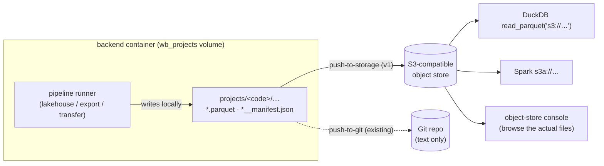
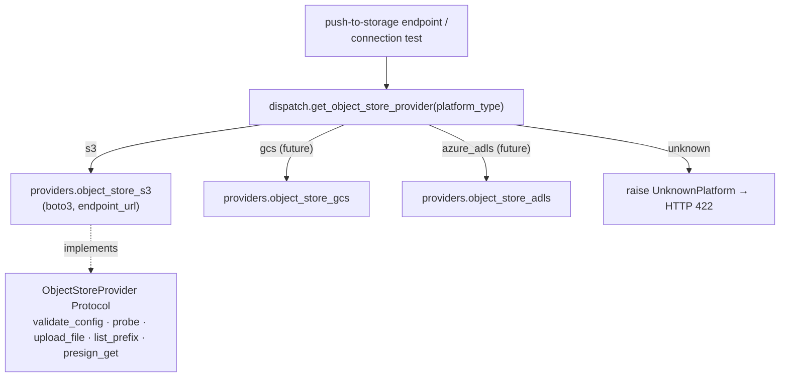

# Object storage — ADR-14 & subsystem design

> **Status:** Accepted · 2026-08-17 (spike-validated 2026-08-18) · supersedes the placeholder ADR-14 ("Lakehouse topology and authority") sketched in `research/2026-07-27-multi-platform-lakehouse-final-architecture-review.md §13`.
> **Referenced by:** `platform/manifests/{s3,gcs,azure_adls}.yaml` (each says *"Promotion to experimental requires … ADR-14 object-store topology decision"*).
> **Scope of this increment:** the topology + provider seam + the **publish** path (v1). Native `s3://` read/write inside the packaged runners is a later increment (see [Phasing](#phasing)).

---

## In one picture

A pipeline run today writes its data files (Parquet, a DuckDB catalog, TransferBatch manifests) to a folder inside the backend container. Git deliberately carries only *text* — the repo holds the recipe, not the groceries. So the actual data never leaves the box: a teammate can't open it, a BI tool can't read it, and there's nothing to point a demo at.

Object storage is the missing "groceries shelf." It's a bucket, reachable over the ubiquitous **S3 API**, that any tool can read from — DuckDB, Spark, pandas, a browser file-viewer. We publish the generated data artifacts there, keyed by project, exactly the way we already push the serving *package* to Git.



The Git push and the object-store push are **siblings**: same trigger surface, same "one repo/prefix per product" shape, complementary payloads (Git = text recipe; object store = binary data).

---

## Decisions

### D1 — The S3 API is the portability boundary; reuse the `s3` platform type

We commit to **S3-API compatibility**, not to any one vendor. Every serious data tool speaks S3 (`read_parquet('s3://…')`, `s3a://`, `s3fs`, `boto3`). The manifest `s3` already exists as a validated `platform_type`; we **reuse it** and add an `endpoint_url` to `extra_config` for non-AWS endpoints. No new `platform_type`, no enum to extend.

`gcs` and `azure_adls` manifests already sit beside `s3` (all three `adapterKind: object_store`, all capabilities `unsupported`). The provider interface is therefore **provider-agnostic**; S3 is simply the first concrete implementation, and GCS/Azure become future siblings behind the same Protocol.

### D2 — Reference dev fixture: SeaweedFS (not MinIO)

| Option | License | Container | S3 API | Status (2026-08) | Verdict |
|---|---|---|---|---|---|
| **SeaweedFS** | Apache-2.0 | single | full | actively maintained | **Chosen dev fixture** |
| RustFS | Apache-2.0 | single | full | beta | Candidate if its console UX matters — needs contract tests first |
| MinIO | **AGPLv3** | single | full | **OSS repo archived Apr 2026, source-only CE** | Rejected — license + archival risk |
| Ceph (RGW) | LGPL | multi (complex) | full | enterprise | Over-weight for this use |
| Localstack | Apache-2.0 | single | emulated | dev/test only | CI mock only, never real data |
| Garage | AGPL-3.0 | single | partial | growing | Same license concern as MinIO |

**What we certify is the S3 API contract, not the fixture.** The same provider code runs unchanged against AWS S3 in production; the fixture is a swappable local convenience. Contract tests (D8) run the provider against both SeaweedFS and a Localstack mock so a fixture swap can't silently break us.

### D3 — A new `ObjectStoreProvider` Protocol behind `platform/dispatch.py`

Since `cbd1fb6` ("Make Postgres a pure peer"), every per-platform capability resolves through one fail-closed lookup, `platform/dispatch.py` — five sibling getters (`get_connection_provider`, `get_discovery_provider`, `get_query_executor`, `get_deployment_provider`, `get_transfer_provider`), each a small `if/elif` over `canonical_platform(...)` with a **lazy** driver import, raising `UnknownPlatform` on an unknown platform and `ProviderUnavailable` on a known platform missing that provider *kind*.

Object storage joins as a **sixth resolver** and a **new duck-typed Protocol** in `platform/interfaces.py` (peer of the existing seven — `Protocol`, `@runtime_checkable`, no forced inheritance), reusing the existing `ValidationReport` / `CapabilityEvidence` dataclasses:



The concrete `providers/object_store_s3.py` sits beside `postgres.py` / `snowflake.py` / `parquet.py`, lazy-imports `boto3`, and honours `endpoint_url`. `probe()` uses **`head_bucket` + a small put/delete round-trip** — *not* `list_buckets`, which typically demands account-wide permission a scoped key won't have.

### D4 — Credential vending: connection owns creds, never `extra_config`

- Access-key ID → `PlatformConnection.username` (already exists, echoed safely).
- Secret → `PlatformConnection.secret_ref`, stored as `direct:<secret>` (literal) or `env:VAR` / `ssm:` / `asm:` (reference), **masked on read** by the existing `_normalize_stored_secret` / `_connection_row` logic in `routers/connections.py`. Never returned in an API response.
- **Never** put the secret in `extra_config` — that dict is echoed verbatim by the connection API.
- Production preference (per the `s3.yaml` note): IAM roles / instance profiles / Workload Identity over static keys; `secret_ref` should point at a role ARN or secrets-manager path. Static demo credentials are injected into the backend **environment**, not baked into a connection row.

### D5 — Single-writer authority

One certified writer per artifact prefix, always.

- **v1:** the backend's `POST /serving/push-to-storage` endpoint is the *sole* writer. It preserves the "package is the execution unit" boundary — the packaged `run.py` is **not** modified; publication is an explicit step layered on top of a finished local artifact.
- **Phase 5:** the packaged runners themselves become writers (writing `s3://` directly), but still one certified writer per artifact — no concurrent multi-writer to a single prefix.

### D6 — Transactional publish: immutable run-prefixes + a `latest.json` pointer

A publish is content-addressed by a `run_id` and the pointer flips **last**, so a reader never observes a half-written snapshot and retries are idempotent. One publish is a **whole-project snapshot** — all currently-generated artifacts under one `run_id`, grouped by producer (`lakehouse/`, `exports/`):

```
<project_prefix>/runs/<run_id>/lakehouse/<model>.parquet
<project_prefix>/runs/<run_id>/lakehouse/<model>__manifest.json
<project_prefix>/runs/<run_id>/exports/<schema>__<table>.parquet
<project_prefix>/runs/<run_id>/manifest.json       ← written AFTER all data objects
<project_prefix>/latest.json                        ← flipped to <run_id> LAST
```

Implemented in `object_store_publish.publish_project_artifacts` (`run_id = <UTC-timestamp>-<8hex>`); the artifact allowlist is `serving_package.collect_for_object_store`; each publish is audited in the `ArtifactPublishRun` SQLite table.

### D7 — Binding is separate from connection

`ProjectArtifactStoreBinding` (SQLite) owns *where this project publishes* — `connection_id` (FK to `PlatformConnection`), `bucket`, `project_prefix`, and an `auto_publish` policy flag (reserved; v1 is always explicit). This mirrors the `MaterializationTarget` "single connection contract" (FK to a registered connection, no inline DSN). The **connection** owns *how to reach the store* (endpoint, region, addressing, TLS, credentials); the **binding** owns *the namespace + policy*.

### D8 — Addressing, endpoints, and the conformance spike

- **Path-style** addressing for the fixture (`http://host:9000/<bucket>/<key>`); **virtual-hosted** for AWS. The provider selects per `endpoint_url`.
- **Internal vs public endpoint split:** the backend reaches the store on the container network (e.g. `seaweedfs:9000`), but a **presigned GET URL** handed to a browser must be signed for the *public* endpoint (e.g. `localhost:9000`). The connection records both; presigning uses the public one.
- Before Phase 3 hardens, a **conformance spike** proves: boto3 upload/list/presign, DuckDB `read_parquet('s3://…')` against the fixture, multipart upload for a large Parquet, and both addressing modes — with **contract tests** green against SeaweedFS *and* a Localstack mock.

### D9 — What we publish, and what we don't (v1)

Publication is an **explicit allowlist** (`collect_for_object_store()`), never a recursive upload of `projects/<code>/`:

| Publish (v1) | Hold back | Why held back |
|---|---|---|
| `exports/*.parquet` + paired `*__manifest.json` | `catalog.duckdb` | embeds local `file://` view paths → broken if downloaded; fixed in Phase 5 (rebuild with `s3://`) |
| `serving/lakehouse/data/*.parquet` + paired manifests | `.dlt/` pipeline state | internal, not consumer-facing |
|  | `dq_tests_*/results/` | possibly sensitive; not an artifact in v1 |
|  | any other `.db` / `.sqlite` / `.zip` | avoid publishing unrelated/DB files |

### D10 — Transfer runner: reachability-gated staging (Phase 5, first mover)

**The trap.** A cross-platform transfer (e.g. MySQL → Databricks) uses dlt to extract shaped rows, write them as Parquet, and bulk-load the target. The obvious "native S3" move is `dlt.pipeline(staging=filesystem("s3://…"))` so the warehouse `COPY INTO`s from the bucket. **This cannot work against the embedded fixture**, for two independent, non-negotiable reasons:

1. **`COPY INTO … FROM 's3://…'` is the *warehouse* reading the object store.** A cloud Databricks/Snowflake cannot open a socket to a host-local SeaweedFS (`seaweedfs:8333` / `localhost:9000`).
2. **STS.** dlt's warehouse destinations mint AWS STS `GetSessionToken` creds to hand the warehouse for the read. SeaweedFS has no STS endpoint → `InvalidClientTokenId`.

So native S3 staging → a cloud warehouse is only valid against a **warehouse-reachable** bucket (real AWS / ADLS / GCS). The fix is to **decouple the browsable artifact from the warehouse's staging**.

**The gate.** The backend (`transfer_execution._s3_staging_env`) picks a mode per run and signals the runner via `WB_S3_MODE`:

| | Store is warehouse-reachable (AWS host sentinel, or `extra_config.warehouse_reachable`) | Store is NOT reachable (embedded fixture / anything ambiguous) |
|---|---|---|
| **Warehouse target** (databricks/snowflake) | `WB_S3_MODE=staging` — native dlt S3 staging; warehouse `COPY INTO`s from the bucket. Staged files **are** the artifact. No container-disk intermediate at scale. | `WB_S3_MODE=artifact` — load via the warehouse's own managed volume/stage (the pre-Phase-5 path); the **runner** separately PUTs the shaped Parquet to the store. |
| **Relational target** (postgres/mysql) | `WB_S3_MODE=artifact` — direct bulk load; the runner PUTs the Parquet artifact. (Filesystem "staging" isn't a meaningful COPY source here.) | same — direct load + runner-written artifact. |

`artifact` is the **fail-safe default** (also for standalone downloaded packages): the runner writes the Parquet itself, which never needs STS or warehouse reachability. **No binding at all → no `WB_S3_*` → the runner behaves exactly as before.**

**Why this is honest about the fixture.** The **S3-write code path is byte-identical** local vs. prod (same `dlt.destinations.filesystem` + boto3 helpers) — SeaweedFS proves the production code; AWS is an endpoint+credentials swap. The **load** mechanism necessarily differs (a cloud warehouse can't read a local store), which is inherent, not a code smell. The embedded fixture's genuine roles: (a) exercise the exact production write path, (b) hold a browsable artifact, and (c) be a live source for *local* engines (DuckDB `read_parquet('s3://…')`, Spark `s3a://`) — **not** a cloud-warehouse stage.

---

## Conformance spike — validated 2026-08-18

The spike (D8) ran the full provider contract against the live SeaweedFS `4.42` fixture (`docker compose --profile storage up seaweedfs`) and **passed every check**:

| Check | Result |
|---|---|
| `create_bucket` / `head_bucket` (the D3 probe) | ok — bucket persists across container recreate |
| `upload_file` → `s3://data-workbench/…/orders.parquet` | ok |
| `list_objects_v2(Prefix=…)` | ok |
| `generate_presigned_url("get_object")` + HTTP GET | ok — byte-exact |
| DuckDB `read_parquet('s3://…')` (1000 rows) | ok |

Settled conventions (now baked into Phase 3):
- **boto3 client:** `endpoint_url=<internal or public>`, `Config(s3={"addressing_style":"path"}, signature_version="s3v4")`, `region_name="us-east-1"`.
- **DuckDB read:** `INSTALL/LOAD httpfs; SET s3_endpoint='host:9000'; SET s3_url_style='path'; SET s3_use_ssl=false;` + key/secret.
- **Fixture networking gotcha:** SeaweedFS binds its *advertised* interface, not loopback — the container needs `-ip.bind=0.0.0.0` for the healthcheck (and any in-container client) to reach it on `localhost`. The S3 gateway's `GET /status` returns 200 and is the health signal.

---

## Phasing

| Phase | Deliverable | Boundary held |
|---|---|---|
| 1 | **This ADR** + conformance spike | decision gate |
| 2 | SeaweedFS fixture: `--profile storage` in compose, `cli/compose.py` forwarding, dev `s3.json`, reset semantics | infra only |
| 3 | `ObjectStoreProvider` Protocol + `get_object_store_provider` resolver + `providers/object_store_s3.py` + `ProjectArtifactStoreBinding` + connection-test wiring + `ConnectionsPage.tsx` form | provider + binding |
| 4 | `collect_for_object_store()` + `POST /serving/push-to-storage` (run-prefix protocol, `latest.json`) + `ArtifactPublishRun` audit + MCP `push_to_object_store` + UI button | **publish model** — runners untouched |
| 5 (separate ADR) | Native `s3://` **read+write** in the runners (`run_lakehouse` / `export_table` / `run_transfer`; `data-profile-parquet` reads `s3://`) **and regenerated package READMEs / documenter skills** | topology change |

The v1↔Phase-5 line is the load-bearing one: **v1 is a publish channel that leaves the runners writing locally; Phase 5 makes object store the runners' native I/O substrate and rewrites their embedded docs to match.** Doing Phase 5 before the provider/fixture/binding are proven would mean rewiring runners against an unvalidated seam — hence the split.

---

## Consequences

**Positive** — vendor-neutral (S3 API, not a vendor); provider-agnostic (GCS/Azure slot in behind the same Protocol); fail-closed and credential-safe by construction (reuses `dispatch` + `_normalize_stored_secret`); genuinely demoable (browse real files in a console; Spark/DuckDB read the same objects); the Git-push pattern is proven and directly mirrored.

**Negative / costs** — a new optional dependency (`boto3`); a second stateful dev service; the internal/public endpoint split is a real config knob (a mis-signed presign fails opaquely); SeaweedFS S3 edge-cases must be pinned by contract tests; `catalog.duckdb` portability is deferred to Phase 5.

**Rejected alternatives** — MinIO (AGPLv3 + archived OSS repo); Ceph (operational weight); Localstack as the real store (dev/test only); binaries in Git (wrong tool — repos hold recipes, not data); a bespoke non-S3 API (re-introduces the lock-in we're avoiding).

---

## Open questions (to resolve during Phase 3–4)

- Retention/GC of old `runs/<run_id>/` prefixes — TTL policy vs. keep-N-latest (leans on bucket lifecycle rules where available).
- Whether `auto_publish` (fire after a successful `deploy_lakehouse`, like git `_maybe_auto_push`) lands in Phase 4 or waits for Phase 5.
- Server-side encryption / bucket-policy defaults for the production (non-fixture) path.
