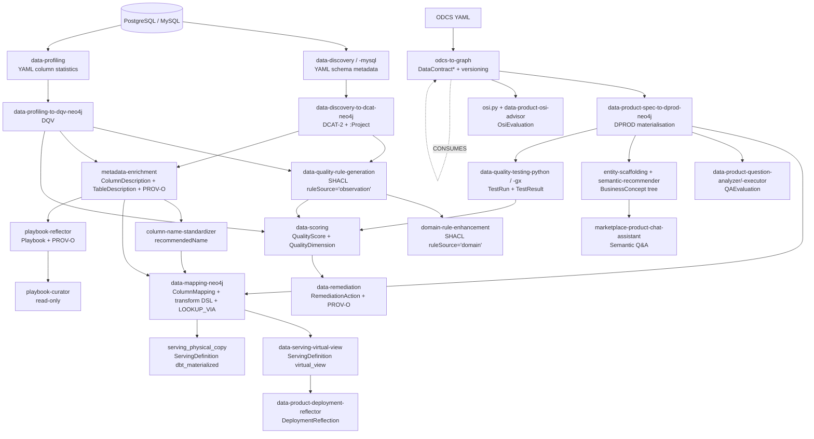
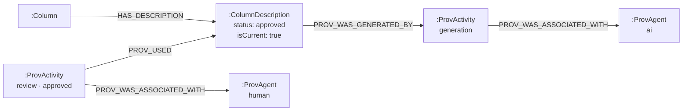
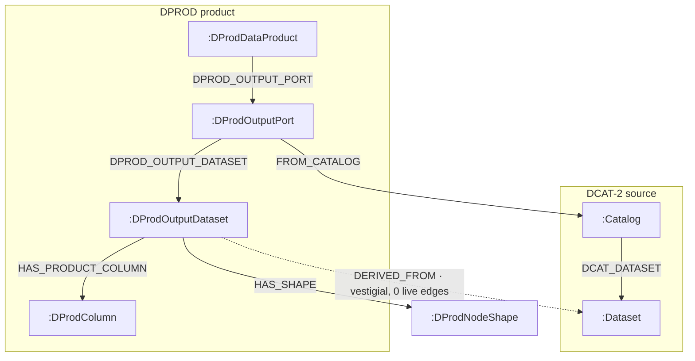
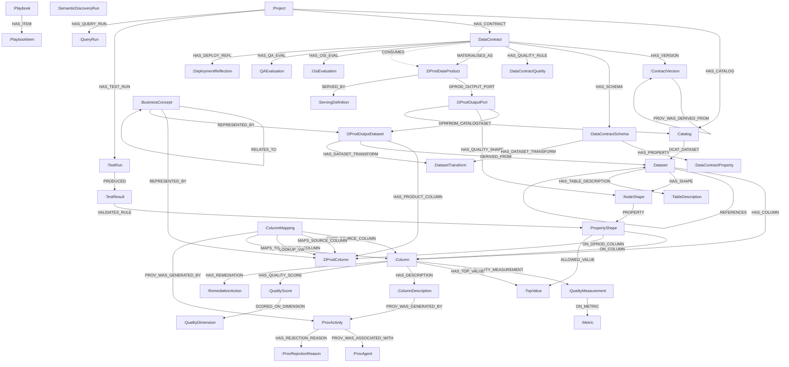

# Ontologies & Graph-Schema Reference

This document is the cross-cutting inventory of **every node label, relationship, property, and enum** in the Data Workbench Neo4j knowledge graph — which ontology each layer adapts, how it is lowered into a property graph, and which skills produce or consume it.

> **Source-of-truth note.** `CLAUDE.md` is canonical for evolving internals (stage registry, query semantics, Cypher gotchas) and the per-subsystem deep dives under `docs/architecture/` own the *behaviour* of each layer. This file owns the *shape* — the schema — and defers to those when they disagree. Per-layer deep dives are cross-linked inline.

The graph is **project-scoped**: every operational node carries the owning project's code in its URI, and product-graph nodes use a `{project_code}-contract` prefix so they stay globally referenceable while still tenant-tagged. See [Project scoping & URIs](#project-scoping--uris) below.

---

## What is *not* in the graph (SQLite / SQLModel)

A large part of the system's state lives in **SQLite via SQLModel**, *not* Neo4j. These are operational/control-plane tables and must **not** be modelled as graph nodes:

`Project` · `AppUser` (auth accounts) · `AppSettings` · `Workflow` · `StageRun` · `StageExecution` · `DQTestRun` · `ProductRequest` · `IngestDraft` · `MarketplaceGap` · `MaterializationTarget` · `LlmUsageEvent` (the token ledger) · `MigrationPlanRow` (dmig migration plan) · `PlatformConnection` / `ExecutionProfile` / `SourceBinding` (multi-platform source registry) · `ChatSession` / `ChatMessage` · `ProductChatSession` / `ProductChatMessage` · `SemanticChatSession` / `SemanticChatMessage` (conversational Semantic Q&A session memory).

The `:Project` graph node is a thin root for graph scoping (see below); the rich project metadata (archetype, domain, connection config, owner, product idea) lives on the SQLModel `Project` row. The token-usage ledger (`LlmUsageEvent`) and the per-product dbt target (`MaterializationTarget`) are SQLite-only — they are referenced here only to mark the boundary. The `dmig` (data-migration) subsystem is project-keyed and disjoint from the `:DataContract` / `:DProdDataProduct` world; its lifecycle lives in the SQLite `MigrationPlanRow` + on-disk artifacts. **Its ONE graph write** (Part A): a reconciled migration materializes its target as `:Dataset:MigrationTarget` nodes on the **isolated** `(:Project)-[:HAS_MIGRATION_TARGET]->` path — deliberately NOT under `HAS_CATALOG` so the source-dataset queries never see targets — with `(:Dataset{source})-[:MIGRATED_TO]->(:Dataset:MigrationTarget)` lineage and `(:Dataset:MigrationTarget)-[:HAS_COLUMN]->(:Column)` (columns `verified:true` when introspected from the target after load, else source-mirrored `verified:false`). The `cmig` (code-migration) subsystem writes a single `:CodeModule` node (URI `codemodule:{project_code}`, code text NEVER stored on it) linked `(:Project)-[:HAS_CODE_MODULE]->(:CodeModule)` and, on spec approval, the cross-project `:USES_DATASET` edge to the linked dmig's `:Dataset` nodes (§8b). The multi-platform source registry (`PlatformConnection` / `ExecutionProfile` / `SourceBinding`) is likewise SQLite-only.

---

## Project scoping & URIs

| Layer | URI pattern | Example |
|---|---|---|
| Catalog (operational) | `catalog:{project_code}:{schema}` | `catalog:hr-06202026-01:public` |
| Dataset (operational) | `dataset:{project_code}:{schema}.{table}` | `dataset:hr-06202026-01:public.employees` |
| Column (operational) | `column:{project_code}:{schema}.{table}.{col}` | `column:hr-06202026-01:public.employees.id` |
| Product root | `dprod:{project_code}-contract` | `dprod:hr-06202026-01-contract` |
| Output dataset | `dprod:ds:{project_code}-contract:{physical}` | — |
| Product column | `dprod:col:{project_code}-contract:{schema}:{col}` | — |
| Contract | `{project_code}-contract` (the `:DataContract.id`) | `hr-06202026-01-contract` |

The `:Project {projectCode}` node is the scoping root:

```
(:Project {projectCode})
   -[:HAS_CATALOG]->(:Catalog)
   -[:HAS_CONTRACT]->(:DataContract {id: '{project_code}-contract'})
   -[:HAS_TEST_RUN]->(:TestRun)
   -[:HAS_VERSION]->(:ContractVersion)      // on the contract
```

**`:CONSUMES` is the only relationship allowed to cross project boundaries** (consumer product → another project's published source product). Everything else is project-scoped via the URI prefix. Chat/MCP agents enforce isolation at the `run_cypher.py` choke point: any query whose text *and* params don't both reference the project code is rejected.

---

## Pipeline overview



---

## 1. DCAT-2 — Data Catalog Vocabulary

**Standard:** [W3C DCAT-2](https://www.w3.org/TR/vocab-dcat-2/) · **Skill:** `data-discovery-to-dcat-neo4j` · **Prefixes:** `catalog:`, `dataset:`, `column:`

Maps PostgreSQL/MySQL schema discovery into a catalog graph. DCAT-2 models datasets/distributions at the file/service level and has no column concept — `:Column` is a custom first-class extension so column-level quality, rules, descriptions and mappings can attach.

### Nodes

| DCAT-2 concept | Label | URI pattern | Key properties |
|---|---|---|---|
| *(multi-tenant root)* | `:Project` | *(keyed by `projectCode`, no URI)* | `projectCode`, `name`, `domain` |
| `dcat:Catalog` | `:Catalog` | `catalog:{code}:{schema}` | `uri`, `name`, `dcatType` |
| `dcat:Dataset` | `:Dataset` | `dataset:{code}:{schema}.{table}` | `uri`, `name`, `searchName`, `schema`, `dcatType`, (post-profiling) `row_count`, `sample_size`, `profiled_at` |
| *(custom)* | `:Column` | `column:{code}:{schema}.{table}.{col}` | `uri`, `name`, `searchName`, `dataType`, `nullable`, `primaryKey`, `ordinal`, (post-naming) `recommendedName` + naming `status` |

### Relationships

| Relationship | From → To | Properties |
|---|---|---|
| `[:HAS_CATALOG]` | `:Project` → `:Catalog` | scoping root |
| `[:HAS_CONTRACT]` | `:Project` → `:DataContract` | project owns its contract(s) |
| `[:HAS_TEST_RUN]` | `:Project` → `:TestRun` | project owns DQ test runs |
| `[:DCAT_DATASET]` | `:Catalog` → `:Dataset` | — |
| `[:HAS_COLUMN]` | `:Dataset` → `:Column` | — |
| `[:REFERENCES]` | `:Dataset` → `:Dataset` | `constraintName`, `columns`, `referencedColumns`, `onDelete`, `onUpdate` — FK edges; drive serving-view join inference |
| `[:FK_REFERENCES]` | `:Column` → `:Column` | `constraintName` — the **column-grain** peer of the dataset-grain `[:REFERENCES]`: one edge per FK column → referenced PK column pair. Written alongside `[:REFERENCES]` by `data-discovery-to-dcat-neo4j`'s `generate_cypher.py` so an ERD viewer can route an edge between the specific participating columns. |

**Custom extensions:** `:Column` (no DCAT column concept); `dcatType` string on every node (annotates the ontology class, since Neo4j is not an RDF store).

> **`searchName` (normalized identity, additive).** `:Dataset`, `:Column` and `:DProdColumn` carry `searchName = toLower(name)` alongside the case-preserving `name`. It exists so name-based *resolution* (the free-text lookup reference table/column an engineer or the mapping LLM authors) is case-insensitive **without** merging distinct-case identifiers or altering any URI — the exact physical identifier stays the stable URI identity, and unquoted identifiers are the supported convention. Written on create by the discovery loader (`generate_cypher.py`, `ON CREATE SET`) and the dprod builder (`odcs.py`/`odcs-to-graph`, plain `SET`); a one-time `scripts/backfill_search_name.py` populates pre-existing nodes. The lookup-resolution reads (`data-mapping-neo4j/write_mappings.py` + its backend twin `lookup_via.py`) match on `coalesce(searchName, toLower(name))`, so an un-backfilled graph still resolves. *Catalog-aware URIs (a `{database}` segment for cross-database collisions) are a separately-scoped follow-up — not needed under the one-connection-per-project model and not yet implemented.*

---

## 2. DQV — Data Quality Vocabulary

**Standard:** [W3C DQV](https://www.w3.org/TR/vocab-dqv/) · **Skill:** `data-profiling-to-dqv-neo4j` · **Prefix:** `metric:`

Attaches measured column statistics to the DCAT graph. `:TopValue` is a custom addition — DQV measures quality but doesn't model value distributions.

| DQV concept | Label | URI | Key properties |
|---|---|---|---|
| `dqv:Metric` | `:Metric` | `metric:{name}` | `uri`, `name`, `dcatType` |
| `dqv:QualityMeasurement` | `:QualityMeasurement` | *(inline)* | `value`, `dcatType` |
| *(custom)* | `:TopValue` | *(inline)* | `value`, `count`, `frequency` |

**Metrics:** `null_count`, `null_rate`, `distinct_count`, `min`, `max`, `mean`, `stddev`, `percentile_25/50/75`, `min_length`, `max_length`, `avg_length`.

| Relationship | From → To | Notes |
|---|---|---|
| `[:HAS_QUALITY_MEASUREMENT]` | `:Column` → `:QualityMeasurement` | one per column-metric pair |
| `[:ON_METRIC]` | `:QualityMeasurement` → `:Metric` | shared metric definition |
| `[:HAS_TOP_VALUE]` | `:Column` → `:TopValue` | custom |

---

## 3. SHACL-inspired — Data Quality Rules (four-source model)

**Standard:** [W3C SHACL](https://www.w3.org/TR/shacl/) *(adapted; property-graph nodes, not RDF triples)* · **Skills:** `data-quality-rule-generation` (`observation`), `domain-rule-enhancement` (`domain`), `product-authoring-assistant` (`user`), `odcs.py:_materialise_spec_rules` (`spec`) · **Prefixes:** `shape:`, `rule:`

Rules carry a `ruleSource` (origin) and a `status` (review state). Only `approved` rules feed the marketplace Quality tab, DQ test generation, and the scoring **Grounding** dimension.

### The four sources — and their **anchoring split**

| `ruleSource` | Origin | Default `status` | Producer | **Anchors to** |
|---|---|---|---|---|
| `observation` | Profiling evidence (null rate, range, uniqueness, top-value coverage, FK) | `pending_review` | `data-quality-rule-generation` | `:Column` via `[:ON_COLUMN]` |
| `domain` | `playbook/domain_catalogs/{domain}.yaml` + LLM guidance | `pending_review` (API) / `approved` (wizard-accepted) | `domain-rule-enhancement` | `:DProdColumn` via `[:ON_DPROD_COLUMN]` |
| `user` | PO-authored in the wizard (`rule_create`) | `approved` on PO commit | `product-authoring-assistant` | `:DProdColumn` via `[:ON_DPROD_COLUMN]` |
| `spec` | Embedded in ingested ODCS `quality[]` | `approved` | `_materialise_spec_rules` inside `_generate_dprod` | `:DProdColumn` via `[:ON_DPROD_COLUMN]` |

> **`external` is retired.** Older versions had a fifth `external` source; it no longer exists in code. The four current sources are `observation` / `domain` / `user` / `spec`.

> **Anchoring is load-bearing.** `observation` rules anchor to the catalog `:Column` and survive `DPROD_WIPE`. `domain`/`user`/`spec` rules anchor to the product `:DProdColumn`; on a dprod rebuild they are cached by `priorColumnUri` and reconnected via `_RECONNECT_RULES_BY_COLUMN_URI`.

> **`spec` dual-encoding.** Each ingested spec rule lives **twice**: as a `:DataContractQuality` node (verbatim severity) *and* as a `:PropertyShape {ruleSource='spec', status='approved'}` on the `:DProdColumn` (severity translated to `sh:Violation`/`sh:Warning`, `confidence: 1.0`, `ruleTarget: 'dprod-column'`). The marketplace `PRODUCT_DETAIL` query deliberately **excludes** the `spec` PropertyShape (`WHERE ps.ruleSource <> 'spec'`) so consumers see each rule once; engineer-facing surfaces see both copies.

### Nodes

| SHACL concept | Label | URI | Key properties |
|---|---|---|---|
| `sh:NodeShape` (catalog) | `:NodeShape` | `shape:{schema}.{table}` | `uri`, `name`, `schema`, `dcatType` |
| `sh:NodeShape` (product) | `:DProdNodeShape` | `shape:` + the `:DProdOutputDataset` URI (`shape:dprod:ds:{code}-contract:{physical}`) | `uri` — the product-side shape grouping `domain`/`user`/`spec` rules for one output dataset |
| `sh:PropertyShape` | `:PropertyShape` | catalog: `rule:{schema}.{table}.{col}.{ruleType}` · product: `rule:{code}:{dprod\|user\|spec}:{physical}:{col}:{ruleType}:{i}` | `uri`, `ruleType`, `path`, `severity`, `confidence`, `description`, `ruleSource`, `status`, `ruleTarget`, `domainRuleRef`, `dimension`, `businessImpact` + rule-specific evidence |

### Rule types & severity

| `ruleType` | Severity | Derived from | Evidence properties |
|---|---|---|---|
| `mandatory` | `sh:Violation` | `null_rate = 0` AND `nullable = false` | `evidenceNullRate` |
| `range` | `sh:Warning` | numeric/date min/max | `minInclusive`, `maxInclusive`, `evidenceMin/Max` |
| `unique` | `sh:Violation` (PK) / `sh:Warning` (non-PK) | `distinct/row ≥ 0.99` | `uniquenessRatio`, `uniquenessThreshold`, `evidenceDistinctCount`, `evidenceRowCount` |
| `allowedValues` | `sh:Violation` | top values cover ≥ 95% | `coverage`, `coverageThreshold`, `evidenceValueCount` |
| `referentialIntegrity` | `sh:Violation` | FK constraint on column | `referencedDataset`, `referencedColumn`, `constraintName` |

`sh:Violation` → test severity `critical`; `sh:Warning` → `warning`. Domain/user rules read severity from their source (YAML/PO selection), default `sh:Warning`.

### Relationships

| Relationship | From → To | Notes |
|---|---|---|
| `[:HAS_SHAPE]` (catalog) | `:Dataset` → `:NodeShape` | one catalog shape per table (`observation` rules) |
| `[:HAS_SHAPE]` (product) | `:DProdOutputDataset` → `:DProdNodeShape` | one product shape per output dataset (`domain`/`user`/`spec` rules). **Keyed by URI**, so it survives `DPROD_WIPE` (which deletes the `:DProdOutputDataset` but not the shape) and is re-attached on rebuild by `_RECONNECT_SHAPES_BY_DATASET`. Authoring MERGEs the shape node by URI *then* the edge — never a path-MERGE from a freshly-created dataset, which would create a duplicate shape every rebuild (`graph_integrity.check_graph_integrity` flags any surplus as `dprod_nodeshape_without_dataset` / `duplicate_uri`). |
| `[:PROPERTY]` | `:NodeShape` \| `:DProdNodeShape` → `:PropertyShape` | one per rule |
| `[:ON_COLUMN]` | `:PropertyShape` → `:Column` | `observation` rules (catalog-anchored; survive `DPROD_WIPE`) |
| `[:ON_DPROD_COLUMN]` | `:PropertyShape` → `:DProdColumn` | `domain` / `user` / `spec` rules (product-anchored; re-attached on rebuild by `priorColumnUri` capture + `_RECONNECT_RULES_BY_COLUMN_URI`, with `_RECONNECT_ORPHANED_RULES_BY_URI` as the deterministic URI-derived fallback) |
| `[:REFERENCES_DATASET]` | `:PropertyShape` → `:Dataset` | FK rule target |
| `[:ALLOWED_VALUE]` | `:PropertyShape` → `:TopValue` | observed allowed values |

**Custom additions to SHACL:** `:DProdNodeShape` (the product-side node-shape peer of catalog `:NodeShape`); `confidence`, `ruleType`, `ruleSource`, `status`, `ruleTarget`, `domainRuleRef`, `[:ALLOWED_VALUE]`.

---

## 4. Metadata Enrichment — Column & Table descriptions

**Standard:** Custom + PROV-O (§8) · **Skill:** `metadata-enrichment` · **Prefixes:** `description:`, `table_description:`

### 4a. Column descriptions

Claude writes a `:ColumnDescription` from all graph context (column metadata, siblings, DQ rules, profiling, top values, FK) at `status: pending_review`. The *absence* of `[:HAS_DESCRIPTION]` is the processing signal.

| Label | URI | Key properties |
|---|---|---|
| `:ColumnDescription` | `description:{schema}.{table}.{col}:{timestamp}` | `uri`, `text`, `status` (`pending_review`→`approved`/`rejected`), `isCurrent` |

`[:HAS_DESCRIPTION]` : `:Column → :ColumnDescription` (all versions; `isCurrent: true` is the active one). Exactly one current per column.

### 4b. Table descriptions (`:TableDescription`)

Sibling of `:ColumnDescription`, written by `metadata-enrichment`'s `write_table_descriptions.py`. Carries a **`relationshipKind`** classification that drives the consumer-side serving-view bridge ranker and entity scaffolding. Attached via a **distinct** relationship (`[:HAS_TABLE_DESCRIPTION]`, not `[:HAS_DESCRIPTION]`) to keep queries unambiguous.

| Label | URI | Key properties |
|---|---|---|
| `:TableDescription` | `table_description:{bare_uri}:{timestamp}` | `uri`, `text`, `relationshipKind`, `status`, `isCurrent`, `createdAt` |

`[:HAS_TABLE_DESCRIPTION]` : `:Dataset → :TableDescription`.

**`relationshipKind` ∈** `fact` · `lookup_dimension` · `general_membership` · `specialization` · `audit_log` · `configuration` · `unknown`. The PO approves text + kind in the SA validation gate's **Tables** tab; on `_generate_dprod` the approved values propagate to `:DProdOutputDataset.description` / `.relationshipKind` (so `generate_view_ddl.py`'s bridge ranker reads them without joining back to the contract — `general_membership` outranks `specialization`; `audit_log`/`configuration` are excluded from entity-scaffolding candidates).

### 4c. Relationship descriptions (`:RelationshipDescription`)

Third enrichment sibling, written by `metadata-enrichment`'s `write_relationship_descriptions.py` — a natural-language description of one FK edge (why table A references table B). Distinct from column/table descriptions: it **hangs off the FROM `:Dataset`** and **points at the TO `:Dataset`**, so it describes a `[:REFERENCES]` edge rather than a single node. The PO reviews it in the SA validation gate's **Relationships** tab.

| Label | URI | Key properties |
|---|---|---|
| `:RelationshipDescription` | `relationship_description:{from__to slug}:{timestamp}` | `uri`, `text`, `relationshipNature`, `fromDatasetUri`, `toDatasetUri`, `status`, `isCurrent`, `createdAt` |

`[:HAS_RELATIONSHIP_DESCRIPTION]` : `:Dataset` (FROM) `→ :RelationshipDescription`.
`[:DESCRIBES_REFERENCE_TO]` : `:RelationshipDescription → :Dataset` (TO).

---

## 5. PROV-O — Provenance

**Standard:** [W3C PROV-O](https://www.w3.org/TR/prov-o/) · **Skills:** `metadata-enrichment`, `data-mapping-neo4j`, `data-remediation`, review handlers · **Prefix:** `prov:`

Records origin and review history of descriptions, mappings, table descriptions, domain-rule decisions, and remediations.

| PROV-O concept | Label | URI | Key properties |
|---|---|---|---|
| `prov:Entity` | *(the reviewed node)* | — | `:ColumnDescription` / `:ColumnMapping` / `:TableDescription` / `:PropertyShape` … |
| `prov:Activity` | `:ProvActivity` | `prov:activity:…:{timestamp}` | `uri`, `activityType`, `outcome`, `occurredAt`, (transform edits) `priorKind/Expression/Inputs/Params/Decorators` + `new*` |
| `prov:Agent` | `:ProvAgent` | `prov:agent:ai:{skill}` / `prov:agent:human:{name}` | `uri`, `agentType` (`ai`/`human`), `name` |
| *(custom)* | `:ProvRejectionReason` | `prov:reason:…:{timestamp}` | `uri`, `category`, `detail` |

### `activityType` / `outcome`

| `activityType` | `outcome` | Skill / surface |
|---|---|---|
| `generation` | — | description/table-description created |
| `review` | `approved` / `rejected` | description review |
| `mapping_generation` | — | mapping created |
| `transformation_authoring` | — / `replaced` | engineer edits a mapping's transform |
| `mapping_review` | `approved` / `rejected` | mapping approve/reject |
| `transformation_escalation` | — | escalate mapping to Steward |
| `mapping_source_rebound` | — | source URIs swapped (e.g. auto-reconnect on rename) |
| `mapping_wipe` | `superseded` | bulk "Start over" soft-delete |
| `remediation_apply` | — | applied data fix |
| `playbook_curation` | — | playbook reflector |

### Rejection categories

**Descriptions:** `incorrect_meaning`, `too_vague`, `too_specific`, `incorrect_constraint`, `incorrect_values`, `incorrect_fk_reference`, `other`.
**Mappings:** `edited_default`, `incorrect_mapping`, `incomplete_transformation`, `wrong_target_column`, `too_low_confidence`, `no_match_exists`, `duplicate_mapping`, `other`.

### Relationships

| Relationship | From → To | PROV-O |
|---|---|---|
| `[:PROV_WAS_GENERATED_BY]` | entity → `:ProvActivity` | `prov:wasGeneratedBy` |
| `[:PROV_WAS_ASSOCIATED_WITH]` | `:ProvActivity` → `:ProvAgent` | `prov:wasAssociatedWith` |
| `[:PROV_WAS_DERIVED_FROM]` | entity → prior entity | `prov:wasDerivedFrom` |
| `[:PROV_USED]` | `:ProvActivity` → reviewed entity | `prov:used` |
| `[:HAS_REJECTION_REASON]` | `:ProvActivity` → `:ProvRejectionReason` | *(custom)* |
| `[:PROV_INFORMED_BY]` | `:ProvActivity` → `:ProvActivity` | playbook curation ← review activities |



---

## 6. Column Mapping & the Transform DSL

**Standard:** Custom + PROV-O · **Skill:** `data-mapping-neo4j` (`--source-mode {catalog,dprod}`) · **Prefix:** `mapping:`

A `:ColumnMapping` records how a source column becomes a target `:DProdColumn`, carrying a **structured transform DSL** (not a free-text SQL expression). It is **dual-source**: the source is either a catalog `:Column` (source-aligned) or another product's `:DProdColumn` (consumer-aligned), both via `[:MAPS_SOURCE_COLUMN]`.

> The legacy `mappingType: direct|derived` + `transformExpression`-only model is superseded. `transformKind` + `transformParams` is authoritative; `transformExpression` survives as the compiled SQL fragment.

### `:ColumnMapping` properties

| Property | Values / notes |
|---|---|
| `uri` | `mapping:{code}:{src_bare}::{tgt_bare}` (multi-source adds `+{hash8}`); literal: `mapping:{code}:literal:{tgt_bare}` |
| `status` | `pending_review` · `approved` · `rejected` · `steward_review` · `superseded` |
| `isCurrent` | exactly one current per target `:DProdColumn` |
| `transformKind` | `direct` · `cast` · `format` · `concat` · `split` · `substring` · `case` · `arithmetic` · `lookup` · `literal` · `expression` · `bucket` · `mask` · `hash` · `window` |
| `transformAuthor` | `po_hint` · `steward_catalog` · `engineer` · `ai_suggestion` (priority: hint → catalog → engineer → AI) |
| `transformInputs` | JSON array of source column URIs the expression references (ordered) |
| `transformParams` | JSON object — kind-specific (see deep dive) |
| `transformDecorators` | JSON — post-transform processing (e.g. `{"standardization": ["trim"]}`) |
| `transformExpression` | compiled SQL fragment (omitted for `direct`/`literal`) |
| `transformConfidence` | float (meaningful for `ai_suggestion`/`steward_catalog`) |
| `transformEscalationReason` | set only when `status='steward_review'` |
| `aggregateFunction` / `groupingKey` | Phase-3 grouping (SUM/COUNT/AVG/MIN/MAX/COUNT_DISTINCT/FIRST/LAST; GROUP-BY passthrough flag) |
| `similarityScore`, `rationale`, `createdAt` | matcher confidence + explanation + timestamp |
| `mappingType` | **legacy** `direct`/`derived` — read `transformKind` instead |

**`transformAuthor` ↔ four-source DQ parallel:** `po_hint`↔`spec`, `steward_catalog`↔`domain`, `engineer`↔`user`, `ai_suggestion`↔`observation`.

### Relationships

| Relationship | From → To | Notes |
|---|---|---|
| `[:MAPS_SOURCE_COLUMN]` | `:ColumnMapping` → `:Column` *or* `:DProdColumn` | source side; URI prefix (`column:` vs `dprod:col:`) dispatches the label. Multi-source → multiple edges. **`literal` kind has none.** |
| `[:MAPS_TO_PRODUCT_COLUMN]` | `:ColumnMapping` → `:DProdColumn` | target (immutable) |
| `[:LOOKUP_VIA]` | `:ColumnMapping` → `:Column` *or* `:DProdColumn` | reference-table lineage (see §6a) |
| `[:PROV_WAS_GENERATED_BY]` | `:ColumnMapping` → `:ProvActivity` | on create + edit |
| `[:PROV_WAS_DERIVED_FROM]` | `:ColumnMapping` → `:ColumnMapping` | remap → the original it replaced |

### 6a. `:LOOKUP_VIA` — reference-table lineage

A `lookup` transform's `lookup_table` / `value_column` / `key_column` live as **bare-name strings** in `transformParams` (no URI, no edge) — so the reference table (often a *different* CONSUMES'd source product than the primary source) was historically invisible in lineage. It is now projected as an explicit edge.

`(:ColumnMapping)-[:LOOKUP_VIA {role, strategy, createdBy}]->(:Column | :DProdColumn)`

- **`role`** ∈ `value` (returned column) · `key` (join column). `exists` strategy has only a `key` edge.
- **`strategy`** ∈ `equi` · `latest` · `aggregate` · `exists` · `asof` (mirrors `transformParams.selection_strategy`).
- **`createdBy`** ∈ `write_mappings` (authoring time) · `reconcile_lookup_via` (backend resolver on approve/replace; one-shot backfill via `scripts/backfill_lookup_via.py`).

Resolution strips a `schema.` qualifier + `vw_` override to the bare physical name, then matches `:Dataset.name` (catalog) or `:DProdOutputDataset.physicalName` reachable via `:CONSUMES` (dprod). Unresolvable names are skipped — the view DDL stays source of truth. Marketplace + engineer graphs fold the edge via `lookup_via.merge_lookup_graph_rows`.

Full per-kind `transformParams` schemas, SELECT emission, and the steward escalation flow: **[`transformations.md`](transformations.md)**.

---

## 7. DPROD — Data Product Ontology

**Standard:** [EKGF DPROD](https://ekgf.github.io/dprod/) · **Skills:** `data-product-spec-to-dprod-neo4j`, `odcs.py:_generate_dprod` · **Prefix:** `dprod:`

Models the data product (ports, datasets, columns, lineage, versioning, access). Reuses DCAT `:Catalog` and SHACL `:NodeShape` rather than duplicating them. Product nodes are **not** versioned (the `:DataContract` carries versioning).

| DPROD concept | Label | URI | Key properties |
|---|---|---|---|
| `dprod:DataProduct` | `:DProdDataProduct` | `dprod:{code}-contract` | `id`, `name`, `domain`, `type`, `version`, `status`, `owner`, `businessPurpose`, SLA fields |
| `dprod:OutputPort` | `:DProdOutputPort` | `dprod:port:{code}-contract` | `name`, `platform`, `classification`, `accessModel`, enforcement/compliance fields |
| `dprod:OutputDataset` | `:DProdOutputDataset` | `dprod:ds:{code}-contract:{physical}` | `name`, `physicalName`, `label`, `grain`, `primaryKey[]`, `rowCount`, `description`, `relationshipKind` |
| *(custom)* | `:DProdColumn` | `dprod:col:{code}-contract:{schema}:{col}` | `name`, `searchName`, `logicalName`, `logicalType`, `physicalType`, `dataType`, `nullable`, `ordinal`, `description`, `isPrimaryKey`, `sourceColumn`, **`transformHint`** |
| `dprod:InputPort` | `:DProdInputPort` | `dprod:{id}:inputPort:{n}` | source-interface fields |
| `dprod:Version` | `:DProdVersion` | `dprod:{id}:version:{ver}` | version metadata |
| `dprod:AccessPolicy` | `:DProdAccessPolicy` | `dprod:{id}:access` | classification/access/masking/compliance |
| lifecycle | `:DProdLifecycleStatus` | `dprod:lifecycle:{status}` | `name` (draft/active/deprecated) — MERGE'd shared node |

### Relationships

| Relationship | From → To | Notes |
|---|---|---|
| `[:DPROD_OUTPUT_PORT]` | `:DProdDataProduct` → `:DProdOutputPort` | — |
| `[:DPROD_OUTPUT_DATASET]` | `:DProdOutputPort` → `:DProdOutputDataset` | — |
| `[:HAS_PRODUCT_COLUMN]` | `:DProdOutputDataset` → `:DProdColumn` | one per product column |
| `[:DERIVED_FROM]` | `:DProdOutputDataset` → `:Dataset` | **Vestigial — not written or read anywhere in the current code (0 live edges).** Product↔source lineage is carried **column-grain** by `:ColumnMapping` (`[:MAPS_SOURCE_COLUMN]` → `[:MAPS_TO_PRODUCT_COLUMN]`, §6), not by a dataset-grain edge. The only dataset-grain lineage that *is* written is the versioning edge `[:PROV_WAS_DERIVED_FROM]` between `:ContractVersion`s (§8) — a different concept. Kept in the schema only to reserve the name; treat as reserved-unused. |
| `[:REFERENCES]` | `:DProdOutputDataset` → `:DProdOutputDataset` | FK edges mirrored from catalog by `DPROD_PROPAGATE_FK` (so a downstream consumer can FK-discover joins across a source's per-dataset views) |
| `[:HAS_SHAPE]` | `:DProdOutputDataset` → `:DProdNodeShape` | product-side DQ shape (`domain`/`user`/`spec` rules) written by the wizard/`odcs.py` path. See §3 — this is where product DQ rules actually hang in the running system. |
| `[:HAS_DATASET_TRANSFORM]` | `:DProdOutputDataset` → `:DatasetTransform` | read-side copy of the shape (§10) |
| `[:DPROD_INPUT_PORT]` / `[:DPROD_HAS_VERSION]` / `[:HAS_ACCESS_POLICY]` / `[:DPROD_LIFECYCLE_STATUS]` | from `:DProdDataProduct` | ports / versions / access / status |
| `[:DPROD_INPUT_DATASET]` | `:DProdInputPort` → `:Dataset` | — |
| `[:HAS_QUALITY_SHAPE]` | `:DProdOutputPort` → `:NodeShape` | reuses SHACL (no duplication). Written only by the alternate `data-product-spec-to-dprod-neo4j` skill loader (`generate_dprod_cypher.py`); the primary wizard/`odcs.py` path attaches product rules via `[:HAS_SHAPE]` → `:DProdNodeShape` above. |
| `[:FROM_CATALOG]` | `:DProdOutputPort` → `:Catalog` | reuses DCAT |



> Lineage note: the `DERIVED_FROM` dataset-grain edge above is **unused** — product↔source lineage is carried column-grain by `:ColumnMapping` (§6). The dotted edge is drawn only to place the reserved name.

---

## 8. ODCS — Open Data Contract Standard (with versioning)

**Standard:** [ODCS](https://bitol.io/open-data-contract-standard/) · **Skill:** `odcs-to-graph` + `routers/odcs.py` · **Prefix:** `contract:` (URIs), `{code}-contract` (id)

Persists ODCS specs as a standalone contract subgraph, **materialises** them into DPROD nodes via `[:MATERIALISES_AS]`, and supports **versioned contracts** with temporal edges.

> **`:DataContractColumn` is retired** — column-level properties are now `:DataContractProperty` (stable identity across schema iterations, carries `transformHint`). The attaching edge is `[:HAS_PROPERTY]`.

### Nodes

| Concept | Label | Key properties |
|---|---|---|
| Contract root | `:DataContract` | `id`, `name`, `version`, `status`, `apiVersion`, `kind`, `domain`, `description`, `purpose`, `productKind` (`source`/`aggregate`/`consumer`), `tags` (list of free-form product labels; trimmed + case-insensitively deduped; drive the marketplace tag filter + group-by; not version-snapshotted), `scoringRubric` (`osi`/`ai_ready`), **`currentVersion`** (int), **`currentLifecycleState`**, `lastSchemaChangeVersion`, `updatedAt` |
| Info | `:DataContractInfo` | `title`, `description`, `purpose`, `limitations` |
| Schema/table | `:DataContractSchema` | `uri`, `physicalName`, `name`, `description`, `physicalType`, `foreignKeys` |
| Column/property | `:DataContractProperty` | `uri`, `schemaName`, `physicalName`, `name`, `logicalName`, `logicalType`, `physicalType`, `description`, `primaryKey`, `required`, `criticalDataElement`, `pii`, `sensitivity`, `examples`, **`transformHint`**, `sourceColumnUri` |
| Owner / Steward / Team / Role | `:DataContractOwner` · `:DataContractSteward` · `:DataContractTeamMember` · `:DataContractRole` | `username`, `name`, `role`, `email` (role adds `access`, `datasets`) |
| Server | `:DataContractServer` | `name`, `environment`, `type`, `account`, `database`, `schema` |
| Quality rule | `:DataContractQuality` | `rule`, `name`, `description`, `severity`, `dimension`, `businessImpact`, `column`, `dataset` |
| SLA | `:DataContractSLAProperty` | `property`, `value`, `unit` |
| Terms | `:DataContractTerms` | `usage`, `limitations`, `billing`, `noticePeriod` (singleton) |
| **Version** | `:ContractVersion` | `version`, `lifecycleState`, `snapshotName/Description/Purpose`, `changeKind`, `revisionNotes`, `actor`, `occurredAt`, `publishedAt` |

`lifecycleState` ∈ `draft` · `submitted` · `in_engineering` · `approved` · `published` · `superseded` · `ingesting`.

### Relationships

| Relationship | From → To | Temporal? | Notes |
|---|---|---|---|
| `[:HAS_INFO]` / `[:HAS_OWNER]` / `[:HAS_STEWARD]` / `[:HAS_TEAM_MEMBER]` / `[:HAS_ROLE]` / `[:HAS_SERVER]` | `:DataContract` → respective node | yes | carry `fromVersion`/`toVersion` |
| `[:HAS_SCHEMA]` | `:DataContract` → `:DataContractSchema` | yes | — |
| `[:HAS_PROPERTY]` | `:DataContract` (and `:DataContractSchema`) → `:DataContractProperty` | yes | replaces old `HAS_COLUMN` |
| `[:HAS_QUALITY_RULE]` / `[:HAS_SLA_PROPERTY]` / `[:HAS_TERMS]` | `:DataContract` → respective | yes | — |
| `[:HAS_DATASET_TRANSFORM]` | `:DataContractSchema` → `:DatasetTransform` | yes | shape source of truth (§10) |
| `[:HAS_VERSION]` | `:DataContract` → `:ContractVersion` | — | one per version |
| `[:PROV_WAS_DERIVED_FROM]` | `:ContractVersion` → prior `:ContractVersion` | — | version lineage |
| `[:MATERIALISES_AS]` | `:DataContract` → `:DProdDataProduct` | — | DPROD transform |

### Versioning model

`:DataContract.currentVersion` pins HEAD; substructure edges carry `fromVersion`/`toVersion` validity (null `toVersion` = unbounded). Reads scope to edges where `fromVersion ≤ currentVersion AND (toVersion IS NULL OR toVersion ≥ currentVersion)`. **`CREATE_NEW_VERSION`** fires on the **first save** when HEAD is past drafty (`_DRAFT_STATES = {None, draft, ingesting}`): v2 starts `lifecycleState='draft'`, v1 stays at prior state with `isCurrent=false`, linked via `[:PROV_WAS_DERIVED_FROM]`. Drafty HEAD edits stay in place (no bump).

### 8a. `:CONSUMES` — a cross-project edge

`(consumer:DataContract)-[:CONSUMES {fromVersion, toVersion, consumedVersion}]->(:DProdDataProduct)`

Links a consumer-aligned product to another project's **published** source product. Target is **MATCH'd, not MERGE'd** (typoed inputs silently drop the edge, never spawn a phantom). Wiped + re-MERGEd on every consumer save (`WIPE_CONSUMES_EDGES` then one MERGE per ODCS `inputs[]` entry). `consumedVersion` snapshots the source's `currentVersion` at bind time → drift detection compares it to the source's live `currentVersion`.

### 8b. `:USES_DATASET` — the second cross-project edge

`(:CodeModule)-[:USES_DATASET {variant, access, specHash, verified}]->(:Dataset)`

Links a code-migration (`cmig`) project's `:CodeModule` to the **linked `dmig` project's** source and target `:Dataset` nodes — `variant ∈ {source, target}`, `access ∈ {read, write}` (distinguishes "the original code *reads* this source table" from "the migrated code *writes* this target table"). Built from the **approved** reverse-engineered spec (`code_migration_orchestrator.rebuild_uses_dataset_edges`), MATCH-only against owner-tagged dmig nodes; wiped on spec reopen/edit/invalidation. `specHash` ties the edge to the spec revision it was derived from. This is the second sanctioned cross-project edge — the "`:CONSUMES` only" rule was a convention, not a lock (the `run_cypher.py` guard is edge-type-blind; it only requires agent queries to name their project). See `docs/code-migration.md`.

---

## 9. Custom Registry (ODPS-aligned)

**Standard:** loosely [ODPS](https://opendataproducts.org/) · **Skill:** `data-product-spec-writer` · **Prefix:** `dataproduct:`

A lightweight registry marker created during spec authoring, *before* the full DPROD structure. **Not** the same node as `:DProdDataProduct` — linked to it after materialisation via `[:REGISTERED_AS]`.

| Label | URI | Key properties |
|---|---|---|
| `:DataProduct` | `dataproduct:{product_id}` | `id`, `name`, `domain`, `type`, `status`, `version`, `owner`, `steward_team`, `spec_file`, `created_at` |

`[:INCLUDES_DATASET]` → `:Dataset` · `[:GOVERNED_BY]` → `:NodeShape` · `[:FROM_CATALOG]` → `:Catalog` · `[:REGISTERED_AS]` ← `:DProdDataProduct`.

---

## 10. `:DatasetTransform` — dataset-level shape

**Standard:** Custom · **Surfaces:** wizard Shape step, `routers/dataset_transform.py`, `generate_view_ddl.py` · Deep dive: **[`dataset-transform.md`](dataset-transform.md)**

Schema-level peer of the column-level transform DSL. **One per `:DataContractSchema`** (source of truth, survives `_generate_dprod`) plus a **parallel copy on `:DProdOutputDataset`** (read side, rebuilt every `_generate_dprod` via `DPROD_COPY_DATASET_TRANSFORM`). Both attach via `[:HAS_DATASET_TRANSFORM]`.

| Property | Phase | Notes |
|---|---|---|
| `filterPredicate` | 2 | compiled SQL WHERE on the base CTE |
| `filterIntent` | 2 | PO's plain-language filter; never auto-compiled (read-only) |
| `dedupeJson` | 2 | `{keys[], order_by, direction}` ROW_NUMBER dedupe |
| `groupingKeysJson` | 3 | product-column names → activates the `grouped` CTE |
| `joinsJson` | 4 | explicit FROM/JOIN graph `[{alias, dataset_uri, kind, predicate}]` (bypasses FK inference) |
| `scdPolicyJson` | 5 | `{type: latest_only/scd2/snapshot, effective_column, expiration_column, natural_key[], add_is_current, snapshot_column, as_of_date}` |
| `suppressedColumnsJson` | 5 | columns dropped from SELECT but kept in contract/lineage |
| `windowSpecsJson` | 6 | named windows referenced by `transformKind='window'` column mappings |
| `grainProse` | 2+ | PO "one row per X" prose (context; column-level grouping keys are load-bearing) |

Column-level companions on `:ColumnMapping`: `aggregateFunction`, `groupingKey`, `transformKind='window'`. ODCS round-trips the block under the `x-workbench-transform` extension key (snake_case canonical + camelCase aliases accepted).

---

## 11. Serving Definition — virtual view vs dbt-materialized

**Standard:** Custom · **Skills:** `data-serving-virtual-view` (virtual), `routers/materialization.py` (dbt) · Deep dive: **[`serving-materialized-dbt.md`](serving-materialized-dbt.md)**

`(:DProdDataProduct)-[:SERVED_BY]->(:ServingDefinition)`. The **`servingMode`** discriminator picks the property set. There are **four** modes — `virtual_view`, `dbt_materialized`, `lakehouse_local`, `transfer_then_transform` — whose serving stages (`serving_virtual_view`, `serving_physical_copy`, `serving_lakehouse_export`, `serving_transfer`) are members of `exclusive_group: "serving"` in `archetypes.py` (at most one active per product; a product can still carry stale defs from a prior mode).

### `servingMode: 'virtual_view'`
`CREATE OR REPLACE VIEW` DDL deployed against the source engine — always fresh, no history.

`productUri`, `servingMode`, `targetPlatform` (`postgresql`/`mysql`/`snowflake`/`databricks`/`bigquery`/`ansi`), `ddl`, `viewName`, `viewNames` (JSON), `viewCount`, `viewSchema`, `summaryJson`, `createdAt`; deployment tracking: `deployedAt`, `deployedBy`, `deployedTo`, `deploymentStatus` (`pending`/`deployed`/`failed`), `deploymentError`, `deploymentErrorMessage`, `deployedViewNames` (JSON), `deploymentDurationMs`.

**Git-push tracking (any mode):** on a successful push to the product's git repo, `gitRepoUrl` + `gitLastPushedAt` are written on **every** `:ServingDefinition` (see the Git-integration section of `CLAUDE.md`).

### `servingMode: 'dbt_materialized'`
A runnable dbt project scaffolded on the backend, built into physical tables (+ dbt **snapshots** for SCD2).

`productUri`, `servingMode`, `targetPlatform` (`postgres`/`snowflake`/`databricks`/`mysql`), `dbtMaterialization` (table/incremental/view/snapshot), `targetSchema`, `dbtProjectPath`, `modelsJson` (`[{name, ddl, status}]`), `summaryJson`, `buildStatus` (`built`/`timeout`/`failed`), `builtAt`, `builtBy`, `buildDurationMs`, `buildError`.

### `servingMode: 'lakehouse_local'`
A local lakehouse export — source tables snapshotted to **Parquet** with a DuckDB catalog + a `TransferBatch` v1 manifest (see `lakehouse_export.py`).

`productUri`, `servingMode`, `format` (`parquet`), `fileUris` (JSON), `manifestUri`, `catalogRef`, `targetDir`, `summaryJson`, `buildStatus` (`built`/`failed`), `builtAt`, `builtBy`, `buildError`.

### `servingMode: 'transfer_then_transform'`
Cross-platform transfer: extract from the source, transfer to a different target platform, then ELT-transform there (see `transfer_execution.py` + `platform/transform_placement.py`).

`productUri`, `servingMode`, `targetPlatform`, `targetSchema`, `placement` (`transform_on_extract`/`hybrid`/`transfer_then_transform`), `manifestUri`, `tablesJson`, `summaryJson`, `buildStatus` (`built`/`failed`), `builtAt`, `builtBy`, `buildError`.

**Verification gate** (materialized only): `gate_state ∈ {no_sample, awaiting_approval, built, rejected, sample_failed}` — a *full* build is blocked until a recent *sample* build passed. Timeouts: 300s sample / 1800s full / 180s scaffold. The per-product target connection lives in the SQLite `MaterializationTarget` (keyed `{code}-contract`), not the graph.

**One SQL core, many emitters** — the same `generate_view_ddl.py` compiler feeds the virtual view (`CREATE OR REPLACE VIEW`), the dbt model (`generate_dbt_models()`), and the lakehouse/transfer paths (`generate_lakehouse_models()`); the SELECT body is byte-identical across modes.

### Cross-skill read
View/model generation reads `:ColumnMapping {status:'approved', isCurrent:true}`, `transformKind`/`transformParams`, `[:REFERENCES]` FK edges (catalog + dprod), and `:DatasetTransform`. Per-view structured summary persists as `:ServingDefinition.summaryJson`.

---

## 12. DQ Test Results — TestRun & TestResult

**Standard:** Custom (GX / Pandera execution) · **Skills:** `data-quality-testing-gx`, `data-quality-testing-python` (loaders); read by `data-scoring`, `data-quality-failure-analysis` · **Prefixes:** `testrun:`, `testresult:`

Lifts scoring from profiling-inferred to **test-evidenced** Validity. Append-only via unique `batchId`.

| Label | URI | Key properties |
|---|---|---|
| `:TestRun` | `testrun:{code}:{batch_id}` | `uri`, `batchId`, `framework` (`gx`/`pandera`), `executedAt`, `totalExpectations`, `successful`, `unsuccessful`, `resultsPath` |
| `:TestResult` | `testresult:{code}:{batch_id}:{n}` | `uri`, `batchId`, `ruleType`, `expectationType`, `evaluated`, `successful`, `unsuccessful`, `passRate`, `passed` |

`[:HAS_TEST_RUN]` `:Project`→`:TestRun` · `[:VALIDATED]` `:TestRun`→`:Dataset` · `[:PRODUCED]` `:TestRun`→`:TestResult` · `[:VALIDATES_RULE]` `:TestResult`→`:PropertyShape` (optional) · `[:ON_COLUMN]` `:TestResult`→`:Column` (optional).

---

## 13. Quality Scoring — dimension scores

**Standard:** Custom (tiered evidence) · **Skill:** `data-scoring` · Deep dive: **[`data-product-scoring.md`](data-product-scoring.md)**

8-dimension scores persisted as `:QualityScore` at column / dataset / catalog (overall) level; weights on shared `:QualityDimension` nodes. Append-only via `batchId`.

| Dimension | Weight | Tier | Evidence |
|---|---|---|---|
| Completeness | 0.20 | 1 | `null_rate` |
| Uniqueness | 0.16 | 1 | `distinct_count`+`row_count` (PK/unique) |
| Validity | 0.16 | 1 | `:TestResult` pass rate → `allowedValues.coverage` → range |
| Consistency | 0.10 | 1 | `:TestResult` RI → `referentialIntegrity` presence |
| Schema Conformance | 0.08 | 1 | type + nullable + profiling presence |
| Rule Coverage | 0.08 | 1 | `:PropertyShape` presence per column |
| Documentation | 0.12 | 2 | `:ColumnDescription.status` |
| Grounding | 0.10 | 3 | `:PropertyShape` `ruleSource IN ('domain','spec')` AND `status='approved'` |

`:QualityScore` (`level`, `dimension`, `score`, `weight`, `scoredAt`, `batchId`) · `:QualityDimension` (`name`, `defaultWeight`, MERGE'd). `[:HAS_QUALITY_SCORE]` from `:Column`/`:Dataset`/`:Catalog`; `[:SCORED_ON_DIMENSION]` → `:QualityDimension`. Moving up a tier can *lower* the composite — read the dimension shape, not just the number.

---

## 14. OSI Evaluation — producer-side semantic readiness

**Standard:** [OSI v0.1.1](https://opensemanticinterchange.org/) · **Skill:** `data-product-osi-advisor` (narrative + Apply cards); translator/scorer/persister in `workbench/backend/osi.py` · **Prefix:** `osi:` · Deep dive: **[`data-product-scoring.md`](data-product-scoring.md)**

Evaluates whether a product's semantic model is **legible to downstream BI/AI tools** (distinct from data quality). Persisted as an `:OsiEvaluation` on the scored `:DataContract` version. Append-only via `batchId`. The contract's `scoringRubric` (`osi` / `ai_ready`) selects the rubric.

| Label | URI | Key properties |
|---|---|---|
| `:OsiEvaluation` | `osi:eval:{id}:v{N}:{batch_id}` | `uri`, `band` (`red`/`amber`/`green`), `completeness` (0–100), `conformancePass` (bool), `errors` (JSON), `checklist` (JSON), `narrative`, `triggeredBy` (`manual`/`submitted`/`approved`), `rubric`, `evaluatorVersion`, `evaluatedAt`, `batchId` |

**Bands:** RED if `conformancePass=false` OR `completeness < 50`; AMBER if pass AND `50 ≤ completeness < 80`; GREEN if pass AND `completeness ≥ 80`. Completeness slot weights: dataset_descriptions 15, field_descriptions 25, primary_keys 10, rich_expressions 20, relationships 10, metrics 10, ai_context 10 (re-normalised when a slot is N/A). `[:HAS_OSI_EVAL]` : `:DataContract` → `:OsiEvaluation` (many per version).

Advisor Apply cards (wizard mutations, not graph writes): `osi_metric_create`, `osi_relationship_create`, `osi_ai_context_set`.

---

## 15. QA Evaluation — answerable-question analysis

**Standard:** Custom · **Skills:** `data-product-question-analyzer` (generate), `data-product-question-executor` (run a curated question) · **Prefix:** `qa:` · Deep dive: **[`qa-and-reflection.md`](qa-and-reflection.md)**

Feeds the AI-Ready OSI `ai_example_questions` predicate (question count → pass/partial/fail).

| Label | URI | Key properties |
|---|---|---|
| `:QAEvaluation` | `qa:eval:{contract_id}:{batch_id}` | `uri`, `mode` (`generate`/`probe`), `questionsJson`, `nearMissGapsJson`, `narrative`, `generatedForVersion`, `triggeredBy`, `analyzerVersion`, `advisorError`, `evaluatedAt`, `batchId` |

**Modes:** `generate` (curated answerable questions + near-miss gaps; **persisted** via `[:HAS_QA_EVAL]`, append-only; stale when `generatedForVersion < lastSchemaChangeVersion`); `probe` (classify a free-form question answerable/partial/no/out-of-scope; **not persisted**).

`[:HAS_QA_EVAL]` : `:DataContract` → `:QAEvaluation`.

---

## 16. Deployment Reflection — declared-vs-deployed verdict

**Standard:** Custom · **Skill:** `data-product-deployment-reflector` · **Prefix:** `deploy_refl:` · Deep dive: **[`qa-and-reflection.md`](qa-and-reflection.md)**

After `deploy_virtual_view`, reads the declared shape (`:DProdColumn` / descriptions / `:PropertyShape` / `:DatasetTransform` / `:QAEvaluation` / `:OsiEvaluation`) plus a sample of preview rows from the deployed view, and emits a verdict report. Pure-text skill; no graph writes beyond the persisted report. Append-only (mirrors `:OsiEvaluation`).

| Label | URI | Key properties |
|---|---|---|
| `:DeploymentReflection` | `deploy_refl:{contract_id}:{batch_id}` | `uri`, `projectCode`, `contractId`, `contractVersion`, `batchId`, `verdict` (`aligned`/`misaligned`/`unknown`), `narrative`, `surprisesJson`, `descriptionAlignmentJson`, `ruleAlignmentJson`, `qaAlignmentJson`, `recommendationsJson`, `previewDatasetCount`, `previewRowsSampled`, `advisorError`, `evaluatorVersion`, `evaluatedAt`, `triggeredBy` |

Every surprise/recommendation must cite a `column_uri`/`dataset_uri` (enforced by `_validate_payload`). `[:HAS_DEPLOY_REFL]` : `:DataContract` → `:DeploymentReflection`.

---

## 17. Semantic Layer — Business Concepts

**Standard:** Custom (a cross-product business-concept layer over deployed views) · **Modules:** `entity_scaffolding.py` (scaffold), `semantic_recommender.py` (recommend), `business_concepts.py` (CRUD), `semantic_discovery.py` (sequence) · **Skill:** `business-concept-advisor` · **Prefixes:** `concept:`, `discovery-run:`, `semrec:` · Deep dive: **[`semantic-layer.md`](semantic-layer.md)**

A Steward-curated **3-tier tree** (`entity` → `attribute` → `value`) bound to the data-product layer, consumed by marketplace Semantic Q&A. **The data-product layer (`:DProdColumn` / `:DProdOutputDataset`) is never mutated** — semantic writes target `:BusinessConcept`, the run sidecar, or recommendation nodes. (The one graph side-effect of *answering* a Q&A question is a `:QueryRun` audit node, written by the SQL executor — see [`:QueryRun`](#queryrun--sql-execution-audit) below.)

### Nodes

| Label | URI | Discriminator | Key properties |
|---|---|---|---|
| `:BusinessConcept` | `concept:{domain}:{slug}:{nonce}` | `level` ∈ `entity`/`attribute`/`value` (legacy `super`→`attribute` on read) | `name`, `definition`, `domain`, `level`, `value_token` + `predicate_template` (values), `synonymsJson`, `relationshipSuggestionsJson`, `status` (`active`/`deprecated`), `promotedFromRecommendationUri` (collision/promotion provenance — a scalar, **not** an edge), `deprecatedReason`, `embedding` (384-d, nullable), `embeddedAt`, `enrichedAt`, `createdBy`, timestamps |
| `:SemanticDiscoveryRun` | `discovery-run:{domain}:{step}` | `step` ∈ `scaffold`/`recommend`/`enrich`/`reset` | `domain`, `step`, `status`, `triggeredBy`, `completedAt`, `completedAtMs`, `durationMs`, `statsJson`, `sourceFingerprintHash`, `sourceFingerprintJson`, `error`, `createdAt` (one node per domain×step; upserted) |
| `:BusinessConceptRecommendation` | `{batch}:concept:{nn}` | — | `conceptName`, `definition`, `confidence`, `evidenceColumnsJson`, `evidenceTermsJson`, `suggestedRelationshipsJson`, `synonymsJson`, `valuesJson`, `status` (`pending`/`accepted`/`rejected`/`edited`), `acceptedAsConcept`, `rejectionReason/Category`, `batchUri`, timestamps |
| `:RecommendationBatch` | `semrec:batch:{ms}-{uuid8}` | — | `batchId`, `evaluatorVersion`, `narrative`, `productsConsidered`, `conceptsJson`, `evaluatedAt`, `triggeredBy`, `advisorError` |

### Relationships

| Relationship | From → To | Properties |
|---|---|---|
| `[:HAS_ATTRIBUTE]` | `:BusinessConcept` (entity) → (attribute) | — |
| `[:HAS_VALUE]` | `:BusinessConcept` (attribute) → (value) | — |
| `[:REPRESENTED_BY]` | `:BusinessConcept` → `:DProdColumn` *or* `:DProdOutputDataset` | binding (entity↔dataset, attribute↔column); wiped+recreated on upsert |
| `[:RELATES_TO]` | `:BusinessConcept` (entity) ↔ (entity) | `kind`, `status` (`pending`/`active`/`rejected`), `via_column`, `createdBy`, timestamps — entity join graph; seeded `pending` from FK edges |
| `[:HAS_RECOMMENDATION]` | `:RecommendationBatch` → `:BusinessConceptRecommendation` | — |
| `[:EVIDENCED_BY]` | `:BusinessConceptRecommendation` → `:DProdColumn` | citation |
| `[:HAS_REJECTION]` | `:BusinessConceptRecommendation` → `:ProvRejectionReason` | steward triage (`prov:reject:` URI) |

### Embeddings

`:BusinessConcept.embedding` — 384-dim **fastembed** `BAAI/bge-small-en-v1.5` (CPU-only, ONNX), cosine, on the Neo4j native vector index **`business_concept_embedding`**. Encoded from `name + "." + definition + synonyms`. Optional — if fastembed is unavailable, retrieval falls back to full-context. Stripped on deprecation; backfill via `POST /api/semantic/concepts/backfill-embeddings`.

**Discovery sequence** (run in order): **scaffold** (deterministic entity/attribute/value spine + bindings + FK `:RELATES_TO`) → **recommend** (cross-product LLM advisor; auto-promotes proposals at/above the confidence threshold — default 0.7 — into bound + parented attributes, queues the rest) → **enrich** (LLM polish). `reset` soft-deprecates the domain first. Each step writes a `:SemanticDiscoveryRun` sidecar with a source **fingerprint** for staleness. **Stranded** concepts (entity w/o dataset, attribute w/o column, value w/o parent) are surfaced, never auto-deleted.

Marketplace **Semantic Q&A** (`marketplace-product-chat-assistant`) answers NL questions over a domain's deployed views as a single grounded SELECT, in `full` or `concept_guided` retrieval mode (embedding-retrieve a subset + 1-hop neighbours). Per-question token usage is recorded to the SQLite `LlmUsageEvent` ledger.

---

## 18. Playbook — domain learning rules

**Standard:** Custom + PROV-O · **Skills:** `playbook-reflector` (produces), `playbook-curator` (reads) · **Prefixes:** `playbook:`, `playbook-item:`

Domain-scoped rules learned from human review outcomes, improving future AI generations.

| Label | URI | Key properties |
|---|---|---|
| `:Playbook` | `playbook:{domain}:{phase}` | `uri`, `phase` (`enrichment`/`mapping`), `domain` |
| `:PlaybookItem` | `playbook-item:{domain}:{phase}:{seq}:v{ver}` | `uri`, `rule`, `version`, `sequence`, `isCurrent` |
| `:PlaybookVersion` | *(inline)* | `version`, `summary`, `createdAt`, `itemsAdded/Updated/Removed` |

`[:HAS_PLAYBOOK]` `:Domain`→`:Playbook` · `[:HAS_ITEM]` → `:PlaybookItem` · `[:HAS_VERSION]` → `:PlaybookVersion` · `[:PROV_WAS_DERIVED_FROM]` item→predecessor · `[:PROV_INFORMED_BY]` curation activity → analysed review activities.

---

## 19. Remediation Actions

**Standard:** Custom + PROV-O · **Skills:** `data-remediation` (orchestrator), `data-remediation-analysis` (report), `data-remediation-planning` (executor)

Each applied fix is an audited, append-only node. Null-rate issues are **reported, never auto-remediated** (default action `skip`).

| `actionType` | Issue | Remediation SQL |
|---|---|---|
| `out_of_range` | values outside domain bounds | NULL or clamp |
| `future_dates` | timestamps in the future | now() or NULL |
| `invalid_values` | not in allowed list | NULL |
| *(reported only)* | `high_null_rate` on mandatory column | manual review |

`:RemediationAction` (`actionType`, `columnUri`, `description`, `rowsAffected`, `sql`, `appliedAt`, `batchId`). `[:HAS_REMEDIATION]` `:Column`→`:RemediationAction` · `[:PROV_WAS_GENERATED_BY]` → `:ProvActivity` · `[:PROV_WAS_ASSOCIATED_WITH]` → `:ProvAgent`.

---

## `:QueryRun` — SQL execution audit

**Standard:** Custom · **Module:** `sql_executor.py` · **Prefix:** `queryrun:`

Every SQL statement the backend runs against a served engine — a view/DDL **deploy** (`execute_deploy`) or a read-only **preview**/**select** (`execute_select`, used by view previews, the materialization sample check, marketplace Semantic Q&A row-prep, and instance value resolution) — appends an audit node. Text is truncated to a byte cap.

| Label | URI | Key properties |
|---|---|---|
| `:QueryRun` | `queryrun:{code}:{uuid}` | `uri`, `projectCode`, `kind` (`deploy`/`preview`), `text` (truncated), `productUri`, `viewSchema`, `executedBy`, `executedAt`, `rowCount`, `durationMs`, `status` (`deployed`/`ok`/`failed`), `errorClass` |

`[:HAS_QUERY_RUN]` : `:Project` → `:QueryRun`.

---

## Full graph schema



---

## Custom terms summary

Terms with no referenced-standard equivalent, custom to this implementation:

| Term | Layer | Why |
|---|---|---|
| `:Project` + `[:HAS_CATALOG]`/`[:HAS_CONTRACT]`/`[:HAS_TEST_RUN]` | DCAT-2 | multi-tenant scoping root (not in DCAT) |
| `:Column`, `dcatType` | DCAT-2 | no column concept; class annotation on a property graph |
| `:TopValue`, `[:HAS_TOP_VALUE]` | DQV | value-frequency distribution |
| `confidence`/`ruleType`/`ruleSource`/`status`/`ruleTarget`/`domainRuleRef` on `:PropertyShape`; `[:ALLOWED_VALUE]`; `[:ON_DPROD_COLUMN]` | SHACL | evidence/origin/review-state; four-source model; dprod anchoring |
| `:ColumnDescription`, `:TableDescription`, `relationshipKind`, `[:HAS_TABLE_DESCRIPTION]` | Enrichment | LLM documentation + table classification |
| `:ProvRejectionReason`, `[:HAS_REJECTION_REASON]` | PROV-O | structured rejection feedback |
| `:ColumnMapping` + transform DSL (`transformKind`/`transformAuthor`/`transformParams`); `[:MAPS_SOURCE_COLUMN]`/`[:MAPS_TO_PRODUCT_COLUMN]`/`[:LOOKUP_VIA]` | Mapping | AI source→product mappings + structured transforms + lookup lineage |
| `:DProdColumn`, `transformHint`, `[:HAS_PRODUCT_COLUMN]`, `[:HAS_QUALITY_SHAPE]` | DPROD | column-level product contract; PO derivation hints; SHACL reuse |
| `:DataContract*` (incl. `:DataContractProperty`, `:ContractVersion`), temporal `fromVersion`/`toVersion` edges, `[:MATERIALISES_AS]` | ODCS | YAML spec has no graph model; versioned contracts |
| `[:CONSUMES]` | ODCS / cross-project | a cross-project edge (consumer product → published source product) |
| `[:USES_DATASET]` | cmig / cross-project | the second cross-project edge (`:CodeModule` → linked dmig `:Dataset`, built from the approved spec) |
| `[:MIGRATED_TO]` | dmig / lineage | source `:Dataset` → materialized `:Dataset:MigrationTarget` (isolated `HAS_MIGRATION_TARGET` path) |
| `:DatasetTransform`, `[:HAS_DATASET_TRANSFORM]` | Shape | dataset-level filter/dedupe/join/group/SCD/window |
| `:ServingDefinition`, `servingMode`, `[:SERVED_BY]` | Serving | virtual-view DDL + dbt-materialized scaffold |
| `:QualityScore`/`:QualityDimension`, `Grounding` dimension | Scoring | weighted aggregate scoring; tier-3 grounding |
| `:TestRun`/`:TestResult` + edges | Testing | persisted GX/Pandera outcomes |
| `:OsiEvaluation`, `[:HAS_OSI_EVAL]` | OSI | evaluation-result node for a spec standard |
| `:QAEvaluation`, `[:HAS_QA_EVAL]` | QA | answerable-question analysis |
| `:DeploymentReflection`, `[:HAS_DEPLOY_REFL]` | Reflection | declared-vs-deployed verdict |
| `:BusinessConcept` tree, `:SemanticDiscoveryRun`, `:BusinessConceptRecommendation`, `:RecommendationBatch`; `[:HAS_ATTRIBUTE]`/`[:HAS_VALUE]`/`[:REPRESENTED_BY]`/`[:RELATES_TO]`/`[:EVIDENCED_BY]` | Semantic | cross-product business-concept layer + discovery sequence |
| `:Playbook`/`:PlaybookItem`/`:PlaybookVersion`, `[:PROV_INFORMED_BY]` | Playbook | domain learning from review feedback |
| `:RemediationAction`, `[:HAS_REMEDIATION]` | Remediation | audited per-fix records |
| `:QueryRun`, `[:HAS_QUERY_RUN]` | Execution audit | per-statement deploy/preview/select audit log |
| URI prefixes (`catalog:`, `dataset:`, `column:`, `metric:`, `rule:`, `shape:`, `description:`, `table_description:`, `mapping:`, `prov:`, `dprod:`, `contract:`, `dataproduct:`, `playbook:`, `testrun:`, `testresult:`, `osi:`, `qa:`, `deploy_refl:`, `concept:`, `discovery-run:`, `semrec:`, `queryrun:`) | All | custom shorthand for what would be HTTP URIs in RDF |

---

## Ontology-to-skill matrix

| Layer | Standard | Produced by | Consumed by |
|---|---|---|---|
| DCAT-2 (+ `:Project`) | W3C | `data-discovery-to-dcat-neo4j`; backend `graph_ops.py` (`:Project`) | rule-gen, enrichment, spec-writer, dprod, mapping, serving, scoring, testing, remediation, chat |
| DQV | W3C | `data-profiling-to-dqv-neo4j` | rule-gen, enrichment, domain-rule, scoring, remediation |
| SHACL (4-source) | W3C (adapted) | `data-quality-rule-generation` (observation), `domain-rule-enhancement` (domain), `product-authoring-assistant` (user), `odcs.py` (spec) | enrichment, dprod, testing, failure-analysis, scoring, remediation, marketplace |
| Enrichment (column + table desc) | Custom | `metadata-enrichment` | mapping, scoring, serving bridge ranker, playbook-reflector, PO validation |
| PROV-O | W3C | enrichment, mapping, remediation, review handlers, playbook-reflector | playbook-reflector, playbook-curator, audit surfaces |
| Column Mapping + transform DSL + `:LOOKUP_VIA` | Custom | `data-mapping-neo4j` (+ `lookup_via.py`) | serving (both modes), marketplace lineage |
| DPROD | EKGF | `data-product-spec-to-dprod-neo4j`, `odcs.py:_generate_dprod` | mapping, serving, semantic layer, scoring |
| Custom Registry | ODPS | `data-product-spec-writer` | `data-product-spec-to-dprod-neo4j` |
| ODCS + versioning + `:CONSUMES` | Bitol | `odcs-to-graph`, `routers/odcs.py` | dprod transform, OSI/QA/reflection, marketplace, consumer mapping |
| `:DatasetTransform` | Custom | wizard Shape step, `routers/dataset_transform.py` | `generate_view_ddl.py` (both emitters) |
| Serving Definition | Custom | `data-serving-virtual-view`, `routers/materialization.py` | deployment/ops, marketplace Serving tab |
| Quality Scoring | Custom | `data-scoring` | UI/marketplace cards, remediation-analysis, chat |
| DQ Test Results | Custom | `data-quality-testing-gx`/`-python` (loaders) | scoring (Tier-1), failure-analysis, chat |
| OSI Evaluation | OSI v0.1.1 | `osi.py` + `data-product-osi-advisor` | OSI panel, marketplace, chat |
| QA Evaluation | Custom | `data-product-question-analyzer`/`-executor` | AI-Ready OSI predicate, wizard Readiness Review |
| Deployment Reflection | Custom | `data-product-deployment-reflector` | engineer dashboard, marketplace Reflection tab |
| Semantic Layer | Custom | `entity_scaffolding`, `semantic_recommender`, `business-concept-advisor` | marketplace Semantic Q&A, Steward UI, `concept_svg` |
| Playbook | Custom | `playbook-reflector` | `playbook-curator`, `metadata-enrichment` |
| Remediation | Custom + PROV-O | `data-remediation`, `data-remediation-planning` | audit/reporting |
