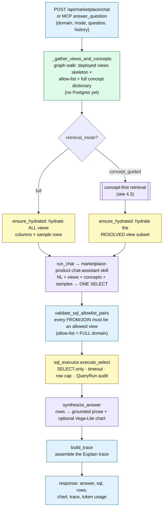
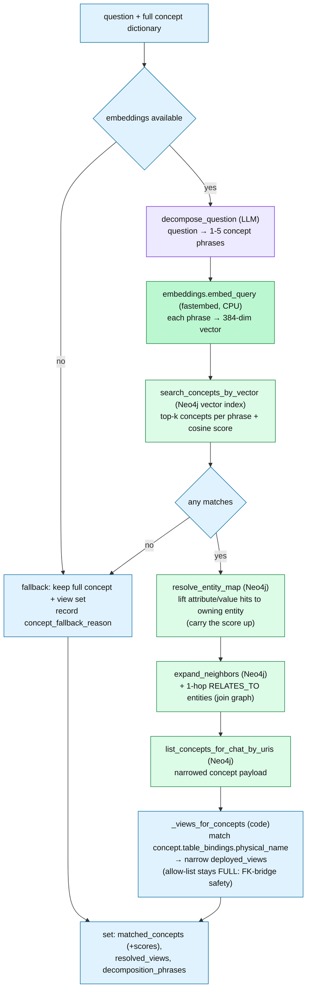
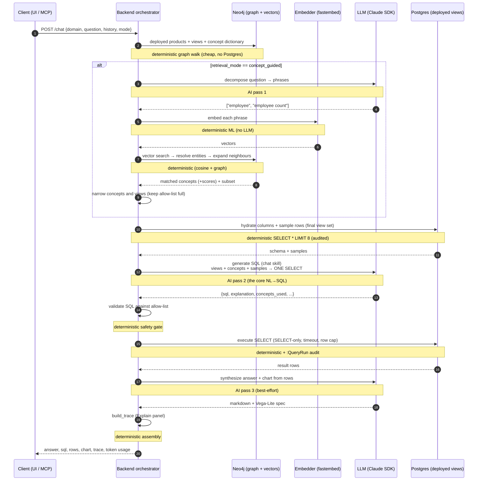

# Marketplace Semantic Q&A

A natural-language question-answering layer over a domain's **deployed data products**.
A consumer types a plain-English question (e.g. *"How many employees are there?"*, *"cancelled
orders by month last year"*); the system translates it into a single safe `SELECT` against the
deployed views, runs it, and answers in prose plus an optional chart — and now also **explains how it
got there**.

It is **stateless**: every request carries the full conversation history, and the backend rebuilds
everything it needs from the graph + warehouse each turn. Nothing about a question is persisted
beyond the standard `:QueryRun` audit rows that every executed SQL statement writes.

- **Entry points:** `POST /api/marketplace/chat` (the web UI's "Semantic Q&A" drawer) and the MCP
  `query_semantic_layer` tool → `marketplace_chat.answer_question` (an engineer's own Claude Code).
  Both share the same core helpers in `workbench/backend/marketplace_chat.py`, so they behave
  identically.
- **Scope:** a **domain** (required) and optionally a single **product**. The answer can only read
  views that are *deployed* (`:ServingDefinition {servingMode:'virtual_view', deploymentStatus:'deployed'}`)
  within that scope.

---

## 1. What it does (conceptual)

The system is a careful translator. It cannot read the database directly — it can only:

1. **look things up** — which products/views exist in the domain, their columns, a few sample rows,
   and a curated **business-concept dictionary** (what "Employee", "Order Status", "cancelled" mean
   and which columns/values they map to);
2. **ask an LLM to write one SQL query** grounded in that context;
3. **check the query is safe** and run it through a locked-down executor;
4. **ask an LLM to phrase the answer** from the real result rows.

Three databases collaborate:

| Store | Role |
|---|---|
| **Neo4j** (graph + vector index) | the "what exists / what it means" layer — products, deployed views, and the `:BusinessConcept` dictionary with its embeddings |
| **PostgreSQL** (the warehouse) | the "what's actually in there" layer — the deployed views holding real rows |
| **SQLite** (workbench DB) | settings + project records (used only to resolve the Postgres connection) |

---

## 2. The two retrieval modes

Both modes answer the same way; they differ in **how much of the concept dictionary and how many of
the views are handed to the SQL-writing LLM**. The toggle is the `retrieval_mode` field
(`"full"` | `"concept_guided"`).

### Full Context
Hand the LLM the **entire domain**: every deployed view (columns + sample rows) and the **whole**
business-concept dictionary. Simple and maximally robust — if a concept is missing or sparse, the raw
schema is still all there. The cost is a larger prompt; in a big domain that is a lot of tokens.

### Concept-Guided
First **figure out which concepts the question is about**, then hand the LLM only those concepts and
only the views they bind to. Sharper, smaller context, fewer warehouse sample-fetches — and it
**falls back to Full Context automatically** whenever the concept layer can't help (no embeddings, no
match, an unmodeled table). The cost is one extra LLM pass (decompose) plus an embedding + vector
search.

| | **Full Context** | **Concept-Guided** |
|---|---|---|
| Concepts sent to the LLM | whole domain | vector-matched subset + 1-hop neighbours |
| Views sent to the LLM | all deployed views | only views the matched concepts bind to |
| Warehouse sample-fetches | all views (≤8) | just the resolved subset |
| LLM passes per question | **2** (write SQL → synthesize) | **3** (decompose → write SQL → synthesize) |
| Extra machinery | — | embeddings + Neo4j vector search |
| Failure behaviour | n/a | graceful fallback to Full Context |
| Best for | small domains, sparse/early semantic layers, max robustness | large domains with a well-curated semantic layer |

> Note: on a *small* domain Concept-Guided can cost slightly **more** than Full (the decompose pass +
> embedding overhead outweighs the savings). The win grows with domain size.

### Where the reasoning lives — and why Concept-Guided is more traceable

The deeper difference between the modes is **where the "what is this question about, and which
products answer it" reasoning happens** — and therefore how observable it is.

- **Concept-Guided externalizes the retrieval reasoning into the graph.** Deciding which concepts
  the question touches and which products can answer it is done by **deterministic, graph-grounded
  operations** — vector match (with similarity scores), entity resolution, neighbour expansion,
  physical-name binding. Each step is observable and replayable, which is exactly why the Explain
  panel can show a `decompose → matched concepts → resolved products → queried product` chain. The
  graph carries the interpretation, and it leaves an audit trail.
- **Full Context delegates that reasoning to the LLM, implicitly.** The model receives the whole
  domain and decides *internally* which tables and concepts are relevant as part of writing the SQL.
  You see the *result* (the SQL + a post-hoc `concepts_used`) but not a grounded chain of *why* —
  the selection reasoning never leaves the model, so it isn't separately traceable.
- **Concrete evidence in this system:** the Explain trace is **richer in Concept-Guided** (six steps)
  than in Full Context (two: generate → execute) — not by design choice but because, in
  Concept-Guided, more of the reasoning is deterministic and therefore *has something to show*.

**The important caveat — don't overstate it.** The **SQL generation itself** (the hardest reasoning:
joins, filters, aggregations) is done by the **LLM in *both* modes**. The graph never writes SQL; it
*grounds and constrains* the context the LLM writes over. And `decompose` is itself an LLM step — so
even "what's it about" begins with the model. The difference is that Concept-Guided immediately
**grounds the model's guess against real graph concepts** (it must match an actual `:BusinessConcept`
and resolve along real edges), whereas Full Context grounds nothing until the allow-list checks the
final SQL.

> In short: **Concept-Guided shifts the *interpretation/retrieval* reasoning out of the LLM's opaque
> internals into explicit, graph-grounded, auditable steps; Full Context trades that traceability for
> simplicity and maximal robustness.** SQL synthesis stays LLM-driven either way — the deterministic
> layers (retrieval grounding, allow-list, executor) constrain and verify it, but they don't replace
> it.

---

## 3. The "Explain" mechanism

Every answer carries an expandable **"Explain — how this answer was resolved"** panel (it replaced
the old "Show SQL" expander). It is driven by a structured `trace` object on the response — assembled
fresh per question, **not persisted** — so it always reflects exactly what happened on that turn.

The panel is **adaptive**: Full Context shows two steps; Concept-Guided shows the full chain.

| Step (label) | Mode | What it shows |
|---|---|---|
| **Decomposed question** | concept-guided | the noun phrases the question was broken into (e.g. `employee`, `employee count`) |
| **Matched concepts** | concept-guided | the business concepts retrieved, each with its **cosine similarity score**; concepts pulled in via the join graph (not a direct match) are tagged **"related"** |
| **Resolved data products** | concept-guided | the deployed views those concepts bind to, each with a **Source / Consumer** alignment chip and the concepts that pointed at it |
| **Queried data product** | both* | which product the SQL *actually* queried, its alignment, and the concepts it **provides** — "selected from N candidate products" |
| **Generated SQL** | both | a one-line rationale, the aggregation kind + confidence, the SQL itself, and the concepts the SQL referenced (with column bindings) |
| **Executed query** | both | status, row count, duration, the views actually used, truncation |

\* "Queried data product" appears whenever the SQL ran (so we know what it touched); it's the bridge
between the candidate products and the SQL, and answers *why this product*.

Functionally, the panel turns an opaque "here's your number" into an auditable story: what the
question was understood to be about → which products were considered → which one was chosen and why →
the exact SQL → what came back. Most of it is just **surfacing values the pipeline already computed**;
only the decompose phrases and the concept→view resolution are captured specifically for it.

---

## 4. Technical workflow

### 4.1 The shared pipeline

Every question — both modes — flows through the same backbone. The only fork is the
**concept-first retrieval** block, which only runs in Concept-Guided mode.



Legend: 🟪 LLM (AI) · 🟦 deterministic code · 🟨 Postgres · 🟩 Neo4j graph.

### 4.2 Full Context — step by step

1. **Gather (Neo4j, code).** `_gather_views_and_concepts` walks the domain's deployed virtual-view
   products → a `deployed_views` skeleton + `allowed_pairs` + the resolved Postgres connection, and
   pulls the **entire** domain concept dictionary (`business_concepts.list_concepts_for_chat`).
2. **Hydrate all (Postgres, code).** `ensure_hydrated` fills every view's columns
   (`information_schema`) and a sample (`SELECT * LIMIT 8`, audited as `:QueryRun`).
3. **Generate SQL (LLM).** `run_chat` packs views + the full concept dictionary + samples + history
   into a JSON payload (capped at 180 KB with priority trimming) and invokes the
   `marketplace-product-chat-assistant` skill (`allowed_tools=[Read, Skill]`, `max_turns=4`, 90 s) →
   one fenced JSON: `{sql, explanation, aggregation_kind, confidence, concepts_used, ...}`.
4. **Validate (code).** `validate_sql_allowlist_pairs` rejects any table that isn't a deployed view
   (CTEs auto-allowed).
5. **Execute (Postgres, code).** `sql_executor.execute_select` — SELECT-only, statement timeout, row
   cap, `:QueryRun` audit.
6. **Synthesize (LLM).** `synthesize_answer` reads the actual rows (≤50) → `answer_markdown` +
   optional Vega-Lite spec. Best-effort: on failure the raw table still renders.
7. **Trace + respond (code).** `build_trace` emits a 2-step trace (Generated SQL → Executed query).

→ **2 LLM passes**: generate, synthesize.

### 4.3 Concept-Guided — the retrieval block

Inserted between *gather* and *hydrate* (`apply_concept_guided_retrieval`). It **narrows concepts and
views** before the SQL pass — and never blocks: any miss records a `concept_fallback_reason` and
keeps the full sets.



Key deterministic detail — **narrow context, not permission**: the SQL prompt only sees the resolved
subset of views, but the execution **allow-list stays the full domain**. So if the LLM needs an
unnamed bridge/join table to connect two products, it is still allowed to use it — the narrowing
guides without trapping.

After this block, the rest is identical to Full Context (hydrate the *subset* → generate → validate →
execute → synthesize).

→ **3 LLM passes**: decompose, generate, synthesize. Plus the deterministic embedding + vector
search.

### 4.4 Sequence of a single question

This is the concept-guided lifecycle end to end. Notes mark which hops are **AI** vs
**deterministic**.



### 4.5 What's AI vs deterministic

| Stage | Kind | Why |
|---|---|---|
| Gather views + concept dictionary | **deterministic** (Neo4j) | fixed graph queries |
| `decompose_question` | **AI** (LLM) | language understanding — what concepts the question is about |
| `embed_query` | **deterministic ML** (fastembed, no LLM) | a fixed embedding model → vectors; same input ⇒ same output |
| Vector search + resolve + expand | **deterministic** (Neo4j) | cosine similarity over an index + graph traversal |
| Narrow concepts/views | **deterministic** (code) | physical-name matching against bindings |
| Hydrate columns + samples | **deterministic** (Postgres) | `information_schema` + `SELECT * LIMIT 8` |
| `run_chat` (NL → SQL) | **AI** (LLM skill) | the core translation |
| `validate_sql_allowlist_pairs` | **deterministic** (code) | the safety gate |
| `execute_select` | **deterministic** (Postgres) | SELECT-only, timeout, row cap |
| `synthesize_answer` | **AI** (LLM) | phrasing + chart choice from real rows |
| `build_trace` | **deterministic** (code) | assembles the Explain panel |

So the **only AI in the loop** is: decompose (concept-guided only), write-SQL, and synthesize-answer.
Everything that touches data, safety, or retrieval is deterministic — the LLM proposes, the
deterministic layers dispose (validate, gate, execute, audit).

---

## 5. Statelessness, safety, and cost

- **Stateless.** No server-side session; the client resends `conversation[]` each turn, and
  `_gather_views_and_concepts` re-snapshots everything. The trace rides in the response, not a store.
- **Three safety layers on every SQL.** (1) the skill is told to only use allow-listed views or
  refuse; (2) `validate_sql_allowlist_pairs` rejects any non-deployed-view reference; (3)
  `sql_executor.execute_select` enforces SELECT-only + timeout + row cap and writes a `:QueryRun`
  audit node.
- **Graceful degradation.** Each LLM pass is independent: decompose failing → fall back to Full
  Context; synthesize failing → the raw result table + first-pass message still render.
- **Token accounting.** All passes for a question note into one accumulator; the response carries
  `token_usage` (working tokens + cache), surfaced in the retrieval badge and result footer.

---

## Appendix — response & trace shape

Selected response fields (`POST /api/marketplace/chat`):

```jsonc
{
  "status": "ok",                  // ok | refused | failed
  "synthesized_answer": "...",     // grounded prose (markdown)
  "sql": "SELECT ...",
  "columns": [...], "rows": [...], "row_count": 160, "duration_ms": 12,
  "chart_spec": { /* Vega-Lite v5 */ },
  "used_views": ["vw_employee"],
  "concepts_used": [ { "concept_name": "Employee", "columns_bound": [...], "role": "..." } ],
  "retrieval_mode": "concept_guided",
  "matched_concepts": [ { "name": "Employee", "via": "match", "score": 0.89 } ],
  "concept_fallback_reason": null,
  "concepts_in_context": 4,
  "token_usage": { "total_tokens": 8775, ... },
  "trace": {
    "retrieval_mode": "concept_guided",
    "steps": [
      { "key": "decompose",      "label": "Decomposed question", "detail": { "phrases": [...] } },
      { "key": "match_concepts", "label": "Matched concepts",    "detail": { "concepts": [...] } },
      { "key": "resolve_views",  "label": "Resolved data products", "detail": { "views": [...], "fallback_reason": null } },
      { "key": "select_product", "label": "Queried data product", "detail": { "selected": [...], "candidate_count": 4 } },
      { "key": "generate_sql",   "label": "Generated SQL",       "detail": { "sql": "...", "explanation": "...", "concepts_used": [...] } },
      { "key": "execute",        "label": "Executed query",      "detail": { "status": "ok", "row_count": 160, "used_views": [...] } }
    ]
  }
}
```

### Key code references

| Concern | Location |
|---|---|
| Orchestration (UI route) | `workbench/backend/routers/marketplace.py` → `marketplace_chat` |
| Orchestration (MCP) | `workbench/backend/marketplace_chat.py` → `answer_question` |
| Gather / hydrate | `_gather_views_and_concepts`, `_hydrate_view_schema`, `ensure_hydrated` |
| Concept-first retrieval | `apply_concept_guided_retrieval`, `_views_for_concepts` |
| LLM passes | `decompose_question`, `run_chat`, `synthesize_answer` |
| Concept layer | `workbench/backend/business_concepts.py` (`search_concepts_by_vector`, `resolve_entity_map`, `expand_neighbors`, `list_concepts_for_chat*`) |
| Embeddings | `workbench/backend/embeddings.py` (fastembed, CPU) |
| SQL safety | `workbench/backend/qa_execute.py` (`validate_sql_allowlist_pairs`), `sql_executor.py` |
| Trace assembly | `marketplace_chat.build_trace` |
| Explain UI | `workbench/frontend/src/components/MarketplaceChatPanel.tsx` (`ExplainPanel`/`ExplainStep`) |

See also **`docs/architecture/semantic-layer.md`** (the `:BusinessConcept` model + embeddings) and
**`docs/architecture/qa-and-reflection.md`** (the producer-side `:QAEvaluation` path, distinct from
this consumer-side chat).
