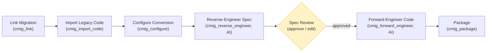

# Code Migration — User Guide

> **In one sentence:** Code Migration converts legacy code (queries, jobs, reports)
> written against a source platform into new code for a modern target — by
> reverse-engineering it into a **reviewed specification** and then
> forward-engineering it against the target platform's best practices — and gives you
> a **downloadable package** with the old and new code side by side.

This guide explains **what** Code Migration does, **who** uses it, and **how** to run
it end to end. It is the code sibling of [Data Migration](data-migration.md): data
migration moves the *tables*; code migration converts the *code that runs against
them*.

---

## 1. What Code Migration is

You have legacy code — a Teradata BTEQ report, a MySQL stored report, an Oracle
PL/SQL job, a Postgres ETL script — and you are moving the data it reads to a modern
platform (Databricks, Snowflake). The code has to move too. Code Migration is the
Workbench capability that does that conversion:

- It **links** to a completed data-migration (`dmig`) project so it knows the exact
  **source → target schema** the code must be rewritten against.
- It **imports** the legacy code (stored immutably; treated as untrusted data —
  never executed).
- It **reverse-engineers** the code into a **use-case-focused specification** — the
  business intent, the tables/columns it touches, and the legacy constructs it uses —
  grounded on a curated **source Platform SME corpus**, not the model's memory.
- A human **reviews and approves** that spec. This is a hard gate: nothing is
  generated until the spec is approved.
- It **forward-engineers** new target-platform code from the approved spec, applying
  the target's prescribed **patterns, best practices, and anti-patterns** from a
  curated **target Platform SME corpus**.
- It **packages** the result: a zip with `old/` and `new/` code, the spec, and a
  README describing the conversion — optionally auto-pushed to Git.

**Who uses it:** the **Data Engineer**. Like data migration, it is engineer-initiated
and creates no marketplace product — it is a conversion job, not a published data
product.

### Why not just ask an LLM to translate the code?

Because single-shot code→code translation gives you no control over target standards
and fails on niche source platforms the model wasn't trained on. Decomposing into
**reverse → review → forward** buys three things (the approach comes from real
migration engagements):

- **Explainability** — you see exactly how the code was interpreted (the spec) before
  any new code exists.
- **Human-in-the-loop** — the review gate sits between the two phases.
- **Full lineage** — every converted file traces back: `original code → reviewed spec
  → design → new code`.

And because the agents are grounded on **curated, version-controlled corpora** (not
training data), a client can **fork the target corpus** to change how the converted
code looks — their naming conventions, house patterns, banned anti-patterns.

---

## 2. The flow, step by step

A Code Migration project runs six stages (`code_migration` workflow):



1. **Link Migration** — pick a completed `dmig` project (one that has reached
   *Reconcile*, so its target `:Dataset` nodes exist). The backend snapshots a
   deterministic `schema_mapping.json` from that migration's `:MIGRATED_TO` graph
   nodes + `migration.json`, records the linked-migration hash (for drift detection),
   and **locks the target platform** from the migration. No lineage edges yet.
2. **Import Legacy Code** — upload the code (a single script today; the layout is
   folder-ready for multi-file modules later). It lands in an **immutable `source/`**
   dir with a SHA-256 manifest. It is **untrusted data**: the AI stages run under a
   tool allowlist with **no shell access** and never execute it.
3. **Configure Conversion** — choose the target **runtime/version**, **output
   language**, and **artifact kind** (SQL script / PySpark job / notebook), and confirm
   the source & target SME corpora. The **target platform is not selectable** — it is
   locked from the linked migration.
4. **Reverse-Engineer Spec** *(AI)* — produces `codespec.json`: the intent, the source
   references (matched to `schema_mapping.json`), and the identified legacy constructs.
5. **Spec Review** — the engineer reviews the spec in the Reviews tab (the *Code Spec*
   review), edits if needed, and **Approves**. Forward-engineering is **blocked** until
   the spec is approved; editing an approved spec re-opens the review. On approval, the
   `:USES_DATASET` lineage edges are built from the spec.
6. **Forward-Engineer Code** *(AI)* — generates the converted code into `new/` (a
   `design.md` first, optionally), grounded on the target SME corpus and the backend's
   `schema_mapping.json` (**the agent never infers target relations**). It writes a
   `conversion.json` report bucketing each construct as **converted / manual_action /
   unsupported**, with source→spec→target lineage, and statically checks the output
   (SQL parse / `ast.parse` / notebook JSON).
7. **Package** — assembles the downloadable zip (`old/`, `new/`, `codespec.json`,
   `design.md`, `conversion.json`, README) and, if Git auto-push is on, pushes it.

> A conversion with any `manual_action`/`unsupported` items is a
> **converted-with-actions** result — it packages, but is never presented as a clean
> success. Someone needs to finish those by hand.

---

## 3. The two Platform SME corpora (the core IP)

Grounding is **corpus-in-skill**: version-controlled markdown, not the model's memory.

- **Source corpus** (`workbench-skills/skills/code-migration-reverse-engineer/reference/<platform>/<version>/`)
  — *what to identify* in the legacy code: libraries, query idioms, platform-specific
  patterns and anti-patterns. Scoped by platform and version. Ships with `mysql`,
  `postgres`, `teradata`, `oracle`.
- **Target corpus** (`workbench-skills/skills/code-migration-forward-engineer/reference/<platform>/`)
  — the target's *patterns, best practices, and anti-patterns*. Ships with `databricks`,
  `snowflake`. **This is the steering point:** a client forks it to control how converted
  code looks.

Provenance is tracked **separately** for the two corpora because they invalidate
differently: changing the *source* corpus invalidates the spec + everything downstream;
changing the *target* corpus invalidates only the conversion/package output, not the
reviewed spec. Overriding a corpus today means forking the vendored skill and rebuilding
the backend image (per-client runtime overlays are future work).

---

## 4. Linking to a data migration (and the graph)

Code migration does not exist in a vacuum — it rewrites code against the schema a data
migration produced. So a `cmig` project **links to a `dmig` project**:

- Since **Part A**, a reconciled `dmig` migration materializes its target as
  `:Dataset:MigrationTarget` graph nodes on an isolated `(:Project)-[:HAS_MIGRATION_TARGET]->`
  path, with `:MIGRATED_TO` lineage from source. That is the real, queryable anchor the
  code module points at.
- The `cmig` project writes one `:CodeModule` node (code text is **never** stored on it —
  only a pointer + metadata) and, on spec approval, a `:USES_DATASET` edge to the linked
  dmig's `:Dataset` nodes. This is the **second sanctioned cross-project edge** (alongside
  `:CONSUMES`); the isolation "rule" was always a convention, not a lock.
- If your `dmig` project finished **before** Part A shipped, run the **backfill**
  (`backfill_migration_targets` MCP tool) to materialize its target nodes so a `cmig`
  project can link to them.
- You cannot delete a `dmig` project while an active `cmig` project links to it (you would
  orphan the conversion) — the delete returns a `409` listing the linked code migrations.

**Eligibility.** A `dmig` project is linkable once it has loaded (`initial_snapshot_loaded`);
a fully **reconciled** one is marked `verified`. An unverified link is allowed but flagged.

---

## 5. The downloadable package

Like every Workbench package, the code-migration package **is** the deliverable — the
Workbench doesn't hide the result behind an internal path:

```
<project>-code-migration/
  old/               original legacy code, exactly as imported (immutable)
  new/               the converted target-platform code
  codespec.json      the reviewed, use-case-focused specification
  design.md          forward-engineering design notes (if produced)
  conversion.json    per-construct report: converted / manual_action / unsupported
  README.md          what was converted + the original→spec→design→new-code lineage
```

Download it via `GET /api/projects/{id}/code-migration/package?format=zip` (or the
`get_code_migration_package` MCP tool), or push it to a per-project Git repo (Gitea or
GitHub) — auto-pushed after **Package** when Git auto-push is enabled, or on demand.

---

## 6. Driving it over MCP

Every UI action has an MCP equivalent (`/mcp`), so an engineer can run the whole flow
from their own Claude Code:

| Step | MCP tool |
|---|---|
| See linkable migrations | `list_eligible_dmig` |
| Link | `link_code_migration(cmig_project_code, dmig_project_code)` — **needs access to both** |
| Import | `import_code(project_code, files=[{filename, content_utf8}])` — never a server path |
| Configure | `configure_code_migration(...)` |
| Reverse-engineer | `run_stage` (the shared agentic tool) |
| Review the spec | `get_code_spec` / `update_code_spec` / `approve_code_spec` / `reopen_code_spec` |
| Forward-engineer | `run_stage` — refused by `require_forward_ready` until the spec is approved (**`force=true` does not bypass it**) |
| Package | `get_code_migration_package` |
| Backfill a pre-Part-A dmig | `backfill_migration_targets(project_code)` |

---

## 7. Try it with the sample legacy code

`samples/code-migration/` ships realistic legacy code tied to the sample databases:

- `mysql-hr/` — a MySQL HR headcount report against the `hr-mysql` sample.
- `postgres-products/` — a Postgres sales-rollup ETL against the `products_sales` sample.

Each is full of source-platform idioms (`GROUP_CONCAT`, `DISTINCT ON`, `ON CONFLICT`,
SCD-2 as-of filters, cryptic columns) so the reverse→forward flow has something real to
convert. Pair each with a `dmig` migration of its sample DB → Databricks and run the
six stages above.

---

## Deep dive — under the hood

- **State machine** (`CodeMigrationPlanRow.status`):
  `linked → imported → configured → awaiting_review → approved → converting →
  converted | converted_with_actions | failed → packaged`.
- **The review gate is enforced server-side**, not by the stage's `has_review` flag
  alone (which only sets `awaiting_review`, a state the dependency checks treat as
  complete). The canonical `code_migration_orchestrator.require_forward_ready` validates
  the **full dependency set** — approved spec hash current, source manifest current,
  linked dmig + its graph nodes present, migration/corpus hashes current — and is called
  by **all four** execution routes (the shared runner, the CLI stream, orphan
  resolution, recovery). MCP `force=true` cannot bypass it.
- **The spec is canonical in the database** (`spec_json` + `approved_spec_hash`); the
  on-disk `codespec.json` is a mirror. Approval pins a stable, key-ordered hash so it
  can't drift on formatting.
- **Imported code is sandboxed technically**, not just by instruction: the cmig AI
  stages run under a no-Bash tool allowlist (`sdk_runner.CODE_MIGRATION_TOOLS`).
- **Fail-closed artifacts**: a stage only reports complete after the backend verifies
  its expected artifact exists and is valid (`codespec.json` for reverse; converted
  code + `conversion.json` for forward).
