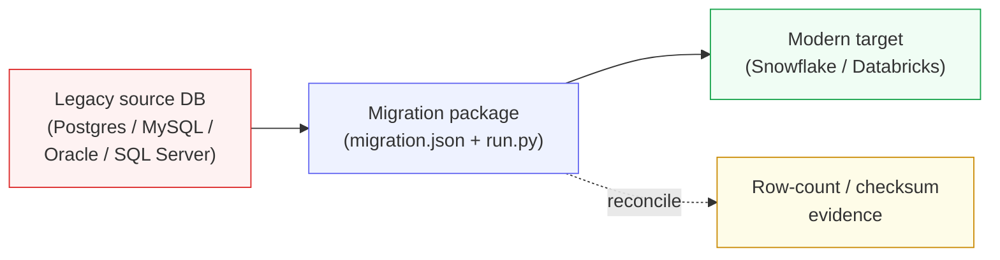
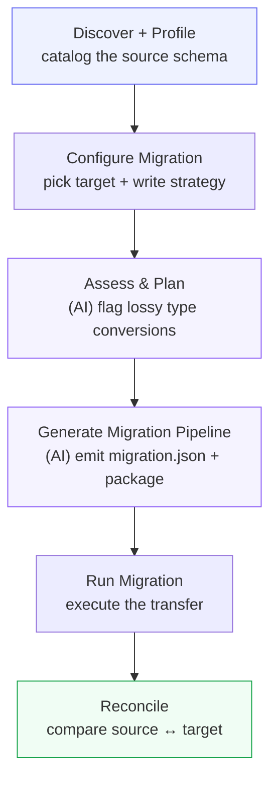
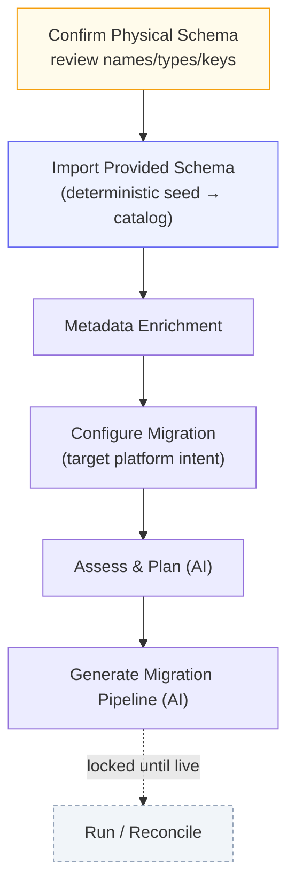
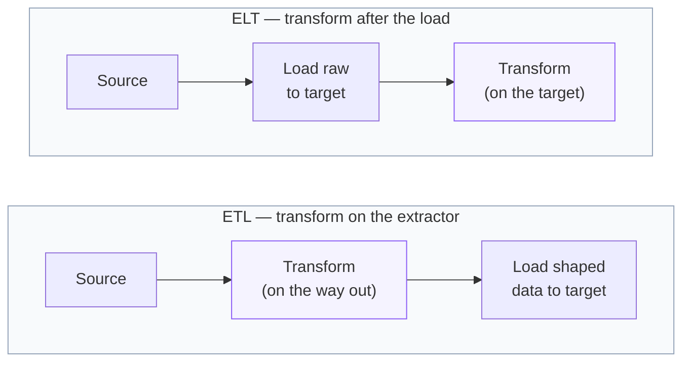

# Data Migration — User Guide

> **In one sentence:** Data Migration moves the tables of a legacy database onto a
> modern platform (Snowflake or Databricks), generates a **re-runnable package** that
> does the move, and gives you **row-count / checksum proof** that the data arrived
> intact.

This guide explains **what** Data Migration does, **who** uses it, and **how** to run
it end to end. It's deliberately honest about one thing up front: today's migration is a
**raw lift-and-shift** — it copies your tables *as they are*, without reshaping them.
[Section 5](#5-where-transformation-does-and-doesnt-happen) explains exactly where data
*transformation* fits (and where it doesn't yet), and [Section 6](#6-data-migration-vs-cross-platform-serving-transfer)
untangles it from a similarly-named feature. There's a short
[Deep dive](#deep-dive-under-the-hood) at the end for the technically curious; you don't
need it to use the feature.

---

## 1. What Data Migration is

Imagine you have an old database — say a PostgreSQL, MySQL, Oracle, or SQL Server system
that's been running for years — and you want its data living in a modern cloud warehouse
like **Snowflake** or **Databricks**. Data Migration is the Workbench capability that does
that move for you:

- It **looks at** the source database and catalogs every table and column.
- It **checks** whether each column's data type has a clean equivalent on the target, and
  warns you about any conversions that could lose information.
- It **generates a runnable package** — a small, self-contained program plus a
  specification file — that performs the copy.
- It **runs** the copy, loading every table onto the target platform.
- It **reconciles** the result: comparing row counts (and checksums) between source and
  target so you have auditable evidence the migration succeeded.

**Who uses it:** the **Data Engineer**. Unlike the product-engineering archetypes
(source-aligned / consumer-aligned products), Data Migration is engineer-initiated and
**does not create a marketplace product** — it's a plumbing job, not a published data
product. There's no Product Owner, no contract, no marketplace entry.

**The mental model — three moving parts:**

The **package** in the middle is the important idea: the Workbench doesn't move your data
through some hidden internal path. It generates a real, downloadable program (`run.py`)
that reads a specification (`migration.json`) and does the move — and *that same package*
is what the Workbench itself runs. You can download it and run it yourself, hand it to
your platform team, or push it to Git.

---

## 2. When to use it

Reach for Data Migration when:

- You're **lifting and shifting** a legacy system onto a cloud data warehouse and want the
  data copied faithfully, table for table.
- You want an **automatically generated, auditable pipeline** rather than hand-writing load
  scripts.
- You want **reconciliation evidence** — row-count and checksum comparison between source
  and target — as proof the migration is complete and correct.

Do **not** reach for it when you want to *reshape* the data on the way — rename columns,
recast types by rule, filter rows, join, aggregate, apply slowly-changing-dimension
history, or mask sensitive values. Today's migration doesn't do that (see
[Section 5](#5-where-transformation-does-and-doesnt-happen)); the product-engineering
serving path does (see [Section 6](#6-data-migration-vs-cross-platform-serving-transfer)).

---

## 3. The flow, step by step

A migration project runs a fixed sequence of stages. The engineer drives it from the
Engineering Workbench pipeline (or headlessly over MCP — see
[Section 7](#7-the-migration-package-and-the-mcp-surface)).

| Step | Stage ID | What happens | Runs an AI agent? |
|---|---|---|---|
| Discover + Profile | (`data_discovery` / profiling) | Connects to the source and catalogs every schema, table, and column. Also flags timestamp/sequence columns that could drive incremental loads. | Yes |
| **Configure Migration** | `dmig_configure` | A form — no AI. Pick the target connection, write strategy (replace / append), and (for Snowflake/Databricks) the target catalog + schema. | No |
| **Assess & Plan** | `dmig_assess_plan` | The AI agent evaluates every source column's type against the target's type system and **flags** potentially lossy conversions (e.g. Oracle `DATE` carries time-of-day that a plain `DATE` target would drop). Produces `assessment.json`. | Yes |
| **Generate Migration Pipeline** | `dmig_generate_pipeline` | The AI agent produces the downloadable package — `migration.json` plus the runner and docs. | Yes |
| **Run Migration** | `dmig_execute_transfer` | The Workbench executes the package (`run.py --mode load`), loading every table onto the target. Per-table progress streams into the stage log. | No |
| **Reconcile** | `dmig_reconcile` | Runs the package in verify mode (`--mode verify`), comparing row counts / checksums between source and target. Stored as reconciliation evidence. | No |

**A note on thin sources (Oracle, SQL Server).** These don't have a dedicated discovery
skill. The pipeline generator can instead **reflect** the live database over SQLAlchemy
(`--reflect`) — enumerating tables and primary keys directly — so you can migrate them
without the full discovery step.

---

## Offline / schema-only migration (no live source)

Many engagements have **no live connectivity to the source yet** — all you have is the
assessment's schema. Data Migration supports this with a **schema-only** mode: it materializes
the provided schema as the project catalog and lets you run everything that doesn't need real
data (enrichment, assess, and *generating* the pipeline), while **Run and Reconcile stay
locked** until a real source and target are connected.

**Choosing it — at intake.** The mode is decided when the inbound assessment is reviewed: on the
migration intake review page (or the `set_intake_execution_mode` MCP tool) toggle **Schema-only
(offline)** before approving. Approving scaffolds the project on the offline template and sets its
`data_connectivity_mode = schema_only`.

1. **Confirm Physical Schema** — a reviewed, structured form (pre-filled best-effort from the
   assessment): `catalog / namespace / table`, a **required physical `data_type`**, nullability,
   primary key, and structured FK references. The assessment blueprint is too lossy to trust as a
   machine contract, so you confirm it explicitly; confirmation blocks on missing types or
   unsafe/duplicate names. *This step only records the schema — it doesn't touch the graph.*
2. **Import Provided Schema** (`dmig_import_schema`) — a **deterministic, no-AI** step that
   materializes the confirmed schema as the project's `:Catalog` / `:Dataset` / `:Column` graph
   (tagged `seededFrom='intake'`), reusing the *same* loader as live discovery. It completes only
   when the load verifies against the confirmed schema (a partial load leaves the step pending).
3. **Metadata Enrichment → Configure → Assess & Plan → Generate** run exactly as in the live flow.
   Configure records a **target platform _intent_** — you don't need a live target connection yet.
4. **Run / Reconcile stay locked.** Execution needs *both* a real source **and** a real target
   connection **and** a generated package; until then the backend refuses to run (a clear
   "not ready: …" message lists exactly what's missing — this gate is enforced server-side, not
   just in the UI).

**Going live later — "Flip to live".** Once source connectivity arrives, click **Flip to live** on
the project (or call `flip_migration_to_live` over MCP). It requires a real source and target, then
attaches the normal live-discovery stage, **deletes the intake-seeded catalog** (so real discovery
loads the authoritative schema rather than the confirmed guess), and re-opens the downstream stages
to re-run against live data.

> Offline mode lands on **`dmig`** first. The seeder is archetype-agnostic, so schema-only
> source-aligned product engineering (`dpe-sa`) is a planned fast-follow.

---

## 4. What it moves today: raw lift-and-shift

This is the most important thing to understand about the current capability, stated
plainly:

> **Migration copies your tables exactly as they are.** Every source table is moved
> whole. Original column **names** and **types** are preserved. No columns are added,
> dropped, renamed, filtered, or recomputed. The only structural choices you get are
> *which target platform/schema*, *replace vs. append*, and the primary key hint.

Two honest caveats that fall out of the "as they are" promise:

- **Type coercion is inferred, not authored.** The Assess & Plan step *warns* about lossy
  type conversions, but it doesn't *fix* them. The actual source-type → target-type
  mapping is done implicitly by the underlying load engine (DLT) as it infers a schema.
  The assessment is advice for a human to read, not a rule the pipeline applies.
- **Identifiers may get normalized.** The load engine applies its own default naming
  convention (snake_case) to identifiers. A source column named `"CustomerID"` can land as
  `customer_id` on the target. This is a side effect of the engine, not something the
  migration currently lets you control.

If you need the data *reshaped* rather than *copied*, that's the transformation question —
which is exactly what the next section is about.

---

## 5. Where transformation does (and doesn't) happen

A common question when moving data between platforms is: **where should the data be
transformed — before the load, or after it?** The two classic answers:

- **ETL** — *Extract, Transform, Load* — reshapes the data **on the extractor**, so only
  already-shaped data crosses to the target. Good for masking sensitive values and
  reducing volume before the move.
- **ELT** — *Extract, Load, Transform* — moves the **raw** data first, then reshapes it
  **on the target** using the target's (often more elastic) compute.
- Most modern pipelines land on a **hybrid** (sometimes called *EtLT*): push the cheap,
  volume-reducing and governance-critical steps to the source, and defer the heavy
  relational work to the target.

**Where does Data Migration sit today? It does neither — there is no transform step at
all.** The current migration is pure lift-and-shift: raw rows leave the source and raw
rows arrive on the target. It's the "Extract → Load" of ELT with the "Transform" left
empty.

That's a deliberate Phase-1 scope, not an oversight. The Workbench *already has* a
transformation engine and an ETL-vs-ELT placement planner — they power the
product-engineering **serving** path (see the next section), not migration. The plan to
bring transformation into migration (and the reasoning about *where* the transform should
run) is written up in the design analysis at
[`research/2026-08-03-migration-transformation-gap-analysis.md`](../research/2026-08-03-migration-transformation-gap-analysis.md).

---

## 6. Data Migration vs. cross-platform serving transfer

Two features in the Workbench share the word "transfer," and it's easy to conflate them.
They are different things for different people:

| | **Data Migration (`dmig`)** | **Cross-platform serving transfer (`transfer_then_transform`)** |
|---|---|---|
| Who runs it | Data **Engineer** | Data **Product Owner** / product-engineering |
| What moves | A **whole database**, table by table | A **single data product's** shaped output |
| Reshapes the data? | **No** — raw lift-and-shift | **Yes** — the full transform DSL (rename, cast, filter, join, mask, SCD…) |
| Product graph / marketplace | **No** — plumbing only | **Yes** — it's a published product's serving mode |
| Where transformation runs | N/A (no transform) | Split across source/target by a **placement planner** (ETL / ELT / hybrid) |

If you're **moving a legacy database wholesale**, you want **Data Migration** — this guide.
If you're **serving a data product** whose source and target live on different platforms
and you need the transform split intelligently across the boundary, that's the serving
transfer mode, documented in
[`docs/architecture/cross-platform-transfer.md`](architecture/cross-platform-transfer.md).

---

## 7. The migration package and the MCP surface

**The package is the execution unit.** Everything the migration does is carried in a
downloadable, self-contained package:

- `migration.json` — the specification: source/target platforms, target schema, write
  disposition, and one entry per table to move.
- `run.py` — a stdlib-plus-DLT runner with three modes: `--mode load` (do the copy),
  `--mode verify` (reconcile row counts), `--mode plan` (dry-run the plan).
- A generated `README.md` documenting how to run it, and reconciliation manifests.

Because the package has no dependency on the Workbench itself, you can **download it** and
run it in your own environment, or **push it to Git** (Gitea/GitHub) — the same way serving
packages are pushed.

**Quality is reconciliation-only.** Migration doesn't run the full DQ suite by default; it
proves the move with row-count / checksum reconciliation. If you *do* want quality testing
on the migrated data, add the DQ workflow group from the workflow catalog.

**Driving it over MCP.** An engineer can run the whole migration headlessly from their own
Claude Code. The live flow uses:

| Tool | What it does |
|---|---|
| `configure_migration` | Set the target — a live connection **or** a platform *intent* (offline) — plus write disposition, target schema/catalog |
| `run_migration_snapshot` | Assemble + run the package (`--mode load`) and complete the transfer stage |
| `run_migration_reconcile` | Run reconciliation (`--mode verify`) and complete the reconcile stage |
| `get_migration_status` | Read the current migration plan + status |
| `get_migration_package` | Download the package as a `{files}` map |

The **offline / schema-only** flow adds full parity for the steps above:

| Tool | What it does |
|---|---|
| `set_intake_execution_mode` | Choose `live` vs `schema_only` on a migration intake before approving |
| `get_physical_schema` | Read the reviewed physical schema (pre-filled from the assessment) |
| `confirm_physical_schema` | Validate + confirm the physical schema (errors on missing types / unsafe names) |
| `seed_migration_schema` | Deterministically materialize the confirmed schema as the graph catalog |
| `flip_migration_to_live` | Transition a schema-only project to live (needs a real source + target) |

---

## Deep dive (under the hood)

*You don't need this section to use Data Migration.* It's here for engineers who want to
know exactly how the pieces fit. The plain-English version: **a per-table
`migration.json` plus a stdlib+DLT runner do a straight source→target table copy; nothing
in between reshapes the data.**

- **The runner** — `workbench/backend/serving_runners/run_migration.py`. The load loop is
  literally `pipeline.run(sql_table(credentials=engine, schema=…, table=…,
  write_disposition=…))`. The only `apply_hints` calls are `primary_key` and `table_name`
  — there is no `add_map`, transformer, filter, or post-load SQL. Modes: `load` / `verify`
  / `plan`. It imports `dlt` + a SQLAlchemy driver only (no `workbench.*`), so it runs
  anywhere.
- **The spec generator** — `workbench-skills/skills/migration-pipeline-generator-dlt/scripts/generate_migration_config.py`.
  Emits `migration.json` from either the discovery YAML (`_datasets_from_discovery`) or a
  live `--reflect` of the source (`_datasets_from_reflection`, the Oracle/SQL-Server
  path). Each dataset entry is table-grained: `{source_schema, source_table, target_table,
  write_disposition, primary_key}` — **no column list, no type map, no transform field.**
- **The plan + persistence** — `workbench/backend/platform/migration_plan.py` (`MigrationPlan`
  lifecycle state machine) and `MigrationPlanRow` (SQLite, `models.py`). Both are
  lifecycle/ownership models; neither carries per-column or per-type mapping fields.
- **The type system** — `workbench/backend/platform/type_system.py`. `CanonicalType` +
  per-platform `TypeMappingProfile` power the Assess & Plan *warnings* (lossy / ambiguous /
  unsupported flags). This is where a future type-coercion rule would build from, but today
  it only informs the assessment.
- **The orchestration + endpoints** — `workbench/backend/routers/migration.py`
  (`snapshot_core`, `reconcile_core`, `configure`, plus the offline
  `physical-schema`/`seed-schema`/`flip-to-live` endpoints) with matching MCP tools in
  `mcp_server.py`. `configure` hard-rejects any `landing_strategy` other than `"raw"`. The
  offline seeder + schema artifact live in `intake_schema_seed.py` + `physical_schema.py`
  (`ProjectPhysicalSchema`); `migration_execution_readiness` is the server-side Run/Reconcile gate.
- **The skills** — `migration-assessment-advisor` (produces `assessment.json`),
  `migration-pipeline-generator-dlt` (produces `migration.json`), and
  `migration-package-documenter` (the package README).

For the forward-looking design — where transformation *should* run and how to wire it in
by reusing the existing placement planner — see
[`research/2026-08-03-migration-transformation-gap-analysis.md`](../research/2026-08-03-migration-transformation-gap-analysis.md).
