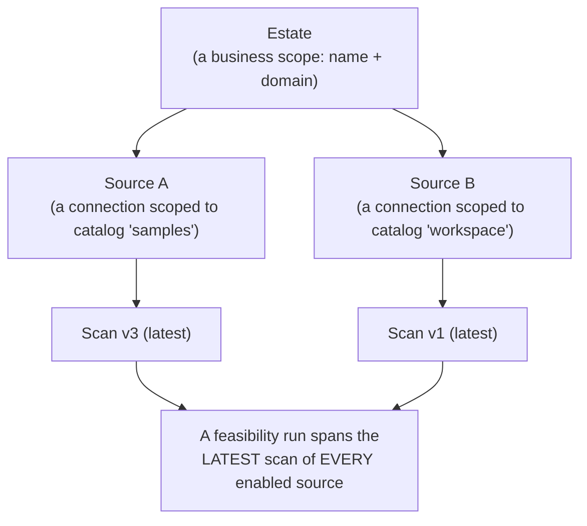
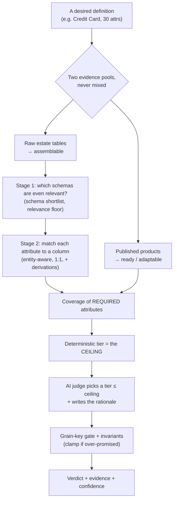
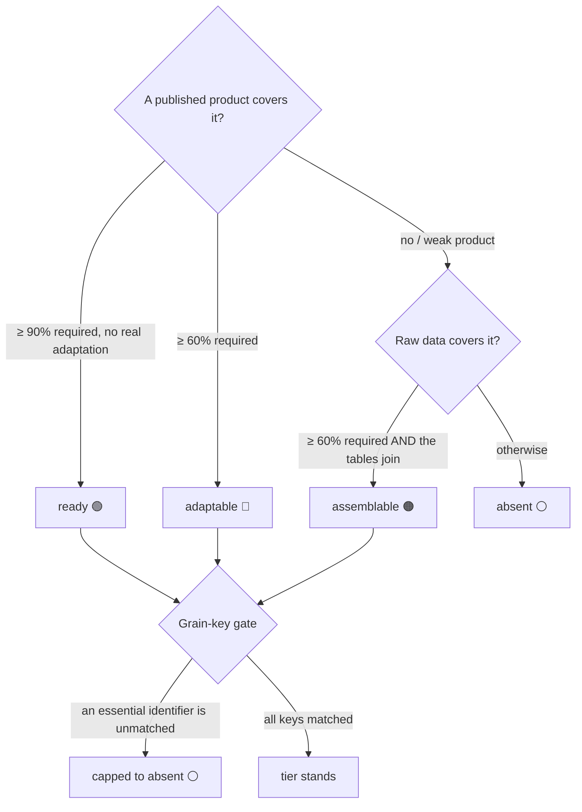

# Data-Product Feasibility & Estate Scanning — a functional guide

> **Who this is for:** a **Data Product Owner** (or anyone driving the Product
> Workbench) who wants to point Data Workbench at a live database, have it look at
> what's actually there, and get a straight answer to: *"Which of the data
> products I wish I had can I build right now — and what would it take?"*
>
> This is the **functional guide** — what the capability does, **how the grading
> actually works underneath** (the part that isn't obvious from the screen), and
> how to use it well. It's the doc to read first.
>
> Its two companions go deeper in narrower directions:
> - **[`estate-discovery.md`](estate-discovery.md)** — the hands-on **setup &
>   connection reference** (per-platform connection fields, the scan drill-down,
>   troubleshooting). Read it when you're wiring up a real platform.
> - **[`connected-estate.md`](connected-estate.md)** — the **architecture
>   deep-dive** (graph model, scoring internals, API/MCP surface, security).

---

## 1. The idea in one minute

Most of the Workbench works **bottom-up**: you start from a source you already
have, discover it, and shape a product out of it. This capability flips the
direction. You start from **what you want** — a catalog of *desired* data-product
definitions — and the Workbench tells you **how buildable each one is today**
against the estate you connected, then helps you act on the buildable ones.

### A plain-English way to picture it

Think of it as a **kitchen check against a shopping list of dishes**:

- You hand over a **shopping list** of dishes you wish you could serve (the
  *reference data-product definitions* — e.g. "a Credit Card product with these 30
  attributes").
- Data Workbench walks your actual **pantry** (your live databases — schemas,
  tables, columns) and your **already-plated dishes** (data products you've already
  published to the marketplace).
- For each item on the list it gives you one of four honest answers:

| Verdict | In the kitchen | In data terms |
|---|---|---|
| **Ready** 🟢 | The dish is already cooked and plated. | A governed, published product already matches — just adopt it. |
| **Adaptable** 🔵 | You have a dish that's close but needs a tweak (a garnish, less salt). | A close published product exists but needs a small, allowed adaptation. |
| **Assemblable** 🟠 | You have the raw ingredients but haven't cooked it yet. | The raw data exists in the estate but isn't a governed product yet. |
| **Absent** ⚪ | You simply don't have it. | No matching data anywhere. |

That's the whole capability: **scan the pantry → grade the shopping list → act on
what's buildable.**

### The stoplight, precisely

Feasibility grades every desired definition into one of four **tiers**. (The
colours below are what the screen actually shows — note **adaptable is blue, not
green**, and **absent is a neutral slate, not an alarming red**: an absence is
information, not a failure.)

| Tier | Colour on screen | What it means | What you do next |
|---|---|---|---|
| **`ready`** | 🟢 green | A published product matches almost exactly (≈ all required attributes, no real adaptation). | **Adopt / endorse** it in the marketplace. |
| **`adaptable`** | 🔵 blue | A close published product exists but needs a **bounded, allowed** adaptation — a rename, a currency normalization, a coarser-grain **aggregation**. | **Author a consumer product** that consumes it, seeded from the definition. |
| **`assemblable`** | 🟠 amber | The raw data exists in the estate and the pieces **join**, but it isn't a governed product yet. | **Compose a modernization portfolio** (source products first, then the aggregate/consumer) via Intake. |
| **`absent`** | ⚪ slate | No matching product **and** no matching raw data. | Note it as a genuine gap. |

> **Why "weekly → monthly" can be adaptable, but "monthly → weekly" is always
> absent.** You can always roll *finer* data up to a *coarser* grain — weekly →
> monthly is an **aggregation**, a legitimate adaptation. You **cannot** reliably
> split a coarse grain back into a finer one without finer-grained sources. So a
> definition that needs *finer* grain than the estate offers is a real gap, never
> an `adaptable`. The grader enforces this.

---

## 2. A worked example

Teresa's team wants a **Credit Card** data product: 30-odd attributes, keyed on
`card_id`, at current state. She runs feasibility against the bank's connected
Postgres estate. Three things happen:

1. **Scan.** The Workbench had already scanned the estate and found, among other
   schemas, a `cards` schema with `cards`, `card_txns`, and `customers` tables.
2. **Grade.** For the Credit Card definition it compares the 30 required
   attributes against (a) every *published* product and (b) the *raw* estate
   tables — assigning each required attribute to **at most one** column.
   - It finds a published **"Cards"** product covering 95% of the required
     attributes, needing only a rename and a currency normalization → **`adaptable`**.
   - A separate **"Collections 360"** aggregate definition finds *no* matching
     product, but its raw tables exist and join on `customer_id` → **`assemblable`**.
3. **Act.** For the Credit Card row Teresa clicks **"Author consumer product"**,
   which opens the product wizard pre-seeded to *consume* the Cards product with
   those two adaptations noted. For Collections 360 she clicks **"Compose
   modernization portfolio"**, which stages a proposed plan she approves in Intake.

A tiny, concrete flavour of the cleverness underneath: the definition asks for a
single `name` column, but the estate only has `first_name` and `last_name`. Rather
than call that a gap, the grader recognises the pair and reports `name` as
**derivable** — "compose `first_name` + `last_name`." (More on that in §5.4.)

---

## 3. The journey end-to-end

```mermaid
flowchart LR
  subgraph EW[Engineering Workbench]
    C["Register a connection<br/>(host · credential · …)"]
  end
  subgraph PW[Product Workbench]
    E["Connected Estate<br/>/product/estate"]
    F["Data-Product Feasibility<br/>/product/feasibility"]
  end
  C -->|attach as a source| E
  E -->|Browse → pick schemas → Scan| SC["Versioned scan<br/>(metadata snapshot)"]
  SC -->|Enrich metadata<br/>(optional but recommended)| SC
  SC -->|Recommend + Evaluate| F
  F -->|read verdicts| R["Stoplight grid<br/>+ per-attribute evidence"]
  R -->|act| A["Adopt · Author consumer ·<br/>Compose portfolio · Save as candidate"]
```

Two pages carry the whole flow, both on the **Product Workbench Home**:

- **Connected Estate** (`/product/estate`) — register sources, browse, scan, enrich.
- **Data-Product Feasibility** (`/product/feasibility`) — recommend, evaluate, read, act.

> **Not to be confused with "Discovery."** The Product Workbench nav also has a
> **Discovery** item — that's the *Pulse* integration, a **different**,
> bottom-up capability where an external tool hands DW an assessment. Connected
> Estate is DW connecting to a live platform and discovering it **itself**,
> top-down. They're separate and never share data. (Full contrast in
> [`estate-discovery.md`](estate-discovery.md).)

---

## 4. Part 1 — Scanning your estate

### What a scan is (and isn't)

A **scan** is one **metadata snapshot** of a live platform: which schemas, tables,
and columns exist, their data types, row counts, and sizes. Crucially:

- **It reads metadata, never your row values.** No cell data is sampled or stored.
  Even the deeper, engineer-only profiling pass reads *row counts*, not values —
  it's PII-safe by construction.
- **It's deterministic, not an AI guess.** The scan asks the platform directly
  ("list your schemas / tables / columns") through a per-platform provider. Running
  an AI over hundreds of tables would be slow, costly, and non-repeatable, so the
  AI is reserved for the *judgement* step later (grading), not the enumeration.
- **It's versioned.** Re-scanning makes a *new* snapshot; old ones are kept. New
  objects are added, changed tables are re-versioned, and **deleted objects are
  tombstoned** (marked gone, never silently dropped) so you can see drift.

### The estate shape: estate → sources → scans



- An **estate** is a stable business scope (a name, optional domain). It holds one
  or more sources.
- A **source** is a registered connection **scoped to one catalog**. To cover more
  of a platform, add **several sources — one per catalog**.
- A **feasibility run assesses the latest scan of *every enabled source*** — so one
  run covers all the catalogs in the estate at once.

> **The setup mechanics** — which connection field means what per platform
> (Postgres/MySQL/Snowflake/Databricks), the load-bearing "catalog is set on the
> *source*, not the connection" rule, and why two sources can otherwise return
> identical results — all live in **[`estate-discovery.md`](estate-discovery.md)**.
> This guide stays functional; go there when you're connecting a real platform.

### On the screen (Connected Estate page)

- **Create an estate** — name + optional domain.
- **Add a source** — pick a registered connection. For a catalog-scoped platform
  (Snowflake/Databricks) you get a **catalog → schema tree**: tick whole catalogs
  or expand and tick individual schemas, then **Add selected** creates one source
  per ticked catalog. For a simple platform (Postgres/MySQL) it's a single **Add
  source**.
- **Browse** a source to list its live schemas with per-schema relation counts,
  then **Save selection** (persist which schemas to scan) or **Scan selected**
  (persist *and* scan now).
- While a scan runs you get a **live progress bar** — "Scanning *`schema`* ·
  4/9 schemas · 132 tables · 1,847 columns" — and, when it finishes, a
  **"Scanned *timestamp* · *duration*"** line.
- The **Scans** panel lists each snapshot labelled **`v3 · source-name · catalog`**,
  with per-schema outcome chips (**scanned / empty / inaccessible**), table row/size
  counts, drill-down into columns, and a red **PII** chip on name-classified columns.

### Enrich metadata — do this before grading

Once a scan completes, an **Enrich metadata** button generates AI descriptions for
the estate's tables and columns. **This materially improves grading accuracy** —
the grader leans heavily on schema- and table-level *text* to decide which parts of
the estate are even relevant to a definition (see §5.2). A raw scan has only bare
names; enrichment gives it meaning. The Feasibility page warns you when a scan
hasn't been enriched yet.

> Under the hood, if enrichment is skipped or fails, the grader falls back to a
> deterministic description synthesised from names and a column sample — so it
> still works, just less accurately. That's why enrichment is *recommended*, not
> *required*.

### What else the scan captures

- **Volumetrics** — per-table row counts (with a `~` when the platform only gives
  an estimate), byte sizes, and file counts. Useful for sizing effort before you
  commit to building.
- **Code assets** (Snowflake & Databricks) — tasks, dynamic tables, streams,
  notebooks, procedures, jobs, DLT pipelines, with a short definition preview and
  dependency count. This is early visibility into the *logic* already running in the
  estate, not just its tables.

---

## 5. Part 2 — How a grade is actually decided *(the strategy)*

This is the part that isn't obvious from the screen. The grade you see is the
output of a deliberately **layered** process: the boring, exact arithmetic is done
**deterministically** by the backend; an AI is used only as a **bounded judge** on
top of that evidence, and can only ever be *more* conservative than the arithmetic
allows. Understanding this is what lets you trust a green — and correctly disbelieve
a red.



### 5.1 Two evidence pools, never conflated

A published, governed **product** and a pile of **raw tables** are fundamentally
different kinds of evidence, so they're kept in separate pools:

- **Published products** (version-pinned) are the only thing that can earn
  **`ready`** or **`adaptable`**. A green tier *always* points at a real product.
- **Raw estate datasets** are the **`assemblable`** pool. Raw data can never be
  `ready`/`adaptable`, because "governed product" is precisely what it isn't yet.

This is why you'll never see a `ready` verdict with no product behind it — the
system refuses to.

### 5.2 Two-stage matching: first *which schemas*, then *which columns*

A real estate is full of unrelated functional areas. A `sales` schema and an
`employees` schema might both have a `product_id` column — but an employees table
has nothing to do with a Credit Card product. Matching columns blindly across the
whole estate produces confident nonsense. So matching happens in two stages:

- **Stage 1 — schema shortlist.** Each definition is first matched against the
  estate's **schema-level text** (the enriched schema description + table names +
  a column sample). The shortlist is **score-driven**, not a rank cap: a schema
  at/above the **shortlist threshold** (default **70** — "confidently relevant") is
  shortlisted, up to a **max** of **5**. The **relevance floor** (default **45**) is
  the hard cutoff: a schema below it is ignored entirely. If *nothing* clears the
  threshold but a schema clears the floor, the **single best above-floor schema is
  still evaluated** (flagged low-confidence) — so a weakly-relevant estate grades
  instead of coming back a false `absent`. Schemas between the floor and the
  threshold are excluded as "below shortlist threshold."
- **Stage 2 — column mapping.** Attribute-to-column matching runs **only** over the
  in-scope schemas' tables. An unrelated schema literally cannot contribute a
  false-positive column.

If *no* schema clears the floor (and no product covers the definition), the verdict
is a clear **`absent`** with the rationale "no schema in the estate cleared the
relevance floor" — and it tells you to lower the floor or enrich the estate. (This
is the single most common reason a definition you *expected* to match comes back
absent — see the playbook in §8.)

### 5.3 Entity- and authority-aware column matching

Within the in-scope tables, each *attribute × candidate column* pairing gets a
score that blends two things, not one:

> **adjusted score = 75% × how well the column *name/meaning* fits the attribute
> + 25% × how well the column's *table* fits the attribute** (its "table-fit").

The table-fit term is what stops a column called `id` in the wrong table from
winning. It's computed **per attribute** (not per product), so a cross-entity
attribute like `transaction_date` isn't dragged toward the product's dominant
entity.

On top of that, the grader is **authority-aware about foreign keys**. It recognises
that a `customer_id` sitting in a `card_txns` fact table is a *reference to* the
customer, whereas the `customer_id` in the `customers` table *is* the customer. So
an inferred **FK-carrier** column is **docked 15 points** when the real
authoritative table is in scope and carries a matching column. The effect:

- `customer_id` resolves to **`customers.customer_id`**, not the fact table's copy.
- `name` resolves to **`customers.name`**, not `suppliers.name`.

The FK detector is name-shape aware — it understands `customerID`, `CustomerId`,
`customer_id`, and `customerIdentifier` as the same idea. On screen these show up as
an amber **"FK → *table*"** badge and a **"table-fit"** hint next to the raw score.

Two more name-shape rules keep look-alikes apart:

- **An identifier is never a category.** A `customer_type` (a segment/label) matching a
  `c_customer_id` (a key) is a shape mismatch — it's demoted to a gap unless the match is
  *very* strong, with the reason shown as **"identifier vs. category mismatch"**. (It's a
  soft demotion, so the reasoning step below can still rescue a genuine one.)
- **Different names no longer tie on meaning.** The grader used to floor two attributes to a
  perfect meaning-match whenever their names shared a word after stripping prefixes — so
  `n_name` (a *nation* name) and `c_name` (a *customer* name) both looked identical to a
  spec's `name`. Now only truly-equal names get that floor; different names are judged on
  their real meaning, and the attribute's own **description** is fed into that judgement.

### 5.3.1 When the descriptions do the deciding (the reasoning matcher)

Scores and fixed weights can't *reason* — they can't tell a customer name from a nation name
when the strings look alike. So after the deterministic pass, an **AI matcher reasons over the
estate's generated descriptions**, but only for the **uncertain** handful of attributes: the
ones whose match is borderline (a middling score), rests on names alone (no description on
either side), has a close runner-up (an ambiguous entity), was flagged by the identifier rule,
or is a required gap with a near-miss just under the bar. Everything the deterministic pass was
confident about is left untouched — this keeps the AI call small and cheap.

For each uncertain attribute the matcher is shown its candidate columns **with their generated
column and table descriptions**, and it must either **pick one of those shown columns** or say
**gap** — it can never invent a column. Its picks are validated against the exact inventory,
then *pinned* and the assignment is recomputed 1:1 (so pinning a rescued column, or dropping a
spurious one, still can't double-count). A pinned match shows a violet **"reasoned"** badge. If
the AI is unavailable or errors, the deterministic result simply stands — nothing breaks.

This is the layer that turns the reported failures — `name → nation.n_name`,
`customer_type → c_customer_id` — into the right answers: `name → customer.c_name`, and
`customer_type` either matched to the real segment column or left an honest gap.

### 5.3.2 Description quality — see where the evidence is thin

Because matching leans on descriptions, the run now **tells you where they're missing**. A match
that rests on names alone (neither the estate column nor the spec attribute has a description)
carries a grey **"name-only"** badge and is counted per product. And any estate schema whose
columns are *all* undescribed — the tell-tale of a failed or skipped enrichment (e.g. an
`accuweather` group the enricher returned nothing for) — is flagged at the top of the results
with a **re-enrich recommended** banner. The fix is almost always to re-run enrichment, not to
touch the levers.

### 5.4 One column, one requirement — plus derivations

Attributes are assigned to columns **1:1** (a greedy, deterministic assignment): a
single column can't be counted as satisfying two different requirements. Coverage
numbers are therefore honest — they can't be inflated by one popular column.

But sometimes the estate doesn't have the attribute *directly* — it has the
**ingredients**. The grader carries a small, curated **derivation catalog** of
composite patterns and treats each as a first-class candidate:

| Target attribute | Composed from | Operator |
|---|---|---|
| `name` / `full_name` | `first_name` + `last_name` | join with a space |
| `full_address` | `street` + `city` + `region` + `postal_code` | format address |
| `age` | `birth_date` (must be a date) | age in completed years |
| `gross_amount` | `net_amount` + `tax_amount` (numeric) | sum |
| `period` | `year` + `month` | join with `-` |

A composite only forms when its component columns all live in **one relevant
table**, each resolves to a **distinct** column, and any type gate is respected
(e.g. `age` needs a real date). When a composite is used, the attribute's status
shows **Derivable** with a "Composite derivation" box naming the components. Two
guardrails keep this honest:

- A composite **can't satisfy a key or grain attribute** — those must be matched
  directly (you can't invent an identifier).
- Composites don't "use up" their component columns, so the same `first_name` can
  still serve other requirements — but a composite only *beats* a direct match by a
  clear margin (the derivation carries a built-in penalty), so a real column always
  wins over a derived one when both exist.

An AI advisor can *additionally* propose derivations, but **only to fill a genuine
gap** (never to override a direct match), and every proposal is validated
exact-reference against the real columns before it counts.

### 5.5 Coverage → tier, and the grain-key gate

With attributes assigned, the deterministic **required-attribute coverage** decides
the ceiling tier:



The thresholds (from the code, so you can reason about borderline cases):

| Condition | Tier |
|---|---|
| Product covers **≥ 90%** of required attributes **and** needs no material adaptation | `ready` |
| Product covers **≥ 60%** of required attributes | `adaptable` |
| Raw data covers **≥ 60%** of required attributes **and** the needed tables are **joinable** | `assemblable` |
| None of the above | `absent` |

**The grain-key hard gate.** A product isn't buildable if you can't *identify* its
rows. So after a tier is chosen, the grader checks the definition's **grain keys**
and its **required key attributes** (e.g. `card_id`, `customer_id`). If any of those
essential identifiers is **unmatched by a direct column** (a derived value never
counts here), the tier is **capped to `absent`** no matter how high the overall
coverage is — "a grain-key gap can't be averaged away by optional matches." The
near-match evidence is still shown so you can see how close it was.

### 5.6 The AI is a bounded judge, not the scorekeeper

Everything numeric above — coverage, per-column scores, joinability — is computed
**deterministically**. The deterministic tier is the **ceiling**. An AI evaluator
then makes **one grounded call per domain batch** (not one per definition — 50
definitions would be 50 calls) over that pre-computed evidence, and may:

- pick the **same** tier with a better, human-readable rationale, or
- pick a **more conservative** tier it can better defend.

It can **never** go greener than the evidence allows. If it tries — a `ready`
without a real product, a tier above the coverage floor — the backend **rejects
that row and falls back to the deterministic verdict**. Coverage numbers always stay
deterministic. And if the AI is unavailable entirely, the whole run just uses the
deterministic heuristic. This is what makes the grades trustworthy: **the AI can
improve the explanation, never inflate the score.**

The **reasoning matcher** of §5.3.1 is bounded the same way: it may only choose from the
columns it was *shown* (or declare a gap), every choice is validated exact-reference before it
counts, and it still can't satisfy a grain key with a derived value or push a tier past the
coverage floor. Both AI touch-points are *bounded pickers over evidence the deterministic engine
controls* — never the scorekeeper.

### 5.7 "Absent" vs "not enough evidence"

A red-slate `absent` should mean "we looked and it genuinely isn't there." That's
only honest if the scan was actually **complete**. So the verdict carries a separate
**evaluation state**:

| Evaluation state | Meaning |
|---|---|
| `completed` | The scan was complete; the tier is trustworthy. |
| `partial` | The scan was partial; some evidence is missing. |
| `insufficient_evidence` | A partial/failed scan with no evidence — shown **instead of** a bare `absent`. |

A partial or failed scan will **never** silently present as `absent`. On screen this
is a separate chip so you're never misled into logging a gap that's really just an
incomplete scan.

### 5.8 The levers you can turn

The Feasibility control bar exposes the three Stage-1 knobs plus a switch, so you can
tune the strategy per run:

| Lever | Default | Effect |
|---|---|---|
| **Schema floor** | 45 | Hard cutoff (slider, 0–100%): a schema below it is ignored entirely. Also governs "no relevant schema → `absent`." Lower it if a definition you expect to match comes back `absent`; raise it to cut noise. |
| **Shortlist ≥** | 70 | Confident-relevance bar (slider, 0–100%): schemas at/above it are shortlisted and evaluated (up to **Max**). If none reach it, the single best above-floor schema is still evaluated at low confidence. Lower it to pull in more moderately-relevant schemas; raise it to keep only the strongest. |
| **Max schemas** | 5 | Ceiling (stepper) on how many *strong* (at/above the shortlist threshold) schemas a definition may draw from. Raise it for genuinely cross-schema products. |
| **Scope to matched schemas** | on | Off = match columns across the *whole* estate (the old behaviour) — slower and noisier, but a useful sanity check. |

---

## 6. Reading a result

Every graded definition is a card. Expand it to see the evidence behind the verdict.

- **Tier chip + evaluation-state chip** — the verdict, and whether the scan behind
  it was complete (§5.7).
- **Required coverage** bar and **confidence %** — coverage is the deterministic
  fraction of *required* attributes matched; confidence is the grader's certainty.
- **Shortlisted schemas** — a chip per estate schema with its relevance score,
  band (`strong` = at/above the shortlist threshold, `moderate` = above the floor,
  `weak` = below), and "✓ in scope / excluded." Click one for the full rationale
  (score, gap to the floor, matched-attribute count, and why it was excluded —
  `below relevance floor` / `below shortlist threshold` / `over max-schemas cap`).
  A schema kept via the **best-one fallback** (nothing cleared the threshold) is
  flagged **best-available · low confidence**. This tells you *where in the estate*
  the grader looked.
- **The per-attribute table** — the heart of the evidence. One row per attribute:
  - **Status** — Direct / Derivable / Missing / Unknown.
  - **→ Column** — the chosen column (with the amber **FK → table** badge when an
    FK-carrier was demoted).
  - **Score** — 0–100, with a **table-fit** hint when entity-awareness changed the
    ranking.
  - **Derivation** — the transform, if the match is derived.
  - **Source** — the product name, or the physical `platform → db.schema.table`, or
    (for a gap) the *reason* it's a gap.
  - Expand a row for the **composite-derivation** box and the ranked
    **alternatives** — each runner-up with a plain-English reason it lost ("wrong
    entity / weaker table," "type incompatible," "below match threshold," "superseded
    by a composite derivation"). This is your audit trail.
- **Join plan** — for multi-table `assemblable` verdicts, whether the tables join
  and on what keys.
- **Provenance line** — the versions behind the run: spec source (`corpus:
  graph-live` — the specs were read live from the published Blueprint Library),
  evaluator skill (or "heuristic (no skill)"), embedding model, catalogs assessed,
  schema floor / shortlist threshold / max, scoring version, run number. Every run
  is auditable.
- **⤓ Report (.md)** — downloads a self-contained Markdown report for that
  definition (verdict, provenance, shortlisted schemas, full attribute table,
  derivations, join plan, and gaps with best near-misses) — handy for sharing a
  buildability assessment with someone who isn't in the tool.

---

## 7. Acting on a verdict

Each buildable tier has a one-click next step that hands you off into the right
existing workflow:

| Tier | Button | What it does |
|---|---|---|
| `ready` | **Adopt in marketplace** | Jumps to the matched product's marketplace detail to adopt/endorse it. |
| `adaptable` | **Author consumer product** | Opens the consumer-product (CF) wizard, seeded to **consume** the matched product with the noted adaptation. |
| `assemblable` | **Compose modernization portfolio** | Stages a *proposed* modernization plan (source products first, then the aggregate/consumer) as an **Intake** submission you approve — its scaffold then creates the projects. |
| `absent` | *(no button)* | An absence has no build action; note it as a gap in your backlog. |

> **Honest note:** the backend has an "absent → log gap" action, but the grid
> **doesn't render a button** for it today. Absents are read-only in this surface.

### Candidates — a lightweight pipeline

Any result (green, amber, or otherwise) can be **★ Saved** as a *candidate* with an
optional note — a personal shortlist of ideas worth pursuing. A saved card shows
**✓ Saved** with an **×** to dismiss. Under the results, **Previous evaluations**
keeps your last runs so you can reopen an earlier grid. Together these turn
feasibility from a one-shot report into a **working backlog**.

---

## 8. How it should be used — a practical playbook

1. **Enrich before you grade.** A bare scan grades on names alone; enrichment gives
   the schema-shortlist stage real meaning and is the single biggest accuracy lever.
   The page warns you when a scan isn't enriched — heed it.
2. **Start with "✨ Recommend definitions."** Rather than grading all 38 definitions
   blind, let the recommender read your enriched estate and pre-select the ones it
   thinks are plausible. Then evaluate that set.
3. **Distrust a surprising `absent` — check the shortlist first.** The most common
   cause is Stage 1: no schema cleared the relevance floor. Expand the shortlisted-
   schemas block; if your target schema is just under the bar, **lower the schema
   floor** and re-run, or **enrich** the estate for better descriptions.
4. **Trust a green only with a product behind it** — which the system guarantees,
   but verify the product in the Source column is the one you expect.
5. **Read `assemblable` join plans.** "Assemblable" means the pieces join; confirm
   the join keys make sense before composing a portfolio.
6. **Treat grain-key gaps as real.** If a card is capped to `absent` by the grain
   gate, the estate genuinely lacks the identifier — that's not a tuning problem.
7. **Use candidates as a backlog** and **re-scan as the estate changes** — verdicts
   are pinned to a scan version, so re-run after a meaningful re-scan.

---

## 9. What it is *not* — honest gaps

- **One scan spans one catalog.** You cover multiple catalogs by adding one source
  per catalog (a run spans them all), but a *single* scan enumerating *across*
  catalogs is future work.
- **Scan selection is schema-grained.** You pick which *schemas* to scan, not
  individual tables within a schema.
- **Joinability is inferred from key *names*, not real foreign keys.** The metadata
  scan carries no FK constraints, so `assemblable` join plans are based on shared
  identity-key names; true FK introspection is a follow-up.
- **Composites are same-table only.** A derivation composes columns of *one* table;
  cross-table/joinable composition is deferred.
- **Key authority is name-based, not data-based.** FK-carrier demotion and grain-key
  matching reason about names, not profiled data; profiling-based authority is future
  work.
- **`absent` has no build action** in the grid (§7).
- **Only four platforms are scannable** — Postgres, MySQL, Snowflake, Databricks.
  Oracle and SQL Server are migration sources only (no discovery provider yet), and
  object stores (S3/GCS/ADLS) are artifact-publish targets, not scannable estates.
- **No benchmark harness yet.** Grading quality is validated by construction and
  tests, not a scored benchmark corpus.

---

## 10. Where to go next

- **Setting up a real connection?** → [`estate-discovery.md`](estate-discovery.md)
  (per-platform fields, the scan drill-down, troubleshooting).
- **Want the internals** (graph model, scoring code, API/MCP surface, security)? →
  [`connected-estate.md`](connected-estate.md).
- **Driving it headlessly** over MCP? The Product Owner front door (`/po-mcp`)
  exposes the whole flow — `create_estate`, `add_estate_source`,
  `list_estate_catalogs`, `run_estate_scan`, `get_estate_scan`,
  `list_feasibility_specs`, `evaluate_feasibility`, `get_feasibility_run`,
  `create_product_from_spec`, and more. See
  [`mcp-architecture.md`](mcp-architecture.md).
- **The desired-product definitions themselves** are the published **Blueprint
  Library** templates, read **live from the graph** — publish a template and it
  appears in Feasibility immediately (no corpus regeneration, no rebuild drift).
  The shape of one definition — required/optional attributes, grain keys,
  freshness, allowed derivations — is documented in
  [`connected-estate.md`](connected-estate.md).
