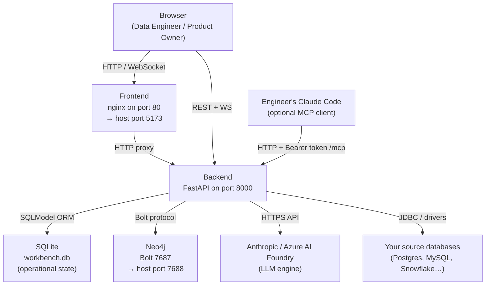
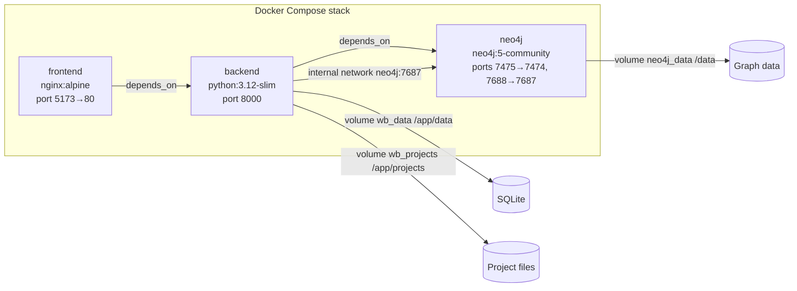

# Data Workbench — Deployment Guide

This guide explains how to deploy Data Workbench in your environment, from a local development machine to a shared team server. It covers the recommended Docker-based path, the manual (no-Docker) path, every configuration option, and how to secure the system once it is running.

---

## What you are deploying

Data Workbench is a **web application with three components**:

| Component | Technology | What it does |
|---|---|---|
| **Frontend** | React (built to static files, served by nginx) | The browser interface — two persona-scoped shells (Product Workbench for owners, Engineering Workbench for engineers) |
| **Backend** | Python / FastAPI | REST API, WebSocket streaming, pipeline execution engine, MCP control plane |
| **Graph database** | Neo4j | Stores the knowledge graph: schemas, profiling results, data quality rules, data product contracts, lineage |

A fourth component — **SQLite** — is a small embedded database that stores operational state (project list, pipeline run history, chat logs, user accounts). It is embedded inside the backend process and does not need a separate server.

> **Your source databases are separate.** Data Workbench connects to your existing data sources (PostgreSQL, MySQL, Snowflake, Databricks, Oracle, SQL Server) to profile and analyse them, but it never copies your source data into its own storage. You supply those databases yourself.

### How the pieces connect



The backend is the central hub. It coordinates everything else: it runs pipeline stages by calling the LLM, reads and writes the knowledge graph in Neo4j, persists pipeline state in SQLite, and connects to your source databases on demand.

---

## Prerequisites

### For Docker Compose (recommended)

| Requirement | Minimum version |
|---|---|
| Docker Engine | 24+ |
| Docker Compose (v2 plugin) | 2.20+ |
| An Anthropic or Azure AI Foundry API key | — |
| Network access to `api.anthropic.com` (or your Foundry endpoint) from the backend container | — |

No Python, Node.js, or database installation is needed on the host.

### For manual (no-Docker) installation

| Requirement | Minimum version |
|---|---|
| Python | 3.12+ |
| Node.js + npm | 20+ |
| Neo4j | 5.x |
| An Anthropic or Azure AI Foundry API key | — |

---

## Option A — Docker Compose (recommended)

This is the fastest path to a working system. Docker Compose launches all three services (frontend, backend, Neo4j) with a single command, wires them together, and manages data persistence through Docker volumes.

### 1. Create a `.env` file

In the same directory as `docker-compose.yml`, create a file called `.env`. This file is **git-ignored** — it holds your secrets.

A minimal `.env` that gets the system running:

```bash
# Required: an LLM credential — ONE of Foundry (key + resource), a direct
# ANTHROPIC_API_KEY, or CLAUDE_CODE_OAUTH_TOKEN from your own Claude Code
# subscription (see "Configuring the AI engine" below)
ANTHROPIC_FOUNDRY_API_KEY=your-foundry-key-here
ANTHROPIC_FOUNDRY_RESOURCE=your-resource-name

# Required for any shared deployment: bearer tokens for MCP API access
# Format: token:label  (or just: token for unrestricted local dev)
WB_MCP_TOKENS=my-secret-token:engineer-name
```

For a secured, shared deployment also add:

```bash
# Enable JWT login (password-protected UI)
WB_AUTH_SECRET=a-long-random-string-at-least-32-chars

# The public URL of the backend (important when engineers install MCP kits)
WB_PUBLIC_BASE_URL=https://workbench.mycompany.com

# The public URL of the frontend (added to CORS allow-list)
WB_FRONTEND_URL=https://workbench.mycompany.com
```

### 2. Build and start

From the repository root:

```bash
docker compose up -d --build
```

The first build will take several minutes because the backend image downloads a ~130 MB language embedding model (used for the Concept-Guided semantic search feature). Subsequent builds are much faster because Docker caches this step.

When the build completes, the system is available at:

| URL | What it is |
|---|---|
| `http://localhost:5173` | The web UI |
| `http://localhost:8000` | The backend API (REST + WebSocket + MCP) |
| `http://localhost:7475` | Neo4j browser (graph query console) |
| `http://localhost:8000/api/health` | Liveness check — returns `{"status": "ok"}` |

### 3. Verify it is running

```bash
# Check all three containers are up
docker compose ps

# Confirm the backend is healthy
curl http://localhost:8000/api/health
```

### 4. Services at a glance



**Note on ports:** Neo4j is mapped to non-standard host ports (7475/7688) deliberately. This avoids clashing with a Neo4j that might already be running locally on the standard ports (7474/7687). The backend reaches Neo4j *inside* the Docker network on the standard ports — so the `WB_NEO4J_PORT` environment variable should remain `7687` (the internal port), not `7688`.

### 5. Data volumes

Docker volumes keep your data safe across container restarts and rebuilds:

| Volume | Mounted at | What is stored there |
|---|---|---|
| `wb_data` | `/app/data` | `workbench.db` — the SQLite operational database (projects, users, pipeline history, chat) |
| `wb_projects` | `/app/projects` | Per-project scratch files (discovery YAML, profiling output, agent artefacts) |
| `neo4j_data` | `/data` | The entire Neo4j knowledge graph |

To stop the system while keeping all data:
```bash
docker compose down
```

To stop and **delete all data** (full reset):
```bash
docker compose down -v
```

### 6. Connecting to your source database from inside the container

When your source PostgreSQL (or other database) runs on the host machine, you cannot use `localhost` as the hostname inside the container — `localhost` inside a container refers to the container itself. Use `host.docker.internal` instead:

```
# In the "Select Data Source" step, use this as the host:
host.docker.internal
```

The Compose file already configures this (`extra_hosts: host.docker.internal:host-gateway`) so the container can resolve this name.

### 7. Stopping and updating

```bash
# Stop without removing data
docker compose down

# Pull latest code changes and rebuild
git pull
docker compose up -d --build
```

---

## Option B — Manual installation (no Docker)

Use this path when you cannot use Docker, or for development work where you want to edit and hot-reload the code.

### Backend

```bash
# 1. Create and activate a Python 3.12 virtual environment
python3 -m venv env
source env/bin/activate   # Windows: env\Scripts\activate

# 2. Install Python dependencies
pip install -r workbench/backend/requirements.txt

# 3. Configure environment (copy and edit as needed)
cp .env.example .env     # or create .env manually — see configuration reference below

# 4. Start the backend (hot-reload mode)
uvicorn workbench.backend.main:app \
  --reload \
  --reload-exclude 'env/*' \
  --reload-exclude 'projects/*'
```

The backend is now available at `http://localhost:8000`.

**Neo4j**: You need a running Neo4j 5.x instance. The easiest way on a local machine is to run just the Neo4j container:

```bash
docker run -d \
  --name neo4j \
  -p 7474:7474 -p 7687:7687 \
  -e NEO4J_AUTH=neo4j/workbenchpass \
  neo4j:5-community
```

Then set `WB_NEO4J_PASSWORD=workbenchpass` in your environment (or `.env` file).

### Frontend

```bash
cd workbench/frontend

# Install dependencies
npm install

# Development server (hot-reload)
npm run dev
```

The frontend is available at `http://localhost:5173`.

For a **production-quality static build** (served by nginx or any web server):

```bash
# Set the backend URL before building
VITE_API_BASE=http://your-backend-host:8000 npm run build
# Output is in workbench/frontend/dist/
```

> **Important:** `VITE_API_BASE` is baked into the built JavaScript at build time. If you move the backend to a different host later, you must rebuild the frontend.

---

## Configuring the AI engine

Data Workbench uses Anthropic's Claude models to run pipeline stages (data discovery, quality rule generation, metadata enrichment, etc.). You need one of three credentials: a direct Anthropic API key, access through Microsoft Azure AI Foundry, or — on a personal workstation — a token minted from your own Claude Code subscription.

### Option 1: Anthropic API (direct)

If you have a direct Anthropic API key, set it as a standard environment variable:

```bash
ANTHROPIC_API_KEY=sk-ant-...
```

No other AI-related configuration is needed. The backend picks up the key automatically via the Claude Agent SDK. Put it in `.env` — `docker-compose.yml` forwards it into the backend service, so it works in both `dwb up` modes.

### Option 2: Azure AI Foundry

If your organisation routes API calls through Azure AI Foundry:

```bash
ANTHROPIC_FOUNDRY_API_KEY=your-foundry-key
ANTHROPIC_FOUNDRY_RESOURCE=your-resource-name   # REQUIRED — no default
ANTHROPIC_FOUNDRY_MODEL=claude-opus-4-8          # optional — the deployed model name in your Foundry instance
```

> **`ANTHROPIC_FOUNDRY_RESOURCE` has no default and is required.** It names your own private Azure resource, so there is deliberately nothing in the source to fall back on. Setting the key without the resource is a **hard `./dwb doctor` failure** that blocks `./dwb up`; if you bypass the launcher, the backend logs an error at startup and every LLM stage fails against Foundry.

When `ANTHROPIC_FOUNDRY_API_KEY` is set, the backend automatically:
1. Sets `CLAUDE_CODE_USE_FOUNDRY=1` to route calls through Foundry
2. Overrides all model tier environment variables to point to your deployed model name

This means all pipeline stages use the same Foundry-deployed model regardless of what tier they request. That single pin is deliberate: a Foundry resource only serves the model *deployments* that exist on it, so an un-deployed tier would 404 with `DeploymentNotFound`. Per-tier Foundry deployments are not configurable today.

### Option 3: Claude Code subscription token

For a developer who already runs Claude Code on their workstation and has neither an API key nor Foundry access. Mint a portable token from the existing login:

```bash
claude setup-token      # interactive; opens a browser and prints the token
```

Put the printed value in `.env`:

```bash
CLAUDE_CODE_OAUTH_TOKEN=<token from setup-token>
```

The token is valid for **one year**, so nothing has to refresh it. No other configuration is needed and there is no backend code path for it: the Agent SDK *is* Claude Code — it spawns the bundled CLI with this process's environment, and the CLI resolves the token itself. `docker-compose.yml` forwards the variable into the backend service, so this is the one subscription route that works under `dwb up` in **both** modes.

> **This is a personal credential.** It bills that one person's Claude subscription and carries their identity. Use it on your own laptop only — a shared or remote deployment must use Option 1 or Option 2. `.env` is gitignored precisely so it never leaves the box.

An *ambient* Claude Code login (the `~/.claude/.credentials.json` on your host) is **not** a substitute under compose: nothing mounts it into the backend container, and its access token expires in hours. The minted token is what makes the subscription portable. `./dwb doctor` detects an ambient login with no key configured and prints the `claude setup-token` command for you.

**Precedence** when more than one is set: `ANTHROPIC_FOUNDRY_API_KEY` → `ANTHROPIC_API_KEY` → `CLAUDE_CODE_OAUTH_TOKEN`.

---

## Full configuration reference

All settings are read from environment variables. In a Docker Compose deployment these come from your `.env` file. In a manual deployment they can be in your shell environment, a `.env` file (if you use `python-dotenv`), or passed as command-line vars.

### AI engine

| Variable | Default | Description |
|---|---|---|
| `ANTHROPIC_API_KEY` | — | Direct Anthropic API key. Used when `ANTHROPIC_FOUNDRY_API_KEY` is not set. |
| `ANTHROPIC_FOUNDRY_API_KEY` | — | Azure AI Foundry API key. Setting this switches the entire system to Foundry. |
| `ANTHROPIC_FOUNDRY_RESOURCE` | — **required with the Foundry key** | Azure Foundry resource name. No default — it names your own resource. |
| `ANTHROPIC_FOUNDRY_MODEL` | `claude-opus-4-8` | Model deployment name in your Foundry instance. |
| `CLAUDE_CODE_OAUTH_TOKEN` | — | Claude Code subscription token from `claude setup-token` (valid 1 year). Lowest precedence. Personal credential — workstation only. |

### Database (SQLite)

| Variable | Default | Description |
|---|---|---|
| `WB_DATABASE_URL` | `sqlite:///workbench.db` (next to the code) | SQLModel database URL. For Docker, set to `sqlite:////app/data/workbench.db` so the file lands on the persistent volume. |

### Graph database (Neo4j)

| Variable | Default | Description |
|---|---|---|
| `WB_NEO4J_HOST` | `localhost` | Neo4j hostname. In Docker Compose, set to `neo4j` (the service name). |
| `WB_NEO4J_PORT` | `7687` | Neo4j Bolt port. Always the internal port (7687), not the remapped host port. |
| `WB_NEO4J_USER` | `neo4j` | Neo4j username. |
| `WB_NEO4J_PASSWORD` | `your_password` | Neo4j password. **Always change this in a shared deployment.** |
| `WB_NEO4J_DATABASE` | `neo4j` | Neo4j database name. |
| `WB_NEO4J_BROWSER_URL` | `http://localhost:7474` | URL for the "Open Neo4j Browser" link in the UI. In the Docker Compose stack set to `http://localhost:7475` (the remapped host port). |

### Networking and CORS

| Variable | Default | Description |
|---|---|---|
| `WB_FRONTEND_URL` | `http://localhost:5173` | Public URL of the frontend. Added to the CORS allow-list so the browser can call the backend API. |
| `WB_PUBLIC_BASE_URL` | (uses request `Host` header) | Trusted public URL of the backend. Baked into MCP kit installers and bootstrap prompts. **Must be set on any shared or remote deployment** to prevent host-header injection. |
| `WB_CORS_ORIGINS` | — | Comma-separated list of extra CORS origins beyond `localhost:5173`, `localhost:3000`, and `WB_FRONTEND_URL`. |

### Authentication and access control

| Variable | Default | Description |
|---|---|---|
| `WB_AUTH_SECRET` | — (auth disabled) | A secret string used to sign session tokens. **Setting this enables authentication.** Use a long, random value (e.g. `openssl rand -hex 32`). |
| `WB_AUTH_REQUIRE` | `0` | When `1`, the backend refuses to start if `WB_AUTH_SECRET` is empty. Prevents accidental open-access deployments. |
| `WB_AUTH_TOKEN_TTL_HOURS` | `12` | How long a login session lasts (hours) before the user must log in again. |
| `WB_READ_ONLY` | `0` | Global read-only mode. Set to `1` to block all writes (useful for demo instances or maintenance). Takes effect immediately — no restart needed. |

### MCP API tokens

The MCP interface (`/mcp` and `/po-mcp`) is how engineers and product owners connect from their own Claude Code to drive the workbench programmatically.

| Variable | Default | Description |
|---|---|---|
| `WB_MCP_TOKENS` | — (MCP inaccessible) | Comma-separated bearer tokens. **Required for any shared deployment.** See token format below. |
| `WB_MCP_ALLOW_INSECURE` | `0` | When `1`, the MCP servers run without token enforcement. **Local development only — never set on a shared deployment.** |
| `WB_ENFORCE_ACCEPT_GATE` | `0` | When `1`, a product request must be formally accepted by an engineer before certain pipeline stages can run. |

**Token format** — each token in `WB_MCP_TOKENS` can be one of:

```
token                             # simple token, full access
token:label                       # token with a label (shown in provenance records)
token:label:proj1|proj2           # scoped to specific project codes
token:label:*:engineer            # role bound to token (owner / engineer / viewer)
```

Example:
```bash
WB_MCP_TOKENS=abc123:alice-engineer:*:engineer,def456:bob-owner:*:owner,xyz789:readonly:*:viewer
```

### Observability (OpenTelemetry)

Data Workbench speaks **OpenTelemetry (OTLP)**. Telemetry is **opt-in and off by default**: unless you configure an OTLP endpoint, nothing is emitted (no traces, no metrics, no logs, no overhead). Set a single standard env var to turn it on and DW pushes telemetry to **any** OTLP-compatible backend — Honeycomb, Datadog, Grafana Cloud, a self-hosted OpenTelemetry Collector, etc.

What you get when it's on:

- **Claude Code CLI telemetry** — the Claude Agent SDK spawns the Claude Code CLI, which emits **token/cost metrics**, **structured log events**, and **traces** (beta) for every stage / chat / advisor run. This works with **no extra Python packages** — DW just sets the CLI's OTel env vars.
- **Backend self-instrumentation** — FastAPI **request spans** and a **parent span around each SDK stage run**, so the CLI's spans stitch into one end-to-end trace across the subprocess boundary. The internal token/cost ledger is also bridged to OTel metrics (`wb.llm.tokens`, `wb.llm.cost_usd`). Requires the `opentelemetry-*` packages, which are baked into the container image.

| Variable | Default | Description |
|---|---|---|
| `OTEL_EXPORTER_OTLP_ENDPOINT` | — (**telemetry off**) | **The on-switch.** Base OTLP URL of your collector/backend (e.g. `http://otel-collector:4318`). Set it and DW starts exporting; leave it unset and nothing is emitted. |
| `OTEL_EXPORTER_OTLP_PROTOCOL` | `http/protobuf` | OTLP transport. Default targets the `:4318` HTTP port. Set `grpc` (with a `:4317` endpoint) to use gRPC. |
| `OTEL_EXPORTER_OTLP_HEADERS` | — | Extra OTLP headers, e.g. a vendor API key: `x-api-key=…` (Honeycomb/Datadog/Grafana Cloud auth). |
| `OTEL_RESOURCE_ATTRIBUTES` | `service.namespace=data-workbench` | Merged resource attributes. DW adds `service.namespace=data-workbench`; the backend's own `service.name` is `data-workbench-backend` (the CLI keeps `claude-code`). |
| `CLAUDE_CODE_ENABLE_TELEMETRY` / `CLAUDE_CODE_ENHANCED_TELEMETRY_BETA` | auto (`1` when endpoint set) | The CLI's master switch + traces-beta flag. DW sets these for you; override to opt out of a signal. |
| `OTEL_{TRACES,METRICS,LOGS}_EXPORTER` | auto (`otlp` when endpoint set) | Per-signal exporter selection. Set one to `console` to print to stderr for a quick local check, or `none` to disable that signal. |
| `OTEL_LOG_USER_PROMPTS` | — (**off**) | **Content capture.** DW never sets this. Turn it on only if you accept that prompt/response **content** (which can embed connection details) will be exported. |

**Reference collector (dev):** to *see* the telemetry immediately, `dwb up --with observability` launches a bundled all-in-one collector (Grafana **otel-lgtm**: OTLP in + Grafana UI with Prometheus/Tempo/Loki) and auto-points the stack at it — Grafana on `http://localhost:3111`, OTLP on `:4318`/`:4317`. It's a **reference visualizer only**; DW has no runtime dependency on it. If you set `OTEL_EXPORTER_OTLP_ENDPOINT` yourself, that always wins (point it at your own platform instead).

**Quick local check (no collector):** set `OTEL_TRACES_EXPORTER=console OTEL_METRICS_EXPORTER=console OTEL_LOGS_EXPORTER=console` alongside any `OTEL_EXPORTER_OTLP_ENDPOINT`, run a stage or the chat drawer, and watch the backend logs — the CLI prints spans/metrics/logs as JSON.

---

## Setting up authentication

By default, authentication is **disabled** — anyone who can reach the URL can use the system as an engineer. For a team deployment you will almost certainly want to enable it.

### Step 1: Enable authentication

Add to your `.env` (or environment):

```bash
WB_AUTH_SECRET=<a-long-random-secret>
WB_AUTH_REQUIRE=1
```

Generate a suitable secret with:
```bash
openssl rand -hex 32
```

After restarting the backend (or the Docker Compose stack), the system will require login.

### Step 2: Create user accounts

The `seed_users.py` script creates login accounts in the SQLite database. Run it from the repository root (with the virtual environment active for a manual install, or via `docker compose exec` for Docker):

```bash
# Manual install
env/bin/python scripts/seed_users.py \
  --email alice@example.com \
  --name "Alice (Product Owner)" \
  --role owner \
  --password 'ChangeMe123!'

env/bin/python scripts/seed_users.py \
  --email bob@example.com \
  --name "Bob (Engineer)" \
  --role engineer \
  --password 'ChangeMe123!'

# Docker Compose
docker compose exec backend \
  python scripts/seed_users.py \
  --email alice@example.com --name "Alice" --role owner --password 'ChangeMe123!'
```

Running the script again with the same `--email` updates the account. Add `--inactive` to disable a login without deleting it.

### Two account roles

| Role | Shell | What they can do |
|---|---|---|
| `owner` | Product Workbench | Author data products via wizard, review and validate, deploy and publish |
| `engineer` | Engineering Workbench | Run pipeline stages, review mappings, manage projects |

Within the Engineering Workbench, the engineer can also switch to specialist hats (Data Steward, Data Quality Analyst, Reviewer) in the role selector — these are client-side only and do not require separate accounts.

---

## Setting up the MCP control plane

Engineers and product owners can drive Data Workbench from their own Claude Code installation over MCP — useful for complex operations, scripting, and automation. This is an optional but powerful capability.

### For engineers

The simplest setup is the one-liner installer, which sets up MCP for a specific project directory:

```bash
curl -fsSL http://localhost:8000/api/engineer-kit/install.sh \
  | WORKBENCH_TOKEN=<your-mcp-token> bash -s -- ~/path/to/your-project
```

This writes a `.mcp.json` file and Claude Code skill configuration to the project directory. The engineer then works in that directory in Claude Code; they will see ~116 workbench MCP tools.

### For product owners

```bash
curl -fsSL http://localhost:8000/api/po-kit/install.sh \
  | WORKBENCH_TOKEN=<your-mcp-token> bash
```

This gives the product owner (`/po-mcp`) ~68 MCP tools tailored to the wizard, marketplace, product review, and Blueprint-Library template workflows.

### Verifying MCP connectivity

In Claude Code, after installing a kit, ask: *"List my workbench projects."* This should invoke `mcp__workbench__list_projects` and return your project list.

---

## Optional services

### MySQL sample data (for demos)

The `docker-compose.override.yml` file adds a MySQL 8.0 container pre-loaded with a sample HR dataset:

```bash
# The override is auto-merged — just start the stack as normal
docker compose up -d --build
```

The MySQL sample is available at `localhost:3307` with username `root` and password `hrpass`. To connect a workbench project to it, use `host.docker.internal` as the host (not `localhost`).

### Gitea self-hosted Git server

Also in the override file, an optional Gitea Git server for the "Push to Git" integration feature:

```bash
docker compose up -d --build
# Gitea web UI available at http://localhost:3101
```

After first start:
1. Browse to `http://localhost:3101` and complete the Gitea setup wizard
2. Go to Settings → Applications → Generate a personal access token
3. In Data Workbench, go to Engineering Workbench → Settings → Git Integration, and enter the token

Once configured, Data Workbench can push serving packages, ODCS contracts, and documentation to a per-product Git repository automatically when a product is deployed.

---

## Production hardening checklist

Before sharing the system with your team or exposing it to a network:

- [ ] Set `WB_AUTH_SECRET` to a long random value and restart
- [ ] Set `WB_AUTH_REQUIRE=1` to fail-closed
- [ ] Create accounts for all users with `scripts/seed_users.py`
- [ ] Set `WB_MCP_TOKENS` with labelled, scoped tokens for each user who will use MCP
- [ ] Set `WB_PUBLIC_BASE_URL` to the public backend URL (for kit installers to work)
- [ ] Set `WB_FRONTEND_URL` to the public frontend URL (for CORS)
- [ ] Rebuild the frontend with `VITE_API_BASE` pointing to the production backend
- [ ] Change the default Neo4j password from `workbenchpass` to something strong
- [ ] Use `WB_READ_ONLY=1` on any demo/shared-view instance to prevent accidental writes

---

## Troubleshooting

### The backend fails to start: `No module named 'claude_agent_sdk'`

The correct package is `claude_agent_sdk`, not `claude-code-sdk`. If you installed the wrong one:

```bash
pip uninstall claude-code-sdk
pip install claude-agent-sdk
```

In Docker, this means the `requirements.txt` has the wrong package name. Check the root `requirements.txt`.

### `docker compose up` fails with a build error on the embedding model step

This step downloads ~130 MB from Hugging Face. If you are behind a proxy or have restricted internet access, the download fails. Solutions:
- Configure Docker build args to use your HTTP proxy: `--build-arg HTTP_PROXY=...`
- Pre-cache the model on the host and mount it into the container

### Stages get stuck in "running" and never complete

The backend auto-recovers stages that have been in `running` state for more than 5 minutes (marks them `complete` or `awaiting_review` based on what is in the graph). If a stage is stuck, wait 5 minutes and refresh. If it persists, check the stage execution log via the Pipeline → stage row → View Log.

### The frontend cannot reach the backend: CORS errors in the browser console

The backend CORS allow-list includes `localhost:5173` by default. If you are accessing the frontend at a different origin (different hostname, different port), you must add it:

```bash
WB_CORS_ORIGINS=https://workbench.mycompany.com
```

Or set `WB_FRONTEND_URL=https://workbench.mycompany.com`.

### Engineers get "Not authorized for project X" from MCP

The MCP token is scoped to specific project codes. Either re-generate a token with `:*` (all projects) or add the project code to the token's scope:

```bash
# Scoped to specific projects:
WB_MCP_TOKENS=mytoken:alice:projectA|projectB

# All projects:
WB_MCP_TOKENS=mytoken:alice:*
```

### Source database connection fails inside the container

Connections to databases on the host machine must use `host.docker.internal` as the hostname, not `localhost`. `localhost` inside a container resolves to the container itself.

### Neo4j is unreachable from the backend

In Docker Compose, the backend connects to Neo4j using the **internal** service hostname `neo4j` and the internal Bolt port `7687`. The environment variables should be:

```bash
WB_NEO4J_HOST=neo4j
WB_NEO4J_PORT=7687
```

Not `localhost:7688` (those are the host-mapped ports, only reachable from outside the container network).

---

## Reference: all environment variables in one place

| Variable | Default | Description |
|---|---|---|
| **AI engine** | | |
| `ANTHROPIC_API_KEY` | — | Direct Anthropic API key |
| `ANTHROPIC_FOUNDRY_API_KEY` | — | Azure AI Foundry key (enables Foundry mode) |
| `ANTHROPIC_FOUNDRY_RESOURCE` | — **required with the Foundry key** | Foundry resource name (no default) |
| `ANTHROPIC_FOUNDRY_MODEL` | `claude-opus-4-8` | Foundry model deployment name |
| `CLAUDE_CODE_OAUTH_TOKEN` | — | Claude Code subscription token (`claude setup-token`); workstation only |
| **SQLite database** | | |
| `WB_DATABASE_URL` | `sqlite:///workbench.db` | SQLModel database URL |
| **Neo4j** | | |
| `WB_NEO4J_HOST` | `localhost` | Neo4j hostname |
| `WB_NEO4J_PORT` | `7687` | Neo4j Bolt port |
| `WB_NEO4J_USER` | `neo4j` | Neo4j username |
| `WB_NEO4J_PASSWORD` | `your_password` | Neo4j password |
| `WB_NEO4J_DATABASE` | `neo4j` | Neo4j database name |
| `WB_NEO4J_BROWSER_URL` | `http://localhost:7474` | Link shown in the UI header |
| **Networking** | | |
| `WB_FRONTEND_URL` | `http://localhost:5173` | Frontend URL (CORS + deep links) |
| `WB_PUBLIC_BASE_URL` | (from request `Host`) | Trusted backend origin (kit installers) |
| `WB_CORS_ORIGINS` | — | Extra CORS origins, comma-separated |
| **Authentication** | | |
| `WB_AUTH_SECRET` | — (auth off) | HS256 signing secret — set to enable auth |
| `WB_AUTH_REQUIRE` | `0` | Fail-closed: refuse to start without a secret |
| `WB_AUTH_TOKEN_TTL_HOURS` | `12` | Session token lifetime in hours |
| `WB_READ_ONLY` | `0` | Global read-only kill-switch (live, no restart) |
| **MCP** | | |
| `WB_MCP_TOKENS` | — (MCP inaccessible) | Bearer tokens for `/mcp` and `/po-mcp` |
| `WB_MCP_ALLOW_INSECURE` | `0` | Open MCP without tokens — local dev only |
| `WB_ENFORCE_ACCEPT_GATE` | `0` | Hard-block stage runs on unaccepted requests |
| **Frontend build-time** | | |
| `VITE_API_BASE` | `http://localhost:8000` | Backend origin baked into the SPA build |
