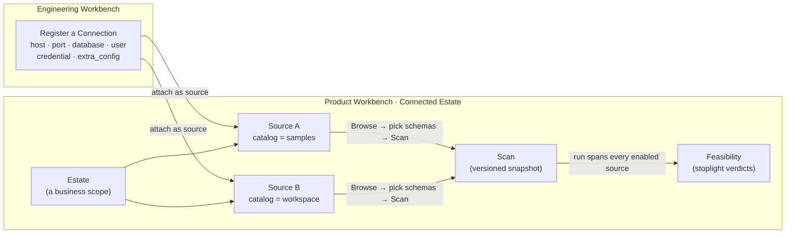

# Estate Discovery (Connected Estate) — setup & connection reference

> **Who this is for:** a Data Product Owner (or anyone driving the Product Workbench)
> who is **connecting a real platform** to Data Workbench and wants the hands-on
> mechanics — per-platform connection fields, the scan drill-down, and troubleshooting.
>
> **New to the capability?** Read **[`data-product-feasibility.md`](data-product-feasibility.md)**
> first — the functional guide to *what* Connected Estate + Feasibility do, **how the
> grading actually works**, and how to use them. This doc is the setup reference that
> pairs with it. The architecture deep-dive is [`connected-estate.md`](connected-estate.md);
> the canonical internals are in the root `CLAUDE.md` and `workbench/backend/CLAUDE.md`.
>
> **Can't grant a live connection?** Use **[`offline-extraction.md`](offline-extraction.md)** —
> add an *offline* source, have the client run the extraction kit in their own
> environment, and upload the reviewable manifest. DW replays it into an estate scan
> identical in shape to a live one, so everything below works unchanged.

## What it is

**Estate Discovery** lets Data Workbench (DW) point at one of your live database
platforms, **scan its metadata** (which schemas, tables, and columns exist —
never the row values), and keep a versioned snapshot of what it found. You then
run **Feasibility** to grade a catalog of *desired* reference data products
against that snapshot with a stoplight.

The whole flow is **top-down**: you start from *what you want* ("I need a Customer
360 with these 30 attributes") and DW answers *how buildable it is right now*
against the estate you connected.

Two entry points on the **Product Workbench Home** page:

- **Connected Estate** (`/product/estate`) — register sources, browse, and scan.
- **Data-Product Feasibility** (`/product/feasibility`) — grade desired products.

### How it differs from Pulse "Discovery"

The Product Workbench nav also has a **Discovery** item — that's a *different*
capability (the **Pulse** integration). Don't confuse the two:

| | **Estate Discovery** (this guide) | **Pulse Discovery** (nav "Discovery") |
|---|---|---|
| Where the estate knowledge comes from | **DW scans a live platform itself** | An external tool (Pulse) hands DW an *assessment* |
| Direction | **Top-down** — desired products → feasibility | Bottom-up — migration / modernization / disposition |
| Reached from | Home → **Connected Estate** / **Data-Product Feasibility** | Nav → **Discovery** |

They're separate bounded contexts and never touch each other's data.

### The stoplight

Feasibility grades every desired product spec into one of four tiers (colours match
the screen — **adaptable is blue**, and **absent is a neutral slate**, not red):

| Tier | Colour | Meaning | What you do next |
|---|---|---|---|
| **`ready`** | 🟢 green | A published product already matches almost exactly. | Adopt / endorse it in the marketplace. |
| **`adaptable`** | 🔵 blue | A close published product exists but needs a bounded adaptation (rename, currency normalize, weekly→monthly aggregation). | Author a consumer product that consumes it. |
| **`assemblable`** | 🟠 amber | The raw data exists in the estate but isn't a governed product yet. | Compose a modernization portfolio via intake. |
| **`absent`** | ⚪ slate | No matching data anywhere. | Note it as a gap. |

> **How each grade is actually decided** — the two-stage schema-then-column matching,
> entity/authority-awareness, composite derivations, and the grain-key gate — is
> explained in plain terms in **[`data-product-feasibility.md`](data-product-feasibility.md)** §5.

## Mental model

A scan is anchored by four things, in this order:

- An **Estate** is a stable business scope (a name + optional domain). It holds
  one or more sources.
- A **Source** is a *registered connection scoped to one catalog*. **Add several
  sources — one per catalog — to cover more of a platform in one estate.**
- A **Scan** is one metadata snapshot of a source's selected schemas. Re-scanning
  makes a *new* version; old snapshots are kept.
- **Feasibility** evaluates a domain's desired specs against the **latest scan of
  every enabled source** — so one run assesses every catalog in the estate.

### 2-level vs 3-level platforms — the key distinction

The single most important setup idea: **how many container levels a platform
has** decides whether you need a *catalog per source*.

| Platform | Levels | The container is… | Sources per connection |
|---|---|---|---|
| **PostgreSQL** | 2-level (`schema.table`) | the connection's **database** | one — the connection *is* the database |
| **MySQL** | 2-level (`database.table`) | the connection's **database** | one — the connection *is* the database |
| **Snowflake** | 3-level (`database.schema.table`) | a **database** chosen per source | **one source per database** |
| **Databricks** | 3-level (`catalog.schema.table`) | a **Unity Catalog** chosen per source | **one source per catalog** |

For 2-level platforms, one connection = one scannable container, so a single
source is all you get (and all you need). For 3-level platforms, **one connection
reaches the whole account/workspace**, and you choose *which catalog* to scan when
you add the source. Two sources on the *same* 3-level connection with *different*
catalogs give you two genuinely different scans; two sources with the *same* (or
no) catalog give you the same scan twice.

> **The load-bearing rule.** For Snowflake and Databricks the **catalog is set on
> the estate _source_, not on the connection.** The connection form never asks for
> a catalog — it only collects the platform's *connection-level* config
> (`http_path` for Databricks; `warehouse`/`role`/`schema` for Snowflake). You pick
> the catalog when you **add the source**, from a picker that enumerates the
> catalogs the connection can see. This is what prevents the classic "two sources,
> identical results" trap (see [Troubleshooting](#troubleshooting)).

## Connections — the crux

A source is always a **registered `PlatformConnection`**. Register one on the
**Engineering Workbench → Connections** page (or over MCP with `create_connection`),
then attach it as an estate source.

### Considerations that hold for every platform

- **Use a read-only, least-privilege user.** The scan only reads metadata
  (schemas / tables / columns / row counts) — a read-only account is enough and
  is safer. The deeper, engineer-gated profiling pass reads row *counts* only (it
  is PII-safe — no value sampling).
- **Prefer an `env:` credential reference over a stored password.** Any credential
  value that starts with `env:VAR` (also `vault:` / `ssm:` / `asm:`) is stored as a
  *reference*, not the secret itself, and resolved at connect time
  (`env:VAR` → the backend process's environment variable `VAR`). A bare value is
  stored as a literal password. `env:` keeps secrets out of the app database.
- **Network reachability.** The **backend** (not your laptop) opens the connection,
  so `host:port` must be reachable from wherever the backend runs (firewalls, VPNs,
  private-link, IP allow-lists all apply to the backend).
- **Serverless warehouse cold-start.** A Databricks SQL warehouse or a Snowflake
  warehouse that has gone to sleep may make the **first Browse/Scan slow or return
  an empty list while it wakes.** Give it a moment and retry — the Browse panel
  even says "a serverless warehouse may take a moment to wake."
- **Databricks Delta-Share catalogs (e.g. `samples`) work.** A shared catalog that
  has no `INFORMATION_SCHEMA` is handled by an automatic `SHOW SCHEMAS` / `SHOW
  TABLES` / `DESCRIBE` fallback, so you can scan `samples` like any other catalog.

### Per-platform setup

The four scannable SQL platforms, side by side. (`env:VAR` works for the
credential on all of them.)

| Field | **PostgreSQL** | **MySQL** | **Snowflake** | **Databricks** |
|---|---|---|---|---|
| **host** | server hostname | server hostname | **account identifier** (e.g. `xy12345.eu-west-1`) | **workspace hostname** (e.g. `dbc-….cloud.databricks.com`) |
| **port** (default) | `5432` | `3306` | `443` (unused — HTTPS) | `443` (unused — HTTPS) |
| **database** (connection field) | the database to scan — **is the scan container** | the database to scan — **is the scan container** | a default Snowflake database (a source's catalog overrides it) | not used by the scan (the source's catalog is authoritative) |
| **username** | DB user | DB user | Snowflake user | *not used* — token auth |
| **credential** | password | password | **password or PAT** | **PAT** (personal access token) |
| **extra_config** | — | — | `warehouse` **(required)**, `role`, `schema` (optional) | `http_path` **(required)** — the SQL warehouse HTTP path |
| **catalog** | n/a (2-level) | n/a (2-level) | **set on the estate _source_** (the database) | **set on the estate _source_** (the Unity Catalog) |

Notes:

- **PostgreSQL / MySQL** need nothing in `extra_config`. The connection's
  `database` field *is* the scan container; there is no catalog to choose.
- **Snowflake**: `host` is the **account identifier**, not a server name;
  `warehouse` is **required** (it runs the metadata queries). A Snowflake PAT
  authenticates as the password. The database is effectively chosen per source via
  the catalog picker.
- **Databricks**: authentication is a **PAT** (entered as the credential — the
  username field is not used); `http_path` (the SQL warehouse HTTP path) is
  **required**. The catalog is chosen per source, never on the connection.

### What is NOT an estate source

Be explicit — some platforms DW supports for *other* things cannot be scanned
here:

| Platform(s) | Status as an estate source | Why |
|---|---|---|
| **s3 / gcs / azure_adls** (object stores) | ❌ not scannable | Artifact-**publish** targets only — no relational metadata to discover. |
| **Oracle** | ❌ not scannable *yet* | No discovery provider yet — Oracle is a Data-Migration **source** only. |
| **SQL Server / Azure SQL** | ❌ not scannable *yet* | No discovery provider yet — a Data-Migration **source** only. |

Only **postgres**, **mysql**, **snowflake**, and **databricks** have a discovery
provider, so only those four can be estate sources.

## Step-by-step

1. **Register a connection.** Engineering Workbench → **Connections** → add the
   platform with the fields from the table above (or `create_connection` over MCP).
   Test it there before using it.
2. **Create an estate.** Product Workbench → Home → **Connected Estate** →
   **New estate** → give it a name (and optional domain) → **Create estate**.
3. **Add a source.** In the selected estate, under **Add a source (registered
   connection)**, pick your registered connection. The page probes it for catalogs
   and shows one of three UIs:
   - **Catalog-scoped platform with listable catalogs (Snowflake/Databricks)** — a
     **catalog → schema tree**. Tick whole catalogs with the **Select all catalogs**
     master checkbox, or expand a catalog and tick individual schemas (with per-catalog
     **all / none** shortcuts). **Add selected (n)** creates **one source per ticked
     catalog**, each with its own saved schema selection — a partial failure is reported
     per catalog and already-added catalogs are chipped and disabled. If no catalogs can
     be listed, a **free-text catalog box + Add** fallback appears.
   - **2-level platform (Postgres/MySQL)** — no catalog; a single **Add source**.
4. **Browse & select schemas.** Click **Browse** on the source to list its live
   schemas (with relation counts). Tick the schemas you want (with **Select all /
   Select none**).
   - **Save selection** persists the choice without scanning.
   - **Scan selected** persists the choice *and* launches a scan immediately.
   - (Plain **Scan** on the source row uses the last saved selection.)
   While a scan runs you get a **live progress bar** ("Scanning *`schema`* · 4/9
   schemas · 132 tables · 1,847 columns"); when it finishes, a **"Scanned *timestamp*
   · *duration*"** line appears.
5. **Read the scan results.** The **Scans** panel lists each scan, **labelled
   `v2 · source-name · catalog`** with a state chip and a rollup (datasets · columns ·
   size · assets · new · tombstoned). Click a completed/partial scan to **expand it**:
   - Per-**schema** sections with an outcome chip — `scanned`, `empty`,
     `inaccessible`, `partial`, or `connection failed` — plus table/column counts (and
     any detail message), and (once enriched) a one-line schema description.
   - Under each schema, its **tables** (name, kind, `~`-estimated row count, size,
     column count) and a **View descriptions** button; click a table to drill into its
     **columns** (name, data type, and a **PII** chip on name-classified columns).
   - **Code Assets** (Snowflake/Databricks) list any tasks / notebooks / pipelines /
     procedures the scan observed.
6. **Enrich the metadata (recommended before grading).** Click **Enrich metadata** in
   the Scans header to generate AI descriptions for the estate's tables and columns. A
   live enrichment bar shows progress and a **"✓ Metadata enriched · *timestamp*"** line
   confirms it. This materially improves grading accuracy — the grader leans on schema-
   and table-level *text* to decide relevance (see the functional guide §5.2). The
   Feasibility page warns you if a scan isn't enriched.
7. **Edit / disable / remove a source.** Rename with ✎; **Disable** to exclude it
   from feasibility without deleting; re-**Browse → Save** to change the schema
   selection; **Remove** to hard-delete the source and cascade away its scans.
   The **catalog is immutable once scanned** (there's no edit-catalog control) — to
   change it, **Remove and re-add** with the new catalog.
8. **Run Feasibility.** Go to **Data-Product Feasibility**, pick an **estate** and a
   **domain**. Optionally click **✨ Recommend definitions** to let DW pre-select the
   plausible ones, tick your set in the spec picker, tune the **schema floor** / **max
   schemas** / **scope-to-matched-schemas** levers if needed, and **Evaluate**. A run
   **spans the latest scan of every enabled source**, so it assesses all your catalogs
   together. A live progress bar tracks *shortlisting → building evidence → evaluating →
   finalizing*. Then act on each verdict (adopt / author-consumer / compose-portfolio),
   and **★ Save** any result as a candidate for your backlog. (See the functional guide
   §6–§7 for reading and acting on results.)

> The same flow is available over MCP on the PO front door (`/po-mcp`, 14 PO tools
> for this capability): `create_estate`, `add_estate_source`, `list_estate_catalogs`,
> `update_estate_source`, `remove_estate_source`, `list_estate_namespaces`,
> `run_estate_scan`, `get_estate_scan`, `get_estate_scan_datasets`,
> `get_estate_scan_assets`, `list_feasibility_specs`, `evaluate_feasibility`,
> `get_feasibility_run`, `create_product_from_spec`.

## Troubleshooting

**"I added two sources on the same Databricks/Snowflake connection and both scans
returned identical results."**
This is the setup trap the catalog rule prevents. If neither source has a catalog
set, both bind to the **warehouse's default catalog** — same connection + no
catalog = the *same* scan twice, by design. **Fix:** give each source a *distinct*
catalog. Because the catalog is immutable once scanned, **Remove** the two sources
and **re-add** them scoped to different catalogs (e.g. one `samples`, one
`workspace`), then scan each. The results now differ, and the Scans panel labels
each row with its catalog so you can tell them apart.

**"Browse returns no schemas / an empty list."**
Usually a **cold serverless warehouse** — wait a few seconds and Browse again. On
Databricks Delta-Share catalogs (e.g. `samples`) the first listing goes through
the `SHOW SCHEMAS`/`DESCRIBE` fallback and can be a little slower; it still works.
If it stays empty, confirm the connection's `warehouse` (Snowflake) or `http_path`
(Databricks) is correct and the account can actually see that catalog.

**"The PAT / credential is missing or rejected."**
If you used an `env:VAR` reference, make sure `VAR` is set **in the backend's
environment** (the backend resolves it, not your browser). A rejected token is
usually expired or lacks scope — regenerate the PAT and update the connection. A
scan that couldn't connect records a **`connection failed`** outcome rather than a
misleading empty result.

## Honest gaps

- **Table-level scan selection.** Selection is **schema-grained today** — you pick
  which *schemas* to scan, not individual tables within a schema. (The whole schema
  is scanned once selected.)
- **A single scan across multiple catalogs.** One source = one catalog. You cover
  several catalogs by adding **one source per catalog** (feasibility spans them
  all), but a *single* scan that enumerates *across* catalogs is not yet supported.
- **Oracle / SQL Server / object-store scanning.** Not estate sources — Oracle and
  SQL Server are migration sources only (no discovery provider yet), and object
  stores (s3/gcs/azure_adls) are artifact-publish targets only.
- **FK-based joinability.** For `assemblable` verdicts, joins are inferred from
  shared identity-key *names* (the metadata scan carries no foreign-key
  constraints); real FK introspection is a follow-up. See
  [`connected-estate.md`](connected-estate.md) for the full deferred-work list.
