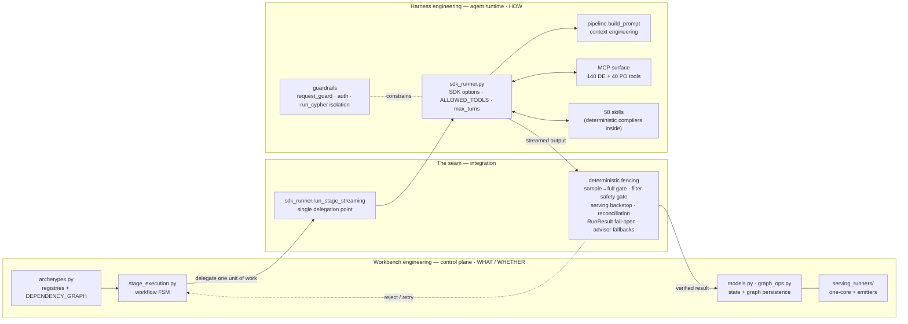
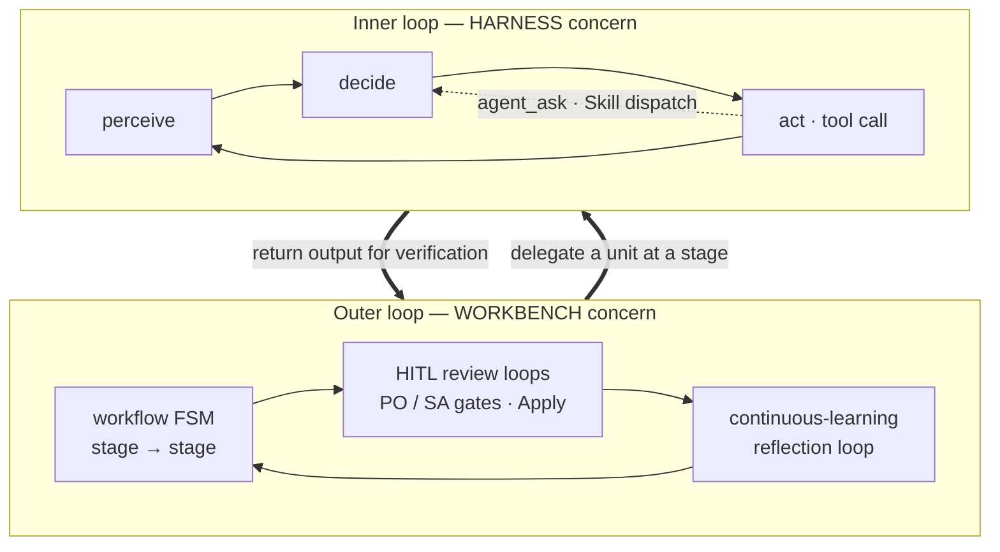

# Harness engineering vs. Workbench engineering

A framing lens for the Data Workbench. It is *not* a new subsystem or a code change —
it is a vocabulary for reasoning about (and staffing) the two engineering disciplines
that make up an agentic data platform. It collapses the 6-layer model in
[`research/techarch.md`](../research/techarch.md) §2 into two disciplines plus the seam
that joins them.

## Verdict

The two-layer split is **correct and load-bearing**, and this codebase happens to draw
the boundary more crisply than most agentic systems do. The split holds because it maps
to *responsibility*, not technology.

## The axis is responsibility, not "deterministic vs. agentic"

The tempting cut — "deterministic code vs. agentic code" — is wrong, because both
disciplines contain both kinds of code:

- Deterministic code lives *inside* the harness: skills carry compilers like
  `workbench-skills/skills/*/scripts/generate_view_ddl.py` (a ~3,900-line SQL compiler),
  which is as deterministic as anything in the backend.
- Agentic calls live *inside* the workbench: there are one-shot LLM advisor call sites
  invoked directly from backend orchestration.

The clean axis is *what each discipline is responsible for*:

- **Workbench engineering owns WHAT and WHETHER** — sequencing, dependencies, gates,
  persistence, verification, emitters. The control plane.
- **Harness engineering owns HOW** the model performs one delegated unit of work —
  context, tools, skills, constraints. The agent runtime.

## The mapping

| Discipline | Owns | Concrete code |
|---|---|---|
| **Workbench engineering** (control plane) | what / whether / persistence / verification | `archetypes.py` (workflow/stage registries, `DEPENDENCY_GRAPH`), `stage_execution.py` (the workflow FSM), `models.py` (SQLModel state), `graph_ops.py` (Neo4j persistence), `serving_runners/` (one-core `_deploy_core.py` + the `run_*.py` emitters), and the verification gates |
| **Harness engineering** (agent runtime) | how the model does one delegated unit of work | `sdk_runner.py` (SDK options, `ALLOWED_TOOLS` allowlist, `max_turns`, anti-exploration prompt), `config.py` (Foundry/model pinning), the MCP surface (140 DE tools in `mcp_server.py` + 40 PO tools in `po_mcp_server.py`), the 58 vendored skills, `pipeline.build_prompt`, and the guardrails (`request_guard.py`, MCP auth, `run_cypher` project isolation, chat "Forbidden" section, `llm_usage.py`) |
| **The seam** (integration) | single hand-off + fencing | `sdk_runner.run_stage_streaming`; the deterministic fencing around it (serving backstop, sample→full gate, filter safety gate, reconciliation, `RunResult` fail-open, advisor heuristic fallbacks) |

## System view

The control plane sequences work and decides *whether* to trust results; the agent
runtime decides *how* to produce one unit of work; the seam is the one place they touch —
a single delegation call wrapped in deterministic fencing that verifies before persisting.

## The seam is a first-class third thing

There is essentially **one delegation point** — `sdk_runner.run_stage_streaming` — where
the deterministic control plane hands a unit of work to the agent. The high-value
engineering is the *fencing* the workbench wraps around that hand-off: it never trusts
the harness's output blindly. The serving backstop, the sample→full verification gate,
the filter safety gate, migration reconciliation, `RunResult` fail-open, and the
deterministic fallbacks behind the one-shot advisors all live here. This "bring the
deterministic and agentic parts together, then verify" is a **workbench-engineering**
responsibility exercised *about* the harness's output — which is why the seam deserves to
be named, not folded silently into either side.

## "Loop engineering" is a lens across both layers, not a third layer

When someone says "loop engineering," disambiguate which loop:

- **Inner loop** — the agent's perceive→decide→act loop (`max_turns`, the tool loop,
  mid-run `agent_ask`, sub-agent Skill dispatch). A **harness** concern.
- **Outer loop** — the workflow FSM + HITL review loops + the continuous-learning
  reflection loop. A **workbench** concern.

So loop engineering spans both disciplines; it is a lens, not a layer.

## The architect's narrative

A version a tech architect can say out loud — to a new engineer, in a design review, or
over a slide.

> **"We build this platform along three engineering axes: workbench, harness, and loop.**
>
> **Workbench engineering is the control plane** — it's deterministic backend code, and
> it owns *what* runs and *whether* we trust the result. It knows the workflow graph, the
> stage dependencies, the review gates, how state is persisted to SQLite and the Neo4j
> knowledge graph, and how a finished product is emitted to a serving platform. If you
> can point at a place where the system *decides the order of things* or *refuses to
> proceed until something is verified*, that's workbench engineering. It is the part that
> would still make sense if you deleted every LLM call — it just wouldn't do anything
> intelligent.
>
> **Harness engineering is the agent runtime** — it owns *how* the model performs one
> delegated unit of work. It's everything we assemble around the model for a single
> turn-taking session: which model and endpoint we pin, the system and stage prompts we
> build, the tool allowlist and the 140 DE plus 40 PO MCP tools the agent can call, the 58 skills
> it can dispatch, and the guardrails that keep it inside its lane — project isolation,
> auth, the acceptance gate, token accounting. A useful tell: harness engineering contains
> plenty of deterministic code too — a skill can ship a 3,900-line SQL compiler — because
> the distinction isn't 'deterministic vs. AI,' it's *who is responsible for the outcome*.
> The harness is responsible for doing one job well; it is not responsible for deciding
> which job comes next.
>
> **Loop engineering isn't a third layer — it's the lens you use when you talk about
> control flow, and it deliberately cuts across the other two.** There's an *inner loop*,
> which is the agent's own perceive–decide–act cycle inside a single session — bounded by
> max turns, able to ask a human mid-run or spin up a sub-agent. That's a harness concern.
> And there's an *outer loop*, which is the workflow state machine, the human-in-the-loop
> review cycles, and the continuous-learning reflection loop that improves the skills over
> time. That's a workbench concern. When someone says 'the loop,' the first question is
> always *which* loop.
>
> **And the whole thing lives or dies at the seam.** There is essentially one place where
> the deterministic control plane hands work to the agent — a single streaming delegation
> call — and the highest-value engineering we do is the *fencing* around it: we never
> persist what the agent produced without verifying it. Sample-then-full gates, filter
> safety checks, reconciliation, fail-open result handling, deterministic fallbacks behind
> every advisor. So the honest one-liner is: **the workbench decides and verifies, the
> harness performs, the loop lens tells you which cadence you're reasoning about, and the
> seam is where trust is negotiated.**"

## Relationship to `research/techarch.md`

This is the two-discipline compression of the detailed model. For the full breakdown see
[`research/techarch.md`](../research/techarch.md) §2 (the layered view) and §5 (the master
mapping table); this document is the staffing/reasoning shorthand, techarch.md is the
backing detail.

## Maintenance note

The tool counts above (116 DE / 34 PO) are asserted against the live `@mcp.tool()` /
`@po_mcp.tool()` decorator counts by `workbench/backend/tests/test_docs_consistency.py`.
If that test fails on this file, update the numbers here to match the live count.
