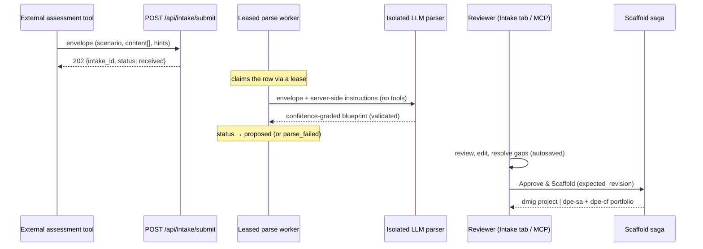
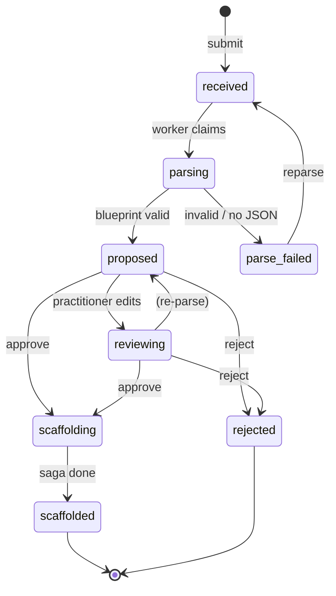
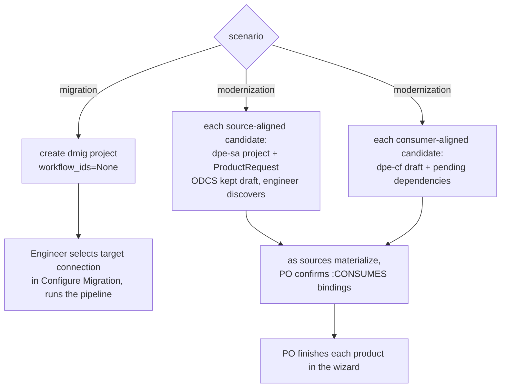

# Inbound intake — turn external assessments into scaffolded projects

## What this is

An external assessment tool evaluates an organization's data estate — its applications, datasets,
data products, and platforms — and produces **data-migration** and **data-modernization**
recommendations. **Inbound intake** is the front door that lets that tool *push* its findings into
Data Workbench, where they become real, ready-to-work projects.

Because the incoming content is usually **unstructured and inconsistent** (prose, spreadsheets, the
occasional data contract), Data Workbench uses an LLM to normalize whatever it's given into a
strict, **confidence-graded blueprint**. A practitioner then reviews and edits that blueprint — the
system never scaffolds anything a human hasn't approved — and on approval the right project(s) are
created for them to finish.

> **Status.** Implemented and tested end-to-end: the submit API, the isolated parser, the review UI
> (an *Intake* tab in each workbench), and both scaffold flows, plus MCP review parity. Example
> payloads live in `samples/intake/`.

## What it enables

- **A single inbound integration point** (`POST /api/intake/submit`) any external system can push to,
  authenticated by a scoped machine credential — no bespoke import script per tool.
- **Tolerance of messy input.** You send whatever structure you have; the parser extracts what it
  can and honestly marks the rest `missing` for a human to fill. Nothing is rejected for being
  sparse.
- **Two outcomes from one pipeline:**
  - **Migration** → a `dmig` (raw lift-and-shift) engineering project, pre-populated for the engineer.
  - **Modernization** → a *portfolio*: candidate source-aligned (`dpe-sa`) and consumer-aligned
    (`dpe-cf`) data-product projects a Product Owner completes in the existing wizards.
- **Human-in-the-loop by design.** Every submission is staged and reviewed; high-confidence fields
  are pre-accepted, ambiguous ones are flagged, and approval is gated until gaps are resolved.

## End-to-end flow



### Submission lifecycle



### What gets scaffolded



## The envelope (what the external tool sends)

`POST /api/intake/submit` with a JSON body:

| field | required | notes |
|---|---|---|
| `scenario` | **yes** | `"migration"` or `"modernization"`. |
| `external_ref` | **yes** | Your stable id for this finding/engagement. Re-POSTing the same `external_ref` **updates the same submission** (idempotent — safe to retry). |
| `content[]` | **yes (≥1)** | Heterogeneous parts, each `{kind, title, media_type?, body}`. `kind` ∈ `text \| table \| odcs \| json`. `body` is a string (or a JSON object for `kind:"json"`). |
| `hints` | no | Structured nudges you already know: `source_platform`, `target_platform`, `domain`. |
| `metadata` | no | Free-form passthrough, preserved verbatim (report id, your confidence, timestamps…). |

**You do not send `source_system`** — it is derived from your credential (provenance is trusted from
the token, never the body). More structure → higher parser confidence → fewer fields a human must
confirm; but prose-only works, unknowns just come back as `missing`.

The parser output is validated against a strict internal schema (`intake_blueprint.py`): every graded
value is `{value, confidence: high|medium|low|missing, why}`, every candidate has a stable id, and a
structural mismatch becomes `parse_failed` — required fields are never fabricated.

## Example payloads

Four ready-to-send examples in `samples/intake/`, spanning the structure/completeness range:

| file | scenario | structure | what it demonstrates |
|---|---|---|---|
| `migration-structured.json` | migration | **high** | `hints` with source/target platforms + a CSV table of datasets/columns/types + a prose recommendation. Parses to a near-complete migration blueprint with few gaps. |
| `migration-freeform.json` | migration | **low** | Prose only (an analyst note), source platform hinted, **target platform unstated** → the parser marks it `missing` and raises a gap for the engineer to fill. |
| `modernization-portfolio.json` | modernization | **high** | Prose + a JSON application inventory + an embedded **ODCS** draft contract + explicit source→consumer relationships → a portfolio of source- and consumer-aligned candidates with dependency edges. |
| `modernization-sparse.json` | modernization | **low** | A thin, vague modernization goal → low-confidence candidates the PO shapes heavily during review. |

See `samples/intake/README.md` for the field-by-field contract you can hand to the external-tool team.

## How to invoke

### 1. Configure a submission credential

Set a scoped machine credential (format `token:source_system`, comma-separated for several):

```bash
export WB_INTAKE_TOKENS="s3cr3t-token:acme-estate-analyzer"
```

For local testing you can instead set `WB_INTAKE_ALLOW_INSECURE=1`, which seeds a single dev token
`dev-intake-token` with `source_system=dev-intake`. (Submission is a mutation, so it is blocked when
the instance is in read-only mode.)

### 2. Submit a payload

```bash
curl -X POST http://localhost:8000/api/intake/submit \
  -H "Authorization: Bearer dev-intake-token" \
  -H "Content-Type: application/json" \
  --data @samples/intake/migration-structured.json
# → {"intake_id": 1, "status": "received"}
```

Post the others the same way:

```bash
for f in migration-freeform modernization-portfolio modernization-sparse; do
  curl -sS -X POST http://localhost:8000/api/intake/submit \
    -H "Authorization: Bearer dev-intake-token" \
    -H "Content-Type: application/json" \
    --data @samples/intake/$f.json ; echo
done
```

The submit returns immediately; the background worker parses the envelope within a few seconds and
flips the submission to `proposed` (or `parse_failed`).

### 3. Review and approve

Three equivalent surfaces — use whichever fits:

**Web UI (recommended).** Open the **Intake** tab:
- Migration submissions → **Engineering Workbench → Intake** (`/engineer/intake`).
- Modernization submissions → **Product Workbench → Intake** (`/product/intake`).

Click a row to open the blueprint review. High-confidence fields are pre-accepted; low/`missing`
fields are highlighted. Edit values (an edit stamps the field high-confidence), toggle
include/exclude on portfolio candidates, and clear each gap with **Mark resolved**. Edits autosave
(and a failed save blocks approval). When no gaps remain, **Approve & Scaffold**.

**MCP (headless).** The engineer's `/mcp` and the PO's `/po-mcp` each expose four review tools —
`list_intake_submissions`, `get_intake_submission`, `approve_intake_submission`,
`reject_intake_submission` (defaulted to migration and modernization respectively). *Submission stays
REST-only* — an agent reviews and approves, it doesn't submit.

**REST directly:**

```bash
# list proposed submissions
curl -sS "http://localhost:8000/api/intake?scenario=migration&status=proposed"

# inspect one (includes approval_blockers)
curl -sS http://localhost:8000/api/intake/1

# edit the blueprint (optimistic concurrency: expected_revision must match)
curl -sS -X PATCH http://localhost:8000/api/intake/1/blueprint \
  -H "Content-Type: application/json" \
  -d '{"expected_revision": 1, "blueprint": { ... }}'

# approve → run the scaffold saga
curl -sS -X POST http://localhost:8000/api/intake/1/approve \
  -H "Content-Type: application/json" -d '{"expected_revision": 2}'
```

`approve` is gated on the current `expected_revision` and refuses while gaps remain. It is
**idempotent and resumable** — a retried approve never creates a duplicate project.

### 4. Finish the scaffolded work

- **Migration:** the new `dmig` project appears in the engineer's project list. The engineer picks a
  target connection in **Configure Migration** (the parser deliberately doesn't invent one), then
  runs discovery → assess → generate → transfer → reconcile as usual. The parsed dataset inventory
  stays on the submission for reference; real discovery remains authoritative.
- **Modernization:** the source-aligned candidates arrive as Incoming requests for the engineer to
  discover; the consumer-aligned drafts wait on their sources, and the PO confirms bindings and
  finishes each product in the wizard once its sources materialize.

### Provenance on the scaffolded project

A scaffolded project carries its intake origin so the engineer keeps the assessment context in front
of them:

- The engineer's project page shows an **"Scaffolded from intake"** banner
  (`IntakeOriginPanel`) with the source system + external ref, the **narrative summary** (the
  blueprint `rationale`, which you can edit during review — it saves via `PATCH /blueprint`), a
  **"View full intake"** link back to the read-only review page, and the **candidate-scoped** parsed
  dataset/column inventory (a modernization child shows only *its* candidate's tables, not the whole
  portfolio's). The inventory is the pre-discovery expectation — real Data Discovery stays
  authoritative.
- `GET /api/intake/origin/by-project/{id}` backs the banner. `Project.parent_intake_submission_id` is
  a denormalized forward marker (`IntakeSpawn` remains the source of truth); the endpoint repairs a
  missing marker on read, so a partially-scaffolded project still resolves its origin.

## Security notes

- **Scoped machine credential.** Submission uses `WB_INTAKE_TOKENS`, distinct from user JWTs and from
  the MCP tokens. `source_system` is derived from the token, so a caller can't spoof provenance.
- **The parser is capability-minimized.** Assessment text is untrusted, so the parser runs with no
  tools, no plugins, and no skills — it can't read files or run commands; it only turns the envelope
  into JSON, which is then schema-validated.
- **No speculative graph writes.** Scaffolding creates projects but writes no guessed
  `:Dataset`/`:Column` nodes; the discovery pipeline stays the source of truth.

## Troubleshooting

| symptom | cause / fix |
|---|---|
| `503 Inbound intake is not configured` | Set `WB_INTAKE_TOKENS` (or `WB_INTAKE_ALLOW_INSECURE=1` for dev). |
| `401 Invalid intake credential` | Bearer token isn't in `WB_INTAKE_TOKENS`. |
| `409 submission already scaffolded` | That `external_ref` was already approved; use a new one. |
| stuck at `received`/`parsing` | The parse worker runs in the backend lifespan; ensure the backend is up and the Agent SDK / model is reachable. |
| `parse_failed` | The model couldn't produce a valid blueprint from the content. Open the submission to see the error, improve the payload, and **Re-parse**. |
| Approve disabled | Unresolved gaps, unsaved/failed edits, or a stale revision — resolve gaps, let autosave finish, reload if prompted. |

## Where it lives (for maintainers)

Backend: `routers/intake.py`, `intake_blueprint.py`, `intake_parser.py`, `intake_worker.py`,
`intake_scaffold.py`, `intake_platform.py`; models in `models.py`; MCP review tools in
`mcp_server.py` / `po_mcp_server.py`. The parser prompt is authored as a versioned skill at
`workbench-skills/skills/intake-scaffold-parser/SKILL.md` and loaded **tool-less** by
`intake_parser.py` (read as text, never invoked via the Skill tool — the input is untrusted).
Frontend: `pages/intake/` + `components/ConfidenceChip.tsx` + `components/IntakeOriginPanel.tsx`.
Deeper design notes are in the
"Inbound intake" section of `workbench/backend/CLAUDE.md`; the options analysis is in
`research/2026-08-04-inbound-integration-external-scaffolding.md`.
