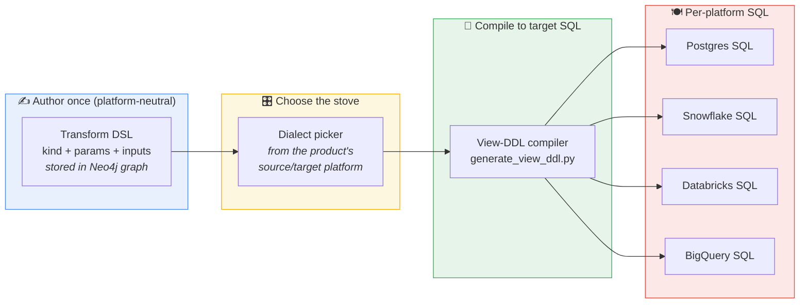
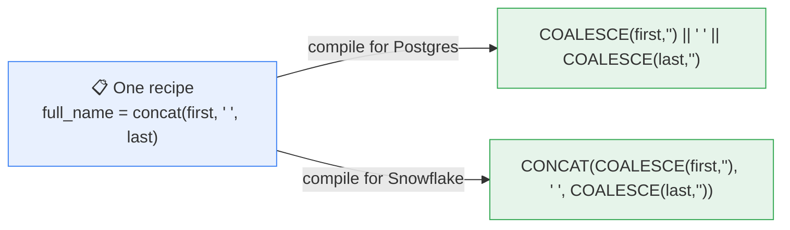
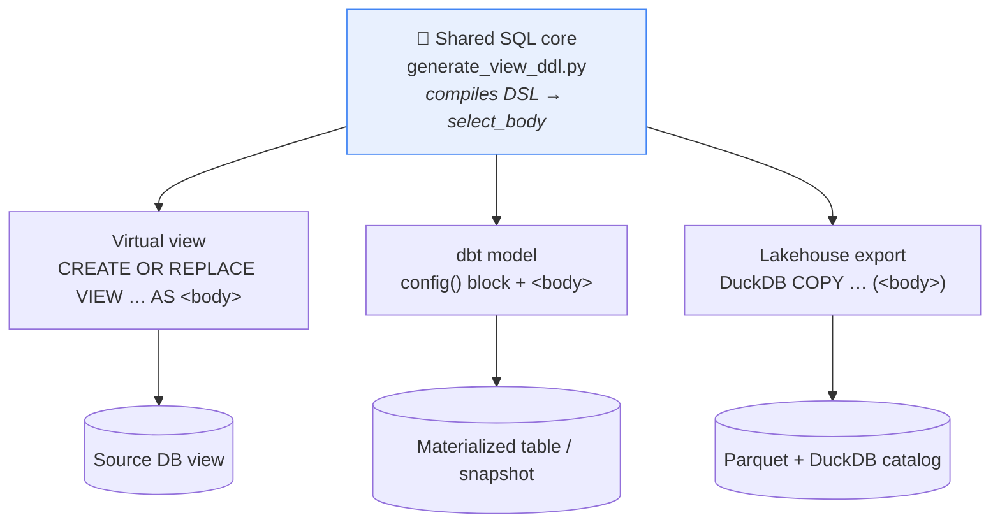
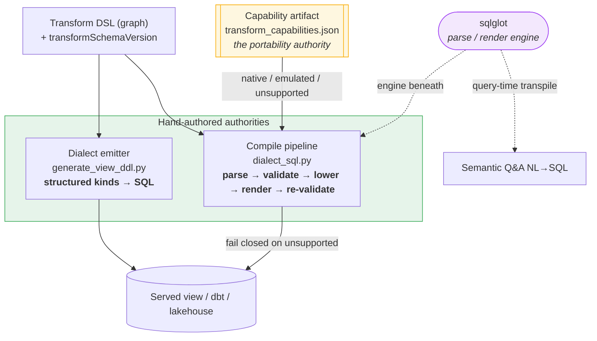

# Mapping & Transformation — Strategy & Per-Platform Reference

> **In one sentence:** transformations are authored **once** in a small, platform-independent description (a DSL stored in the knowledge graph), and a compiler turns that same description into the correct SQL for whichever data platform the product is served on — Postgres, Snowflake, Databricks, BigQuery, MySQL, or DuckDB.

> **Reading note.** Sections 1–4 are the **functional strategy** — read these to explain the concept to anyone. Section 2 is a plain-English, layman's walkthrough with a running example. Section 5 is the **transform catalog** (every supported transform and what its DSL looks like). Section 6 is the **engineer reference** — the per-kind × per-platform rendering matrices and how the dialect is chosen. Sections 7–9 cover serving, roadmap, and cross-links.
>
> This doc *frames* the capability. The terse internals live in [`architecture/transformations.md`](architecture/transformations.md) (column DSL), [`architecture/dataset-transform.md`](architecture/dataset-transform.md) (dataset-level shape), [`architecture/view-ddl-fk-bridges.md`](architecture/view-ddl-fk-bridges.md) (join construction), and [`architecture/transform-portability.md`](architecture/transform-portability.md) (the neutral-DSL capability artifact, the parse→validate→lower→render compile pipeline, and the author-time enforcement gate).

---

## 1. What "Mapping & Transformation" is

**Mapping & Transformation** is the pipeline stage (`stage_id: data_mapping`, renamed from "Data Mapping" because the old name undersold it) where a Data Engineer authors the **source → target derivation model** for a data product. It is far more than a 1:1 column match:

- **Source selection** — which upstream column(s) feed each product column.
- **Column transforms** — the 16 transform *kinds* (concat, cast, lookup, mask, hash, bucket, window, `date_difference`, …) that shape each value.
- **Dataset shape** — grain, deduplication, grouping, filters, joins, SCD (slowly-changing-dimension) policy, and PII suppression.

**Who authors it:** the Data Engineer (in the web Mappings review queue or via MCP), with AI suggestions and Product-Owner hints as inputs. Every mapping is **review-gated** and carries W3C PROV-O provenance.

**What it produces:** structured `:ColumnMapping` and `:DatasetTransform` nodes in Neo4j — the platform-independent DSL. Nothing about a specific SQL dialect is decided here.

---

## 2. In plain English

Think of it as a **recipe, not a finished dish.**

> You write the recipe once, in a neutral language: *"full name = first name, a space, then last name; mask all but the last four digits of the card; the country comes from the country-code lookup table."* The Workbench stores the **recipe** — not a plate of food. Later, when it's time to actually serve the product on Snowflake, it cooks that recipe in Snowflake's kitchen; on Postgres, it cooks the same recipe in Postgres's kitchen. **Same recipe, different stove.**

Why bother? Because the same product might be served on Postgres today and Snowflake tomorrow, and because a consumer product can pull from sources on different platforms. If the transformation were written directly as Postgres SQL, you'd have to rewrite it for every platform. By keeping the recipe neutral and compiling it on demand, the *intent* is authored once and stays correct everywhere.

### A running example

Take a raw `customers` table and build a `customer_360` data product with four columns:

| Product column | Plain-English intent | Transform kind |
|---|---|---|
| `full_name` | first name + a space + last name | `concat` |
| `signup_ts` | the signup date string, as a real timestamp | `cast` |
| `customer_id_hash` | a stable, irreversible hash of the customer id | `hash` |
| `country` | look the country name up from the ISO code | `lookup` |

**Step 1 — you author the recipe (platform-independent).** This is what lands in the graph:

```jsonc
// full_name
{ "product_column": "full_name",
  "kind": "concat",
  "inputs": ["first_name", "last_name"],
  "params": { "separator": " " } }

// customer_id_hash
{ "product_column": "customer_id_hash",
  "kind": "hash",
  "inputs": ["customer_id"],
  "params": { "algorithm": "sha256", "salt": "cust:" } }
```

**Step 2 — the Workbench cooks it for the target platform.** The *same* `full_name` and `customer_id_hash` recipes become different SQL depending on the stove:

```sql
-- full_name on Postgres
COALESCE("first_name", '') || ' ' || COALESCE("last_name", '')
-- full_name on Snowflake
CONCAT(COALESCE("first_name", ''), ' ', COALESCE("last_name", ''))

-- customer_id_hash on Postgres
encode(digest('cust:' || customer_id::TEXT, 'sha256'), 'hex')
-- customer_id_hash on Snowflake
SHA2('cust:' || CAST(customer_id AS VARCHAR), 256)
-- customer_id_hash on BigQuery
TO_HEX(SHA256('cust:' || CAST(customer_id AS STRING)))
```

Notice `country` (the lookup) isn't in that list — a `LEFT JOIN` to a reference table looks the same on every platform, so it doesn't diverge. **Most of the SQL is portable; only a handful of constructs genuinely differ per platform, and those are exactly what the compiler specializes.**





---

## 3. The strategy: author once, compile to target

Three ideas carry the whole design.

### 3.1 Two planes, one graph

The Workbench separates a **control plane** (platform-neutral) from a **data plane** (platform-specific). Discovery, enrichment, mapping authoring, ODCS contracts, the marketplace — all operate against the neutral Neo4j graph and never touch a source platform. The transform DSL lives entirely in this neutral plane: a `:ColumnMapping` carries a `transformKind`, `transformParams`, `transformInputs`, and optional `transformExpression` / `transformDecorators`, with **no dialect attached**. (For the full platform-adapter picture see [`multi-platform.md`](multi-platform.md).)

### 3.2 Dialect is chosen at serving time, not authoring time

A platform is bound to the *product*, not to the *transform*. When the serving stage runs, the Workbench resolves the effective dialect from the project's source binding (or a serving override, or a consumed source's platform — see §6.4) and threads it into the compiler. The same graph state can be compiled for a different platform tomorrow with no re-authoring.

### 3.3 One SQL core, N emitters

A single compiler (`generate_view_ddl.py`) produces one `select_body` from the DSL. That body is then wrapped by whichever serving mode is active — **byte-identical** across modes. Joins, transforms, SCD lowering, and dialect all resolve **once** in the shared core; the emitters never re-implement transform logic.



---

## 4. Who does what (the role of sqlglot and the capability artifact)

Platform translation is owned by **two hand-authored authorities**; sqlglot is the mechanical parse/render **engine** underneath them, never the decider.

| Component | Role | The authority? |
|---|---|---|
| **`generate_view_ddl.py` `Dialect` hierarchy** (the `data-serving-virtual-view` skill) | Emits the compiled view/dbt/lakehouse SQL. Hand-written per-dialect primitives (`cast`, `hash`, `regexp_replace_global`, `str_concat`) + structured compilers (`substring`, `split_part`, `date_difference`, `mask`, `hash`, `bucket`, `window`). | **Yes** — the emitter for structured kinds. |
| **Capability artifact** — `platform/transform_capabilities.<ver>.json`, built from the `data-transform-translation` skill's per-platform YAML | Declares, per function per platform, `native \| emulated \| unsupported`. The single source of truth for *what can be translated*. | **Yes** — the portability authority. |
| **`dialect_sql.py` compile pipeline** (sqlglot) | `parse(read=expressionDialect) → validate AST against the artifact → lower neutral ops → render(targetDialect) → re-validate → CompileResult`. Parse-validates every raw-SQL-bearing surface and **fails closed** on unknown/unsupported functions. Its rendered `CompileResult.sql` also feeds the **serving-DDL emit path** for raw `expression`-kind transforms (`generate_view_ddl._translate_raw_expression`, cross-dialect only, fail-open) — so a Postgres-authored escape-hatch expression is rendered to the served engine instead of emitted verbatim. | No — sqlglot is the parse/render engine; the artifact decides. |
| **`dialect_sql.render_for_platform`** (sqlglot) | The NL→SQL query path (marketplace Semantic Q&A): transpiles the LLM's ANSI SQL to the served engine at query time. | No — mechanical transpile. |
| **`platform/sql_renderer.py`** + fixtures | A parallel structured per-platform renderer for the cross-platform transfer/conformance gate (slated to fold into the shared pipeline). | Yes (transfer path). |
| **`osi.py`**, **`platform/transform_placement.py`** (sqlglot) | Parseability validation + read-only AST analysis (ETL/ELT pruning). | No. |

So sqlglot is now used in *two* places — the transform-portability compile pipeline **and** the NL→SQL query path — but it is the **engine**, never the **authority**. The correctness call belongs to the hand-written `Dialect` emitter (for structured kinds) and to the capability artifact (for portability).

**The key point — "transpile success ≠ capability."** sqlglot will happily *emit* `AGE(...)` for Databricks or `SPLIT_PART(...)` for BigQuery even though those engines don't support them. So the pipeline doesn't trust the transpile: it **walks the rendered AST and checks every function against the capability artifact**, and refuses to hand back deployable SQL when anything is unsupported. That's what upgrades "same recipe, different stove" from a hope to a guarantee — the full mechanism is in [`architecture/transform-portability.md`](architecture/transform-portability.md).



---

## 5. The transform catalog (what the DSL looks like)

Every transform is a `transformKind` plus a `transformParams` object (and, for some kinds, a `transformExpression` and `transformInputs`). The canonical registry of kinds is `VALID_TRANSFORM_KINDS` in the mapping skill's `write_mappings.py`. There are four authoring sources (`transformAuthor`): `po_hint`, `steward_catalog`, `engineer`, `ai_suggestion` (priority: hint → catalog → LLM).

### 5.1 Column-level kinds

| Kind | What it does | DSL params (shape) |
|---|---|---|
| `direct` | Straight passthrough of one source column. | *(none)* |
| `cast` | Change a column's type. | via `transformExpression`, e.g. `signup_date::timestamp`; structured form uses `{target_canonical_type, precision?, scale?}` (see §6.2) |
| `format` | UPPER / LOWER / TRIM / TO_CHAR string formatting. | via `transformExpression` (or the `standardization` decorator, §5.2) |
| `concat` | Join columns with a separator. | `{separator}` (+ `transformExpression` like `first \|\| ' ' \|\| last`) |
| `split` | Extract a delimited part. | `SPLIT_PART(col, '<delim>', <index>)` via `transformExpression` |
| `substring` | Take a fixed slice. | `SUBSTRING(col FROM <start> FOR <len>)` via `transformExpression` |
| `case` | Conditional value. | via `transformExpression`; structured form `{branches:[{when,then}], else_value}` |
| `arithmetic` | `+ − × ÷` between columns. | via `transformExpression`; structured form `{operator, safe_divide?}` |
| `literal` | A constant value — **no source column, no join.** | `{literal_value: "'ACTIVE'", target_type?}` |
| `expression` | Engineer escape hatch: raw SQL emitted verbatim (with input substitution). Also the fallback for any unknown kind. | `transformExpression` + `transformInputs` |
| `lookup` | Resolve a value from a reference table via an implicit `LEFT JOIN`. | `{lookup_table, key_column, value_column, selection_strategy}` — see below |
| `bucket` | Discretize a continuous value into ordered bands. | `{boundaries:[25,50,100], labels:["low","medium","high","very_high"]}` — **N boundaries → N+1 labels**; emits a `CASE` chain |
| `mask` | Format-preserving redaction. | `{algorithm: keep_last\|keep_first\|middle, keep_n: 4, mask_char: "X", keep_format: false}` |
| `hash` | Irreversible digest (**not** a security primitive — salt is for determinism/namespacing). | `{algorithm: md5\|sha1\|sha256, salt: ""}` |
| `window` | A window function referencing a named window declared on the dataset. | `{function, window: "<name>", offset?, default?, ntile?}` |
| `date_difference` | Neutral date-arithmetic op — supersedes hand-written `AGE()` / `DATEDIFF()` so the same recipe renders correctly on every platform. | `{unit: year\|month\|day\|…, semantics: completed_units\|boundary_count\|symbolic_interval}`; inputs `[start, end]` (a single input pairs with `CURRENT_DATE`) |

**`lookup.selection_strategy`** has five shapes:

| Strategy | Meaning | Extra params |
|---|---|---|
| `equi` (default) | `LEFT JOIN ref ON src.fk = lk.key`, return `lk.value_column`. | — |
| `latest` | Latest row per key (`ROW_NUMBER() … = 1`). For `current_X` / `most_recent_X`. | `order_by_column` (required), `order_by_direction` |
| `aggregate` | `GROUP BY key`, aggregate the reference. | `aggregate_function ∈ {SUM,COUNT,AVG,MIN,MAX,COUNT_DISTINCT}` **or** raw `aggregate_expression`; optional `filter_clause` |
| `exists` | Boolean flag `(lk.key IS NOT NULL)`. For `has_X` / `is_X`. | — |
| `asof` | Point-in-time (SCD-2) join: pick the reference row whose validity window contains the anchor's pivot date. | `effective_from_column`, `pivot_column` (both required), `effective_to_column?` |

The lookup reference table is bare-name in params; its lineage is materialized separately as the `:LOOKUP_VIA` edge.

**Portability metadata (transform-portability).** Every SQL-bearing surface is stamped with `transformSchemaVersion` so the compiler can evolve op semantics without silently re-reading old rows. The `expression` escape hatch additionally carries an `expressionDialect` (default `postgres`) so the compiler knows which grammar to parse legacy raw SQL with. And `bucket` can nest a neutral `value` op (e.g. bands over `date_difference` years) so a "transform of a computed value" stays one portable column rather than a hand-written `CASE`.

### 5.2 Decorators (any kind)

Applied by `_apply_decorators` after the base expression is built:

- **`standardization`** — ordered list of `trim` → `TRIM()`, `upper` → `UPPER()`, `lower` → `LOWER()`, `normalize_whitespace` → dialect `REGEXP_REPLACE(expr, '\s+', ' ')`.
- **`default_if_null`** — wraps in `COALESCE(expr, <default>)`.

### 5.3 Column-level aggregation (Phase 3)

On `:ColumnMapping`, active only when the dataset declares grouping keys:
- **`aggregateFunction`** ∈ `{SUM, COUNT, AVG, MIN, MAX, COUNT_DISTINCT, FIRST, LAST}` (a non-grouping column with none falls back to `MAX(col)`).
- **`groupingKey`** (bool) — marks the column as a `GROUP BY` passthrough.

### 5.4 Dataset-level shape — `:DatasetTransform`

The schema-level peer of column transforms. One node per output dataset; reserved fields activate per phase (no graph migration):

| Field | Shape / effect |
|---|---|
| `filterPredicate` | Compiled SQL `WHERE` fragment on the base CTE. (A safety gate refuses plain-language prose from reaching a deployed `WHERE`.) |
| `dedupeJson` | `{keys:[...], order_by, direction}` → `ROW_NUMBER() OVER (PARTITION BY keys ORDER BY order_by) = 1` |
| `groupingKeysJson` | list of product columns → activates the `grouped` CTE + `GROUP BY` |
| `joinsJson` | `[{alias, dataset_uri, kind, predicate, bridge_only?}]` — explicit FROM/JOIN graph; **bypasses FK inference and always wins** |
| `windowSpecsJson` | `{name: {partition_by[], order_by:[{column,direction}], frame}}` — referenced by `kind='window'` columns |
| `scdPolicyJson` | `{type, effective_column, expiration_column, add_is_current, snapshot_column, as_of_date, …}` — see below |
| `suppressedColumnsJson` | product columns dropped from the SELECT but kept in the contract/lineage (PII); PKs never suppressed |

**SCD policy types:** `latest_only` (synthesizes a dedupe to the latest row per key), `scd2` (validates the validity-period columns, optionally appends a derived `is_current`), `snapshot` (pins the view to one point-in-time with a synthesized `WHERE`).

**View assembly** — the compiler layers CTEs on top of an explicit or FK-inferred FROM:

```sql
CREATE VIEW ... AS
WITH base AS (SELECT <cols> FROM <from + joins + lookup_joins> [WHERE <filter>])
[, deduped AS (... ROW_NUMBER() OVER (PARTITION BY <keys> ORDER BY <order_by>) = 1 ...)]
[, grouped AS (SELECT <gk_cols>, <agg_fn>(<col>) AS <col>, ... FROM <base|deduped> GROUP BY <gk_cols>)]
SELECT * FROM <base|deduped|grouped>;
```

Full detail: [`architecture/dataset-transform.md`](architecture/dataset-transform.md) and [`architecture/view-ddl-fk-bridges.md`](architecture/view-ddl-fk-bridges.md).

---

## 6. Deep dive — per-platform rendering

### 6.1 The compilation paths

The same neutral DSL feeds three hand-written code paths that specialize different things:

1. **View-DDL emitter** (`generate_view_ddl.py`, the everyday serving path). Structured kinds are compiled dialect-aware through the `Dialect` hierarchy: `literal`, `lookup`, `bucket`, `mask`, `hash`, `window`, `date_difference`, plus the `cast`/`concat`/`substring`/`split_part` primitives and decorators. Kinds still carried as raw `transformExpression` (`case`, `arithmetic`, `expression`, and legacy `cast`/`concat`) get word-boundary column substitution — but they're no longer trusted blindly (see path 2). The `Dialect` hierarchy specializes exactly the constructs that genuinely diverge (§6.3).

2. **Capability compile + validate pipeline** (`dialect_sql.py` + the capability artifact). Every SQL-bearing surface — the `expression` escape hatch, lookup `aggregate_expression` / `filter_clause`, `:DatasetTransform` filter and join predicates — is parsed, its AST walked against the capability artifact, lowered (neutral ops like `date_difference`), rendered to the target dialect, and re-validated. It **fails closed** on any unknown or unsupported function and yields a `CompileResult` that carries deployable SQL only when clean. This is what closed the original "`AGE()` reaches Databricks verbatim" gap. It runs as an author-time preflight and a staged deploy gate (§6.5).

3. **Structured conformance renderer** (`platform/sql_renderer.py`, the cross-platform transfer gate). Every kind — `cast`, `concat`, `arithmetic`, `case` — is rendered structurally per platform; its `GOLDEN_PATH_FIXTURES` are declared in-code as "the specification … authoritative documentation of cross-platform SQL behaviour" and are the cleanest per-kind × per-platform reference (§6.2). (Slated to fold into path 2 over time.)

> Because the emitter (path 1) and the conformance renderer (path 3) are separate code, the same kind can render slightly differently between them (e.g. the emitter's `hash` md5 emits lowercase `md5(t0.col::TEXT)`; the conformance renderer emits `MD5(CAST("col" AS TEXT))`). Both are correct for their path; don't assume byte-parity.

### 6.2 Matrix A — the structured DSL conformance spec

From `GOLDEN_PATH_FIXTURES` (`platform/sql_renderer.py`). Identifier quoting: Postgres/Snowflake use `"col"`, MySQL/Databricks use `` `col` `` (shown here as `{col}`). "—" = deliberately not specified for that platform.

| Kind (params) | Postgres | MySQL | Snowflake | Databricks |
|---|---|---|---|---|
| `cast` int32 | `CAST({col} AS INTEGER)` | `CAST({col} AS SIGNED)` | `CAST({col} AS INTEGER)` | `CAST({col} AS INT)` |
| `cast` int64 | `CAST({col} AS BIGINT)` | `CAST({col} AS UNSIGNED)` | `CAST({col} AS BIGINT)` | `CAST({col} AS BIGINT)` |
| `cast` float64 | `CAST({col} AS DOUBLE PRECISION)` | `CAST({col} AS DOUBLE)` | `CAST({col} AS FLOAT)` | `CAST({col} AS DOUBLE)` |
| `cast` decimal(18,4) | `CAST({col} AS NUMERIC(18,4))` | `CAST({col} AS DECIMAL(18,4))` | `CAST({col} AS NUMBER(18,4))` | `CAST({col} AS DECIMAL(18,4))` |
| `cast` string | `CAST({col} AS TEXT)` | `CAST({col} AS CHAR)` | `CAST({col} AS VARCHAR)` | `CAST({col} AS STRING)` |
| `cast` date | `CAST({col} AS DATE)` | `CAST({col} AS DATE)` | `CAST({col} AS DATE)` | `CAST({col} AS DATE)` |
| `cast` timestamp | `CAST({col} AS TIMESTAMP)` | `CAST({col} AS DATETIME)` | `CAST({col} AS TIMESTAMP_NTZ)` | `CAST({col} AS TIMESTAMP_NTZ)` |
| `cast` timestamp+tz | `CAST({col} AS TIMESTAMPTZ)` | — | `CAST({col} AS TIMESTAMP_LTZ)` | `CAST({col} AS TIMESTAMP)` |
| `cast` boolean | `CAST({col} AS BOOLEAN)` | — | `CAST({col} AS BOOLEAN)` | `CAST({col} AS BOOLEAN)` |
| `concat` (sep `" "`) | `COALESCE({col},'') \|\| ' ' \|\| COALESCE({col2},'')` | `CONCAT(COALESCE({col},''), ' ', COALESCE({col2},''))` | `CONCAT(COALESCE({col},''), ' ', COALESCE({col2},''))` | `CONCAT(COALESCE({col},''), ' ', COALESCE({col2},''))` |
| `literal` string | `'ACTIVE'` | `'ACTIVE'` | `'ACTIVE'` | `'ACTIVE'` |
| `literal` null | `CAST(NULL AS TEXT)` | `CAST(NULL AS CHAR)` | `CAST(NULL AS VARCHAR)` | `CAST(NULL AS STRING)` |
| `arithmetic` `*` | `{col} * {col2}` | `{col} * {col2}` | `{col} * {col2}` | `{col} * {col2}` |
| `arithmetic` `/` safe | `CASE WHEN {col2}=0 THEN NULL ELSE {col} / NULLIF({col2},0) END` | *(same, backticks)* | *(same)* | *(same, backticks)* |
| `coalesce` | `COALESCE({col}, {col2})` | `COALESCE({col}, {col2})` | `COALESCE({col}, {col2})` | `COALESCE({col}, {col2})` |
| `case` | `CASE WHEN {col}='Y' THEN 'active' ELSE 'inactive' END` | *(same)* | *(same)* | *(same)* |
| `hash` md5 | `MD5(CAST({col} AS TEXT))` | `MD5({col})` | `MD5({col})` | `MD5(CAST({col} AS STRING))` |
| `hash` sha256 | `ENCODE(DIGEST(CAST({col} AS TEXT),'sha256'),'hex')` | — | `SHA2({col}, 256)` | `SHA2(CAST({col} AS STRING), 256)` |
| `mask` email | `REGEXP_REPLACE({col}, '^[^@]+', '***')` | — | `REGEXP_REPLACE({col}, '^[^@]+', '***')` | `REGEXP_REPLACE({col}, '^[^@]+', '***')` |
| `bucket` | `CASE WHEN {col} < b THEN 'lo' … ELSE 'hi' END` | — | *(same)* | *(same, backticks)* |

Notes: Postgres `sha256` needs the `pgcrypto` extension. MySQL omits `boolean`/`timestamp+tz`/`sha256` casts (no clean CAST target). The conformance `bucket` uses N labels for N boundaries; the **production** `bucket` uses N+1 labels for N boundaries (§6.1 regime difference).

**Raw-SQL Snowflake authoring functions (capability artifact).** Beyond the structured kinds above, the `expression` escape hatch accepts raw SQL that the capability pipeline (§6.1 path 2) validates by **sqlglot canonical AST name** — so common Snowflake spellings now compile instead of failing `unknown_function`: `IFF`/`ZEROIFNULL`/`NULLIFZERO` (→ `IF`), `NVL` (→ `COALESCE`), `NVL2`, `DECODE` (→ `DECODE_CASE`), `DATEADD` (→ `DATE_ADD`), `CONVERT_TIMEZONE`, `TO_DATE`/`TRY_TO_DATE` (→ `TS_OR_DS_TO_DATE`), `TO_TIMESTAMP`/`TO_TIMESTAMP_NTZ`, `TRY_CAST`, `TRY_TO_NUMBER` (→ `TO_NUMBER`), `PARSE_JSON`, `LISTAGG` (→ `GROUP_CONCAT`). Authored expressions are parsed with the *target* platform's grammar by default, so a Snowflake-served product's expressions canonicalize correctly. Source: `reference/snowflake/transforms.yaml` → the built `transform_capabilities.v1.json`; conformance in `test_sql_renderer.py`.

### 6.3 Matrix B — serving-emitter dialect divergences

The view emitter (`Dialect` hierarchy) keeps most SQL portable (`ROW_NUMBER() OVER`, `LEFT JOIN`, `GROUP BY`, `LENGTH`, `GREATEST`) and routes the constructs that genuinely diverge through per-dialect methods — including `substring`, `split_part`, and `date_difference` (added with the portability work). The core divergence axes it dispatches on:

| Divergence axis | Postgres | Snowflake | Databricks | BigQuery | MySQL | DuckDB | ANSI (base) |
|---|---|---|---|---|---|---|---|
| Type cast form | `v::type` | `CAST(v AS type)` | `CAST(v AS type)` | `CAST(v AS type)` | `CAST(v AS type)` | `v::type` | `CAST(v AS type)` |
| CAST-to-text type | `TEXT` | `VARCHAR` | `STRING` | `STRING` | `CHAR` | `VARCHAR` | `VARCHAR` |
| md5 | `md5(x)` | `md5(x)` | `md5(x)` | `TO_HEX(MD5(x))` | `md5(x)` | `md5(x)` | `md5(x)` |
| sha256 | `encode(digest(x,'sha256'),'hex')` | `SHA2(x, 256)` | `sha2(x, 256)` | `TO_HEX(SHA256(x))` | `SHA2(x, 256)` | `sha256(x)` | `md5(x) /* degraded */` |
| sha1 | `encode(digest(x,'sha1'),'hex')` | `SHA1(x)` | `sha1(x)` | `TO_HEX(SHA1(x))` | `SHA1(x)` | `md5(x) /* degraded */` | `md5(x) /* degraded */` |
| `REGEXP_REPLACE` global | `REGEXP_REPLACE(h,p,r,'g')` | `REGEXP_REPLACE(h,p,r)` | `REGEXP_REPLACE(h,p,r)` | `REGEXP_REPLACE(h,p,r)` | *(inherits ANSI)* | `…,'g'` | `REGEXP_REPLACE(h,p,r)` |
| Multi-source concat operator | `\|\|` | `\|\|` | `CONCAT()` | `CONCAT()` | `CONCAT()` | `\|\|` | `CONCAT()` |
| `ORDER BY` null placement | `… NULLS LAST` | `… NULLS LAST` | `… NULLS LAST` | `… NULLS LAST` | *(omitted — MySQL lacks the syntax)* | `… NULLS LAST` | `… NULLS LAST` |

`get_dialect(name)` is fail-closed: empty → Postgres (pre-Phase-7 default); an unknown non-empty name raises `ValueError`. Registered names: `postgres`/`postgresql`, `snowflake`, `databricks`, `bigquery`, `mysql`, `duckdb`, `ansi`.

**Worked `hash` (sha256, salt `"cust:"`) across the serving emitter** — this is the running example's `customer_id_hash`, showing the emitter composing *cast-to-text + salt + dialect hash*:

| Platform | Emitted SQL |
|---|---|
| Postgres | `encode(digest(('cust:' \|\| t0.customer_id::TEXT), 'sha256'), 'hex')` |
| Snowflake | `SHA2(('cust:' \|\| CAST(t0.customer_id AS VARCHAR)), 256)` |
| Databricks | `sha2(('cust:' \|\| CAST(t0.customer_id AS STRING)), 256)` |
| BigQuery | `TO_HEX(SHA256(('cust:' \|\| CAST(t0.customer_id AS STRING))))` |

### 6.4 How the dialect is chosen at serving time

`stage_execution._resolve_platform_context` resolves the effective dialect in this order:
1. The project's `SourceBinding` → `PlatformConnection.platform_type`, mapped through `_PLATFORM_DIALECT_MAP`.
2. A `configure_serving`-set `target_dialect` overrides the inference.
3. For a **consumer-aligned** product with no local binding, the dialect is **borrowed from the `:CONSUMES`'d source's served location** (so a consumer view lands on the same engine as the sources it joins).

That effective dialect is passed as `generate_view_ddl.py --dialect <x>`. The serving stage's `dialect` config field offers PostgreSQL / Snowflake / Databricks / BigQuery / ANSI (default `postgres`).

> **Coverage asymmetry to know:** BigQuery has a first-class emitter dialect but **no platform manifest / type profile** — you can render BigQuery SQL but cannot yet register/discover a BigQuery source. Conversely Oracle and SQL Server have type profiles (migration targets) but no emitter dialect. See [`multi-platform.md`](multi-platform.md) §2 for the live capability matrix. (MySQL was reconciled to its own dialect — `_PLATFORM_DIALECT_MAP["mysql"] = "mysql"`, previously `ansi` — so MySQL-served views now emit MySQL-valid SQL and are capability-validated like the other served platforms.)

### 6.5 Author-time portability enforcement

The capability pipeline (§6.1, path 2) is surfaced and enforced so a non-portable transform is caught **before** deploy, not at it:

- **Preflight (read-only):** `GET /api/projects/{id}/serving/transform-preflight` (and MCP `get_transform_preflight`) run the compiler against the resolved platform and return per-mapping errors + remediation. The `TransformPreflightCallout` at the top of the mapping review panel auto-fires it so the engineer re-authors (Replace) before deploying.
- **Staged gate:** `WB_TRANSFORM_ENFORCEMENT` (live-read, mirrors `WB_READ_ONLY`) stages enforcement `off` → `warn` (default; logs only, no behaviour change) → `block` (refuses the deploy/build with a clean `422` + remediation). It's wired into serving deploy, dbt materialize/build, and the ELT transfer target — enforcement lives in the shared `CompileResult`, so no emitter path bypasses it.

---

## 7. How it connects to serving

Approved mappings + `:DatasetTransform` are compiled once into a `select_body`, then wrapped by the active serving mode (**one SQL core, N emitters**, §3.3): a virtual `CREATE OR REPLACE VIEW`, a dbt model (`{{ config(...) }}` + body, plus dbt snapshots for SCD2 history), or a lakehouse Parquet export via DuckDB. The full serving story — build/deploy split, verification gate, packaging — is in [`architecture/serving-materialized-dbt.md`](architecture/serving-materialized-dbt.md).

---

## 8. Roadmap & honest gaps

- **The capability artifact is live.** The `data-transform-translation` skill compiles per-platform YAML (`portable_functions.yaml` + `reference/<platform>/transforms.yaml`) into a checksum-validated `platform/transform_capabilities.<ver>.json`; the backend reads *only* the artifact (re-verifying the checksum) and never imports the skill. A client running a different engine version forks the YAML, rebuilds, runs the guard test, and swaps the artifact. Full lifecycle in [`architecture/transform-portability.md`](architecture/transform-portability.md).
- **Remaining portability follow-ups** (per `transform-portability.md`): `format` date-token translation, `_compile_window` NULLS-LAST polish, the full 5-way dialect-binding consolidation + folding `platform/sql_renderer.py` into the shared pipeline, stamping the dataset-transform SQL fields with `transformSchemaVersion`, and flipping `WB_TRANSFORM_ENFORCEMENT` from `warn` to `block` after a clean portfolio audit.
- **Dialect pickers are still duplicated** across modules (emitter `_DIALECTS`, NL-query `PLATFORM_TO_SQLGLOT`, `_PLATFORM_DIALECT_MAP`, quoting `_BACKTICK_PLATFORMS`, conformance `_RENDERER_CLASSES`) — the "5-way consolidation" above.
- **Emitter and conformance renderer not yet unified** (§6.1). Separate code paths with intentional but real rendering differences until `sql_renderer.py` folds into the shared pipeline.
- **Consumer views assume one platform.** A consumer product's virtual view JOINs across its source views, which must all be on the same platform (federation is future work).

---

## 9. See also

- [`architecture/transform-portability.md`](architecture/transform-portability.md) — the neutral-DSL capability artifact, the parse→validate→lower→render compile pipeline, `CompileResult`, and the staged enforcement gate (this doc's deep-dive peer).
- [`architecture/transformations.md`](architecture/transformations.md) — column-level DSL internals, `transformAuthor` model, `:LOOKUP_VIA`, `column_transform_set` apply protocol.
- [`architecture/dataset-transform.md`](architecture/dataset-transform.md) — `:DatasetTransform` reserved fields, SCD lowering, suppressed columns, window emission, dialect picker.
- [`architecture/view-ddl-fk-bridges.md`](architecture/view-ddl-fk-bridges.md) — FK-driven join construction and the bridge ranker.
- [`architecture/serving-materialized-dbt.md`](architecture/serving-materialized-dbt.md) — one-core/two-emitters, materialization, the sample→full gate.
- [`multi-platform.md`](multi-platform.md) — platform adapters, capability matrix, the SQL dialect *system* (§8), per-platform reference sheets (Appendix A).
