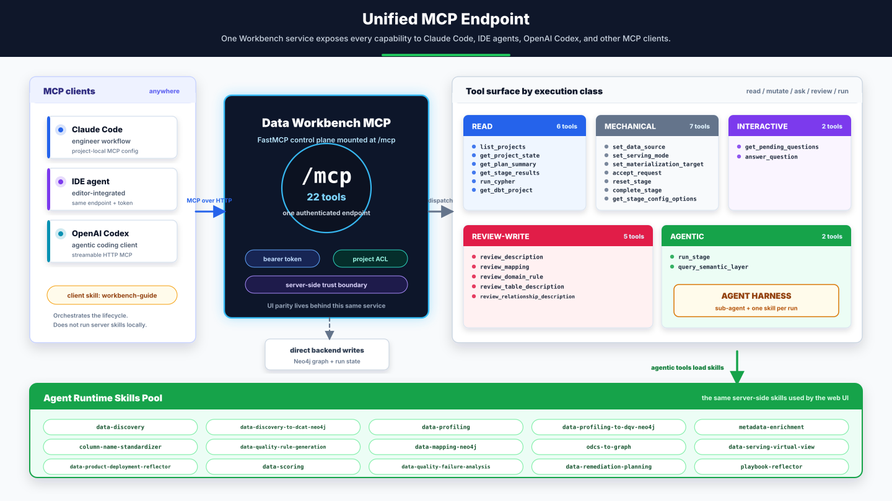
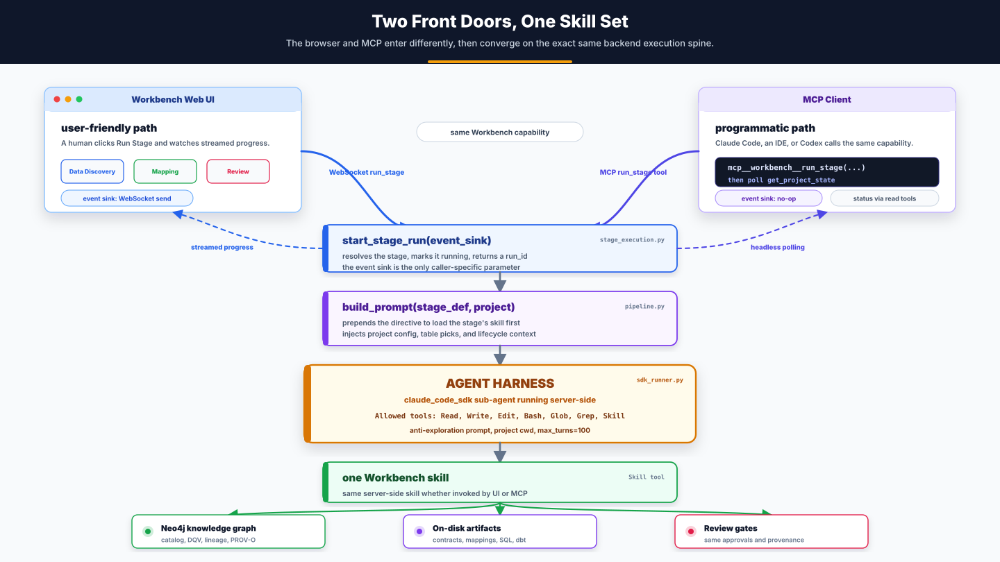
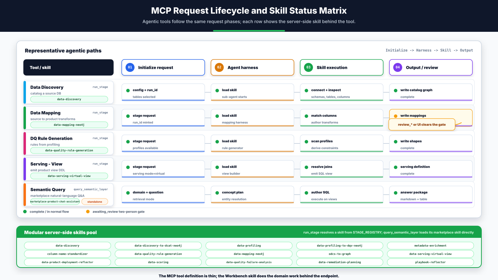

# Data Workbench — the MCP endpoint

> The Data Workbench has two front doors. The **web UI** is the user-friendly one.
> The **MCP endpoint** is the programmatic one — a single service that fronts every
> Workbench capability for any MCP client (Claude Code, an IDE, OpenAI Codex). Both
> doors open onto the **same agent skills**. This document explains that endpoint:
> what each tool does, and how the agentic tools run as sub-agents over a shared
> agent harness.
>
> **This is the canonical MCP tool reference; other docs link here rather than
> restating the surface.** For client *setup and day-to-day usage* (install, tokens,
> the typical session), see **[engineer-guide.md](engineer-guide.md)** — this document
> is the architecture and the tool reference. Internals (stage registry, review system,
> serving modes) live in **[../CLAUDE.md](../CLAUDE.md)**.

---

## Part A — The capability story

### 1. One endpoint, every capability

Everything the Workbench can do — discover a database, profile it, enrich metadata,
generate quality rules, map columns, serve a view or a dbt project, score a product,
answer a marketplace question — is exposed through **one MCP service**, mounted at
`/mcp` (`workbench/backend/main.py`). An MCP client connects with a bearer token, and
every tool is project-scoped to what that token may access.

The 142 tools fall into clear **execution classes**. Most are *read* or *mechanical* —
they query or mutate the project's graph and state directly. A small, important set is
**agentic**: those tools don't compute an answer in-process, they **start a sub-agent**
that loads one of the Workbench's skills and does real work.

> The engineer's `/mcp` surface grew well past the original discovery/mapping/serving
> core: it now also drives **consumer-aligned (`dpe-cf`) product authoring** end-to-end
> (`create_consumer_product`, `save_odcs_spec`, `discard_draft_version`, `submit_product_spec`,
> `match_inputs`, `bulk_approve_mappings`, `deploy_virtual_view`) and exposes the **marketplace / DQ /
> OSI / QA / provenance** read surface a consumer engineer needs. A **separate PO front
> door** (`/po-mcp`) is documented below.

### 2. Two front doors, one skill set

The headline property: **running a stage from the web UI and from MCP is the same
execution.** The UI sends a WebSocket `run_stage`; an MCP client calls the `run_stage`
tool. Both land in `stage_execution.start_stage_run(...)` — code that was deliberately
*"extracted so BOTH the WebSocket handler and the MCP `run_stage` tool can start a
stage"* — which builds the prompt (`pipeline.build_prompt`) and hands it to the agent
harness (`sdk_runner.run_stage_streaming`). The harness loads exactly one skill and
runs it.

The **only** difference between the two doors is the *event sink*: the UI passes a
socket-send callback so events stream to the browser; the MCP path passes a no-op and
the caller polls `get_project_state` instead. Same skill, same writes, same result.

### 3. Every agentic tool is a single-skill sub-agent

When an agentic tool runs, the backend spins up a `claude_agent_sdk` session — its own
sub-agent — under an **agent harness** (`sdk_runner.py`). The harness is tightly
bounded so the stage is reproducible:

- **One skill, loaded up front.** `build_prompt` prepends a directive: *"FIRST: Load
  the `<skill>` skill … follow the steps literally; do not explore the directory, run
  git, or check dependencies."*
- **An anti-exploration system prompt** appended to the Claude Code preset, reinforcing
  "execute the task directly; the skill provides everything."
- **A small tool allowlist** — `[Read, Write, Edit, Bash, Glob, Grep, Skill]` — and the
  project directory as `cwd`.

So each agentic invocation is effectively a focused, single-skill sub-agent: a request
walks **Initialize → Agent Harness → Skill Execution → Output/Review**. Stages with a
review gate finish at `awaiting_review` (a two-person gate cleared via the `review_*`
tools or the UI); the rest finish `complete`.

---

## Part B — Architecture & tool reference

### The tool surface

142 tools (`workbench/backend/mcp_server.py` — every `@mcp.tool()`), by execution class.
*Agentic* tools front a server-side skill; everything else resolves in-process against
Neo4j / SQLite. All project-scoped tools enforce the token's project authorization
(`_deny_project`); the review-write tools additionally enforce the declared `role`.

**Inbound intake review (4).** `list_intake_submissions` / `get_intake_submission` /
`approve_intake_submission` / `reject_intake_submission` are the engineer's headless
surface for reviewing MIGRATION submissions pushed by an external tool (the mirror of the
Incoming-queue actions in the web UI). *Submission itself is REST-only* — an external
system POSTs `/api/intake/submit` with a scoped machine credential (`WB_INTAKE_TOKENS`),
never an MCP token. Approval runs the resumable, idempotent scaffold saga. The PO's
`/po-mcp` has the same four tools defaulted to MODERNIZATION portfolios.

**Pre-flight gates.** `run_stage` and `complete_stage` now accept `force: bool = False`
and run three pre-flight checks up front so a stage fails fast with an actionable
message instead of stalling at `pending`: `_dependency_gate` (archetype-aware — a
dependency on a stage **not in this project's pipeline** is N/A, so a `dpe-cf` consumer
product is no longer wrongly blocked on `metadata_enrichment`), `_required_config_gate`
(refuses when a required config field is missing, skipping fields that declare a
`default`), and `_serving_mappings_gate` (refuses `serving_virtual_view` while mappings
are still `pending_review`, pointing at `bulk_approve_mappings`). `force=true` bypasses
the pre-flight checks.

**Acceptance gate.** Engineer-owned *mutating* tools (`run_stage`, `complete_stage`,
`reset_stage`, the `set_*`, the review-writes, serving/materialization mutations) are
gated by the shared `request_guard`: while the governing product request is still
`submitted`, the action is **warn-only** by default and a **hard 409 / structured
`required_action: accept_request`** once `WB_ENFORCE_ACCEPT_GATE` is set. This is
universal across `dpe-sa` and `dpe-cf`. Read-only tools and the accept/reject decision
tools are never gated. So a session starts with `list_assignments` → `accept_request`
(or `reject_request`) before any engineering work.

#### Read — inspect state, never mutate

| Tool | Scope / purpose |
|---|---|
| `list_projects` | Projects the caller's token may access — returns an envelope `{"projects": [{code, name, archetype, domain, …}], "count": N}` (was a bare list before the 2026-07 expansion). |
| `get_available_actions` | Dependency-aware menu of what you can do NOW — the flexible-but-guarded "what's runnable" view. |
| `get_product_report` | Full Markdown deployment report for a product (Mermaid ERD + lineage), wrapping the marketplace report endpoint. |
| `get_stage_output` | Reviewable markdown "Step Report" of what a stage **produced** (output-side view; pairs with `get_stage_results`). |
| `get_stage_executions` | Run history for a single stage — every execution with status, cost, and `error_message` on failure. |
| `get_edit_diff` | Diff between the deployed contract version and the current head — what an edit would change. |
| `get_provenance` | W3C PROV-O audit trail for a description (`col_uri`) or a mapping. |
| `get_usage_summary` | LLM token + cost totals — system-wide or scoped to a product. |
| `list_marketplace_products` | List published data products in the marketplace. |
| `get_marketplace_detail` | Detailed view of one published product (concise CLI form of the marketplace detail). |
| `get_marketplace_lineage` | Consumer-friendly lineage — which source tables/columns feed a product. |
| `get_product_lineage` | Marketplace-wide PRODUCT dependency graph (`{nodes, edges}`) — how products relate via `:CONSUMES` (source → aggregate → consumer). Coarse: products only, no tables/columns. |
| `list_marketplace_gaps` | List logged marketplace gaps (newest first; default = active backlog). |
| `get_odcs_spec` | Read the current ODCS v3.1 spec from the graph for a project. |
| `get_osi_evaluation` | Read the latest OSI (AI-readiness) evaluation (the score `trigger_osi_score` produces). |
| `get_dq_score` | Read the latest Data Quality score for a product. |
| `get_dq_test_runs` | Read the latest DQ test-run rollup — pass rate + rule coverage. |
| `get_deployment_reflection` | Read the latest post-deploy AI reflection verdict. |
| `preview_serving_view` | Preview real rows from a product's deployed view (proves the product returns data). |
| `run_readonly_sql` | Run an ad-hoc READ-ONLY SELECT against the product's source/served Postgres. |
| `list_ingest_drafts` | List in-flight ODCS ingest drafts for a PO (the `/product/ingest` flow). |
| `match_inputs` | Rank marketplace source products against a consumer spec's declared inputs. |
| `run_gap_analysis` | Pre-flight gap analysis comparing the consumer's schema columns to bound sources. |
| `suggest_domain_rules` | Suggest domain-catalog DQ rules for the project's `:DProdColumn` nodes. |
| `probe_qa_question` | Probe whether a free-form question CAN be answered by a product before running it. |
| `list_platforms` | List all registered data platforms with their capability levels (unsupported / experimental / preview / certified). Use to discover which platforms are available for connections and serving. |
| `get_platform_capabilities` | Full capability manifest for one platform. Unknown platform returns an error (never silently falls back). |
| `get_transfer_batch_schema` | Return the TransferBatch v1 JSON schema (ADR-13 reviewable gate). Use to inspect the versioned data-plane exchange contract before Phase 3 Parquet/Iceberg export work begins, or to validate a future manifest. |
| `get_project_state` | Full detail + the PO's brief + every stage's status by workflow; each stage carries an `execution_kind` telling you which tool drives it. |
| `get_plan_summary` | Compact "where are we / what's next" digest: counts, `percent_complete`, completed/running/awaiting/blocked, and the single `recommended_next` step + the tool to run it. |
| `get_stage_results` | A stage's structured output (descriptions, mappings, profiling, DQ rules, datasets, serving, contract…) via the same vetted query the UI uses — no hand-written Cypher. Scope with `table`/`column`. |
| `run_cypher` | Read-only, project-scoped Cypher (enforced inside a Neo4j READ transaction; query must reference the project code; 200-row cap). |
| `check_graph_integrity` | Detect-only graph-integrity scan — runs the invariant catalog (structural orphans, duplicate URIs, cross-project leakage, `:CONSUMES`/`:USES_DATASET` validity, enum/null hygiene, `isCurrent` uniqueness, retired-term probes, stranded concepts) and returns a `{check, severity, count, sample}` scorecard incl. clean checks. Global by default; optional `project_code` scopes the code-bearing checks. Never writes, never blocks. |
| `get_dbt_project` | Pull a materialized product's generated dbt project as a `{path: content}` file map (excludes `target/`, `logs/`) to run/maintain in your own dbt/CI. |
| `get_okf_bundle` | Export a published product as an Open Knowledge Format bundle — a `{path: content}` map of cross-linked markdown + YAML frontmatter docs (product / datasets / quality / reflection) for an external AI agent that can't reach this MCP/graph. A portable *briefing* alongside `get_dbt_project` (runnable) and the ODCS contract; lossy by design. Keyed by `contract_id`, project-authz-gated. |
| `get_dataset_filter` | Read a product's dataset-level row filter — the PO's plain-language `filterIntent` and its compiled SQL predicate (`filterPredicate`). Pairs with `set_dataset_filter`. |
| `list_assignments` | The incoming product-request queue the token can see (filter by `project_code` / `status`). Start every session here. |
| `get_assignment` | One product request by `request_id` with project context + any engineer→PO gap reason. |
| `list_rejection_categories` | Valid `category` values for `reject_request`. |
| `list_available_workflows` | The project's current workflows + the addable catalog (use the `workflow_id`s with `add_workflow`/`remove_workflow`). |
| `get_dataset_transform` | A dataset's `:DatasetTransform` (joins, filter, dedupe, grouping keys, SCD policy, suppressed columns, grain) — the shape view-DDL sees. |
| `get_join_preflight` | Checks each dataset's mapped base tables form one FK-connected component; gaps carry a `recommended_joins` payload for `set_dataset_joins`. |
| `get_transform_preflight` | Capability preflight: compiles every mapping expression against the resolved serving platform and returns `errors[]` (each with `product_col` + `remediation`), `warnings[]`, `used_capabilities[]`. Surfaces AGE-style "unsupported on `<platform>`" at author time. Read-only. |
| `get_upstream_drift` | Per-CONSUMES source: pinned version vs the source's current head. |
| `get_mapping_graph` | The full lineage-canvas payload (all current mappings + the complete product column set). |
| `get_unmapped_columns` | Product `:DProdColumn`s with no current mapping (the unmapped-columns review queue). |
| `get_stale_mappings` | Mappings whose source link was wiped by an upstream DPROD rebuild, with rebind suggestions. Pairs with `rebind_stale_mapping`. |
| `get_mapping_rationale_report` | Markdown rationale report for the current mapping set (returns the markdown text). |
| `get_materialization_status` | dbt verification-gate state: latest sample/full runs, derived `gate_state`, per-model preview. |

#### Interactive — drive a mid-run question (a read + a write that pair)

| Tool | Scope / purpose |
|---|---|
| `get_pending_questions` | Poll a running stage for a question it's waiting on (e.g. Data Discovery's "which tables?"). Read-only. |
| `answer_question` | Answer that question (free text / yes-no / option / comma-separated checklist) — unblocks the stage. |

#### Mechanical — mutate state directly, no agent

| Tool | Scope / purpose |
|---|---|
| `set_data_source` | Configure the source DB connection (required before discovery); also completes `select_data_source`. |
| `get_stage_config_options` | The config a stage needs before `run_stage` (e.g. discovery's schema/table picklists). |
| `set_serving_mode` | Swap the serving exclusive-group member: `virtual` (SQL view) ↔ `materialized` (dbt tables). |
| `set_materialization_target` | Per-product Postgres connection that dbt materializes into (defaults to source if unset). |
| `accept_request` | Accept a product request (`submitted → accepted`). **Universal — do this before any mutation, for both dpe-sa and dpe-cf.** Optional `request_id` targets a specific one (default: latest non-rejected). Idempotent. For dpe-sa it also unlocks the PO validation gate. Never gated. |
| `reject_request` | Reject a request back to the PO with a structured `category` + `reason`. A valid pre-acceptance decision; never gated. |
| `set_dataset_filter` | Finalize an output dataset's row filter — engineer-owned SQL boolean (`output_dataset_uri` from `get_dataset_filter`). Runs the same prose/SQL safety gate as the UI; refuses plain-language/malformed predicates and writes nothing. Re-run serving afterward. |
| `set_dataset_joins` | Author an explicit FROM/JOIN graph on a dataset (overrides FK auto-discovery); apply a `get_join_preflight` `recommended_joins` payload directly. |
| `add_workflow` / `remove_workflow` | Add a catalog workflow to / remove one from the project (the `+ Add Workflow` picker). |
| `select_exclusive_group` | Pick the active member of any exclusive stage group (generalizes `set_serving_mode`). |
| `request_source_candidates` | Ask the PO to identify/create source products for a consumer with nothing to map to (optionally pin a column gap). |
| `send_upstream_pushback` | File a consumer-pushback onto a source product's incoming queue (severity cosmetic/schema/breaking). |
| `rebind_stale_mapping` | Rebind a stale mapping to a new source column (reverts it to pending_review). URIs from `get_stale_mappings`. |
| `build_dbt_package` | Build (scaffold + assemble) the runnable dbt project on disk WITHOUT running `dbt build` — the "Build dbt Project" build stage. Downloadable via `get_dbt_project` immediately; the actual build runs through the gate below. |
| `build_lakehouse_package` | Build the runnable lakehouse package (models.json + run.py + README) WITHOUT running the export — the "Build Lakehouse Package" build stage. Needs no live source; downloadable via `get_lakehouse_package` immediately. `export_lakehouse` runs the export (Deploy). |
| `build_materialization_sample` / `approve_materialization_full` / `reject_materialization_sample` | Drive the dbt sample→approve→full verification gate over MCP (full is server-gated on a passing sample; no force-bypass). |
| `reset_stage` | Set a stage back to `pending` so it can re-run. |
| `complete_stage` | Complete a non-LLM lifecycle stage (Mark Discovery/Engineering Complete, ODCS→dprod, Publish, Synthesize ODCS, Auto-Map). Refuses LLM / DQ / review stages with guidance. |
| `create_consumer_product` | Create a new consumer-aligned (`dpe-cf`) project — the MCP equivalent of the New Product wizard. |
| `save_odcs_spec` | Save/update the ODCS v3.1 contract spec to the graph (merge-by-default). Returns `save_mode`/`new_version`/`branched` so the caller knows when a save cut a new version. |
| `discard_draft_version` | Discard an unintended draft contract version and roll back to the prior one. Draft-only (never destroys published/approved history); preserves surviving mappings. |
| `submit_product_spec` | Submit the project's ODCS spec to engineering (MERGEs `:CONSUMES` from matched inputs). |
| `ingest_odcs_spec` | Commit an ingested ODCS spec (the `/product/ingest` path). |
| `bulk_approve_mappings` | Approve all pending column mappings for a consumer product in one call. |
| `deploy_virtual_view` | Deploy the authored virtual view (`CREATE OR REPLACE VIEW`) to the source Postgres. |
| `interpret_filter_intent` | Compile a plain-language dataset filter into a grounded SQL predicate. |
| `interpret_transform_intent` | Compile a plain-language column derivation into a structured transform DSL payload (kind + inputs resolved to source URIs + params/decorators/expression), ready to apply via `review_mapping`. |
| `trigger_osi_score` | Trigger an OSI readiness evaluation for a project's contract (persists `:OsiEvaluation`). |
| `log_marketplace_gap` | Log a consumer-reported gap against a published product. |
| `complete_product_request` | Mark engineering complete for the project's latest product request. |
| `reject_product_request` | Reject the project's latest product request back to the Product Owner. |

#### Review-write — clear a human review gate (role-gated, PROV-O attributed)

These wrap the same `routers/reviews.py` handlers the UI POSTs to, so provenance and
auto-stage-flip (`_check_review_complete`) are identical. Each requires a declared
`role`, enforced per surface (the "switch hats" model).

| Tool | Scope / purpose | Allowed roles |
|---|---|---|
| `review_description` | Approve/edit a pending column description (clears the enrichment review). | Data Steward · Reviewer · Data Product Owner |
| `review_mapping` | Approve / replace / escalate a pending column mapping. | Data Engineer · Reviewer |
| `review_domain_rule` | Approve/reject a pending domain DQ rule. | Data Quality Analyst · Data Product Owner · Reviewer |
| `review_table_description` | Approve/reject/edit a pending **table** description (dpe-sa). | Data Product Owner · Data Steward · Reviewer |
| `review_relationship_description` | Approve/reject/edit a pending **relationship** description (dpe-sa). | Data Product Owner · Data Steward · Reviewer |

#### Agentic — start a sub-agent that loads one skill

| Tool | Scope / purpose | Skill fronted |
|---|---|---|
| `run_stage` | Start a pipeline stage server-side; returns a `run_id` immediately and runs in the background (poll `get_project_state`). The stage's skill is resolved from `STAGE_REGISTRY[stage_id].skill`. | the skilled stages below |
| `query_semantic_layer` | Ask the marketplace semantic layer a natural-language question; runs the concept-guided pipeline (resolve entities → author SQL → execute → synthesize) and returns markdown. | `marketplace-product-chat-assistant` (standalone skill, not a pipeline stage) |
| `execute_qa_question` | Answer a question against a deployed product — NL→SQL, validated and run through the gated `sql_executor`. | `data-product-question-executor` (standalone skill, not a pipeline stage) |
| `get_semantic_discovery_status` | Per-step state of a **domain's** concept-layer discovery (scaffold/recommend/enrich): has-run, last-run, stats, staleness; plus concept counts + stranded concepts. Read-only, domain-scoped. | — |
| `run_semantic_discovery_step` | Run one discovery step (`scaffold` → `recommend` → `enrich`, in order) and record it; `recommend` auto-promotes proposals ≥ `confidence_threshold` (default 0.7). Domain-scoped, role-gated (Steward / Engineer / PO). | `business-concept-advisor` (recommend), entity-enrichment LLM (enrich) |
| `reset_semantic_discovery` | Soft-deprecate a domain's concept layer for a clean rebuild. Domain-scoped, role-gated. | — |

**`run_stage` → stage → skill.** Which skill a `run_stage` call invokes depends on the
stage. The table below is the **complete** set of skilled stages — every `stage_id` in
`workbench/backend/archetypes.py:STAGE_REGISTRY` that carries a `skill` (regenerate it
straight from the registry rather than maintaining a count by hand):

| Stage (`stage_id`) | Skill | Review gate |
|---|---|---|
| `data_discovery` | `data-discovery` | — |
| `load_schema` | `data-discovery-to-dcat-neo4j` | — |
| `data_profiling` | `data-profiling` | — |
| `load_profiles` | `data-profiling-to-dqv-neo4j` | — |
| `metadata_enrichment` | `metadata-enrichment` | descriptions |
| `column_name_standardization` | `column-name-standardizer` | — |
| `dq_rule_generation` | `data-quality-rule-generation` | — |
| `data_mapping` | `data-mapping-neo4j` | mappings |
| `odcs_to_dprod` | `odcs-to-graph` | — |
| `serving_virtual_view` | `data-serving-virtual-view` | — |
| `deployment_reflection` | `data-product-deployment-reflector` | — |
| `data_scoring` | `data-scoring` | — |
| `dq_failure_analysis` | `data-quality-failure-analysis` | — |
| `data_remediation_planning` | `data-remediation-planning` | — |
| `reflect_on_reviews` | `playbook-reflector` | — |

> DQ test generation/execution stages (`dq_test_generation_gx` / `_python`,
> `dq_test_execution`) are also started by `run_stage` but run as backend
> subprocesses, not skills.

#### Data migration, code migration, connections, transfer serving & intake

The engineer surface also drives the two **engineer-initiated migration** archetypes
(`dmig`, `cmig`) end-to-end, plus multi-platform connections, the cross-platform
serving modes, and the migration side of inbound intake. Grouped below (all
project-scoped and guarded like the tables above).

**Data migration (`dmig`) (11).** `configure_migration` (target + landing strategy →
MigrationPlan) · `get_migration_status` (lifecycle: draft→assessed→…→reconciled) ·
`run_migration_snapshot` (assemble + RUN the extract→load; completes the execute stage) ·
`run_migration_reconcile` (verify source↔target row counts) · `get_migration_package`
(the runnable DLT package as `{files}`) · `set_intake_execution_mode` (live vs
schema_only) · `get_physical_schema` / `confirm_physical_schema` (review the schema-only
physical schema) · `seed_migration_schema` (materialize the confirmed schema) ·
`flip_migration_to_live` (schema-only → live) · `backfill_migration_targets` (materialize
the dmig target `:Dataset` graph for a pre-Part-A project). The `dmig_assess_plan` /
`dmig_generate_pipeline` LLM stages run via `run_stage`.

**Code migration (`cmig`) (10).** `list_eligible_dmig` (dmig projects a cmig may link to) ·
`link_code_migration` (bind the schema source; dual-project auth) · `import_code`
(`{filename, content_utf8}` into an immutable sandbox) · `configure_code_migration` ·
`get_code_spec` / `update_code_spec` / `approve_code_spec` / `reopen_code_spec` (the
**blocking** code-spec review gate — forward engineering is server-gated on an approved
spec; `force=true` does NOT bypass) · `get_code_migration_package` (the `old/` + `new/` +
conversion-report package) · `get_code_migration_status` (blocker list). The
`cmig_reverse_engineer` / `cmig_forward_engineer` LLM stages run via `run_stage`.

**Connections & source binding (7).** `list_connections` / `create_connection`
(public config only — no passwords) / `test_connection` (live probe) ·
`get_source_binding` / `set_source_binding` (bind a project to a registered connection) ·
`list_source_namespaces` / `list_source_tables` (browse the bound source via its
DiscoveryProvider — Postgres / MySQL / …).

**Cross-platform serving, placement & packages (7).** `get_serving_advice`
(capability-aware virtual/materialized/lakehouse/transfer recommendation) ·
`get_placement_advice` / `set_transform_placement` (per-op ETL/ELT/hybrid placement for a
transfer product) · `get_lakehouse_status` / `get_transfer_status` (persisted serving
definition state) · `run_transfer` (execute a cross-platform transfer) · `get_view_package`
(self-contained virtual-view deploy package). Pairs with the already-listed
`build_lakehouse_package` / `export_lakehouse` / `get_lakehouse_package` /
`build_dbt_package`.

**Post-deploy, DQ artifacts, git & object store (5).** `run_deployment_reflection` (generate a
FRESH `:DeploymentReflection` headlessly — the reflector RUN; `complete_stage` only *marks*
the stage) · `get_dq_package` (the generated DQ test suite as `{files}`) · `get_dq_rules`
(per-table/column rule breakdown) · `push_to_git` (push serving artifacts + OKF docs to
the product's Gitea/GitHub repo) · `push_to_object_store` (publish the generated DATA
artifacts — Parquet + manifests — to the project's bound S3-compatible object store under an
immutable run prefix; the DATA complement of `push_to_git`'s recipe/text; ADR-14).

**Inbound intake — migration review (already counted above).** `list_intake_submissions` /
`get_intake_submission` / `approve_intake_submission` / `reject_intake_submission` are the
engineer's headless review of MIGRATION submissions (see "Inbound intake review" at the top
of this section); the PO's `/po-mcp` mirrors them for MODERNIZATION.

### The Product Owner endpoint — `/po-mcp` (68 tools)

A **second MCP front door**, mounted at `/po-mcp` (`workbench/backend/po_mcp_server.py`),
gives the **Data Product Owner** their own tool surface — portfolio triage, the
contract-first authoring wizard, the source-validation gate, the PO↔engineer feedback
loops, and publish — so a PO can shape and ship a product from their own Claude Code in
business terms. It is deliberately separate from the engineer's `/mcp`: a PO sees only
PO tools.

**Auth is shared, not duplicated.** `po_mcp_server.py` imports `_BearerAuthMiddleware`,
`_deny_project`, `_deny_write`, `_serving_guard`, and `_principal` from `mcp_server` and
wraps `po_mcp.streamable_http_app()` in the same middleware — same `WB_MCP_TOKENS` /
`WB_MCP_ALLOW_INSECURE`, same request-scoped principal contextvar, same fail-closed
posture, and the same read-only enforcement.

**Token format (role-bound, 4-field).** `WB_MCP_TOKENS` is a comma-separated list; each
entry is `token[:principal[:projects[:role]]]`:

| Form | Meaning |
|---|---|
| `token` | principal `engineer`, all projects, no bound role |
| `token:alice` | principal `alice`, all projects |
| `token:alice:p1\|p2` | restricted to projects `p1`, `p2` |
| `token:alice:*:engineer` | all projects, **account role `engineer`** |
| `token:bob:p1:owner` | project `p1`, **account role `owner`** |
| `token:carol:*:viewer` | **read-only token** (`viewer`/`readonly`) — reads pass, writes refuse |

`role ∈ {owner, engineer, viewer}`. A **missing 4th field is fully back-compatible** with
1/2/3-field tokens (`role=None`, unrestricted). When a token carries a bound role,
`_role_guard` uses it and **ignores the self-declared `role` param** on review tools —
closing the old "surface separation, not a security tier" gap: an `owner` token can't
reach engineer-owned reviews and vice-versa. `_deny_write()` (folded into every write
tool on both `/mcp` and `/po-mcp`) refuses when the instance is globally read-only
(`WB_READ_ONLY`) **or** the token is a viewer token. Reads always pass.

**Zero raw Cypher.** Every PO tool delegates to an existing router handler (the same
`odcs` / `reviews` / `ingest_products` / `marketplace` / `osi` / `edits` /
`domain_catalogs` / `serving_strategy` handlers the web wizard POSTs to), translating
`HTTPException` into a structured `{"error": …}`. So the PO surface automatically tracks
the graph schema and business logic of those handlers — it wraps the UI, it doesn't fork
it.

| Tool | Purpose |
|---|---|
| `get_po_summary` | The starting point for every PO session — portfolio + what needs attention. |
| `list_my_products` | All data products owned by an email address. |
| `get_product_status` | The PO equivalent of `get_plan_summary` — where a product is + what's next. |
| `list_domains` | Available domain catalogs (pick a valid domain). |
| `list_marketplace` | Browse published data products (optional `tag` filter). |
| `get_product_lineage` | Marketplace-wide PRODUCT dependency graph (`{nodes, edges}`) — how products relate via `:CONSUMES`, to see what builds on what before reclassifying/editing. |
| `create_source_product` | Create a source-aligned (`dpe-sa`) product from an idea + domain + name. |
| `start_consumer_product` | Create a consumer-aligned (`dpe-cf`) product (New Product wizard). |
| `get_product_spec` / `save_product_spec` | Read / save (merge-by-default) the ODCS v3.1 contract spec. `save_product_spec` returns `save_mode`/`new_version`/`branched`. |
| `discard_draft_version` | Discard an unintended draft version and roll back to the prior one (draft-only; preserves mappings). |
| `get_authoring_plan` | Private completeness checklist for a consumer product. |
| `find_source_products` | Rank marketplace source products against the consumer spec. |
| `discover_product_columns` | Step-1 starter schema from domain + plain-language idea. |
| `recommend_schema` | Feasibility-aware column ranking against bound sources. |
| `check_filter` | Compile a plain-language row filter to a grounded predicate. |
| `suggest_sla` | SLA defaults inherited from CONSUMES'd sources. |
| `suggest_domain_rules` / `create_user_rules` / `review_domain_rule` | Rule Coach: suggest / author / approve DQ rules. |
| `advise_serving_strategy` | Recommend virtual-view vs dbt-materialized serving. |
| `get_osi_evaluation` | Read the product's OSI (AI-readiness) score. |
| `run_gap_analysis` | Pre-flight gap check: product columns vs bound sources. |
| `submit_product_spec` | Submit the consumer spec to engineering. |
| `list_scoring_rubrics` | Scoring-rubric picker. |
| `get_stage_output` / `get_product_report` | Reviewable Step Report / full Markdown product report. |
| `get_pending_validations` | Triaged source-validation-gate queue. |
| `review_validation_item` / `bulk_approve_source_validation` | Clear PO validation items (one or all). |
| `list_incoming_pushbacks` / `resolve_pushback` | The consumer-pushback loop. |
| `list_source_candidate_requests` / `resolve_source_candidate_request` | The source-candidates-needed loop. |
| `trigger_osi` | Score the product's OSI (AI-readiness) NOW — the "Score OSI now" button. Pairs with `get_osi_evaluation` (read). |
| `get_discovery_inventory` | Estate Discovery — the object-grain inventory (objects + dispositions + lineage + facets) behind the Product Workbench's Discovery table/DAG. |
| `deploy_product` | Publish the product to the marketplace — the final PO action. |
| `list_intake_submissions` / `get_intake_submission` | The PO's headless review of inbound **MODERNIZATION** intake submissions (mirror of the engineer's migration surface). |
| `approve_intake_submission` / `reject_intake_submission` | Approve a reviewed blueprint (runs the idempotent scaffold saga → a `dpe-sa`+`dpe-cf` portfolio) or reject it. |
| `create_estate` / `add_estate_source` | **Connected Estate** (top-down feasibility, a SEPARATE bounded context from Pulse `get_discovery_inventory`): create a scannable estate scope + attach a source. `live` (default) attaches a registered connection scoped to one `catalog` (Unity Catalog / database container; one source per catalog) with a namespace policy; `offline` (`ingest_mode='offline'`, `platform=…`, no connection) is for clients who can't grant a live connection — they run the extraction kit and you import the manifest. |
| `list_estate_catalogs` | Enumerate a connection's catalogs (3-level platforms — Databricks/Snowflake) so you can pick one for `add_estate_source(catalog=…)`. |
| `update_estate_source` / `remove_estate_source` | Edit a source (name / enabled / saved schema selection; catalog immutable once scanned) / hard-delete it and cascade its scans, graph subtree, and dependent feasibility runs. |
| `list_estate_namespaces` | Browse a source's live namespace tree (schemas within the source's catalog) before choosing/saving a scan policy. |
| `run_estate_scan` / `get_estate_scan` | Queue an async deterministic metadata scan (leased worker) / poll its state + diff stats + per-namespace outcomes. |
| `get_estate_scan_datasets` | List the raw datasets + columns (with volumetrics: size_bytes, last_modified, row estimates) observed by a completed scan. |
| `get_estate_scan_assets` | List code assets (tasks, notebooks, DLT pipelines, dynamic tables) captured for a scan — Snowflake and Databricks only; includes name, asset_kind, namespace, language, schedule, definition_preview, depends_on. |
| `get_estate_extraction_package` | **Offline extraction** (for clients who can't grant a live connection): get the client-run, stdlib-only metadata-extraction kit (`{files}`) for an offline source. The client runs `run.py` read-only in THEIR environment, reviews the produced `estate-manifest-<ts>.yaml`, and hands it back. No DW dependency, no LLM inside; credentials never leave the client. |
| `import_estate_scan` | Import an offline extraction manifest (the reviewed `estate-manifest-<ts>.yaml`, as a YAML string) as a real `:EstateScan` — identical shape to a live scan, so enrichment + feasibility grade unchanged. Fail-closed validation; `preview_only=true` validates + summarizes (counts / redaction / PII columns) without writing. |
| `list_feasibility_specs` | List the reference data-product specs a feasibility run evaluates — the published Blueprint Library templates, read live from the graph. |
| `evaluate_feasibility` / `get_feasibility_run` | Queue a top-down feasibility evaluation — estate-wide by default (spans the latest scan of every enabled source = all catalogs), or a pinned `scan_id` (legacy) / read the stoplight results (ready \| adaptable \| assemblable \| absent + evaluation state + coverage). |
| `create_product_from_spec` | Act on a verdict — adopt (ready), seed a consumer wizard (adaptable), or compose+stage a modernization portfolio for intake review (assemblable). |
| `save_feasibility_candidate` | Save a feasibility score as a lightweight candidate for future work — lighter than committing to intake. De-duped by score + owner; re-saving updates notes. Appears in My Products "Candidate pipeline". |
| `list_feasibility_candidates` | List saved (not dismissed) feasibility candidates for a PO — the pipeline of ideas flagged during feasibility evaluation, with tier, coverage, confidence, rationale, and PO notes. |

**Blueprint Library** (the single source of truth for data-product **spec templates** — project-independent `:DataContract:ProductTemplate` nodes; every workflow-facing consumer reads only `published` templates):

| Tool | What it does |
|---|---|
| `list_templates` | Browse templates visible to the PO (`published ∪ your own drafts`), filterable by domain / status / origin (seed \| clone \| import \| authored) / product_kind / free-text `q`. |
| `get_template` | Fetch a template's full ODCS spec (+ template head props). |
| `get_template_completeness` | Design-completeness ("what's missing"): missing descriptions / primary+grain keys / purpose / required-flag decisions + an OSI-style band. Operational fields are informational (set at instantiation). |
| `create_template` | Author a new template (ODCS spec dict) → a draft you own. |
| `import_template` | Import an ODCS spec (YAML/JSON text) as a new draft (ODCS in). |
| `clone_template` | Clone any template (incl. a read-only seed) into a fresh editable draft with lineage. |
| `save_template` | Save edits to a draft (merge-by-default; rejects a read-only seed). Returns `save_mode`/`new_version`. |
| `publish_template` | Publish a draft (author-gated): flips draft→published. Feasibility reads published templates live from the graph, so a publish takes effect immediately — no corpus regeneration step. |
| `export_template` | Export a template as ODCS YAML (ODCS out). |

The companion `workbench-po-guide` skill (packaged in the `po-kit/` plugin) teaches the
PO lifecycle; `routers/po_kit.py` serves its `curl | bash` installer and
`routers/bootstrap.py` serves a paste-once onboarding prompt (`?persona=po|de`).

### The agent harness — how a stage becomes a sub-agent

Both front doors converge here (`workbench/backend/stage_execution.py` →
`pipeline.py` → `sdk_runner.py`):

1. **`start_stage_run(project_id, stage_number, …, event_sink)`** resolves the stage
   definition, builds the prompt, marks the stage `running`, mints a `run_id`, and
   launches a background task. The background task persists `StageRun` /
   `StageExecution` regardless of whether the caller is still connected.
2. **`build_prompt(stage_def, project, config)`** interpolates connection details and
   stage config into the stage's template, then prepends the single-skill loading
   directive (or, for composite stages, a multi-skill one).
3. **`run_stage_streaming(prompt, project_dir, run_id)`** opens a `claude_agent_sdk`
   session with `ClaudeAgentOptions(allowed_tools=[Read, Write, Edit, Bash, Glob,
   Grep, Skill], permission_mode="acceptEdits", cwd=project_dir, max_turns=100,
   skills="all")` and a `claude_code` system-prompt preset with the anti-exploration
   text appended. Streamed events go to the `event_sink`.

The MCP path passes a **no-op** sink (headless); the caller polls `get_project_state`
/ `get_plan_summary` for status. Mid-run questions are surfaced through the
`message_queue` and answered with `get_pending_questions` / `answer_question`.

### The skills pool

The pipeline skills (one per skilled stage in the matrix above) live in the server
checkout at `workbench-skills/skills/<name>/` (each has a `SKILL.md` + `scripts/`). They are
**the same skills the web UI invokes** — the
only thing the entry point changes is the event sink. Beyond the pipeline skills, a few
**programmatic-only** skills are called directly from FastAPI endpoints (each with a
deterministic heuristic fallback, so the system stays usable without them):
`marketplace-product-chat-assistant`, `data-product-archetype-classifier`,
`data-product-gap-analyzer`, `data-mapping-rationale-summarizer`,
`data-product-schema-advisor`.

### The client-installed Workbench skill

The MCP tool definitions tell a client *what* it can call. They don't teach it *how to
orchestrate* the Workbench. That guidance ships as a client-installed skill,
**`workbench-guide`** (`engineer-kit/skills/workbench-guide/SKILL.md`) — installed into
the engineer's Claude Code via the `engineer-kit` plugin or the `install.sh` one-liner
(see [engineer-guide.md](engineer-guide.md)).

It is an **orchestration** skill, not an execution skill (those stay on the server). It
gives the client the lifecycle map (dpe-sa vs dpe-cf), the tool surface with the right
tool per `execution_kind`, a status cadence, and the ground rules for driving the MCP:

- **Relay retrieved data verbatim** — show the real rows the tool returned, not a gloss.
- **Re-fetch, don't cache** — a read result is valid only for the current turn; never
  answer a status question from memory.
- **Warn before running a non-recommended step** — if the user asks for a stage that
  isn't `recommended_next`, name the recommended one, explain the missing prerequisite,
  and confirm before running.
- **Always pass the project code; scope `run_cypher` to it.**
- **`run_stage` is async** — poll, and on each poll also `get_pending_questions` so
  interactive stages don't time out to a default.
- **Don't run server-side skills locally** — drive everything through MCP.

The result: whether a human clicks through the UI or an agent drives the MCP, the work
is done by the same skills, under the same gates, with the same provenance.

---

## See also

- **[engineer-guide.md](engineer-guide.md)** — client setup, tokens, the typical session, troubleshooting.
- **[../CLAUDE.md](../CLAUDE.md)** — stage registry, review system, serving modes, and the rest of the internals.
- **[architecture.md](architecture.md)** — system diagrams and stable contracts.
- Diagram generators: `docs/diagrams/mcp_unified_endpoint.py`, `mcp_two_front_doors.py`, `mcp_request_lifecycle.py` (re-run with `env/bin/python docs/diagrams/<name>.py`).
