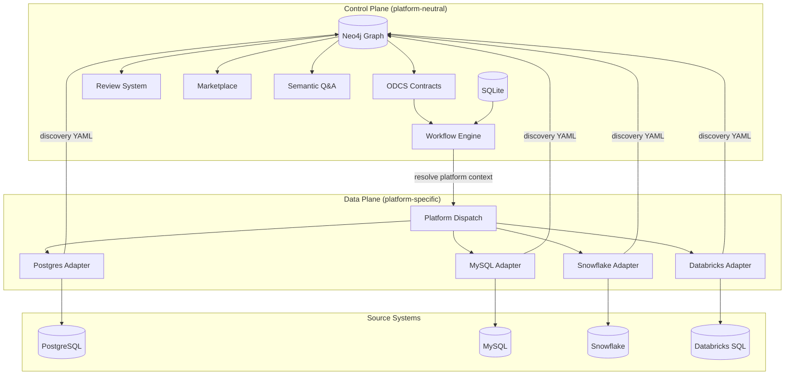
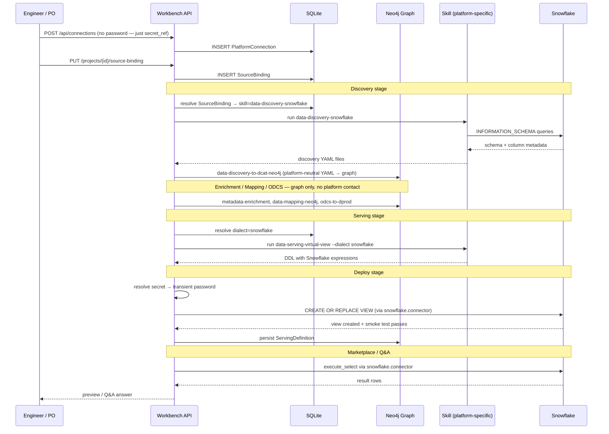
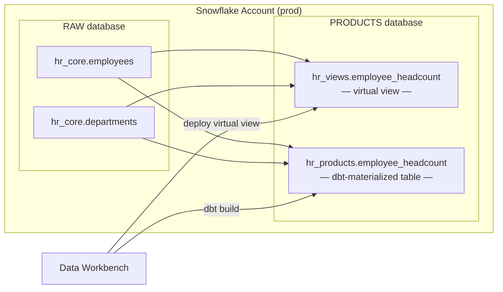
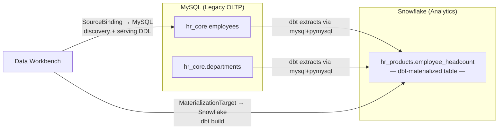
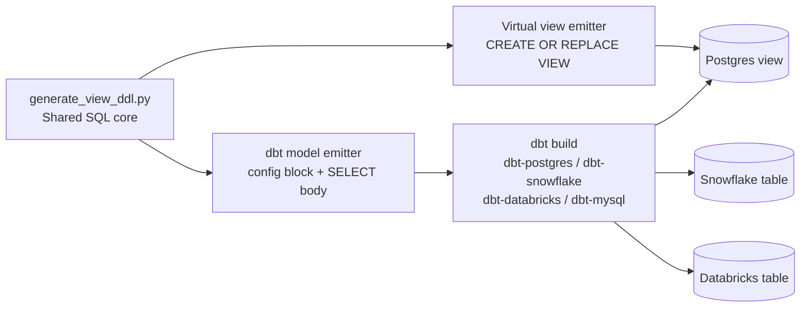
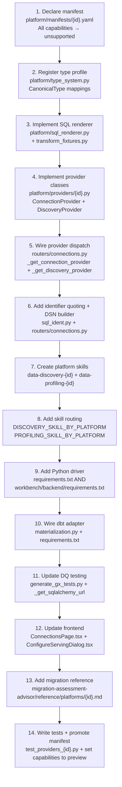

# Multi-Platform Data Source Support — Architect's Guide

This guide explains how Data Workbench supports multiple data platforms, how to configure platform connectivity, how to add support for new platforms, and what the known boundaries are today.

> **Reading note.** Sections 1–9 are conceptual architecture. Section 10 is the provider interface contract. Section 11 is the type system. Section 12 covers skills. Section 13 is the step-by-step developer checklist for adding a new platform. Sections 14–16 cover serving, gaps/roadmap, and FAQ. Appendix A has platform-specific reference sheets.

---

## 1. The Core Idea: Two Planes, One Graph

Data Workbench separates the **control plane** from the **data plane**. The control plane — project metadata, graph knowledge, workflows, approvals, ODCS contracts — runs on a shared Neo4j + SQLite backend and is entirely platform-neutral. The data plane is where platform specificity lives: how schemas are discovered, how views are deployed, how previews are read.

The critical insight is that the two planes share almost nothing at runtime. The platform-neutral graph is built once during discovery and enrichment; everything downstream (mapping review, ODCS authoring, DQ rules, marketplace, Q&A) operates against that graph and never touches the source platform again — until a view is deployed or a SQL preview is needed.



This means:
- Adding a new platform does not touch the pipeline orchestration, the graph schema, the review system, or the wizard flows
- Most of Data Workbench — enrichment, mapping, DQ rules, ODCS authoring, marketplace, Q&A — runs entirely against the graph
- Only the handful of components that touch live data (discovery, profiling, view deploy, preview, Q&A SQL execution) need platform-specific implementations

---

## 2. Platform Support Today

Ten platforms are currently registered in the manifest registry. The `CapabilityLevel` enum (`platform/interfaces.py`) has five values, ordered lowest to highest: `unsupported` < `experimental` < `preview` < `certified`, plus `deprecated`. The load-bearing rule lives in `PlatformRegistry.is_usable()`: **only `preview` and `certified` are treated as usable** — `experimental` is declared-but-gated, and `assert_usable()` raises `CapabilityUnavailable` for anything below `preview`.

### Platform capability matrix

| Platform | connection | discovery | profiling | read\_query | native\_view | dbt\_mat | remediation | semantic\_qa | transfer\_src | transfer\_tgt | lakehouse\_export | lakehouse\_src |
|---|---|---|---|---|---|---|---|---|---|---|---|---|
| **PostgreSQL** | certified | certified | certified | certified | certified | certified | preview | certified | preview | preview | unsupported | certified |
| **MySQL 8.0+** | preview | preview | preview | preview | preview | unsupported | unsupported | unsupported | preview | unsupported | unsupported | preview |
| **Snowflake** | preview | preview | preview | preview | preview | preview | unsupported | unsupported | preview | preview | unsupported | unsupported |
| **Databricks SQL** | preview | preview | preview | preview | preview | preview | unsupported | unsupported | unsupported | preview | unsupported | unsupported |
| **Oracle** | unsupported | unsupported | unsupported | unsupported | unsupported | unsupported | unsupported | unsupported | preview | preview | unsupported | unsupported |
| **SQL Server / Azure SQL** | unsupported | unsupported | unsupported | unsupported | unsupported | unsupported | unsupported | unsupported | preview | preview | unsupported | unsupported |
| **DuckDB (local lakehouse)** | preview | preview | preview | preview | unsupported | unsupported | unsupported | unsupported | preview | preview | preview | unsupported |
| **Amazon S3** | unsupported | unsupported | unsupported | unsupported | unsupported | unsupported | unsupported | unsupported | unsupported | unsupported | unsupported | unsupported |
| **Azure ADLS Gen2** | unsupported | unsupported | unsupported | unsupported | unsupported | unsupported | unsupported | unsupported | unsupported | unsupported | unsupported | unsupported |
| **Google Cloud Storage** | unsupported | unsupported | unsupported | unsupported | unsupported | unsupported | unsupported | unsupported | unsupported | unsupported | unsupported | unsupported |

S3, Azure ADLS, and GCS are pre-registered placeholders — manifests exist so the registry is ready when object-store backends enter scope (Phase 3 lakehouse).

**`certified`** — fully tested against a live environment (only Postgres today).  
**`preview`** — usable; implementation complete and tested against mocked/simulated drivers, not yet live-validated.  
**`experimental`** — declared but **not** usable; `is_usable()` returns `False`, so a stage gated on this capability is refused.  
**`unsupported`** — not implemented; `assert_usable()` raises `CapabilityUnavailable` before the stage executes.

---

## 3. Architecture: The Platform Adapter Pattern

The architecture uses four distinct layers. Each has a clear responsibility and a well-defined interface.

```mermaid
graph TB
    subgraph L1["Layer 1 — Connection Registry"]
        PC[PlatformConnection\nSQLite record]
        SB[SourceBinding\nproject ↔ connection]
        MT[MaterializationTarget\nper-product dbt target]
        SEC[secret_ref\nenv-var pointer, never stored]
        PC --> SEC
        SB --> PC
        MT --> SEC
    end

    subgraph L2["Layer 2 — Platform Manifests"]
        MAN[manifests/*.yaml\nCapability declarations]
        REG[PlatformRegistry singleton\nget_registry()]
        MAN --> REG
    end

    subgraph L3["Layer 3 — Provider SPI"]
        CP[ConnectionProvider Protocol]
        DP[DiscoveryProvider Protocol]
        QE[QueryExecutor Protocol]
        PCP[Postgres providers]
        MCP[MySQL providers]
        SCP[Snowflake providers]
        DCP[Databricks providers]
        PP[Parquet providers]
        CP & DP & QE --> PCP & MCP & SCP & DCP & PP
    end

    subgraph L4["Layer 4 — Pipeline Dispatch"]
        RC["resolve_source_connection_ref()\nrouters/connections.py"]
        SE["sql_executor.py\nexecute_deploy · execute_select"]
        SKL["Skill Router\nDISCOVERY_SKILL_BY_PLATFORM\nPROFILING_SKILL_BY_PLATFORM"]
        DIA["Dialect Router\nPLATFORM_TO_SQLGLOT\nget_renderer()"]
        RC --> SE & SKL & DIA
    end

    L1 --> L2
    L2 --> L3
    L3 --> L4
```

### Layer 1 — Connection Registry

Every data source is represented as a **`PlatformConnection`** record in SQLite (`models.py:506`):

```
PlatformConnection
  connection_name    human-readable label ("prod-snowflake-analytics")
  platform_type      manifest id: "postgres" | "mysql" | "snowflake" | "databricks" | ...
  host               hostname, Snowflake account identifier, or Databricks workspace URL
  port               standard port (optional for Snowflake/Databricks which use HTTPS)
  database           database or catalog name
  username           service account (Databricks uses the literal string "token")
  secret_ref         "env:VAR_NAME" — the name of an env var that holds the password/token
  extra_config_json  platform-specific extras: warehouse/role (Snowflake), http_path/catalog (Databricks)
  connection_roles_json  ["source"] and/or ["target"]
```

**Credential security model**: passwords are never stored in the database, graph, logs, or API responses. `secret_ref` is an opaque pointer resolved by `platform/secrets.py:resolve_secret()` at connection time using `env:<VAR>` or `direct:<password>` prefixes. The resolved value is used transiently within the connection call and discarded when the connection closes.

A **`SourceBinding`** (`models.py:553`) links a project to a `PlatformConnection`. One project has at most one source binding. Fields of note:
- `default_schema` — schema/catalog scope used as default for discovery
- `target_dialect` — optional SQL dialect override for serving stages
- `view_target_namespace` — optional `catalog.schema` for 3-level platforms (Databricks Unity Catalog, Snowflake)

### Layer 2 — Platform Manifests

Every supported platform has exactly one YAML file in `workbench/backend/platform/manifests/`. The **`PlatformRegistry`** singleton (`platform/registry.py`) globs all `*.yaml` files at startup.

Manifest schema:
```yaml
apiVersion: workbench.platform/v1
id: snowflake
displayName: Snowflake
adapterVersion: "1.0.0"
adapterKind: jdbc                 # "jdbc" | "object_store" | "embedded"

driver:
  package: snowflake-connector-python
  compatibility: ">=3.0"

namespace:
  parts: [schema, relation]       # Snowflake uses 2-level; Databricks uses [catalog, schema, relation]
  labels:
    schema: Schema
    relation: Table / View

capabilities:
  connection: preview
  discovery: preview
  profiling: preview
  read_query: preview
  native_view: preview
  dbt_materialized: preview
  remediation: unsupported
  semantic_qa: unsupported
  transfer_source: unsupported
  transfer_target: preview
  lakehouse_export: unsupported
  lakehouse_source: unsupported
```

**`PlatformRegistry` API** (`platform/registry.py`):
- `get_registry()` → singleton
- `platform_ids()` → sorted list of registered IDs
- `get_manifest(id)` → `PlatformManifest | None`
- `get_capability(id, capability)` → `CapabilityLevel`
- `is_usable(id, capability)` → `True` only for `preview` or `certified`
- `assert_usable(id, capability)` → raises `CapabilityUnavailable` if not usable
- `capability_matrix()` → full `{platform_id: {capability: level}}` dict

**REST API** (`routers/platforms.py`):
- `GET /api/platforms` — list all with usability booleans
- `GET /api/platforms/capability-matrix` — full matrix
- `GET /api/platforms/{id}` — single manifest
- `GET /api/platforms/{id}/capabilities/{capability}` — one capability level

**Promoting a capability level**: edit `platform/manifests/{id}.yaml` and set the capability to the new level. No code change is required — the manifest is loaded at runtime.

**Disabling a platform entirely**: set all capabilities to `unsupported` in its manifest. The platform will still appear in `GET /api/platforms` but every feature invocation will return `CapabilityUnavailable`.

### Layer 3 — Provider SPI (Service Provider Interface)

Defined as `@runtime_checkable Protocol` classes in `platform/interfaces.py`. Duck-typing — no forced inheritance. Six provider protocols:

| Protocol | Methods | Used by |
|---|---|---|
| `ConnectionProvider` | `validate_config()`, `probe()`, `open()` → `ManagedConnection` | `/api/connections/{id}/test`, binding save |
| `DiscoveryProvider` | `list_namespaces()`, `list_relations()`, `describe_relations()` → `DiscoveryBundle` | Schema/table picker in UI, MCP `list_source_namespaces/tables` |
| `QueryExecutor` | `explain()`, `select()`, `classify_error()` | Preview rows, Semantic Q&A SQL execution |
| `QueryRenderer` | `render_query()`, `validate_query()` (pure — no live connection) | Filter predicate dry-run validation |
| `DdlRenderer` | `render_view()`, `render_relation_change()`, `validate_ddl()` (pure) | Virtual view DDL generation |
| `DeploymentProvider` | `plan()`, `apply()`, `verify()`, `compensate()` | Deploy view stage |
| `TransferExecutionProvider` | `plan_transfer()`, `execute_transfer()`, `verify_transfer()`, `compensate_transfer()` | Cross-platform transfer serving |

**Implemented providers** (`platform/providers/`):

| File | Provider classes | Notes |
|---|---|---|
| `postgres.py` | `PostgresConnectionProvider`, `PostgresDiscoveryProvider`, `PostgresQueryExecutor`, `PostgresDeploymentProvider` | Reference certified implementation |
| `mysql.py` | `MySQLConnectionProvider`, `MySQLDiscoveryProvider` | Both DSN-style and structured field refs |
| `snowflake.py` | `SnowflakeConnectionProvider`, `SnowflakeDiscoveryProvider` | Includes `list_catalogs_and_schemas()` for target namespace picker |
| `databricks.py` | `DatabricksConnectionProvider`, `DatabricksDiscoveryProvider` | Unity Catalog + Hive Metastore auto-detect |
| `parquet.py` | `ParquetConnectionProvider`, `ParquetDiscoveryProvider` | DuckDB-backed; connection ref = base directory + glob |
| `transfer.py` | `DuckDBTransferProvider` | Cross-platform EL via DuckDB; dlt engine for warehouse targets |

**Provider dispatch** in `routers/connections.py` — `_get_connection_provider(platform_type)` and `_get_discovery_provider(platform_type)` are if/elif chains. Only Postgres and MySQL providers are eagerly imported; Snowflake, Databricks, and Parquet are imported lazily inside the dispatch functions so the server starts even if optional drivers are absent.

### Layer 4 — Pipeline Dispatch

When a stage runs (`pipeline.py:build_prompt()`):
1. `resolve_source_connection_ref(project, session)` checks for a `SourceBinding` and returns `(platform_type, connection_ref_dict)`.
2. If the project has a binding, `_resolve_platform_context()` builds a context dict with `connection_string`, `skill_override` (e.g. `data-discovery-snowflake`), `dialect`, and `view_target_namespace`.
3. The `skill_override` replaces the default Postgres skill in the stage's prompt.
4. The prompt injects `connection_string` and `--dialect <dialect>` for the skill scripts.

For the **config-options endpoint** (table/schema picker in the UI), `routers/stages.py` runs the skill's `discover_schemas.py` and `discover_tables.py` scripts directly as subprocesses, resolving the platform from the `SourceBinding`.

---

## 4. End-to-End Pipeline Flow

The following diagram traces a Snowflake project from connection registration through marketplace Q&A, showing exactly where platform-specific code runs and where control returns to the neutral graph.



---

## 5. End-User Configuration

### Step 1 — Register the platform connection

**Via the UI**: Engineering Workbench → **Connections** → **Add Connection**. Fill in platform type, host, database, username, and the name of the environment variable that holds the password (`secret_ref`).

**Via REST** (or MCP `create_connection`):
```http
POST /api/connections
{
  "connection_name": "prod-snowflake",
  "platform_type": "snowflake",
  "host": "myorg.us-east-1.snowflakecomputing.com",
  "database": "ANALYTICS",
  "username": "workbench_svc",
  "secret_ref": "env:SNOWFLAKE_WORKBENCH_PASSWORD",
  "extra_config": {
    "warehouse": "COMPUTE_WH",
    "role": "WORKBENCH_ROLE"
  }
}
```

Set the referenced env var before starting the backend:
```bash
export SNOWFLAKE_WORKBENCH_PASSWORD="<actual password>"
```

**Test the connection** before binding it to a project:
```http
POST /api/connections/{id}/test
```
Returns `{"ok": true}` or a specific error if credentials or network are wrong.

### Step 2 — Bind the connection to a project

**Via the UI**: open a project → click the platform badge in the project header → **Change source binding**.

**Via REST**:
```http
PUT /api/projects/{project_id}/source-binding
{
  "connection_id": 42,
  "default_schema": "hr_core"
}
```

After binding, the project's pipeline automatically routes to the platform's skill and SQL adapter — no other configuration is needed for the standard source-aligned flow.

### What stays the same regardless of platform

- Creating projects, workflows, stages
- The PO wizard (ODCS authoring, rule coaching, schema shaping)
- All review and approval flows (descriptions, mappings, rules)
- Marketplace browsing, lineage, gap logging
- Engineer chat (operates on the graph)
- MCP tooling surface (116+ tools)

---

## 6. Materialization Patterns

Materialization is the act of building a physical, queryable data product from the ODCS contract and mapped columns. The key design decision is where that physical artifact lives — and it doesn't have to be on the same instance, database, or even the same platform as the source data.

### Pattern A — Same platform, same instance (simplest)

The most common case. Source tables and materialized product views live in the same database instance. No `MaterializationTarget` is needed.



**Configuration**: no `MaterializationTarget` — the deploy stage uses the `SourceBinding` connection and creates views in a separate schema within the same instance.

### Pattern B — Same platform type, different instance

Source and materialized product use the same platform technology but different accounts or environments (e.g. prod Snowflake → analytics Snowflake). The `SourceBinding` still points to the production account; the `MaterializationTarget` carries the analytics account.

```http
PUT /api/projects/{id}/serving/materialization-target
{
  "platform": "snowflake",
  "connection_json": {
    "account": "myorg-analytics.us-east-1.snowflakecomputing.com",
    "database": "HR_PRODUCTS",
    "username": "dbt_svc",
    "secret_ref": "env:SNOWFLAKE_ANALYTICS_PASSWORD",
    "warehouse": "ANALYTICS_WH",
    "schema": "hr_products"
  }
}
```

### Pattern C — Cross-platform (different technologies)

Source and materialized product are on different platforms (e.g. MySQL OLTP → Snowflake analytics).



**Important constraint**: virtual views (`serving_virtual_view`) always deploy to the **source** platform. Only the physical materialization path (`serving_physical_copy` via dbt) can land data on a different platform. For Pattern C, switch to `serving_physical_copy` via `set_serving_mode`.

### Pattern summary

| | Source | Target | Serving mode | MaterializationTarget needed? |
|---|---|---|---|---|
| **A — Same instance** | any | same instance | virtual or physical | No |
| **B — Same platform, different instance** | Snowflake prod | Snowflake analytics | physical (dbt) | Yes |
| **C — Cross-platform** | MySQL OLTP | Snowflake OLAP | physical (dbt) | Yes |

---

## 7. The Role of dbt

dbt (data build tool) is the **materialization engine** when physical tables or cross-platform copies are needed. It is not the SQL author and not the catalog.

When `serving_physical_copy` runs, Data Workbench:
1. Calls `generate_dbt_models()` in `generate_view_ddl.py`. The SELECT body is byte-identical to the virtual view emitter — all transforms, SCD lowering, window functions resolve once in the shared core.
2. Wraps each SELECT body in a dbt model file: `{{ config(materialized='table') }} <select_body>`.
3. Scaffolds a complete runnable dbt project on disk (models, `profiles.yml`, `sources.yml`).
4. Runs `dbt build` against the target platform using the appropriate dbt adapter.



The `profiles.yml` generated by Data Workbench uses `env_var()` references — credentials come from environment variables injected at build time. The scaffolded dbt project is shareable without leaking secrets.

**Installed dbt adapters** — `dbt-core`, `dbt-postgres`, `dbt-snowflake`, and `dbt-databricks` are all pinned in `requirements.txt` today, so Postgres, Snowflake, and Databricks dbt materialization run out of the box:
- `dbt-core` + `dbt-postgres` — bundled (frozen lockfile)
- `dbt-snowflake==1.10.8` — bundled; Snowflake dbt materialization runs out of the box
- `dbt-databricks==1.12.4` — bundled; Databricks dbt materialization runs out of the box
- `dbt-mysql` — community adapter, **not** bundled; MySQL `dbt_materialized` stays `unsupported`, so a MySQL-served product falls back to a virtual view

> **Capability caveat.** The Snowflake and Databricks manifests declare `dbt_materialized: preview` and their dbt adapters are now in the image, so that path is live. Only MySQL still lacks a bundled dbt adapter. Note that `dlt[snowflake,databricks]` in the Dockerfile pulls the *connectors* (used for cross-platform transfer) — separate from the *dbt adapters* pinned above.

---

## 8. The SQL Dialect System

Different platforms use different SQL syntax. Data Workbench has two complementary dialect mechanisms.

### Transform DSL renderer (`platform/sql_renderer.py`)

Used when generating view DDL from the transform DSL (column-level `kind` / `params`). Each platform has a concrete renderer class.

| Platform | Class | Concat | Cast | Hash | Quoting |
|---|---|---|---|---|---|
| PostgreSQL | `PostgresSqlRenderer` | `\|\|` | `::text` | `md5()` | `"col"` |
| Snowflake | `SnowflakeSqlRenderer` | `CONCAT()` | `CAST(x AS TEXT)` | `SHA2()` | `"COL"` |
| Databricks | `DatabricksSqlRenderer` | `CONCAT()` | `CAST()` | `sha2()` | `` `col` `` |
| MySQL / ANSI | `MysqlSqlRenderer` | `CONCAT()` | `CAST()` | `MD5()` | `` `col` `` |

`get_renderer(platform_id)` in `sql_renderer.py` — fail-closed (`KeyError` on unknown platforms). `platform/transform_fixtures.py` holds 22 golden-path fixtures (`GOLDEN_PATH_FIXTURES`), each asserted across up to 4 platforms — 83 conformance pairs in total — by `test_sql_renderer.py`.

### LLM-generated SQL renderer (`dialect_sql.py`)

Used only at **LLM-generation sites** (Semantic Q&A, QA executor) — never inside `sql_executor`. Parses ANSI SQL via sqlglot and re-renders to the target dialect.

```python
PLATFORM_TO_SQLGLOT = {
    "postgres": "postgres",
    "mysql": "mysql",
    "snowflake": "snowflake",
    "databricks": "databricks",
    "bigquery": "bigquery",
    "duckdb": "duckdb",
}
```

`render_for_platform(sql, target_platform)` — reads dialect from `SourceBinding.target_dialect` if set, otherwise auto-derives from `platform_type`.

### Identifier quoting (`sql_ident.py`)

Single source of truth for per-platform quoting:
- `quote_style(platform)` → `"backtick"` (MySQL, Databricks) | `"double"` (all others)
- `quote_ident(name, platform)` → `` `name` `` or `"name"`
- `quote_relation(schema, name, platform)` → fully qualified; handles 3-level Unity Catalog names (`` `catalog`.`schema`.`table` ``)

---

## 9. The Namespace Model (`platform/namespace.py`)

`NamespaceModel` describes how a platform addresses a relation and what setup statements are needed before executing:

- `parts` — ordered namespace levels from the manifest (`["schema", "relation"]` for Postgres/MySQL/Snowflake; `["catalog", "schema", "relation"]` for Databricks)
- `qualify(namespace, relation)` → fully-quoted `schema.table` or `catalog.schema.table`
- `session_setup_statements(source_namespace)` → `USE CATALOG ...` for Databricks; empty for others
- `create_namespace_statement(namespace)` → `CREATE SCHEMA IF NOT EXISTS ...` with correct quoting
- `to_descriptor()` → JSON-safe dict embedded in the deploy package for the stdlib-only standalone runner

`get_namespace_model(platform_id)` — fail-closed: raises `KeyError` for unknown platforms.

---

## 10. The Type System (`platform/type_system.py`)

A canonical type enum (`CanonicalType`) with 21 values bridges across platform-specific type strings. Each platform has a `TypeMappingProfile` registered via `register_profile(platform_id, profile)`.

**Canonical types** (21):
`int8`, `int16`, `int32`, `int64`, `float32`, `float64`, `decimal`, `string`, `binary`, `boolean`, `date`, `time_ms`, `timestamp_us`, `timestamp_tz_us`, `interval_day`, `interval_year`, `json`, `array`, `struct`, `map`, `unknown`

**`TypeMappingProfile` interface**:
- `map_to_canonical(platform_type_str)` → `ColumnTypeDescriptor` with `canonical`, `precision`, `scale`, and optionally a `ConversionWarningKind` (`lossy` / `ambiguous` / `unsupported` / `precision_capped`)
- `map_from_canonical(canonical, precision, scale)` → SQL type string for DDL generation

**Built-in profiles**: `postgres` (41 entries), `mysql` (38), `snowflake` (38), `databricks` (37), `oracle` (migration Phase 2), `sqlserver` (migration Phase 2).

`get_profile(platform_id)` — fail-closed (`KeyError` on unknown). Used by the migration assessment advisor to produce per-column conversion warnings.

---

## 11. Platform Skills — The LLM-Driven Pipeline Layer

Skills live in `workbench-skills/skills/`. The backend mounts the skills plugin via `config.PIPELINE_PLUGINS` and threads it into every `ClaudeAgentOptions`. When a stage runs, `_resolve_platform_context()` injects a `skill_override` into the stage prompt if the project has a non-Postgres `SourceBinding`.

### Platform-specific skill families

| Feature | Postgres (default) | MySQL | Snowflake | Databricks | Parquet/DuckDB |
|---|---|---|---|---|---|
| Discovery | `data-discovery` | `data-discovery-mysql` | `data-discovery-snowflake` | `data-discovery-databricks` | `data-discovery-parquet` |
| Profiling | `data-profiling` | `data-profiling-mysql` | `data-profiling-snowflake` | `data-profiling-databricks` | `data-profile-parquet` |
| Export | — | — | — | — | `data-export-parquet` |

### Skill directory structure

Every platform discovery skill follows an identical layout:
```
workbench-skills/skills/data-discovery-{platform}/
  SKILL.md
  scripts/
    discover_schemas.py     list non-system schemas → JSON stdout
    discover_tables.py      list tables in given schemas → JSON stdout
    extract_metadata.py     column/PK/FK/constraint metadata → YAML files
```

Each script **self-installs its driver** (`pip install --quiet ...`) so it runs standalone without the backend's virtualenv.

### Platform-to-skill routing maps (`routers/connections.py`)

```python
DISCOVERY_SKILL_BY_PLATFORM = {
    "mysql":       "data-discovery-mysql",
    "snowflake":   "data-discovery-snowflake",
    "databricks":  "data-discovery-databricks",
    "duckdb":      "data-discovery-parquet",
    "duckdb_local":"data-discovery-parquet",
}
PROFILING_SKILL_BY_PLATFORM = {
    "mysql":       "data-profiling-mysql",
    "snowflake":   "data-profiling-snowflake",
    "databricks":  "data-profiling-databricks",
    "duckdb":      "data-profile-parquet",
    "duckdb_local":"data-profile-parquet",
}
```

Postgres is the default — if a platform has no entry in either map, the stage falls back to the standard `data-discovery` / `data-profiling` skills.

### Discovery YAML output format (all platforms)

All platform discovery skills emit identical YAML. This is what makes the downstream `data-discovery-to-dcat-neo4j` graph loader platform-neutral.

```yaml
schema: sales
table: orders
comment: null
columns:
  - name: id
    ordinal: 1
    type: <platform-native type string>
    nullable: false
    default_value: null
    comment: null
primary_key:
  columns: [id]
foreign_keys:
  - column: customer_id
    ref_table: customers
    ref_column: id
unique_constraints: []
indexes: []
check_constraints: []
```

### Migration assessment reference files

For platforms used as migration sources, a reference file in `workbench-skills/skills/migration-assessment-advisor/reference/platforms/{platform_id}.md` documents the platform's quirks, type system edge cases, and common migration gotchas that the assessment advisor skill reads to produce per-column conversion warnings.

Files exist for: `postgres.md`, `mysql.md`, `snowflake.md`, `databricks.md`, `oracle.md`, `sqlserver.md`.

---

## 12. Dependencies and Dockerfile

### `requirements.txt` (frozen lockfile — what the Dockerfile installs)

Adding a new platform driver requires updating **both** `requirements.txt` (frozen lockfile) and `workbench/backend/requirements.txt` (canonical list). Only `requirements.txt` is installed by the Dockerfile — a driver added only to the canonical list is silently absent from the container.

Platform drivers currently in the frozen lockfile:

Platform drivers and dbt adapters **directly pinned** in the frozen `requirements.txt`:

| Package | Role | Notes |
|---|---|---|
| `psycopg2-binary==2.9.11` | Postgres driver | Ships own libpq — no apt deps needed |
| `PyMySQL==1.1.2` | MySQL driver | Pure Python |
| `databricks-sql-connector==4.4.0` | Databricks driver | Explicitly added with two-file sync reminder comment |
| `dbt-core==1.11.11` | dbt engine | Always bundled |
| `dbt-postgres==1.10.0` | dbt adapter (Postgres) | Bundled |
| `dbt-snowflake==1.10.8` | dbt adapter (Snowflake) | Bundled — Snowflake dbt materialization works out of the box |
| `dbt-databricks==1.12.4` | dbt adapter (Databricks) | Bundled — Databricks dbt materialization works out of the box |

Notably **not** in `requirements.txt`: `snowflake-connector-python`, `oracledb`, `pyodbc`, and `dbt-mysql`. The Oracle driver arrives through the Dockerfile layer below; Snowflake connectivity uses the pinned `snowflake-sqlalchemy` plus `dlt[snowflake]` from the Dockerfile.

### `Dockerfile` second install layer

```dockerfile
RUN pip install --no-cache-dir -c requirements.txt \
    "dlt[databricks,snowflake,postgres,sqlalchemy,parquet]>=1.5,<2.0" \
    "oracledb>=2.0"
```

This installs dlt (for migration pipelines and cross-platform transfer) plus the Oracle driver. `dlt[snowflake]` transitively pulls `snowflake-connector-python`, which is why Snowflake connectivity works even though the connector is not a direct `requirements.txt` entry. dbt *adapters* for Snowflake/Databricks are **not** installed by this line — dlt extras cover the transfer connectors only, not dbt. SQL Server (`pyodbc`) is intentionally omitted — it requires a system ODBC driver and runs via the downloadable migration package, not in-backend.

---

## 13. Adding a New Platform — Developer Checklist

This section is the definitive step-by-step guide. The fourteen steps below cover a complete platform integration (Steps 10–11 apply only if dbt materialization and DQ testing are in scope for the platform). The graph-loader skills (`data-discovery-to-dcat-neo4j`, `data-profiling-to-dqv-neo4j`), pipeline orchestration, review system, ODCS contracts, and marketplace do not change.



### Step 1 — Declare the manifest (required first)

Create `workbench/backend/platform/manifests/{platform_id}.yaml`. Start all capabilities at `unsupported` — this registers the platform in the registry without enabling any features.

```yaml
apiVersion: workbench.platform/v1
id: bigquery
displayName: BigQuery
adapterVersion: "1.0.0"
adapterKind: jdbc

driver:
  package: google-cloud-bigquery
  compatibility: ">=3.0"

namespace:
  parts: [schema, relation]
  labels:
    schema: Dataset
    relation: Table

capabilities:
  connection: unsupported
  discovery: unsupported
  profiling: unsupported
  read_query: unsupported
  native_view: unsupported
  dbt_materialized: unsupported
  remediation: unsupported
  semantic_qa: unsupported
  transfer_source: unsupported
  transfer_target: unsupported
  lakehouse_export: unsupported
  lakehouse_source: unsupported
```

### Step 2 — Register the type system profile

In `platform/type_system.py`, add a `_{platform_id}_profile` `TypeMappingProfile` constant following the `_postgres_profile` pattern. Register it at the bottom of the file:

```python
register_profile("bigquery", _bigquery_profile)
```

Add an entry to `list_profiles()`. Cover all platform-native types with accurate `ConversionWarningKind` annotations (`lossy` for types that lose data, `ambiguous` for types whose semantics differ, `precision_capped` where the canonical representation truncates precision).

Add test cases to `test_type_system.py` asserting both `map_to_canonical` and `map_from_canonical` round-trips.

### Step 3 — Implement the SQL expression renderer

In `platform/sql_renderer.py`, add a `BigQuerySqlRenderer(BaseSqlRenderer)` class. Override `platform_id` and any `_render_*` methods that differ from Postgres. At minimum, check:
- `_render_concat` — `||` (Postgres) vs `CONCAT()` (most others)
- `_render_cast` — `::type` (Postgres) vs `CAST(x AS type)`
- `_render_hash` — `md5()` vs `SHA2()` / `sha2()`
- `_quote` — double-quotes (BigQuery uses backticks)

Add the renderer to `_RENDERERS` and `get_renderer()`. Add at least one fixture per transform kind to `platform/transform_fixtures.py`. Verify with `pytest test_sql_renderer.py`.

### Step 4 — Implement provider classes

Create `platform/providers/bigquery.py`. Implement `ConnectionProvider` (required) and `DiscoveryProvider` (required for all interactive flows). Implement `QueryExecutor` and `DeploymentProvider` when preview capability is ready.

Key conventions:
- Lazy-import the driver inside each method body (`from google.cloud import bigquery as bq`) so the module loads in environments where the driver is not installed
- `probe()` should connect, run a cheap query (`SELECT 1`), and return `CapabilityEvidence` with latency
- `describe_relations()` must return a `DiscoveryBundle` with column metadata in the exact format that `extract_metadata.py` produces
- Never store credentials — resolve them from `connection_ref` at call time

### Step 5 — Wire provider dispatch

In `routers/connections.py`, add `bigquery` branches to `_get_connection_provider()` and `_get_discovery_provider()`:

```python
elif platform_type == "bigquery":
    from workbench.backend.platform.providers.bigquery import (
        BigQueryConnectionProvider, BigQueryDiscoveryProvider
    )
    return BigQueryConnectionProvider()
```

### Step 6 — Add identifier quoting and DSN builder

In `sql_ident.py`, add `"bigquery"` to `_BACKTICK_PLATFORMS` if BigQuery uses backtick quoting (it does).

In `dialect_sql.py`, add:
```python
PLATFORM_TO_SQLGLOT["bigquery"] = "bigquery"
```

If BigQuery needs a custom DSN format, add a branch in `build_connection_string()` in `routers/connections.py`.

### Step 7 — Create the platform skills

Create two skill directories following the exact layout in Section 11:

**`workbench-skills/skills/data-discovery-bigquery/`**  
`SKILL.md` frontmatter:
```yaml
---
name: data-discovery-bigquery
description: "Extracts and documents BigQuery dataset metadata including tables, columns, primary keys, and type information."
---
```

Scripts:
- `discover_schemas.py` — lists datasets (BigQuery's "schemas"). Self-installs `google-cloud-bigquery`. Emits JSON array of schema names to stdout.
- `discover_tables.py` — lists tables in given datasets.
- `extract_metadata.py` — extracts full column metadata → YAML files in the exact shared format.

**`workbench-skills/skills/data-profiling-bigquery/`**  
`SKILL.md` + `scripts/profile_table.py`. Profile using `APPROX_COUNT_DISTINCT()` and `APPROX_QUANTILES()` for BigQuery's approximate aggregate functions.

### Step 8 — Add skill routing

In `routers/connections.py`:
```python
DISCOVERY_SKILL_BY_PLATFORM["bigquery"] = "data-discovery-bigquery"
PROFILING_SKILL_BY_PLATFORM["bigquery"] = "data-profiling-bigquery"
```

### Step 9 — Add Python driver to requirements

Add to **both** `requirements.txt` (frozen lockfile) and `workbench/backend/requirements.txt` (canonical list). Pinning convention: pin to a tested minor version with `>=` lower bound.

```
# BigQuery connector
google-cloud-bigquery>=3.11,<4.0
```

The Dockerfile installs `requirements.txt` — if you forget to add the driver there, the container will fail silently at connection time.

### Step 10 — Wire dbt adapter (if dbt materialization is in scope)

1. Add `dbt-bigquery` to `requirements.txt` and `workbench/backend/requirements.txt`.
2. In `routers/materialization.py`, add a branch in `_dbt_env()` to build the BigQuery-specific environment variables for the generated `profiles.yml`.
3. In `generate_view_ddl.py`, if BigQuery's DDL has significant departures from standard SQL (e.g. column-level type annotations in `CREATE VIEW`), add a `BigQueryDdlRenderer`.
4. Promote `dbt_materialized` in the manifest from `unsupported` to `preview`.

### Step 11 — Update DQ testing

In `generate_gx_tests.py`, add BigQuery to `_get_sqlalchemy_url()` to build the correct SQLAlchemy connection URL for the GX test runner. BigQuery uses `bigquery://project/dataset` URL format.

Note: some GX expectation types that use Postgres-specific SQL expressions fall back to the SQLAlchemy-generic subset for non-Postgres platforms — this is expected behaviour.

### Step 12 — Update the frontend

Four files in `workbench/frontend/src/`:

**`pages/engineer/ConnectionsPage.tsx`**:
- Add `"bigquery"` to `SUPPORTED_PLATFORMS`
- Add default port to `PLATFORM_DEFAULTS` (BigQuery is HTTPS-based — add `null` or `443`)
- Add a colour to `PlatformChip`'s platform-to-colour map

**`components/ConnectionPickerDialog.tsx`**:
- Add `"bigquery"` to `PLATFORM_LABELS` and `PLATFORM_COLORS`

**`components/ConfigureServingDialog.tsx`**:
- Add `"bigquery": "bigquery"` to `PLATFORM_TO_DIALECT`
- BigQuery uses 2-level addressing (`dataset.table`) — do NOT add to `THREE_LEVEL_PLATFORMS`

**`components/SourcePlatformBadge.tsx`**:
- Add a BigQuery icon or colour token if a distinct visual identity is desired

### Step 13 — Add migration assessment reference

Create `workbench-skills/skills/migration-assessment-advisor/reference/platforms/bigquery.md`. Follow the structure of the existing `snowflake.md` and `databricks.md` files. Document:
- Platform-specific type system quirks (BigQuery's `STRUCT`, `ARRAY`, `GEOGRAPHY` types)
- Naming conventions and reserved words
- Common migration gotchas (e.g. BigQuery uses `ARRAY_AGG` not `string_agg`, no `SERIAL` / `AUTOINCREMENT`)
- SQL dialect notes relevant to the assessment agent

### Step 14 — Write tests and promote the manifest

Tests to add or extend:
- `test_connections.py` — extend the provider dispatch tests for BigQuery
- `test_platform_namespace.py` — verify namespace model parsing
- `test_type_system.py` — round-trip `map_to_canonical` → `map_from_canonical` for all BigQuery native types
- `test_sql_renderer.py` — all 22 transform fixture pairs pass for the `BigQuerySqlRenderer`

When all tests pass, promote capabilities from `unsupported` to `preview` in the manifest. Promote to `certified` after live-environment validation.

---

## 14. Serving Patterns, the Advisor, and the Lakehouse

### Serving-pattern taxonomy

Serving is described on two axes. **Axis 1 — where the product physically lives**:

| Pattern (id) | Plain meaning | Crosses a boundary? | Enabling tech | Status |
|---|---|---|---|---|
| `native_virtual` | A `CREATE VIEW` over existing tables in the source DB | No | plain SQL (`routers/serving.py`) | Built |
| `native_materialized` | New physical tables in the *same* DB | No | dbt (`routers/materialization.py`) | Built |
| `lakehouse_file` | Extract to Parquet files + DuckDB query engine | Yes → files | DuckDB + pyarrow + `TransferBatch` | Experimental |
| `transfer_then_transform` | Cross-platform move: extract from source, load into different target | Yes → another platform | DuckDB engine (Postgres/DuckDB targets); dlt (Snowflake/Databricks) | Experimental |
| `federated` | Target queries source live, no copy | No copy | FDW / Trino / external tables | Deferred |
| `warehouse_native_load` | Snowflake/Databricks bulk ingest (`COPY INTO`/Unity) | Yes | per-warehouse loaders | Deferred |

**Axis 2 — where transforms execute** (cross-boundary only): `transform_on_extract` (ETL), `transfer_then_transform` (ELT), `hybrid` (EtLT — recommended default: push cheap volume-reducers down, defer heavy joins/aggregations/SCD2).

### The capability-aware serving advisor

`POST /serving-strategy/advise` returns the full pattern list, each feasibility-gated against the source × target capability matrix (`platform/registry.py`):

- `feasible` — buildable now; one is marked `recommended` with a rationale
- `impossible` — physics/capability (e.g. `native_materialized` cannot span two platforms)
- `not_yet_supported` — roadmap or unbuilt for this pair

The advisor is **advisory only** — it never mutates state. The web **Configure Serving** dialog and the MCP `get_serving_advice` tool both render this payload.

### Lakehouse (Parquet + DuckDB) — Phase 1

The `serving_lakehouse_export` stage (third member of the `serving` exclusive-group alongside virtual and materialized):
1. Compiles the product SELECT using `generate_lakehouse_models()` in `generate_view_ddl.py` (the third emitter using `DuckDBDialect`)
2. Extracts each output dataset to Parquet via DuckDB `COPY`
3. Writes a TransferBatch-v1 manifest with reconciliation against the prior run
4. Registers a persistent DuckDB catalog view (`read_parquet(...)`)
5. Verifies with a DuckDB + pyarrow dual-engine row-count check

The `duckdb_local` platform also works as a **source** — a directory of Parquet files can be registered, bound, discovered (`data-discovery-parquet`), and profiled (`data-profile-parquet`). The DCAT/DQV graph loaders consume the emitted YAML unchanged.

---

## 15. Known Gaps and Roadmap

### Confirmed gaps

| Gap | Impact | Notes |
|---|---|---|
| GX DQ expectation compatibility | Moderate | Some GX expectations use Postgres-specific SQL; non-Postgres falls back to the SQLAlchemy-generic subset |
| Value resolution (fuzzy search) | Minor | Postgres uses `pg_trgm` similarity; non-Postgres falls back to `LIKE '%value%'` — less accurate for typo-tolerant lookups |
| Filter predicate dry-run | Minor | EXPLAIN-based pre-validation only works for Postgres; other platforms get parse-only validation |
| Consumer product same-platform assumption | Architecture | Virtual views JOIN across source views; those source views must all be on the same platform |
| Project deletion view cleanup | Low | `DELETE /api/projects/{id}` drops Postgres views but has no equivalent for non-Postgres artifacts |
| Snowflake driver not in frozen lockfile | Build | `snowflake-connector-python` self-installs via skill scripts but is absent from the Docker image; first-run discovery is slow |

### Near-term roadmap

- **Redshift** — `psycopg2`-compatible (libpq) wire protocol; lowest-effort addition. Manifest does not yet exist.
- **BigQuery** — `BigQueryDialect` in `generate_view_ddl.py` already exists; provider, skills, SQL executor adapter, and `google-cloud-bigquery` driver still needed.
- **Lakehouse Phase 2** — true Iceberg WRITE (`pyiceberg` + catalog lifecycle) and object-store backends (`s3`/`gcs`/`azure_adls`)
- **Snowflake frozen lockfile** — move `snowflake-connector-python` from self-install to the frozen lockfile
- **Oracle (migration source only)** — type system profile exists; `oracledb` is in the Dockerfile; provider and skills still needed
- **SQL Server (migration source + target)** — type system profile exists; blocked by `pyodbc` ODBC driver system dependency

---

## 16. Frequently Asked Questions

**Q: A user wants to point their project at MySQL instead of Postgres. What do they do?**  
Register a MySQL `PlatformConnection`, test it, bind it to the project via `PUT /api/projects/{id}/source-binding`. Discovery, profiling, enrichment, mapping, serving, deploy, preview, and Q&A all route to MySQL automatically from that point.

**Q: How do I enable or disable a specific feature for a platform?**  
Edit `workbench/backend/platform/manifests/{platform_id}.yaml` and set the capability to the new level (`unsupported` to disable, `preview` or `certified` to enable). The change takes effect on next backend startup — no code change required.

**Q: Can the source and materialization target be on different platforms?**  
Yes — see Section 6, Pattern C. Set a `MaterializationTarget` pointing to the target platform. Virtual views always deploy to the source platform. Physical copies via dbt build on the target. Switch to `serving_physical_copy` via `set_serving_mode`.

**Q: A consumer-aligned product CONSUMEs a source product on Snowflake. Does the consumer project also need a SourceBinding?**  
No. Data Workbench walks the `:CONSUMES` graph to find the source project and borrows its `SourceBinding`. The consumer views deploy on the same platform as their source — which is correct since they JOIN across those source views.

**Q: How do I promote a capability from experimental to certified?**  
Validate the capability against a live environment. Update `platform/manifests/{id}.yaml` to set the capability to `certified`. No code change required.

**Q: What happens if a stage runs on a platform whose capability is `unsupported`?**  
`PlatformRegistry.assert_usable()` fires before the skill or SQL executor is invoked and raises `CapabilityUnavailable`. The stage returns a clean error with no partial execution.

**Q: I added a driver to `workbench/backend/requirements.txt` but the container can't find it.**  
The Dockerfile installs `requirements.txt` (the frozen lockfile at the repo root), not `workbench/backend/requirements.txt`. You must add the driver to both files. See the note in Section 12.

---

## Appendix A — Platform Reference Sheets

### PostgreSQL

**Python driver**: `psycopg2-binary` (frozen lockfile — no extra install)  
**SQLAlchemy URL prefix**: `postgresql+psycopg2://`  
**dbt adapter**: `dbt-postgres` (bundled)  
**Identifier quoting**: double-quotes (`"schema"."table"`)  
**Namespace levels**: 2 (schema + relation)

**Required configuration fields**:

| Field | Example | Notes |
|---|---|---|
| `platform_type` | `postgres` | Also accepts `postgresql` |
| `host` | `db.internal.corp` | |
| `port` | `5432` | |
| `database` | `analytics` | |
| `username` | `workbench_svc` | |
| `secret_ref` | `env:PG_WORKBENCH_PASSWORD` | |

**Capabilities**: All capabilities certified. Postgres is the reference implementation.

**Notable platform specifics**:
- `pg_trgm` extension enables fuzzy value resolution in Semantic Q&A; falls back to LIKE if extension not installed
- EXPLAIN-based filter predicate dry-run validation available
- SCD-2 snapshots use `ROW_NUMBER() OVER (PARTITION BY ... ORDER BY ...)` window function
- `CREATE SCHEMA IF NOT EXISTS` supported natively

---

### MySQL 8.0+

**Python driver**: `PyMySQL` (frozen lockfile)  
**SQLAlchemy URL prefix**: `mysql+pymysql://`  
**dbt adapter**: `dbt-mysql` (community adapter — NOT bundled; install separately)  
**Identifier quoting**: backticks (`` `schema`.`table` ``)  
**Namespace levels**: 2 (schema + relation)

**Required configuration fields**:

| Field | Example | Notes |
|---|---|---|
| `platform_type` | `mysql` | |
| `host` | `mysql.internal.corp` | |
| `port` | `3306` | |
| `database` | `hr_core` | |
| `username` | `workbench_svc` | |
| `secret_ref` | `env:MYSQL_WORKBENCH_PASSWORD` | |

**`extra_config` (optional)**:

| Key | Example | Notes |
|---|---|---|
| `charset` | `utf8mb4` | Defaults to utf8mb4 |
| `ssl_ca` | `/etc/ssl/certs/mysql.pem` | Path to CA cert for SSL |

**Notable platform specifics**:
- DDL view header is rewritten at deploy time: `"schema"."view"` → `` `schema`.`view` ``
- No `BOOLEAN` type — use `TINYINT(1)`; the type profile maps this to `CanonicalType.boolean`
- `INFORMATION_SCHEMA.COLUMNS` used for discovery (column names differ slightly from Postgres)
- Sample data: `samples/hr-mysql/` contains a full HR schema ported from the Postgres HR sample

---

### Snowflake

**Python driver**: `snowflake-connector-python` (not a direct lockfile entry — pulled transitively via `dlt[snowflake]` in the Dockerfile)  
**SQLAlchemy URL prefix**: `snowflake://` (via `snowflake-sqlalchemy`)  
**dbt adapter**: `dbt-snowflake==1.10.8` — bundled in `requirements.txt`; `dbt_materialized` runs out of the box  
**Identifier quoting**: double-quotes (`"SCHEMA"."TABLE"`) — Snowflake folds unquoted identifiers to uppercase  
**Namespace levels**: 2 (schema + relation); use `view_target_namespace` for 3-level `catalog.schema` deploy targets

**Required configuration fields**:

| Field | Example | Notes |
|---|---|---|
| `platform_type` | `snowflake` | |
| `host` | `myorg.us-east-1.snowflakecomputing.com` | Full Snowflake account identifier |
| `database` | `ANALYTICS` | Uppercase conventional |
| `username` | `WORKBENCH_SVC` | |
| `secret_ref` | `env:SNOWFLAKE_WORKBENCH_PASSWORD` | |

**`extra_config` (required)**:

| Key | Example | Notes |
|---|---|---|
| `warehouse` | `COMPUTE_WH` | Required — virtual warehouse for query execution |
| `role` | `WORKBENCH_ROLE` | Recommended — defaults to user's default role |
| `schema` | `PUBLIC` | Optional default schema |

**Notable platform specifics**:
- All identifiers are uppercase by convention; the discovery provider normalises to lowercase for graph consistency
- `APPROX_COUNT_DISTINCT` for profiling cardinality (far more efficient at scale than `COUNT(DISTINCT)`)
- `SAMPLE (N ROWS)` for row sampling during profiling
- SCD-2 via dbt Snapshots (Snowflake native `MERGE` strategy)

---

### Databricks SQL

**Python driver**: `databricks-sql-connector` (frozen lockfile)  
**SQLAlchemy URL prefix**: `databricks+connector://` (via `sqlalchemy-databricks`)  
**dbt adapter**: `dbt-databricks==1.12.4` — bundled in `requirements.txt`; `dbt_materialized` runs out of the box  
**Identifier quoting**: backticks (`` `catalog`.`schema`.`table` `` for Unity Catalog)  
**Namespace levels**: 3 (catalog + schema + relation) for Unity Catalog; 2 (schema + relation) for Hive Metastore

**Required configuration fields**:

| Field | Example | Notes |
|---|---|---|
| `platform_type` | `databricks` | |
| `host` | `adb-1234567890.12.azuredatabricks.net` | Workspace URL — no `https://` prefix |
| `database` | `hr_catalog` | Unity Catalog catalog, or `hive_metastore` |
| `username` | `token` | Literal string `"token"` for PAT auth |
| `secret_ref` | `env:DATABRICKS_ACCESS_TOKEN` | Env var holding the Personal Access Token |

**`extra_config` (required)**:

| Key | Example | Notes |
|---|---|---|
| `http_path` | `/sql/1.0/warehouses/abc123def` | Required — copy from Databricks workspace connection details |
| `catalog` | `hr_catalog` | Unity Catalog catalog; defaults to `hive_metastore` |
| `schema` | `hr_core` | Default schema |

**Notable platform specifics**:
- Discovery provider auto-detects Unity Catalog via `SHOW CATALOGS`; falls back to `SHOW SCHEMAS` for Hive Metastore
- `PERCENTILE_APPROX(col, 0.5)` for median; `RAND() < 0.1` for approximate Bernoulli sampling
- Delta Lake SCD-2 via dbt Snapshots (Databricks native `MERGE` on Delta tables)
- Personal Access Tokens are the standard auth method; `username` must be the literal string `"token"`

---

### Oracle Database

**Python driver**: `oracledb` (installed in Dockerfile second layer)  
**dbt adapter**: `dbt-oracle`  
**Status**: Type system profile exists (`platform/type_system.py`); manifest registered; `transfer_source: preview`. Connection provider, discovery provider, and skills not yet implemented.

**Intended use**: migration source only (Data Migration archetype). Oracle data discovery and profiling will run via the migration assessment path, not the standard discovery pipeline.

---

### SQL Server / Azure SQL

**Python driver**: `pyodbc` (requires system ODBC driver — NOT in container)  
**dbt adapter**: `dbt-sqlserver` (community adapter)  
**Status**: Type system profile exists; manifest registered; `transfer_source: preview`, `transfer_target: preview`. Not yet usable inside the container — pyodbc needs a system `msodbcsql18` package. SQL Server migrations run via the downloadable migration package.

**`extra_config` (when implemented)**:

| Key | Example | Notes |
|---|---|---|
| `driver` | `ODBC Driver 18 for SQL Server` | ODBC driver name as installed on the host |
| `trust_server_certificate` | `yes` | For dev environments with self-signed certs |

---

### DuckDB (local lakehouse)

**Python driver**: `duckdb` (installed via skill self-install; add to requirements when lakehouse reaches `preview`)  
**dbt adapter**: none needed for DuckDB-backed lakehouse serving  
**Status**: `connection: preview`, `discovery: preview`, `profiling: preview`, `lakehouse_export: preview`. The `duckdb_local` platform is the lakehouse target for the `lakehouse_file` serving pattern.

**Connection ref**: not a host/port DSN — the "connection" is a local filesystem base directory and optional file glob pattern.

**Notable platform specifics**:
- Used as both a source (read existing Parquet files via `read_parquet(glob)`) and an output target (write product Parquet files during lakehouse export)
- No credential; no `secret_ref` needed — access is filesystem-level
- `ParquetConnectionProvider` / `ParquetDiscoveryProvider` in `platform/providers/parquet.py`

---

### BigQuery (planned)

**Python driver**: `google-cloud-bigquery` (not yet in requirements)  
**dbt adapter**: `dbt-bigquery`  
**Identifier quoting**: backticks (`` `project`.`dataset`.`table` ``)  
**Status**: `BigQueryDialect` exists in `generate_view_ddl.py` and `PLATFORM_TO_SQLGLOT` in `dialect_sql.py`. Manifest does not yet exist. Provider, skills, SQL executor adapter, and driver still needed. Follow the 14-step checklist in Section 13.

---

### Redshift (not yet in scope)

Redshift uses a `psycopg2`-compatible wire protocol (libpq). When Redshift enters scope, the Postgres executor base can be reused with minor adjustments (schema introspection queries, `DISTKEY`/`SORTKEY` DDL extensions, `UNLOAD`-based profiling). The dbt adapter is `dbt-redshift`. No manifest currently exists.
