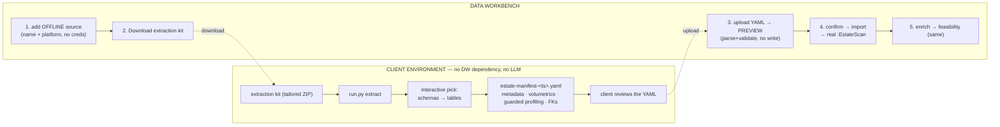

# Offline Extraction — client-run metadata capture in lieu of live access

**Read-first functional guide.** Peers: [`connected-estate.md`](connected-estate.md)
(architecture deep-dive) and [`estate-discovery.md`](estate-discovery.md)
(setup & connection reference). This guide covers the **offline** path: what it is,
when to use it, the plain-terms journey, how to read the upload preview, the security
posture, and honest gaps.

## The problem, in one line

Some clients won't hand Data Workbench (DW) live credentials to their data platforms —
so DW's two live-introspection paths (Connected-Estate scan; greenfield discovery)
can't run. Offline extraction removes that blocker: **the client runs a small, vetted
tool in their own environment, produces a reviewable file, and uploads it** — and DW
reconstructs the exact graph state a live scan would have produced.

## Layman walkthrough

A Data Product Owner (DPO) adds a data source to their estate but marks it
**"I can't give DW a live connection."** Instead of a **Scan** button they get
**Download extraction kit** + **Import scan**. DW hands them a small ZIP tailored to
their platform (say Snowflake): a stdlib-only Python CLI, a `requirements.txt` with just
the Snowflake driver, an `.env.example` with a clearly-marked blank for their token, and
a README. The client:

1. Fills in their token in `.env` (**the one thing DW never has**).
2. Runs `python run.py extract` — the tool connects and shows an **interactive picker**
   in the terminal: it lists the schemas it can see (with a *select-all* toggle), then,
   per chosen schema, the tables (with *select-all-in-schema* / per-table). **The client
   drives the entire selection in the CLI — no file editing.**
3. The tool pulls metadata + volumetrics + guarded profiling and writes timestamped
   artifacts: **`estate-manifest-<ts>.yaml`**, an `extract_result-<ts>.json` log, and a
   `selection-<ts>.yaml` record of the exact choices (replayable).
4. Opens the manifest, confirms nothing sensitive is in it (readable by design — schema/
   table/column names, types, counts, and only *safe* enumerated values), and sends it
   back.

The DPO uploads the YAML in DW. DW **previews and validates** it (counts, schemas,
redaction summary, warnings) **without touching the graph**, then on confirm
**materializes it as a real estate scan** — identical shape to a live scan — so
enrichment, feasibility grading, and act-on-green all work unchanged.



## Why this shape

- **Removes the access blocker** — the client keeps their credentials.
- **Auditable end to end** — the client can read the script before running it and read the
  YAML before sending it; nothing leaves without review.
- **No DW dependency at runtime, no LLM/agent inside the tool** — deterministic extraction
  only.
- **Doubles as a demo accelerator** — prebuilt sample manifests
  ([`samples/estate-manifests/`](../samples/estate-manifests/)) import instantly with no
  live DB and no scan cost.

## The manifest — "DCAT-in-YAML"

One platform-agnostic document per source (the platform is just a field). It serializes
exactly what DW's scanner captures, plus a little more:

```yaml
manifest_version: "1"
kind: estate                 # estate | source (source = greenfield, Phase 2)
platform: snowflake          # postgres | mysql | snowflake | databricks | duckdb
catalog: ANALYTICS           # the {db} URI segment (the source database/catalog)
extraction:
  metadata: true
  volumetrics: true
  profiling: true
  values_included: true
  redaction: {pii_redacted: 7, cardinality_capped: 3}   # what was withheld
relations:
  - schema: SALES
    table: ORDERS
    relation_kind: table
    row_count: 128934
    size_bytes: 20447232
    comment: "Order header"                  # captured when the platform exposes it
    columns:
      - name: ORDER_STATUS
        data_type: VARCHAR
        nullable: false
        ordinal: 4
        profile:                             # guarded; PII/over-cap → values null
          null_count: 0
          distinct_count: 5
          top_values: [{value: OPEN, count: 40120, frequency: 0.311}]
      - name: CUSTOMER_ID
        data_type: NUMBER
        primary_key: true                    # captured (a live scan omits PK — a bonus)
    foreign_keys:
      - {from_column: CUSTOMER_ID, to_schema: SALES, to_table: CUSTOMERS, to_column: CUSTOMER_ID}
```

The importer **derives each column's data classification itself** (never trusting the
file) and replays these into the same graph writer a live scan uses — so the imported
estate scan is indistinguishable from a live one.

## Safe-by-default profiling (the privacy backbone)

Profiling is **on by default, values on with guardrails**. Value-bearing outputs
(`min` / `max` / enumerated `top_values`) are **auto-redacted** — present but nulled,
counts kept — for:

| Trigger | What's withheld | Why |
|---|---|---|
| **PII-classified name** (`email`, `ssn`, `dob`, `account_number`, …) | `min` / `max` / `top_values` | never expose actual sensitive values |
| **Over cardinality cap** (`> --max-enum-cardinality`, default 50) | `top_values` | high-card ≈ identifier-like, not a safe enumeration |
| **Over length cap** (`> --max-value-length`, default 200) | `top_values` | free text is never enumerated |
| **`--no-values`** | every value-bearing field, globally | the client's global off switch |

Counts (`null_count`, `distinct_count`), aggregate stats (`mean`, lengths), types, keys,
and names are always kept. Every withholding is tallied in the manifest's `redaction`
block so the reviewer — and the DW upload preview — see exactly what was held back.
**`--no-profile`** drops profiling entirely (metadata + volumetrics only).

## The extraction kit (what the client runs)

A tailored ZIP per platform. Its README is written to be understood **without reading the
code** (two diagrams, an env-var table, a flag table).

| File | Purpose |
|---|---|
| `run.py` | Entrypoint. Connects, runs the interactive picker, extracts. |
| `_extract_core.py` | Read-only introspection + guarded profiling per platform. |
| `_manifest_writer.py` | Assembles the manifest + applies the redaction. |
| `manifest_config.json` | Baked-in redaction caps + PII token list + defaults. |
| `requirements.txt` | The one DB driver + `pyyaml` + the picker lib (`questionary`). |
| `.env.example` | The `WB_SOURCE_*` credential blanks — **the one thing DW never has**. |

**CLI surface:**

- `python run.py extract` → interactive two-level picker (schemas → tables, with
  select-all / all-in-schema). **The CLI *is* the selection UI — no YAML editing.**
- Non-interactive escapes (CI / demo / no TTY): `--all` (every schema+table) or
  `--selection selection-<ts>.yaml` (replay a prior pick). The tool falls back to `--all`
  automatically when stdin isn't a TTY.
- `python run.py list` — just print the visible inventory.
- Flags: `--no-profile` · `--no-values` · `--no-volumetrics` · `--sample-limit N` ·
  `--top-n N` · `--max-enum-cardinality K` · `--exclude-column schema.table.col` ·
  `--code-assets`.

Credentials live **only** in `WB_SOURCE_*` env / `.env`, never baked into the package.
Reruns are timestamped, so a full before/after history is kept.

## Uploading in DW — preview before commit

Two steps mirror the ODCS `parse` → `commit` split:

1. **Preview** (`POST /api/estates/sources/{id}/import-manifest/preview`) — parse +
   validate + summarize with **no graph write**: schema/table/column counts, per-schema
   breakdown, redaction summary, PII-flagged columns, warnings. A malformed manifest is
   rejected here (fail-closed) before anything touches the graph.
2. **Confirm** (`POST .../import-manifest`) — the atomic replay into a real `:EstateScan`
   (monotone `scan_version`, `origin: offline_import` marker). Re-importing a refreshed
   manifest behaves like a normal rescan (tombstone/diff).

Reading the preview: names, types, and counts are yours to eyeball; the **redaction**
line tells you what values were withheld; **PII-flagged** columns show what the heuristic
caught. Warnings flag empty relations or a manifest carrying no relations.

## A genuine fidelity gain

The offline tool captures **more** than the live scan — primary keys, exact row counts,
and **source comments**, which DW seeds as draft column/table descriptions
(`descriptionSource = "source_comment"`) so the later LLM enrichment fills only the gaps
and still computes embeddings. The live scan can't do this.

## Security / privacy posture

- **No LLM/agent in the tool** — pure deterministic extraction.
- **Credentials never leave the client** and are never baked into the package.
- **Read-only** introspection + guarded profiling; **no full-table dumps**.
- **Safe-by-default profiling** (above) with a visible `redaction` summary.
- **Client reviews the YAML** before sending (human-readable by design).
- **Hardened upload** on the DW side (extension allowlist + size cap + traversal/NUL/UTF-8
  checks) and **fail-closed validation** (strict schema; classification derived by DW, not
  trusted from the file). A malicious manifest can misrepresent an estate but cannot escape
  the validator or touch other projects (estate-scoped writes only).

## Honest gaps

- **Enrichment stays server-side** — descriptions + embeddings are LLM/embedding work, not
  in the no-LLM tool. Identical to a live scan; import lands upstream of it.
- **v1 keeps the one-catalog-per-source model** — a multi-catalog estate is one manifest
  per source (matches the current add-tree behavior).
- **Snowflake / Databricks / MySQL extractors** ship complete but are exercised primarily
  against Postgres in CI; treat the first run against a new platform as a smoke test.

## Where the pieces live

| Piece | Location |
|---|---|
| Manifest contract + pure converters | `workbench/backend/estate_manifest.py` |
| Import (preview + replay) | `workbench/backend/estate_ingest.py` |
| Graph extras (profileJson + comment→description) | `workbench/backend/estate.py` |
| Client tool | `workbench/backend/extraction_runners/` |
| Kit packaging + README | `workbench/backend/extraction_package.py` |
| API endpoints | `routers/estates.py` (`extraction-package`, `import-manifest[/preview]`) |
| PO MCP tools | `get_estate_extraction_package`, `import_estate_scan` |
| UI | `EstatePage.tsx` (offline source, kit download, import modal) |
| Demo manifests | [`samples/estate-manifests/`](../samples/estate-manifests/) |

## Phase 2 — greenfield source-aligned (`dpe-sa`) offline

The **same manifest and same extraction kit** also seed a **greenfield source-aligned
product** with no live source — for a client who can't connect but wants a real `dpe-sa`
data product, not just an estate assessment. The PO ticks **"I can't grant a live
connection — I'll upload metadata instead"** in the New Source Product wizard; the
engineer's pipeline then shows a deterministic **Import Uploaded Metadata**
(`data_discovery_offline`) stage instead of live discovery + profiling. The engineer
uploads the reviewed manifest; DW seeds the project's `:Catalog`/`:Dataset`/`:Column` +
DQV profiling graph (tagged `seededFrom='offline_import'`) and verifies node counts.
**Everything after discovery — enrichment, name standardization, PO validation, ODCS
synthesis, mapping, serving — is byte-identical to the live template**; it reads the
graph, which is seeded, not live-discovered.

| Piece | Location |
|---|---|
| Manifest → discovery + profile YAML docs | `estate_manifest.to_discovery_docs` / `to_profile_docs` |
| Deterministic seeder (runs both loaders, verifies) | `source_manifest_seed.seed_graph_from_manifest` |
| Stage + template | `data_discovery_offline` + `DPE_SA_OFFLINE_WORKFLOW_TEMPLATES` (`archetypes.py`) |
| Endpoints | `routers/source_offline.py` (`upload-manifest`, `seed-offline`) |
| Creation branch | `ProjectCreate.data_connectivity_mode='offline'` → offline template (`routers/projects.py`) |
| Intake hook | `intake_scaffold._scaffold_source_aligned` (offline when the submission signals no live access) |
| UI | `NewSourceProductWizard.tsx` offline toggle · `Pipeline.tsx` Import-metadata action |

It reuses the shipped `dmig` offline-seed blueprint end-to-end (`intake_schema_seed`'s
loader-runner + provenance-tag + verify pattern); the profiling docs are a genuine add
(the schema-only migration seed had no profiles). The manifest already carries PK / FK /
precision / comments + profiling — exactly what live discovery + profiling produce.
