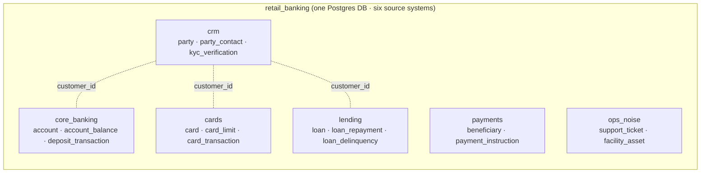

# Scenario: Brownfield retail-banking estate → data products

A guided, end-to-end demo of the **top-down** Data Workbench capability: point the Workbench at a
live banking estate it has never seen, let it **discover** what's there, **grade** that estate
against a catalog of *desired* data products, and turn the promising ones into a **scaffolded
portfolio** of engineering tasks and a consumer draft — without an engineer hand-modelling a thing
up front.

This is the **brownfield** story: you don't get to design the source systems, you *inherit* them.

---

## The one-paragraph version (shopping list vs. pantry)

You (a Data Product Owner) have a **shopping list** of data products the business wants — e.g.
a *Customer Banking 360*. Your bank already runs a **pantry** of siloed source systems (a CRM, a
core-banking platform, a card system, a loan system, …). The Workbench walks your pantry, then
tells you, per shopping-list item: **do we already have this? can we adapt something? can we
assemble it from raw ingredients? or is it simply absent?** For the "assemble it" ones, it clusters
your pantry into the **source-aligned products** you'd need to build, files them as **engineering
tasks**, and pre-drafts the **consumer product** on top — ready for review.

Nothing in this scenario is a bespoke script. It exercises the shipping Connected-Estate →
Feasibility → Product Assembly → Intake capability against a purpose-built sample estate.

---

## The estate (sample: `retail-banking`)

One Postgres database, `retail_banking`, whose **schemas each simulate a separate source system**
— exactly the brownfield shape (systems that were never designed to fit together, linked only by a
shared customer id).



- **Foreign keys live *inside* each system** (e.g. `account_balance → account`). That's what lets
  the Workbench recognise each system as its own cluster/"seam".
- **Systems link only by shared business keys** — `customer_id` everywhere, `account_id` inside
  core banking, `card_id` inside cards — never by a cross-system FK. Real brownfield estates are
  exactly this un-joined.
- **`ops_noise`** (IT tickets, facilities) and the **absence of any wealth/investment data** are
  deliberate: they make the honest "we don't have this" outcomes real.

~200 customers, ~300 accounts, ~4,000 transactions, ~250 cards, ~150 loans — small enough to scan,
enrich and grade in a few minutes.

## The shopping list (three reference specs)

Three *desired* products live in the feasibility corpus (domain **Retail Banking**). You grade the
estate against them:

| Reference spec | Kind | What it wants | Grades |
|---|---|---|---|
| **Customer Banking 360** (`agg_customer_banking_360`) | aggregate | customer identity + deposit accounts/balances + cards | **assemblable** — the raw ingredients are in `crm` + `core_banking` + `cards`, nothing published yet |
| **Customer Lending Exposure** (`agg_customer_lending_exposure`) | aggregate | customer + loans + repayments + delinquency + card credit | **assemblable** — from `crm` + `lending` (+ `cards`) |
| **Wealth Portfolio 360** (`cns_wealth_portfolio_360`) | consumer | portfolios, holdings, instruments, valuations | **absent** — the estate has no wealth data at all |

> **Source-aligned products are *not* on this list.** They aren't authored up front — they're what
> Product Assembly *proposes* by clustering the scanned estate. The shopping list is only the
> **target** (aggregate/consumer) products you want.

---

## Walkthrough

### 0. Load the estate

```bash
dwb up --pg-sample retail-banking      # creates + seeds the retail_banking DB (idempotent)
```

This registers a **Quick connect** entry `retail-banking-postgres` (Postgres, db `retail_banking`,
user `workbench`, primary schema `crm`).

### 1. Connect + scan (deterministic — no LLM)

In the **Product Workbench** → Connected Estate:
1. Create a **Connection** from the `retail-banking-postgres` quick-connect prefill.
2. Create an **Estate** ("Retail Bank"), add a **Source** on that connection. **Leave the catalog
   empty** (Postgres is 2-level — the connection's own database *is* the container), and set the
   source's namespace policy to **exclude `retailbank_views`** so the estate shows sources only.
3. **Run scan.** The provider-driven scan enumerates all six source schemas, their tables/columns,
   volumetrics, and the intra-schema FK edges. (This is *not* the LLM discovery skill — it's a
   deterministic metadata read.)

### 2. Enrich (recommended before grading)

Run **Enrich metadata**. The scan reads column *names* and types, not your SQL comments — the enrich
pass generates and embeds a description for every column, which sharpens both the schema shortlist
and the column-level semantic match. Grades are materially better with it than without.

### 3. Feasibility — read the stoplight

Run **Feasibility** against the Retail Banking specs. Expect:

```
Customer Banking 360        ●  assemblable   (crm + core_banking + cards)
Customer Lending Exposure   ●  assemblable   (crm + lending + cards)
Wealth Portfolio 360        ●  absent        (no matching estate data)
```

Drill into a card to see the matched columns, the coverage, the grain-key check, and — for the
absent one — the honest "no relevant schema" explanation.

### 4. Work the product — Product Assembly clusters the estate

On **Customer Banking 360**, click **Work this product**. Assembly opens:
- The **Sources** tab clusters the in-scope estate into **source seams** — here roughly three:
  a **Customer/Party** cluster (`crm`), a **Deposit Accounts** cluster (`core_banking`), and a
  **Cards** cluster (`cards`). Each seam is a proposed **source-aligned product**. You can
  merge/split/rename clusters — they're yours to curate.
- The **Attributes** tab lets you confirm which estate columns feed each aggregate attribute
  (exclude/defer/derive as needed).
- Generate the **functional report** to preview exactly what will be created.

### 5. Scaffold the portfolio (Intake)

Click **Scaffold this portfolio**. This stages a structured **Intake** submission. Open it in the
Intake queue, review, and **Approve**. The scaffold saga then creates:
- one **`dpe-sa`** project per source cluster — each with a **ProductRequest** on the engineer's
  queue (the "go build this source-aligned product" task), and
- one **`dpe-cf`** consumer project (the *Customer Banking 360* aggregate) as a **draft**, its ODCS
  **pre-filled** with the curated schema + source-intent hints, plus **pending-dependency** records
  pointing at the source clusters it will consume.

```mermaid
flowchart TD
  scan["Scan + enrich<br/>(deterministic)"] --> feas["Feasibility<br/>stoplight"]
  feas -->|Work this product| asm["Product Assembly<br/>cluster estate → source seams"]
  asm -->|Scaffold portfolio| intake["Intake review → Approve"]
  intake --> sa1["dpe-sa: Customer/Party<br/>(engineer task)"]
  intake --> sa2["dpe-sa: Deposit Accounts<br/>(engineer task)"]
  intake --> sa3["dpe-sa: Cards<br/>(engineer task)"]
  intake --> cf["dpe-cf: Customer Banking 360<br/>(draft, pre-filled ODCS)"]
  sa1 -. "publishes → PO confirms :CONSUMES" .-> cf
  sa2 -. .-> cf
  sa3 -. .-> cf
```

---

## What's live vs. what's narrated

The scripted/automated part of this scenario is **only** the estate load (`dwb`). Everything from
"connect" onward is you driving the shipping capability live. And the flow's *automation* ends at
the scaffold — the rest is the platform's normal per-project workflow:

- The **engineer** builds each `dpe-sa` product (discovery → enrichment → naming), and the **PO**
  validates it in the source-validation gate, then it's **served** and **published** to the
  marketplace.
- The **consumer** *Customer Banking 360* draft is scaffolded with its schema and its intended
  sources recorded as pending dependencies — but the actual **`:CONSUMES` binding is confirmed by
  the PO in the consumer wizard once the source products publish** (the edge is created against a
  *published* product; it can't be pre-wired to something that doesn't exist yet). This is a
  deliberate, honest step — not a gap the demo pretends away.

---

## Talking points

- **Brownfield, not greenfield** — no one designed these systems to fit; the Workbench recovers the
  seams and the joinability from what's actually there.
- **Two evidence pools, honestly separated** — a product can only be "ready/adaptable" if something
  is *published*; with an empty marketplace the best a raw estate earns is **assemblable**. "Absent"
  is a real answer, not a failure.
- **The source products come from the estate, top-down feasibility just picks the target** — which
  is exactly how a data-mesh brownfield migration should feel.

## Related docs

- `docs/data-product-feasibility.md` — how a grade is actually decided (functional).
- `docs/connected-estate.md` — the scan/feasibility architecture.
- `docs/estate-discovery.md` — per-platform connection setup.
- `docs/inbound-intake.md` — the intake blueprint + scaffold saga.
- `samples/retail-banking/README.md` — the sample's schema map + modelling texture.
