# Data Workbench User Guide

Data Workbench is a web-based tool for **discovering, documenting, transforming, quality-checking, and publishing data**. It connects to your databases, uses artificial-intelligence agents to understand what is in them, and helps you produce **data products** — well-described, quality-checked datasets that other teams can discover and use with confidence.

This guide is written for everyone who touches the tool: data engineers, data product owners, data quality analysts, and data stewards. It is **self-contained** — every capability is explained here in plain language, from first principles, with step-by-step walkthroughs. You do not need to read any other document to follow it. Where a companion document goes deeper on a topic, it is noted, but this guide never *depends* on one.

A note on language: this guide **spells everything out**. Terms like "ODCS," "SCD," or "DCAT" are always expanded the first time they appear, and there is a [Glossary](#glossary) at the end. If you hit an unfamiliar word, look there first.

---

## Table of contents

**Start here**
1. [What Data Workbench is](#1-what-data-workbench-is)
2. [Core concepts](#2-core-concepts)
3. [Which path are you on? Greenfield vs Brownfield](#3-which-path-are-you-on-greenfield-vs-brownfield)
4. [Supported data platforms](#4-supported-data-platforms)
5. [How data is transformed: source-to-target mapping](#5-how-data-is-transformed-source-to-target-mapping)

**The greenfield build path** (build products from data you already have a connection to)

6. [Data Discovery](#6-data-discovery)
7. [Source-aligned data products](#7-source-aligned-data-products)
8. [Aggregate data products](#8-aggregate-data-products)
9. [Consumer-aligned data products](#9-consumer-aligned-data-products)

**The brownfield assess path** (start from an existing estate you inherited)

10. [Connected Estate scanning and Data-Product Feasibility](#10-connected-estate-scanning-and-data-product-feasibility)
11. [Pulse Discovery](#11-pulse-discovery)
12. [Offline Extraction (no live connection)](#12-offline-extraction-no-live-connection)
13. [The Blueprint Library (data-product templates)](#13-the-blueprint-library-data-product-templates)
14. [Inbound Intake (from an external assessment tool)](#14-inbound-intake-from-an-external-assessment-tool)

**Quality, migration, and modernization**

15. [Data Quality](#15-data-quality)
16. [Data Migration](#16-data-migration)
17. [Code Migration](#17-code-migration)

**Sharing, consuming, and operating**

18. [The Marketplace](#18-the-marketplace)
19. [The Semantic Layer and Semantic Q&A](#19-the-semantic-layer-and-semantic-qa)
20. [Reviews and approvals](#20-reviews-and-approvals)
21. [The advisory chat assistants](#21-the-advisory-chat-assistants)
22. [Driving Data Workbench from your own command line (MCP)](#22-driving-data-workbench-from-your-own-command-line-mcp)

**Reference**

23. [Roles and permissions reference](#23-roles-and-permissions-reference)
24. [Glossary](#glossary)
25. [Frequently asked questions](#frequently-asked-questions)
26. [What is shipped today vs on the roadmap](#what-is-shipped-today-vs-on-the-roadmap)

---

## 1. What Data Workbench is

Data Workbench sits between your **operational databases** (where data is created and stored) and the **teams who want to use that data** (analysts, data scientists, application builders). Its job is to turn raw tables into **data products**: datasets that come with a clear name, plain-English descriptions, quality rules, a machine-readable specification, a queryable output, and full lineage showing where every column came from.

It does this through a mix of **automation and human judgment**. Artificial-intelligence agents do the heavy, repetitive work — reading schemas, profiling data, drafting descriptions, proposing quality rules, mapping columns. A human then **reviews and approves** that work at every important gate. The guiding principle throughout the product is: *the agent drafts; a person decides.* Nothing an agent proposes goes live without someone approving it.

Everything the tool learns about your data — schemas, statistics, descriptions, rules, mappings, lineage — is stored in a **knowledge graph** (a Neo4j database). The knowledge graph is the single source of truth. Because it records how everything connects, features like end-to-end lineage "just work": a mapping links two columns, a column belongs to a table, a table belongs to a product, and the graph can walk those links in any direction.

### The two workbenches

The application is split into **two separate areas**, one for each of the two primary people who use it:

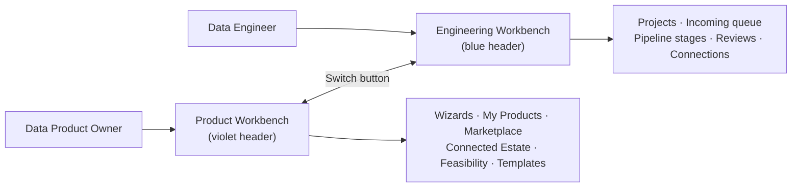

- **Product Workbench** (violet header) — for the **Data Product Owner**, the person who decides *what* a data product should be. This is where products are created, shaped, validated, and published, where the marketplace lives, and where the brownfield estate-scanning and feasibility tools live.
- **Engineering Workbench** (blue header) — for the **Data Engineer** and the specialist roles (Data Steward, Data Quality Analyst, Reviewer). This is where the technical pipeline stages are run, where database connections are registered, and where the engineering reviews happen.

A **Switch** button in the top-right corner of the header moves you between the two areas at any time. The header color and the browser tab title change so that, even with several tabs open, you always know which workbench you are looking at.

> **A note on sign-in.** Out of the box, Data Workbench has **no login** — you land directly on a chooser and pick a workbench. Optional authentication can be switched on by an administrator, but it is off by default and access between personas is currently enforced only in the interface, not by a hardened security layer. Treat a shared installation accordingly. This is covered again under [What is shipped today vs on the roadmap](#what-is-shipped-today-vs-on-the-roadmap).

---

## 2. Core concepts

Before you open the application, five ideas make everything else easier to follow.

### 2.1 Projects

A **project** is the central container for a piece of work. It links Data Workbench to a specific data source (or to a product goal) and holds all the records, pipeline runs, and outputs for that work. Think of a project like a folder on your computer: it has a name, a purpose, and a set of tasks inside it. Every project is **isolated** — two projects that happen to look at the same tables get completely independent records and never interfere with each other.

### 2.2 Workflows and stages

A **workflow** is a named sequence of steps — called **stages** — that accomplishes one piece of work. For example, a "Source Discovery & Profiling" workflow contains a Data Discovery stage and a Data Profiling stage.

A project can hold **several workflows**, and you can add more from a catalog at any time using the **+ Add Workflow** control. Each stage has a **status** that tells you where it is:

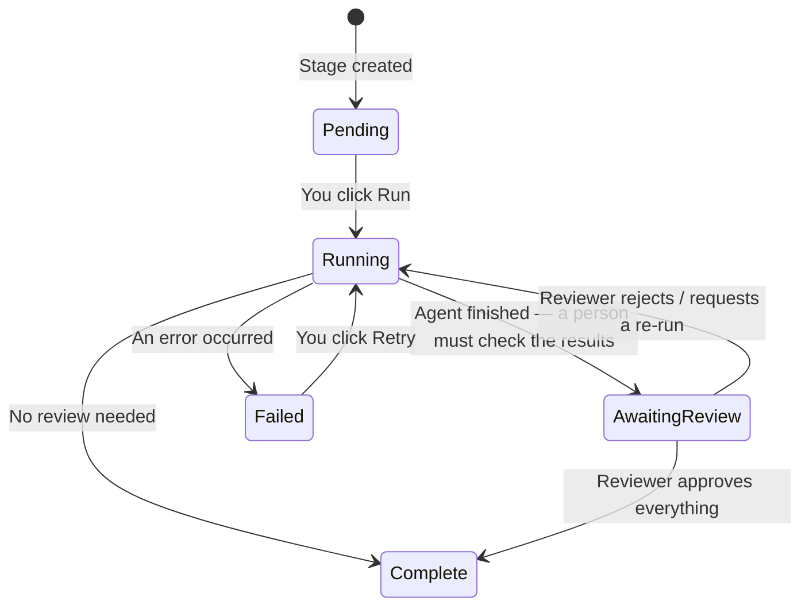

The **Awaiting Review** status is the human gate: when a stage produces agent-generated results (descriptions, mappings, quality rules), those wait for a qualified person to approve or correct them before they count. This is covered in detail under [Reviews and approvals](#20-reviews-and-approvals).

In the Engineering Workbench, a project is presented as a **board of capability cards** grouped into phases — *Discover & document*, *Validate*, *Materialize & serve*, and an optional *Data quality & scoring* — rather than a rigid rail. One card is highlighted as the **recommended next step**, but you can run capabilities in any order; running ahead of the recommendation just warns you that an earlier step has not completed yet.

### 2.3 Archetypes — the kind of work a project does

When you create a project you choose an **archetype**: the category of work it will do. The archetype decides which workflows and stages are available.

| Archetype | Who drives it | What it produces |
|---|---|---|
| **Data Discovery** | Data Engineer | A catalogue of a source database — schemas, tables, columns, relationships, and profiling statistics — in the knowledge graph |
| **Data Quality** | Data Engineer + Data Quality Analyst | Quality rules, automated test results, and a quality score for a data source |
| **Source-aligned data product** | Product Owner + Data Engineer | A named, described, quality-checked product built directly from one source database |
| **Consumer-aligned data product** | Product Owner + Data Engineer | A product assembled from one or more existing products, shaped to a specific need (this archetype also covers **aggregate** products — see below) |
| **Data Migration** | Data Engineer | An executable pipeline that copies data from a legacy database to a modern target platform, plus proof it arrived intact |
| **Code Migration** | Data Engineer | Converted code — legacy queries/jobs rewritten to run on a modern platform, with the old and new versions side by side |

(A seventh archetype, **Data Modernization**, is a placeholder and is not yet available to create.)

### 2.4 Data products, and the source / aggregate / consumer trichotomy

A **data product** is not just a table. A plain table becomes a data product when it carries a **contract** (a clear specification of its columns, types, and rules), an **owner**, a **quality score**, a queryable output, and **lineage**. Data Workbench recognizes three *kinds* of data product, which describe a product's role rather than how it was built:

- **Source-aligned** (kind = `source`) — profiled directly from one raw database. It is the faithful, curated representation of a source. This is the **building block**.
- **Aggregate** (kind = `aggregate`) — a reusable product that **consumes** other products and combines them (for example, joining an employee product and a payroll product into a monthly cost roll-up). It is meant to be consumed *further* by other products, so it defaults to a "materialized" serving mode to make downstream use fast and stable.
- **Consumer-aligned** (kind = `consumer`) — a fit-for-purpose *leaf* product, shaped to answer one team's specific question.

The important, slightly counter-intuitive point: **the kind is decoupled from the archetype.** Both *aggregate* and *consumer* products are built with the same "consumer-aligned" machinery and differ only by **intent**, which the product owner declares as a late-binding flag while authoring. A consumer or aggregate product may consume **any** published product — source, aggregate, or consumer — which lets you build multi-hop chains (product A feeds B, which feeds C). Data Workbench guards these chains so they can never form a loop.

### 2.5 ODCS data contracts

An **ODCS data contract** (ODCS stands for **Open Data Contract Standard**, an open industry format) is a structured, machine-readable specification of a data product. It captures the product's columns and their types, descriptions, quality rules, ownership, service-level expectations, and other metadata. Think of it as the product's technical specification sheet — except it is machine-readable, version-controlled, and directly linked to the underlying data. Products can be **exported** as an ODCS file (in YAML or JSON format) and existing ODCS files can be **imported**.

A useful thing to notice is the **order in which the contract is created**, which flips between the two product archetypes:

- For a **source-aligned** product, the contract is generated **after** discovery — the engineer profiles the source first, and the contract is synthesized from the approved findings. This is *discovery-first*.
- For a **consumer-aligned** (or aggregate) product, the contract is authored **up front**, before any source is bound — the product owner shapes what they need first. This is *contract-first*.

### 2.6 Roles

Within the Engineering Workbench a **role selector** lets you act as a specialist. Your current role decides which stages you can run and which review queues you can action.

| Role | Primary responsibility |
|---|---|
| **Data Product Owner** | Decide what a product should be; validate the engineer's work; publish |
| **Data Engineer** | Register connections; run pipeline stages; map columns; deploy the served output |
| **Data Steward** | Manage the business-concept layer; resolve transformation questions the engineer escalates |
| **Data Quality Analyst** | Generate quality rules; run tests; score data quality |
| **Reviewer** | Approve column descriptions and column mappings |

A full breakdown of who can do what is in the [Roles and permissions reference](#23-roles-and-permissions-reference).

---

## 3. Which path are you on? Greenfield vs Brownfield

Almost everything in Data Workbench falls onto one of two paths. Knowing which one you are on tells you where to start.

The distinction is about **whether your source systems already exist and were designed to fit the products you want** — not about who kicks the work off.

- **Greenfield** — you are **building new products from data you can already reach**, from the bottom up. You point Data Workbench at a database, discover it, and shape products out of it: a source-aligned product first, then aggregate and consumer products on top. The classic sign of greenfield: you *know which database you want to build from* and you have (or can get) a live connection to it. Greenfield also covers building a brand-new source-aligned product from an uploaded metadata file when there is no live source at all.

- **Brownfield** — you have **inherited an estate** of existing systems that nobody designed to fit together, and you want to know *what you can build from what you already have*. You connect Data Workbench to the live platform, let it **scan** the estate, and then **grade** that estate against a shopping-list of desired products. This is top-down: you start from *what you want* and the tool tells you how buildable each item is right now.

> **A subtle but important point.** Source-aligned products show up on **both** paths. On the greenfield path you author them deliberately. On the brownfield path they are *recovered* — clustered out of the scanned estate as "source seams" that then feed aggregate and consumer products. So "source-aligned" is not a greenfield-only idea; the real dividing line is **inherited-and-not-designed-to-fit** (brownfield) versus **newly-built-to-fit** (greenfield).

Use this table to find your starting point:

| If your situation is… | You are on the… | Start at |
|---|---|---|
| "I have a database and want to make a curated product from it" | Greenfield | [Data Discovery](#6-data-discovery) → [Source-aligned products](#7-source-aligned-data-products) |
| "I want to combine several existing products into a reusable roll-up" | Greenfield | [Aggregate products](#8-aggregate-data-products) |
| "I need a product tailored to one team's specific question" | Greenfield | [Consumer-aligned products](#9-consumer-aligned-data-products) |
| "I have a whole estate and want to know what products I can build from it" | Brownfield | [Connected Estate and Feasibility](#10-connected-estate-scanning-and-data-product-feasibility) |
| "An external tool already surveyed our estate and I want to work from its assessment" | Brownfield | [Pulse Discovery](#11-pulse-discovery) |
| "The client won't give us a live database connection" | Brownfield or Greenfield | [Offline Extraction](#12-offline-extraction-no-live-connection) |
| "I want to move a legacy database to a modern warehouse as-is" | Migration | [Data Migration](#16-data-migration) |
| "I want to convert legacy code to run on a modern platform" | Migration | [Code Migration](#17-code-migration) |
| "I just want to assess a source's quality" | Either | [Data Quality](#15-data-quality) |

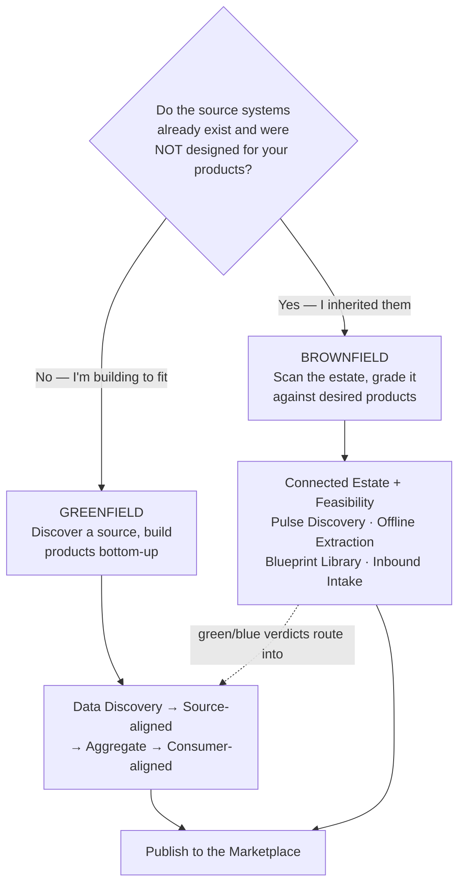

Notice the dotted arrow: the brownfield tools don't replace the greenfield build — they **route into** it. When the feasibility grader says "you can adapt an existing product" or "you can assemble this from raw data," acting on that verdict drops you into exactly the greenfield wizards described in sections 7–9.

---

## 4. Supported data platforms

Data Workbench touches a live database in only a few moments: when it **scans/profiles** a source, when it **previews** rows, when it **deploys/serves** a product's output, and when it **migrates** data. A platform can be supported in one of those roles and not another, so "is my platform supported?" always has to be answered per role.

Support comes in honest grades:

- **Certified** — tested against a real, live system. Today that is **PostgreSQL only**.
- **Preview** — fully built and tested against simulated drivers, but not yet validated against a live system. Usable, but expect the occasional rough edge.
- **Not available** — not implemented for that role; the stage will refuse to run.

### The platform table

| Platform | Scan / profile as a source? | Serve / deploy a product? | Migration source? | Migration target? |
|---|---|---|---|---|
| **PostgreSQL** | ✅ Certified | ✅ Virtual views **and** materialized tables | ✅ Preview | ✅ Preview |
| **MySQL 8.0+** | ✅ Preview | ✅ Virtual views only — **materialized tables not available** | ✅ Preview | ❌ |
| **Snowflake** | ✅ Preview | ✅ Virtual views **and** materialized tables | ✅ Preview | ✅ Preview |
| **Databricks (SQL / Unity Catalog)** | ✅ Preview | ✅ Virtual views **and** materialized tables | ❌ (not a source) | ✅ Preview |
| **Oracle** | ❌ (no scanner yet) | ❌ | ✅ Preview | ✅ Preview |
| **SQL Server / Azure SQL** | ❌ | ❌ | ✅ Preview | ✅ Preview |
| **DuckDB (local files)** | ✅ Preview | Lakehouse file export only (Parquet) — no live views | ✅ Preview | ✅ Preview |
| **BigQuery** | ❌ (no scanner yet) | Can *emit* BigQuery SQL, but you cannot register/scan a BigQuery source | ❌ | ❌ |
| **Amazon S3 / Azure ADLS / Google Cloud Storage** | ❌ | Publish **data files** to, only | ❌ | ❌ |

Reading the table:

- **Only four platforms can be scanned/profiled** as discovery or estate sources: **PostgreSQL, MySQL, Snowflake, Databricks**. Oracle and SQL Server are **migration-only** — you reach them through the Data Migration flow, not the normal "Add Connection" screen.
- **dbt-materialized serving** (building physical tables — see [section 15](#15-data-quality) and [section 9](#9-consumer-aligned-data-products)) works on PostgreSQL, Snowflake, and Databricks, but **not MySQL**, where products are served as virtual views only.
- Object stores (Amazon S3, Azure ADLS, Google Cloud Storage) are **publish targets for data files**, not databases you scan.

### What actually runs in the demo environment

The bundled demonstration environment (started with the `dwb` launcher) wires up: the backend, the frontend, a Neo4j knowledge graph, **one PostgreSQL** database carrying the sample data, a Gitea git server (for the "push to git" feature), and an **optional MySQL** sample database. Out of the box the demo therefore exercises **PostgreSQL fully** and **MySQL if you enable it**. Snowflake, Databricks, Oracle, and SQL Server require real external systems and credentials — nothing is pre-wired for them.

### One limitation to know up front

A consumer-aligned product's output joins across the products it consumes, and **all of those must live on the same platform** — Data Workbench does not federate a single product's query across two different database engines. (Moving a whole product's output from one platform to another *is* supported, as a serving mode; see [section 5.6](#56-where-transformation-happens-in-each-flow).)

---

## 5. How data is transformed: source-to-target mapping

This section explains how a value in a source column becomes a value in a product column. It is the heart of what Data Workbench does, so it is worth understanding even if you never author a transform yourself.

### 5.1 The core idea: one recipe, different stove

When you map a source column to a product column, you **do not write database-specific SQL**. Instead you describe the *intent* in a small, neutral, platform-independent form — for example, "full name = first name, then a space, then last name." Data Workbench stores that intent in the knowledge graph and, at the moment a product is served, **compiles it into the exact SQL** for whichever platform the product runs on.

The analogy the product uses is a kitchen: **you write the recipe once in plain language, and the Workbench cooks it in whichever kitchen it is serving from** — PostgreSQL's kitchen, Snowflake's kitchen, Databricks' kitchen. Same recipe, different stove.

Why this matters to you: the same product can move from one platform to another without anyone rewriting its logic, and a product can pull from sources that behave differently per engine without you memorizing each engine's quirks. Most SQL is already portable (a `LEFT JOIN`, a `GROUP BY` look the same everywhere); only a handful of constructs genuinely differ per engine, and those are exactly what the compiler specializes. **The target platform is chosen at serving time, not while you author.**

### 5.2 The transform catalog

A transform is a **kind** plus a small set of parameters. There are sixteen kinds. You will rarely touch most of them directly — the artificial-intelligence agent proposes them and you review — but here is the whole vocabulary in plain language:

| Kind | What it does |
|---|---|
| `direct` | Pass a source column straight through, unchanged |
| `cast` | Change a column's data type (for example, a date-shaped string into a real timestamp) |
| `format` | Tidy text — uppercase, lowercase, trim spaces, reformat |
| `concat` | Glue several columns together with a separator (first + space + last) |
| `split` | Pull one piece out of a delimited value (the domain out of an email address) |
| `substring` | Take a fixed slice of a string (characters 1 to 3) |
| `case` | Conditional logic — "if status is Y then Active, otherwise Inactive" |
| `arithmetic` | Math between columns (add, subtract, multiply, divide), with optional safe divide-by-zero |
| `literal` | A fixed constant value with no source column (for example, always `'ACTIVE'`) |
| `expression` | The escape hatch — raw SQL, for anything the structured kinds don't cover |
| `lookup` | Fetch a value from a reference table via an automatic join (a country name from a country code) |
| `bucket` | Sort a continuous number into labeled bands (an age into low / medium / high) |
| `mask` | Redact a sensitive value while keeping its shape (show only the last four digits of a card number) |
| `hash` | Irreversibly scramble a value into a fixed digest (md5, sha1, sha256) — for stable de-identification, **not** a security control |
| `window` | A running or ranked calculation over a group of rows (row numbers, running totals, previous/next row) |
| `date_difference` | Portable date math (age in years, days between two dates) that renders correctly on every platform |

The **`lookup`** kind has five selection strategies you might see: `equi` (a plain match — the default), `latest` (the most recent row per key), `aggregate` (sum/count/average over the reference), `exists` (a yes/no flag), and `asof` (a point-in-time, history-aware match).

Two **decorators** can wrap any kind: `standardization` (trim/upper/lower/normalize whitespace) and `default_if_null` (substitute a fallback when the value is missing).

Beyond single columns, a product also carries **dataset-level shape** — instructions that affect the whole output: a filter (a `WHERE` clause), de-duplication, grouping and aggregation (`GROUP BY`), explicit joins, window definitions, dropping a sensitive column from the output while keeping it in the contract, and a **slowly-changing-dimension policy** (see the glossary entry for [SCD](#glossary)) that is one of `latest_only` (keep only the current row per key), `scd2` (keep full, validity-dated history), or `snapshot` (pin to a single point in time).

### 5.3 Who wins — the authorship cascade

Every mapping records **who authored it**. There are four possible authors, and a strict priority order decides who wins when more than one has an opinion:

**Priority: product-owner hint → steward catalog → engineer → artificial-intelligence suggestion.**

- **Product-owner hint** — the product owner declared the intent in the contract while authoring. Highest priority.
- **Steward catalog** — a reusable, domain-approved transformation template matched from your organization's catalog.
- **Engineer** — the data engineer hand-edited it during review.
- **Artificial-intelligence suggestion** — the agent proposed it because nothing higher applied. Lowest priority; it only fills a gap.

In plain terms: **a product-owner hint beats a catalog standard, which beats a manual engineer edit, which beats an agent's guess.** The agent is explicitly told to defer to anything a human specified.

### 5.4 The engineer's review workflow: Approve, Replace, Escalate

Nothing an agent proposes is applied automatically — every mapping lands in the engineer's **Mappings review queue**. For each one the engineer can:

- **Approve** — accept the draft as-is (with a quality rating of Acceptable, Good, or Excellent).
- **Replace** — re-author it. This one action covers *any* change: editing the transform, changing which source column feeds it, or remapping to a completely different source. A Replace always records a reason, and the original agent suggestion is preserved so the history stays auditable.
- **Escalate** — hand it to a data steward when the correct business rule needs domain knowledge the engineer doesn't have. The steward answers, and the answer is remembered as a reusable catalog entry.

### 5.5 How portability is guaranteed (and where it can stop you)

The promise "same recipe, any platform" is **enforced, not hoped for**. The key insight the product leans on: *a SQL engine will happily print a function for a platform that cannot actually run it.* So Data Workbench keeps a separate **capability record** that declares, for every function on every platform, whether it is native, emulated, or unsupported. When a transform is compiled, the system walks the generated SQL and checks every function against that record. If anything is unsupported — or is a function it has never seen — it **fails closed**: it refuses to hand back deployable SQL and surfaces the problem with a hint on how to fix it.

You will meet this in two places:

- A **preflight check** at the top of the mapping review panel flags "this won't compile on *your platform*" *before* you deploy, so you can Replace it.
- An enforcement setting decides what happens then. Today it defaults to **warn** (it logs the problem but does not block you); an administrator can flip it to **block** (a clean refusal) once a set of products is known to be clean.

### 5.6 Where transformation happens in each flow

This is the part people most often get confused about. Transformation is central to some flows and deliberately **absent** from others:

- **Building a product (source-aligned, aggregate, consumer-aligned) — full transformation.** This is the home of everything above. Approved mappings compile into one shared block of SQL, which is then wrapped as a live virtual view, built into a materialized table, or exported as data files — the same logic across all three.
- **Data Migration — no transformation at all.** A migration is a **raw lift-and-shift**: it copies tables from one platform to another exactly as they are. There is no rename, recast-by-rule, filter, join, or aggregation. If you need the data reshaped, you do that afterward by building a product on top of the migrated data — not during the migration. (See [section 16](#16-data-migration).)
- **Cross-platform serving ("transfer then transform") — transformation happens *after* the move.** When a product is served onto a *different* platform from its sources, Data Workbench can extract the raw data, load it onto the target, and *then* run the transforms there. The recipe is identical to the in-place case; only *where it executes* changes. A planner can split the work — pushing cheap filters down to the source and deferring heavy joins to the target.

---

## 6. Data Discovery

> **Who:** Data Engineer. **Where:** Engineering Workbench. **Path:** Greenfield.

**Goal:** connect to a database, understand its structure, and record what is in it — without necessarily publishing a product. Data Discovery is the first exploration of an unfamiliar source, and it is the foundation every greenfield product is built on.

**When to use it:**
- You want to understand a database you have never worked with before.
- You need a schema inventory for planning.
- You want plain-English descriptions attached to every table and column.
- You want to assess quality without publishing a product (add the quality workflows described in [section 15](#15-data-quality)).

**What you will have at the end:** a complete catalogue of the source — schemas, tables, columns, keys, relationships — with profiling statistics and, optionally, approved descriptions and quality rules, all stored in the knowledge graph.

### At a glance

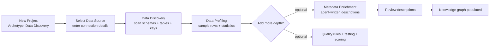

### Step by step

**Step 1 — Create the project.** In the Engineering Workbench, click **New Project**, choose **Data Discovery**, give it a name, and click **Create**.

**Step 2 — Connect to the source database.** The first stage is **Select Data Source**. Click **Set Data Source** and enter the connection details (host, port, username, password, database name). Supported scan sources are **PostgreSQL, MySQL, Snowflake, and Databricks** (see [section 4](#4-supported-data-platforms)). This is a configuration step — no agent runs; it simply saves the connection and marks the stage complete. If a sample database is running, it appears as a one-click **Quick connect** prefill.

> **Tip for the demo environment.** When Data Workbench runs in a container and your source database runs on your own machine, set the connection host to `host.docker.internal` rather than `localhost`, so the backend container can reach it.

**Step 3 — Run Data Discovery.** Click **Run** on the **Data Discovery** stage. An agent connects to the database, reads every schema and table, reads column definitions, detects primary keys and foreign-key relationships, and loads it all into the knowledge graph. A few minutes is typical.

**Step 4 — Run Data Profiling.** Click **Run** on **Data Profiling**. The agent samples rows and computes statistics for each column: row counts, how often values are missing (the null rate), how many distinct values there are, minimum and maximum values, and the most common values. These are stored alongside the schema.

**What you now have:** a complete schema catalogue with profiling statistics, visible on the project's dashboard cards. Discovered tables also appear in the marketplace under a **Datasets** sub-tab, so they are browsable even before they become a product.

**Step 5 (optional) — Metadata Enrichment.** Click **+ Add Workflow**, add **Metadata Enrichment**, and run it. An agent uses the profiling evidence to write plain-English descriptions for every table and column. Because the descriptions are based on the *data*, not just the column names, this is where cryptically-named columns get explained — an agent can look at the values in a column called `lvl` and describe it as "job level," or a column called `amt` and describe it as "salary amount." The descriptions go into a review queue; a Steward or Reviewer approves or corrects each one.

**Step 6 (optional) — Add quality.** From the project, add the **Quality Assessment**, **Quality Testing**, and **Quality Remediation** workflows. These are described fully under [Data Quality](#15-data-quality).

---

## 7. Source-aligned data products

> **Who:** Data Product Owner (initiates and validates) + Data Engineer (runs the pipeline). **Where:** both workbenches. **Path:** Greenfield.

**Goal:** publish a well-named, well-described, quality-checked product built directly from a single source database. The engineer profiles the source and proposes names; the product owner validates everything before the product is built and published.

**When to use it:**
- You have an operational database and want to offer a curated version of it to other teams.
- You want machine-readable metadata, descriptions, and quality rules documented alongside the data.
- You want a product consumers can find in the marketplace and query directly.

**What you will have at the end:** a published product with a formal ODCS contract (exportable as a file), approved column names and descriptions, evidence-based quality rules, a queryable output, and full lineage from source columns to product columns.

### The flow, and why it needs two people

A source-aligned product is *discovery-first*: the engineer has to profile the source before the contract can exist, and the product owner validates the human-facing choices (names, descriptions, classifications, rules) before anything is built. Work moves between the two people only at explicit **gates**. Switching personas is a real part of the flow — use the **Switch** button in the header.

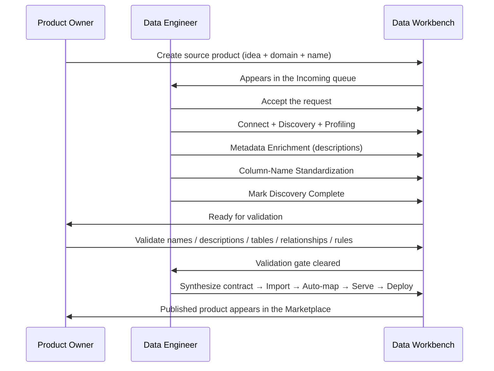

### Product Owner steps

**Step 1 — Create the product.** In the **Product Workbench**, click **New Product** and choose **Source-aligned product**. A short, three-step wizard opens:
1. **Describe your idea** — explain in plain language what this data is about and why it matters. The engineer reads this to understand what they are profiling.
2. **Choose a domain** — the business area (Finance, Human Resources, Logistics, and so on).
3. **Name the product** — a clear, consumer-facing name.

Click **Submit**. The request lands in the engineer's **Incoming** queue, and behind the scenes a project is provisioned for it.

**Step 2 — Wait for discovery.** When the engineer marks discovery complete, the product's status changes to *Ready for validation* and you get a notification in **My Products**.

**Step 3 — Validate.** Click **Validate** to open the combined five-tab validation panel. This gate must be fully cleared before the engineer can build the product.

| Tab | What you are reviewing |
|---|---|
| **Names** | The engineer's suggested column names — cleaner, more consistent versions of the raw database names |
| **Descriptions** | The plain-English descriptions for every column and table |
| **Tables** | Table classifications — is this a fact table, a lookup, a historical audit log? |
| **Relationships** | How tables relate (this drives the join logic in the product's output) |
| **Rules** | Suggested quality rules based on what was observed in the data |

On each tab, **Approve** or **Reject** (with a reason).

### Data Engineer steps

**Step 1 — Accept the request.** In the Engineering Workbench, open **Incoming**, find the request, and click **Accept**. (Accepting is a hard gate — the engineer cannot start until they take ownership.)

**Step 2 — Run the discovery pipeline** in order: **Select Data Source** → **Data Discovery** → **Data Profiling** → **Metadata Enrichment** → **Column-Name Standardization** (an agent proposes consumer-facing names for the owner to review) → **Mark Discovery Complete** (which opens the owner's validation gate).

**Step 3 — Build the product** once the owner clears the gate:
1. **Synthesize Contract from Graph** — assembles a complete ODCS contract from the approved names, descriptions, and rules (mechanical, no agent).
2. **Import Contract** — loads the contract into the product model in the graph.
3. **Auto-Map Source Columns** — creates direct one-to-one mappings from each source column to its product column (since the owner already approved the names, no inference is needed).
4. **Data Serving** — generates the SQL that consumers will query.
5. **Deploy** — creates the output in the target database.
6. **Deployment Reflection** *(optional)* — an agent compares the deployed output against the declared product shape and reports any surprises.
7. **Mark Engineering Complete** — tells the owner the product is live.

---

## 8. Aggregate data products

> **Who:** Data Product Owner + Data Engineer. **Where:** both workbenches. **Path:** Greenfield.

**Goal:** create a **reusable roll-up** that combines several existing products into one — for example, joining an employee product and a payroll product into a monthly headcount-cost product that other teams can build on.

An aggregate product is technically the **same machinery** as a consumer-aligned product (section 9) — it uses the identical ten-step wizard and the same mapping-and-serving pipeline. The only difference is **intent**, which you declare with a flag while authoring. Because an aggregate is meant to be consumed *further* by other products, it **defaults to a materialized (physically-built) serving mode** so that downstream products read from a fast, stable table rather than re-computing a deep chain of views every time. That default is a recommendation, not a lock — you can override it.

**When to use it (rather than a plain consumer product):**
- You are building a *reusable* mid-layer that several downstream products will share.
- Two or more source products need to be joined into one grain (one row per department per month, say).
- You want to de-risk long chains by materializing the shared middle so downstream queries stay fast.

**How you declare it:** in the wizard's **Product Details** step, set the product kind to **aggregate**. The wizard auto-suggests this when the product consumes two or more sources.

### The one thing that trips everyone up: the two-source join

The first time you serve an aggregate that joins two *different* products, the build will often stop with an error about there being **no join path** between them. This is expected, and it is a feature, not a bug: Data Workbench deliberately keeps each product's internal relationships *inside* that product, so the foreign-key links that exist within one source do not silently reach across a product boundary and join two unrelated products by accident.

You resolve it in one of two ways, both offered right at the point of failure:
- Apply the **join preflight** helper, which discovers a sensible bridge between the two products and proposes the join for you to accept, **or**
- Author the join explicitly in the dataset-level shape (the `joins` list), naming exactly which columns connect the two products.

Once you have declared the join once, it is remembered and the build proceeds.

### At a glance

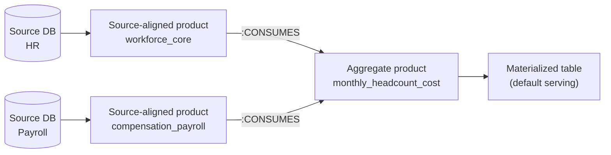

Everything else — authoring the schema, binding sources, mapping columns, reviewing, deploying — is identical to the consumer-aligned walkthrough below. After it deploys, the product carries an **Aggregate** chip in the marketplace, and its lineage shows both sources feeding it.

---

## 9. Consumer-aligned data products

> **Who:** Data Product Owner (defines the contract) + Data Engineer (implements it). **Where:** both workbenches. **Path:** Greenfield.

**Goal:** create a product shaped to a **specific consumer's need** — one that combines and transforms columns from one or more existing products, applying business rules, filters, and transformations the owner defines up front.

**When to use it:**
- You want a product tailored to one team's analytical need (a Finance team's monthly revenue report).
- The product combines data from multiple existing products.
- It needs transformations beyond a simple pass-through — grouping, filtering, history-tracking, calculated columns.
- You already have an ODCS contract you want to import (see the Ingest note at the end of this section).

**What you will have at the end:** a published, fit-for-purpose product whose every column has reviewed lineage back to the products it consumes.

### Source vs consumer, restated

A **source-aligned** product is a faithful, curated representation of one source database — the raw material. A **consumer-aligned** product is built *on top of* one or more products: the owner declares what they *need* (the columns, the grain, the filters, the rules) and the engineer implements the mappings that connect that declared schema to the underlying data. It is *contract-first*: the shape is decided before any source is bound.

### The flow

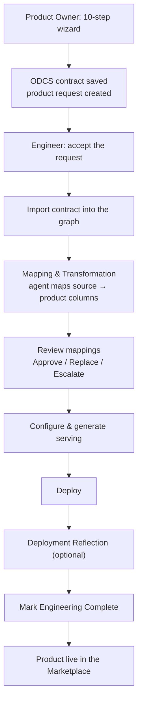

### Product Owner steps — the ten-step wizard

Go to **Product Workbench → New Product → Consumer-aligned product**.

**Steps 1–2 — Describe and shape the dataset.**
1. **Describe & Choose Domain** — name the concept and pick the business domain. If the [Blueprint Library](#13-the-blueprint-library-data-product-templates) has a matching template, it is offered here — click **Use template** to start from it (every field stays editable).
2. **Shape** — describe the **grain** (what does one row represent?), optionally add a filter (for example, *active customers only*), and choose a history policy if you need it: *Latest only* (keep the most recent record per key), *Slowly-Changing-Dimension Type 2* (keep the full history of changes with start and end dates), or *Snapshot* (pin to one point in time).

**Steps 3–4 — Define the schema.**
3. **Suggest candidate sources** *(optional)* — search for existing products that might feed this one. Picking some here helps the tool rank relevant columns for you in the next step. You can skip this and bind sources at step 9.
4. **Shape the Schema** — pick or add the columns your product needs. For each column you can mark it a **Group-by key** (for aggregated datasets), mark it **Suppressed** (keep it in the contract and lineage but drop it from the output), or open a **Derive** editor to say how it is calculated (rename, cast, concatenate, mask, hash, bucket, or a custom expression — the transform kinds from [section 5](#52-the-transform-catalog)).

**Steps 5–8 — Describe the product and its rules.**
5. **Product Details** — name, description, purpose, physical dataset name, and the **product kind** flag (consumer or aggregate — see [section 8](#8-aggregate-data-products)).
6. **Operations & Support** — service-level expectations, support contacts, roles (all optional; inherited from source products where available).
7. **Rule Coach** — review suggested quality rules for your schema; approve the ones that match your expectations. Approved rules are included in the published contract automatically.
8. **Readiness Review** *(optional)* — preview the product's readiness score and a sample of the questions consumers will be able to ask, before you submit.

**Step 9 — Bind to source products (required).**
9. **Confirm candidate sources** — the required submission gate. Confirm which published products this one will draw from. These links are recorded in the graph. You can run a **pre-flight gap check** here: it analyses whether each column in your schema can be matched to a column in the confirmed sources and flags each as *covered*, *derivable*, *ambiguous*, or *gap*. Fix gaps (adjust or add a source) or explicitly acknowledge them before submitting.

**Step 10 — Submit.** The request enters the engineer's Incoming queue.

### Data Engineer steps

**Accept the request**, then run the integration pipeline:

1. **Import contract** — mechanical; reads the owner's contract and creates the product structure in the graph.
2. **Mapping & Transformation** — an agent maps each product column to a source column from the consumed products, applying any transform hints the owner set. The results land in the **Mappings** review queue, where you **Approve**, **Replace**, or **Escalate** each one (see [section 5.4](#54-the-engineers-review-workflow-approve-replace-escalate)).
3. **Configure Serving** — choose how the product is delivered:

| Mode | Best for | How it works |
|---|---|---|
| **Virtual view** (default) | Simple, always-fresh reads | A SQL view in the target database; every query reads live from the sources |
| **Materialized table (dbt)** | Large datasets, history-tracking, reusable aggregates | Physically-built tables, with a sample → review → approve → full-build verification gate. Available on PostgreSQL, Snowflake, Databricks (not MySQL) |
| **Lakehouse (Parquet files)** | File-based consumers, offline analytics | Exports data as Parquet files with a transfer manifest; browsable with DuckDB |

4. **Data Serving** → **Deploy** → **Deployment Reflection** *(optional)* → **Mark Engineering Complete**.

> **Importing an existing contract instead.** If you already have an ODCS contract file, you don't have to retype it into the wizard. **Product Workbench → Ingest** lets you upload or paste a `.yaml`/`.json` contract (source-aligned *or* consumer-aligned). The tool detects which kind it is, and for consumer contracts it walks you through matching each required upstream to a marketplace product — with a **Mark as gap** option and a **Create now** button that spawns a source-product wizard for anything missing and links it back. Your progress auto-saves as a draft, so you can leave to author a missing source and resume later.

---

## 10. Connected Estate scanning and Data-Product Feasibility

> **Who:** Data Product Owner (the Data Engineer registers the connection). **Where:** Product Workbench. **Path:** Brownfield.

This is the flagship brownfield capability. Instead of building a product from a database you already know you want, you **connect Data Workbench to a live platform, let it scan the whole estate, and ask: of the products I *wish* I had, which can I actually build from what we already have?**

### The shopping-list-and-pantry idea

The whole feature runs on a kitchen metaphor:

- You hand over a **shopping list** of dishes you wish you could serve — a set of *desired reference data-product definitions* (for example, "a Credit Card product with these thirty attributes, keyed on `card_id`"). These come from the [Blueprint Library](#13-the-blueprint-library-data-product-templates).
- Data Workbench walks your actual **pantry** — your live databases (schemas, tables, columns) — and the **dishes already plated** — the data products already published to the marketplace.
- For each shopping-list item, it returns one honest verdict about how buildable that item is right now.

### The four-verdict stoplight

Every desired product is graded into one of four tiers:

| Verdict | Color on screen | Plain meaning | What you do next |
|---|---|---|---|
| **Ready** | 🟢 green | A published product already matches, almost exactly — no real change needed. | Adopt / endorse it in the marketplace. |
| **Adaptable** | 🔵 blue | A close published product exists but needs a small, *allowed* change (a rename, a currency normalization, a weekly-to-monthly roll-up). | Author a consumer product that consumes it. |
| **Assemblable** | 🟠 amber | The raw data exists in the estate and the pieces join, but it is not a governed product yet. | Compose a modernization portfolio — source products first, then the aggregate/consumer on top. |
| **Absent** | ⚪ slate (neutral) | No matching product **and** no matching raw data. | Note it as a genuine gap. An absence is information, not a failure. |

Notice the colors: **adaptable is blue and absent is a neutral slate**, deliberately — an absence is not an error, so it is not shown in red.

### How a grade is actually decided (the honest version)

You do not need the internals, but you should trust the grade, so here is what stands behind it:

1. **Two evidence pools, never mixed.** Only a *published product* can earn Ready or Adaptable; *raw estate tables* can only ever reach Assemblable. So you never see a "Ready" with no real product behind it.
2. **It figures out which schemas are even relevant first,** then matches each desired attribute to a column only within those relevant schemas. An `employees` schema will not accidentally contribute to a Credit Card product.
3. **One column can satisfy only one requirement,** so the coverage numbers are honest — nothing is double-counted.
4. **It is smart about look-alikes and ingredients.** It knows a `customer_id` sitting in a transactions table is a *reference* to a customer, not the customer record itself. And if the estate has `first_name` and `last_name` but you asked for `name`, it reports `name` as *derivable* rather than a gap.
5. **Coverage decides the tier, but an identity gate can override it.** Roughly: a product covering ~90% or more of the required attributes is Ready; ~60% or more is Adaptable; raw data covering ~60% *and joinable* is Assemblable. But if an essential identifier (the grain key, like `card_id`) is unmatched, the verdict is capped at Absent no matter how high coverage looks.
6. **The artificial intelligence is a bounded judge, not the scorekeeper.** All the arithmetic is deterministic. The agent can only *keep the same tier with a better explanation* or *be more conservative* — it can never inflate a grade. If the agent is unavailable, the run simply uses the deterministic result.
7. **"Couldn't tell" is never shown as "Absent."** A partial or failed scan shows *insufficient evidence*, so you are never misled into logging a gap that is really an incomplete scan.

### Key structure: Estate → Sources → Scans

- An **Estate** is a stable business scope (a name, optionally a domain) that holds one or more sources.
- A **Source** is a registered connection scoped to **one catalog/database**. To cover more of a platform, add several sources — one per catalog.
- A **Scan** is one metadata snapshot of a source's selected schemas. Re-scanning creates a *new* version; old snapshots are kept, and deleted objects are **tombstoned** (marked gone, never silently dropped) so you can see how the estate drifts over time.

### The journey: scan → enrich → recommend → evaluate → act

| Step | What you do | Notes |
|---|---|---|
| **Connect** | The **Data Engineer** registers a database connection (Engineering Workbench → **Connections**); the **Product Owner** then attaches it as an estate source. | Connections are engineer-owned; the deeper profiling pass is engineer-gated too. |
| **Scan** | Browse a source, tick which schemas to scan, run the scan. | A metadata snapshot only — **never row values**; deterministic, not an agent's guess. |
| **Enrich** *(strongly recommended)* | Click **Enrich metadata** to have an agent write descriptions of the tables and columns. | This is the single biggest accuracy lever — the grader leans heavily on this text. |
| **Recommend** *(optional)* | Click **✨ Recommend definitions** to let the tool pre-select the shopping-list items worth grading. | |
| **Evaluate** | Pick an estate and a domain, adjust the tuning levers if needed, and click **Evaluate**. | One run covers the latest scan of *every* enabled source, so it spans all your catalogs at once. |
| **Act** | On each verdict, take the routing action from the stoplight table above. | Ready → marketplace; Adaptable → consumer-product wizard (pre-bound to the matched product); Assemblable → a proposed portfolio you approve. |

### Connection setup, per platform

The four scannable platforms differ in how you connect them. The load-bearing rule: for the two "three-level" platforms (Snowflake and Databricks), the **catalog is set on the estate *source*, not on the connection** — you pick it when you add the source. Getting this wrong is the classic "I added two sources and got identical results" trap.

| Platform | Naming levels | Host | Port | Credential | Extra needed |
|---|---|---|---|---|---|
| **PostgreSQL** | 2 (`schema.table`) | server hostname | 5432 | password | — (the connection's database is the scan container) |
| **MySQL** | 2 (`database.table`) | server hostname | 3306 | password | — |
| **Snowflake** | 3 (`database.schema.table`) | account identifier (e.g. `xy12345.eu-west-1`) | 443 | password or personal access token | a **warehouse** (required); catalog set on the source |
| **Databricks** | 3 (`catalog.schema.table`) | workspace hostname | 443 | personal access token | the **HTTP path** of the SQL warehouse (required); catalog set on the source |

Practical pointers: use a **read-only, least-privilege** account (the scan only reads metadata); the **backend** opens the connection, so the host and port must be reachable from wherever the backend runs; and a cold serverless warehouse may make the first scan slow or empty — just retry.

### Honest limitations

- **You pick which *schemas* to scan, not which tables** — a whole schema is scanned or not.
- **One scan covers one catalog.** Cover several by adding one source per catalog; a single scan cannot yet enumerate across catalogs.
- **Joinability is inferred from key *names*, not real foreign keys** — a live metadata scan carries no foreign-key constraints, so "assemblable" join plans rest on shared identifier names. (Interestingly, the offline manifest in [section 12](#12-offline-extraction-no-live-connection) *does* capture real keys — a fidelity bonus.)
- **Derivations are same-table only** — combining ingredients across two tables is deferred.
- **"Absent" has no build button** in the grid — it is read-only there.
- **Only four platforms are scannable** (PostgreSQL, MySQL, Snowflake, Databricks).

The whole flow is also drivable from your own command line over the Product-Owner tool surface (see [section 22](#22-driving-data-workbench-from-your-own-command-line-mcp)).

---

## 11. Pulse Discovery

> **Who:** Data Product Owner. **Where:** Product Workbench → **Discovery**. **Path:** Brownfield.

There are **two** estate-discovery systems in Data Workbench, and they never share data. It is worth being clear about the difference, because the navigation labels are similar.

| | **Connected Estate** (section 10) | **Pulse Discovery** (this section) |
|---|---|---|
| Where the estate knowledge comes from | Data Workbench **scans the live platform itself** | An **external tool called Pulse** hands Data Workbench an assessment |
| Direction | **Top-down** — desired products graded for feasibility | **Bottom-up** — inventory existing sources and surface candidate products |
| Reached from | Product Workbench Home → **Connected Estate** / **Data-Product Feasibility** | Product Workbench Home → **Discovery** |
| One-line pitch | "Scan a live platform directly to inventory what we actually have." | "Work from a Pulse-powered assessment to inventory sources and surface candidate products." |

**When to use which, in plain terms:**
- Use **Connected Estate** when you *can connect Data Workbench directly* to the live databases and want the feasibility stoplight against a shopping list.
- Use **Pulse Discovery** when an *external assessment tool has already surveyed the estate* and you want to work bottom-up from its findings — typically to surface migration, modernization, or retirement candidates — rather than have Data Workbench crawl the platform itself.

They are separate by design and do not touch each other's data.

---

## 12. Offline Extraction (no live connection)

> **Who:** Data Product Owner (and the client, in their own environment). **Where:** Product Workbench. **Path:** Brownfield or Greenfield.

Sometimes a client will not hand Data Workbench live credentials to their databases. That blocks both the estate scan and greenfield discovery. **Offline Extraction** removes the blocker: the client runs a small, vetted tool in *their own* environment, produces a reviewable file, and sends that file back — the credential never leaves the client.

### How it works

```mermaid
flowchart LR
    A["Owner adds a source, marks it<br/>'no live connection'"] --> B["Download extraction kit"]
    B --> C["Client runs the kit<br/>in their own environment"]
    C --> D["Kit writes a YAML manifest<br/>(metadata + volumetrics + safe profiling)"]
    D --> E["Client reads it, confirms<br/>nothing sensitive, sends it back"]
    E --> F["Owner uploads the manifest"]
    F --> G["Data Workbench previews & validates<br/>(no graph write)"]
    G --> H["Replay into a real scan<br/>— identical to a live scan"]
```

1. In the Product Workbench, the owner adds a source but marks it **"I can't give Data Workbench a live connection."** Instead of a **Scan** button they get **Download extraction kit** and **Import scan**.
2. Data Workbench hands them a small, platform-tailored package: a dependency-light Python command-line tool, a requirements file with just the one database driver, a template for the client's token, and a README.
3. The **client** runs the tool in their own environment. An interactive picker lets them choose which schemas and tables to include. The tool reads metadata, volumetrics, and **safe-by-default, personally-identifiable-information-redacted** profiling, and writes a human-readable manifest file (a **DCAT-in-YAML** document — DCAT is the **Data Catalog Vocabulary**, an open cataloguing standard). The tool contains **no artificial intelligence** — it is pure, deterministic extraction, does only read-only introspection, never dumps whole tables, and tallies every value it withholds so the client can audit exactly what is and isn't in the file.
4. The client reads the file to confirm nothing sensitive is in it, then sends it back.
5. The owner uploads it. Data Workbench **previews and validates** it (counts, a redaction summary, warnings) *without writing to the graph*, then on confirm **replays it into a real scan that is identical in shape to a live scan** — so enrichment, feasibility, and acting on verdicts all work unchanged.

The offline manifest actually captures a little *more* than a live scan — real primary keys, exact row counts, and source comments.

### The two phases

| Phase | What the manifest seeds | Persona / entry point |
|---|---|---|
| **Estate replay** (brownfield) | Replays into a real estate **scan**, identical to a live scan; then enrich → feasibility as normal. | Owner, on the Connected Estate page — an offline source's *Download kit* → *Import scan*. |
| **Greenfield source-aligned seed** | The same manifest seeds a brand-new **source-aligned product** with no live source — the project's catalogue, datasets, columns, and profiling. | Owner ticks the offline toggle in the New Source Product wizard; the engineer then runs an "Import Uploaded Metadata" stage instead of live discovery. Everything after discovery is identical to the live path. |

### Honest limitations

- Enrichment (writing descriptions) still happens on the server side, not inside the no-artificial-intelligence extraction tool.
- The model is **one manifest per catalog/source**.
- The extraction tools for MySQL, Snowflake, and Databricks ship complete but are exercised most against PostgreSQL — treat a first run on a new platform as a smoke test.

---

## 13. The Blueprint Library (data-product templates)

> **Who:** Data Product Owner. **Where:** Product Workbench → **Data Product Templates**. **Path:** feeds both brownfield and greenfield.

The **Blueprint Library** is a built-in, browsable catalogue of **reusable data-product templates** — reference definitions of data products, each one an ODCS contract enriched with feasibility metadata (which attributes are required, which are keys, the grain, the allowed derivations, and so on). It is the single place these templates live, and it feeds three different workflows.

**What a user can do with it:**
- **Browse and filter** the grid — free-text search (semantic or keyword), a **Status** filter (Published vs My Drafts), an **Origin** filter (Seed / Clone / Imported / Authored), a **Kind** filter (source / aggregate / consumer), and **Domain** chips. Built-in **Seed** templates are read-only (a lock icon); you see all published templates plus your own drafts.
- **Clone** a seed into a fresh, fully-editable draft.
- **Edit** a draft in an embedded ODCS editor with an artificial-intelligence "Assist" panel.
- **Import** an ODCS file (paste or upload) as a new template, or **Export** one.
- **Publish** a draft (which makes it visible to everyone), or **Retract** it.

**The two ways templates get used:**

1. **As the shopping list for brownfield feasibility.** In Connected Estate / Data-Product Feasibility ([section 10](#10-connected-estate-scanning-and-data-product-feasibility)), the *published* templates **are** the list of desired products the scan grades your estate against. The result cards even cite that the specs were read live from the Blueprint Library.
2. **As starting points for a new product.** In the consumer-product wizard ([section 9](#9-consumer-aligned-data-products)), step 1 offers matching templates; clicking **Use template** clones one into the wizard, after which every column is editable.

**How it stays current:** publishing a draft simply flips its status to *published* and it becomes available everywhere immediately — including in the next feasibility run, because feasibility reads the published templates **live from the graph** every time. There is no separate "rebuild" step, and a publish survives a restart. Retracting hides it again immediately.

---

## 14. Inbound Intake (from an external assessment tool)

> **Who:** a practitioner (Data Engineer for migrations, Data Product Owner for modernizations). **Where:** the **Intake** tab in each workbench. **Path:** Brownfield.

Inbound Intake is a front door for an **external assessment tool** to push its findings into Data Workbench as ready-to-work projects. It is useful when a separate tool has already surveyed a client's landscape and produced migration or modernization recommendations, and you want to turn those into real projects without retyping them.

How it works: the external tool submits its (usually messy, unstructured) recommendations to a dedicated endpoint under a scoped machine credential. An isolated parser normalizes them into a strict, **confidence-graded blueprint** — it never guesses at required fields, so anything the assessment didn't say clearly is flagged as missing. A **practitioner then reviews and edits** the blueprint in the **Intake** surface, and approval is gated until every gap is filled — nothing is scaffolded that a human hasn't approved. On approval, one of two things is created:

- A **migration** submission scaffolds a **Data Migration** project, which the engineer then completes by picking a target and running the pipeline. Reviewed in **Engineering Workbench → Intake**.
- A **modernization** submission scaffolds a **portfolio** of source-aligned and consumer-aligned product projects that a product owner completes in the usual wizards. Reviewed in **Product Workbench → Intake**.

The review surface works both in the interface and from the command-line tool surface. Submission itself is available only through the endpoint (not the command line) — an external tool submits; a human reviews and approves.

---

## 15. Data Quality

> **Who:** Data Engineer (discovery) + Data Quality Analyst (rules, tests, scoring). **Where:** Engineering Workbench (for a standalone source) or on a product's board. **Path:** either.

**Goal:** assess how good a data source or product is — generate evidence-based quality rules, run automated tests against them, and produce a defensible quality score.

Data Quality has two related-but-distinct pieces: **testing** (does the data pass its rules right now?) and **scoring** (an overall 0–100% quality grade). Both are covered here.

### The testing lifecycle: Configure → Build → Run

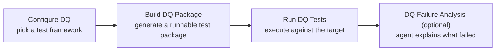

- **Configure** — choose the test framework in a small dialog (changeable later). The choice is either **Great Expectations** (an industry-standard library with the richest vocabulary of checks) or **Pure Python / Pandera** (lightweight schema validators, fewer dependencies, simplest for automated pipelines). Only one is active at a time.
- **Build** — generate a **self-contained, runnable test package** from the approved rules. Crucially, **nothing runs against live data during Build** — so the package appears instantly and can be downloaded or pushed to git the moment Build finishes.
- **Run** — actually execute the package against the target, record pass/fail and the offending values, and load the results into the graph so dashboards can show trends.
- **DQ Failure Analysis** *(optional)* — an agent writes a readable report grouping failures by table and column with the most common bad values.

### One switch: what is tested and where the rules come from

The behaviour differs by scenario, but only along two axes: **where the rules come from** and **what data the tests run against**. Under the hood there are exactly two modes, chosen automatically.

| Scenario | Mode | What is tested | Where the rules come from | Are rules generated? |
|---|---|---|---|---|
| **Standalone dataset** (a Data Quality or Data Discovery project) | catalog | The raw source tables | Discovered — mined from profiling, then approved | **Yes** (a "DQ Rule Generation" step) |
| **Source-aligned product** | product (with an optional catalog pre-check) | The deployed product output vs the contract; optionally the raw source as an early smoke test | Derived from the source, approved by the owner, baked onto the contract | Source side only |
| **Consumer-aligned product** | product | The deployed product output vs the contract | Authored directly by the owner on the contract | **No** — the rules already exist |

The convergence idea worth remembering: source-aligned and consumer-aligned products **both test the deployed product against its contract's rules** — they differ only in *how the rules got onto the contract* (a source-aligned product *derives* them; a consumer-aligned product has them *authored*).

To add the workflow, use **+ Add Workflow**: it offers **DQ Testing** for a dataset or a source pre-check, and **Product DQ Testing** for a product — and it only shows what makes sense for that project.

### The quality score: eight dimensions and a Red/Amber/Green band

Scoring is a **separate stage** from testing (it consumes test results as one input) that computes a composite score from 0 to 100% across eight weighted dimensions, at column, dataset, and overall levels:

| Dimension | Weight | What it measures |
|---|---|---|
| **Completeness** | 20% | How free of missing values the data is |
| **Uniqueness** | 16% | Whether columns that should be unique actually are |
| **Validity** | 16% | Whether values conform to the approved rules (this is where the latest **test** results feed in) |
| **Documentation** | 12% | Whether columns are described and the descriptions approved |
| **Consistency** | 10% | Whether foreign-key / referential relationships hold |
| **Grounding** | 10% | Whether rules are anchored to authoritative domain sources |
| **Schema Conformance** | 8% | Governance maturity — data type, nullability, and profiling present |
| **Rule Coverage** | 8% | Whether each column has at least one quality rule |

The overall score shows a band: **Green ≥ 80%, Amber 60–79%, Red < 60%.** There is also a Tier 1/2/3 evidence badge indicating how well-grounded the rules are. One honest subtlety worth knowing: *moving up a tier can lower the number* (because a stricter, better-grounded rule is harder to pass) — so read the shape of the result, not only the headline number.

### Why the package matters: it runs with Data Workbench turned off

The test package is a **real, portable artifact, not something locked inside Data Workbench.** After Build, you can **⤓ Download** it (a zip with the test code, a requirements file, and a README) or **↑ Push to Git** (into the product's repository alongside the serving code and docs). You can then run it against **any reachable database** with a plain `pip install` and one command, and — importantly — it **exits with a failure code on any failure, so it drops straight into an automated pipeline gate.**

Every run writes three files so the package reports its own verdict **with no Data Workbench and no knowledge-graph connection**:

| File | Audience | Contents |
|---|---|---|
| `run_result.json` | machines / automated pipelines | A standard verdict: overall status, per-table results, metrics |
| `report.md` | people | A readable pass/fail, per-table, with sample bad values |
| a timestamped results file | history | The full framework-native log, one per run |

This is a recurring doctrine across the product: **the package *is* the execution unit.** Data Workbench does not run tests (or serving, or migration) through a hidden internal path — it runs the same package you can download and run yourself. Your outputs outlive the tool.

### Remediation

Add a **DQ Remediation** workflow and run **Remediation Planning** — an agent identifies the highest-impact fixes. After your team fixes the source data, run **Re-Profile & Re-Score** to measure the improvement; the dashboard shows the score trend over time.

### Honest limitations

- A source-aligned project cannot hold a source pre-check suite *and* a product suite at the same time — run one at a time.
- Product-test failures do not yet link back to the specific product-column node in the graph (source tests do); the readable reports are unaffected.
- Product tests execute against PostgreSQL, Databricks, Snowflake, and MySQL; non-PostgreSQL platforms need the matching database driver installed on the backend (a missing one stops with a clear "install this" message).
- Products only *test* rules that already exist on the contract; a thin contract means thin coverage. Rule *generation* is a source/dataset capability only.

---

## 16. Data Migration

> **Who:** Data Engineer. **Where:** Engineering Workbench. **Path:** Migration.

**Goal:** move the tables of a legacy database onto a modern cloud warehouse, generate a re-runnable package that performs the move, and get row-count/checksum proof the data arrived intact.

**The most important thing to understand:** Data Migration is a **raw lift-and-shift**. It copies your tables exactly as they are — original names, original types — without reshaping, filtering, renaming, or recomputing anything. It is plumbing, not a published product: there is no product owner, no contract, and no marketplace entry. If you need the data reshaped, you do that *afterward* by building a product on top of the migrated data ([sections 7–9](#7-source-aligned-data-products)).

**When to use it:**
- You are lifting an old PostgreSQL, MySQL, Oracle, or SQL Server system onto Snowflake or Databricks.
- You want an automatically generated, auditable pipeline instead of hand-written load scripts.
- You want reconciliation evidence that the move is complete and correct.

**Supported endpoints:** sources are **PostgreSQL, MySQL, Oracle, SQL Server**; targets are **Snowflake, Databricks**.

### At a glance

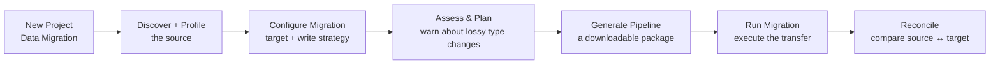

| Stage | What it does | Uses an agent? |
|---|---|---|
| **Discover + Profile** | Catalogues every schema, table, and column, and flags timestamp/sequence columns that could drive incremental loads | Yes |
| **Configure Migration** | A form — the target connection, the write strategy (replace or append), and for Snowflake/Databricks the target catalog and schema | No |
| **Assess & Plan** | An agent checks each source column's type against the target's type system and **warns** about lossy conversions (an Oracle `DATE` carries a time-of-day a plain `DATE` target would drop) | Yes |
| **Generate Migration Pipeline** | An agent produces the downloadable package | Yes |
| **Run Migration** | Executes the package, loading every table onto the target; per-table progress streams into the log | No |
| **Reconcile** | Re-runs the package in verify mode, comparing row counts and checksums source-versus-target, stored as evidence | No |

### What you get

- **A downloadable, git-pushable package** — this *is* the execution unit, with no dependency on Data Workbench. It contains a `migration.json` (the spec: source and target platforms, target schema, write strategy, one entry per table), a stdlib runner (`run.py` with load / verify / plan modes), a generated README, and reconciliation manifests. You can run it yourself or push it to a git repository.
- **Reconciliation evidence** — row-count and checksum comparison as proof the move landed. Quality is reconciliation-only by default; add the full Data Quality workflow if you want deeper testing of the migrated data.
- **Queryable graph nodes** — a *reconciled* migration also records its target as isolated graph nodes with lineage from the source. These are what a Code Migration project ([section 17](#17-code-migration)) links to.

### The offline / schema-only variant

Many engagements have no live source connection yet — only a schema from an assessment. A schema-only mode lets you run everything that doesn't need real data (enrich, assess, *generate* the pipeline) while **Run and Reconcile stay locked** until a real source and target are connected. It adds a **Confirm Physical Schema** review step (you confirm names, types, and keys because an assessment is too lossy to trust as a machine contract) and a deterministic seed step. When a live source arrives, **Flip to live** deletes the seeded guess and re-runs against the real schema.

### Two features share the word "transfer" — don't confuse them

| | **Data Migration** (this section) | **Cross-platform serving transfer** ([section 5.6](#56-where-transformation-happens-in-each-flow)) |
|---|---|---|
| Who runs it | Data Engineer | Data Product Owner / product engineering |
| What moves | A **whole database**, table by table | A **single product's** shaped output |
| Reshapes the data? | **No** — raw copy | **Yes** — the full transform vocabulary |
| Marketplace product? | No — plumbing only | Yes — it is a product's serving mode |

Rule of thumb: moving a legacy database wholesale is Data Migration; serving one product across platforms with an intelligent transform split is the serving transfer mode.

### Honest limitations

- **No transformation at all** — pure raw copy. If you need reshaping, this isn't the tool.
- **Type coercion is only advisory** — Assess & Plan *warns* about lossy conversions but does not fix them; the load engine maps types implicitly.
- **Identifiers may be normalized** (for example `"CustomerID"` becoming `customer_id`) by the load engine, and you cannot currently control that.
- **Quality is reconciliation-only** by default.

---

## 17. Code Migration

> **Who:** Data Engineer. **Where:** Engineering Workbench. **Path:** Migration.

**Goal:** convert legacy code (queries, jobs, reports) written for one platform into new code for a modern target — by reverse-engineering it into a *reviewed specification* first, then forward-engineering it against the target's best practices — and get a package with the old and new code side by side.

Code Migration is the code sibling of Data Migration: **Data Migration moves the tables; Code Migration converts the code that runs against them.** Like Data Migration, it is engineer-initiated and produces no marketplace product.

**Why the reverse-then-forward approach** (rather than a single-shot translation): decomposing the work buys you **explainability** (you see how the code was interpreted *before* any new code exists), a **human review gate**, and **full lineage** (original code → reviewed spec → design → new code). A single-shot translation gives you none of that and tends to fail on niche source platforms.

### The flow

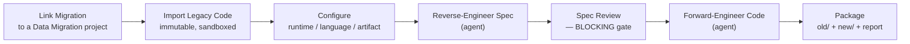

1. **Link Migration** — pick a completed Data Migration project. Data Workbench snapshots the source-to-target schema mapping from that migration and **locks the target platform** to the migration's target. (This is why Code Migration always links to a Data Migration project — it needs a real, reconciled schema to rewrite code against.)
2. **Import Legacy Code** — upload the code. It lands in an **immutable** folder with a checksum manifest and is treated as **untrusted data**: the agent stages run with **no shell access** and never execute it.
3. **Configure Conversion** — choose the target runtime/version, the output language, and the artifact kind (a SQL script, a PySpark job, or a notebook). The **target platform is not selectable** — it is locked from the linked migration.
4. **Reverse-Engineer Spec** *(agent)* — produces a specification: the business intent, the source tables and columns it touches (matched to the schema mapping), and the legacy constructs it found.
5. **Spec Review** — you review and edit the spec, then **Approve**. **This is a hard, blocking gate**: forward engineering is refused (enforced on the server, not just hidden in the interface — even the command-line tool cannot force past it) until the approved spec, the source manifest, the linked migration, and the reference material all line up. Editing an approved spec re-opens the review.
6. **Forward-Engineer Code** *(agent)* — generates the converted code, grounded on the target reference material and the locked schema mapping (the agent never invents target relations). It also writes a per-construct report bucketing each item as **converted**, **needs manual action**, or **unsupported**, with lineage, and statically checks the output.
7. **Package** — assembles the downloadable zip and optionally pushes it to git.

An honest framing you will see: a conversion with any "manual action" or "unsupported" items is a **"converted with actions"** result — it packages, but it is never presented as a clean success. Someone finishes those by hand.

### The two reference corpora

Grounding comes from two curated, version-controlled reference collections (not the model's memory):

| Corpus | What it holds | Ships with |
|---|---|---|
| **Source corpus** | *What to identify* in the legacy code — libraries, query idioms, platform-specific patterns and anti-patterns | MySQL, PostgreSQL, Teradata, Oracle |
| **Target corpus** | The target's *patterns, best practices, and anti-patterns* — **this is the steering point**: a client forks it to control how the converted code looks (their naming conventions, house patterns, banned anti-patterns) | Databricks, Snowflake |

The two are tracked separately because they invalidate differently: changing the *source* corpus invalidates the spec and everything downstream; changing the *target* corpus invalidates only the conversion output, not the reviewed spec. (Overriding a corpus today means forking the reference material and rebuilding — per-client runtime overlays are future work.)

### What you get

A downloadable, git-pushable package laid out as:

```
<project>-code-migration/
  old/            the original legacy code, exactly as imported (immutable)
  new/            the converted target-platform code
  codespec.json   the reviewed specification
  design.md       forward-engineering design notes (if produced)
  conversion.json per-construct report: converted / manual action / unsupported
  README.md       what was converted + the original → spec → design → new-code lineage
```

Sample legacy code to try it on lives in `samples/code-migration/` (a MySQL human-resources report and a PostgreSQL sales roll-up).

### Honest limitations

- **"Converted with actions" is common** — any manual-action or unsupported construct needs finishing by hand.
- **Single-script import today** (multi-file module support is future work).
- **Requires a completed Data Migration to link to** (loaded at minimum; fully reconciled to be marked verified).

---

## 18. The Marketplace

> **Who:** everyone. **Where:** both workbenches.

The **Marketplace** is where published products are discovered and explored. Products are listed with their name, domain, kind (Source / Aggregate / Consumer), and a status badge; filter with the chips at the top. Click any product to open its detail view.

| Tab | What you see |
|---|---|
| **Overview** | Description, domain, purpose, version, contacts, service levels, and cross-references to the products it consumes and the products built on top of it |
| **Schema** | Column names, types, descriptions, and per-column quality rules |
| **Quality** | All approved quality rules, grouped by table and category, with filters |
| **Readiness** | A readiness score (a Red/Amber/Green band) that asks "is this product semantically consumable?" — independent of the underlying data quality — with a per-criterion "what to fix" checklist |
| **Q&A** | The questions this product can answer, plus a free-form box to check whether a specific question is answerable |
| **Lineage** | An interactive canvas of column-level lineage from source columns to product columns, plus a product-to-product consumption view and a five-column value-flow (Sankey) view |
| **Serving** | The serving mode, connection details, and a download-package button |
| **Preview** | Sample rows from the deployed output, so you can see real data before using the product |
| **Reflection** | The post-deployment agent report — surprises, alignment checks, recommendations |

There is also a **Datasets** sub-tab that lists discovered tables that are not yet products — a table becomes a product (and moves out of the Datasets list) automatically once its columns are mapped into one.

**Reporting a gap.** If a product is missing something you need, click **Report a gap** on the product detail. Your note goes to the product owner as a notification, and they decide whether to enhance the product or create a new one.

**Readiness scoring** (mentioned above) is worth a sentence of its own: it checks whether the contract carries enough *semantic* information for a downstream analytics or artificial-intelligence consumer to use it without asking the producer questions — do datasets have descriptions, do fields carry real expressions rather than bare pass-throughs, are keys and relationships declared. It is distinct from the data *quality* score in [section 15](#15-data-quality): quality asks "is the data good?", readiness asks "is the product understandable and safe to consume?"

---

## 19. The Semantic Layer and Semantic Q&A

> **Who:** Data Steward (builds it) + everyone (uses the chat). **Where:** Concepts page + the Marketplace chat.

The **Semantic Layer** is a curated dictionary of **business concepts** — entities (Customer, Order, Employee), attributes (customer.email, order.amount), and enumerated values (status: active, inactive) — that sit on top of the deployed products and let people ask questions in plain English.

**Building it (Data Steward).** On the **Concepts** page, a three-step Discovery sequence builds or refreshes the concept layer for a domain:
1. **Derive entities from schema** — automatically creates entity, attribute, and value concepts from the product structure (deterministic, instant).
2. **Find cross-product concepts** — an agent identifies concepts that appear across several products and elevates them into shared, domain-level concepts.
3. **Enrich names and definitions** — an agent refines names and adds definitions and synonyms for better natural-language matching.

Each step shows when it last ran and a **staleness indicator** that warns when the underlying products have changed since. Concepts that score below the auto-promote threshold land in a **Review Queue** for a steward to promote or discard.

**Using it: Semantic Q&A.** At the bottom of the Marketplace, a chat panel lets anyone ask questions in plain English across the deployed products in a domain — for example, *"What was total revenue in the first quarter by region?"* The system finds the relevant concepts, builds a SQL query, runs it, and returns the answer with an **Explain** trace showing how it was derived (how the question was decomposed, which concepts matched, how the SQL was built, how values were verified).

> **Two honesty caveats worth stating plainly.** First, the domain-wide Semantic Q&A chat **depends on the semantic layer above** — without a built concept layer it falls back to a less precise mode. Second, the per-product **Q&A tab** in the marketplace ([section 18](#18-the-marketplace)) is a **validation aid** — a quick way to sanity-check what a single product can answer — not a finished enterprise semantic-query interface. Don't position it to consumers as the latter.

---

## 20. Reviews and approvals

> **Who:** the reviewing roles (Steward, Reviewer, Quality Analyst, Product Owner, Engineer).

Reviews are the human gates that make "the agent drafts; a person decides" real. After many stages finish, they enter **Awaiting Review**, and the Reviews tab shows the pending queue.

**Reviewing descriptions.** A Steward or Reviewer sees each generated description next to the column name, table, and type, and either **Approves** (with a rating of Acceptable / Good / Excellent) or **Rejects** — writing a corrected version and choosing a category for what was wrong. When the queue empties, the stage flips to Complete.

**Reviewing mappings.** Each pending mapping shows the source column(s), the target column, a confidence score, and a badge for who authored it. The three actions — **Approve**, **Replace**, **Escalate** — are described in [section 5.4](#54-the-engineers-review-workflow-approve-replace-escalate). The mapping review surface is rich: it has a graph canvas where hovering an edge shows the transform details and clicking a column isolates its edges; a **Re-run** control (refresh keeping approvals, or start over); previous/next navigation through already-reviewed items; and a **Guide me** button per mapping that opens the chat pre-filled with that column's context. When the agent cannot find a confident source for a column, that column appears in an **Unmapped Columns** panel where you hand-create the mapping.

**Reviewing quality rules.** Domain-generated rules land in a queue for a Quality Analyst to approve or reject; rejected rules do not affect tests or scores.

**Source product validation (Product Owner).** For source-aligned products, the owner clears a combined five-tab gate (names, descriptions, table classifications, relationships, rules) before the engineer can build the product ([section 7](#7-source-aligned-data-products)).

Every rejection carries a category and a reason, and both are stored as an auditable provenance trail, so a product owner can see exactly what to revise.

---

## 21. The advisory chat assistants

> **Who:** Data Engineer (Ask) + Data Product Owner (Guide me).

There are two coaching chat surfaces. **Both are advisory — neither writes to the knowledge graph.**

**The engineer's "Ask" panel** (Engineering Workbench) is a drawer on every project page. It is **scoped to the current project only** and is **read-only**: it answers questions about the project's graph and interprets scores, and every factual claim it makes is backed by a query you can see. Use it for exploring the graph (*"Which columns have no approved description?"*), interpreting scores (*"Why is my documentation score low?"*), diagnosing failures (*"The mapping stage failed — what happened?"*), and tracing lineage (*"Where does the `customer_id` column come from?"*). For actions — approvals, running stages, editing contracts — use the interface panels.

**The owner's "Guide me" panel** (inside the New Product wizard) coaches the product owner through authoring. It can suggest column names and descriptions, add columns to the schema, set transform hints, create or approve quality rules, and set dataset-level shape. When it makes a suggestion, an **Apply** button appears; clicking it writes the suggestion straight into the wizard's form fields.

> **Honesty note.** A separate "per-run learning coach" that would learn from your history across runs is **described in internal design notes but is not shipped** — do not expect it, and don't let anyone present it as a live feature.

---

## 22. Driving Data Workbench from your own command line (MCP)

> **Who:** Data Engineers and Data Product Owners who prefer a command line.

Both personas can drive Data Workbench from **their own command-line assistant** (such as Claude Code, Cursor, or Codex) using **MCP** (the **Model Context Protocol**, an open standard for connecting an assistant to a tool). This is useful for scripted workflows, complex multi-step operations, or wiring the workbench into a larger automated pipeline.

There are **two front doors** onto the same backend:

- **`/mcp`** — the **Data Engineer** door, with **142 tools** (list projects, run a stage, review a mapping, deploy, and so on).
- **`/po-mcp`** — the **Data Product Owner** door, with **68 tools** (portfolio, the conversational authoring assistant, the validation gate, publish, Connected-Estate feasibility, offline extraction, the Blueprint Library).

Your machine is a **thin client** — the actual work still runs on the server, so you need no local database credentials and no local copies of the skills. Ask an administrator for the server URL and a token, then run the one-line installer for your persona:

```bash
# Data Engineer
curl -fsSL http://<workbench-host>:8000/api/engineer-kit/install.sh \
  | WORKBENCH_TOKEN=<your-token> bash -s -- ~/path/to/your-project

# Data Product Owner
export WORKBENCH_TOKEN=<your-token>
curl -fsSL http://<workbench-host>:8000/api/po-kit/install.sh | bash
```

After installing, open the project in your assistant and just *ask* — "List my workbench projects," "Run discovery on the Customer Master project," "Which mappings are pending?" If you are not sure which door you need, paste the output of `curl http://<workbench-host>:8000/api/bootstrap` into a fresh session and it will set itself up.

The same plain-English Semantic Q&A you get in the marketplace is available from the command line too (*"using the workbench, how many customers are in each segment?"*).

---

## 23. Roles and permissions reference

### Which roles can run which stages

| Stage | Product Owner | Engineer | Quality Analyst | Steward |
|---|:--:|:--:|:--:|:--:|
| Select Data Source | | ✓ | | |
| Data Discovery / Profiling | | ✓ | | |
| Metadata Enrichment | | ✓ | | |
| Column-Name Standardization | | ✓ | | |
| Quality Rule Generation | | | ✓ | |
| Quality Testing (build + run) | | | ✓ | |
| Quality Scoring | | | ✓ | |
| Quality Remediation | | | ✓ | |
| Initiate / author ODCS contract | ✓ | | | |
| Import Contract | | ✓ | | |
| Mapping & Transformation | | ✓ | | |
| Data Serving (all modes) | | ✓ | | |
| Deploy | | ✓ | | |
| Deployment Reflection | | ✓ | | |
| Mark Discovery / Engineering Complete | | ✓ | | |
| Synthesize / Auto-Map (source-aligned) | | ✓ | | |
| Marketplace Deploy / Score readiness | ✓ | | | |
| Source product validation (source-aligned) | ✓ | | | |
| Reflect on Reviews | | | | ✓ |
| All Migration and Code-Migration stages | | ✓ | | |

### Which roles can action which review queues

| Review queue | Who can action it |
|---|---|
| Column descriptions | Steward, Reviewer (Product Owner for source-aligned products, in the validation panel) |
| Table descriptions + classifications | Product Owner (source-aligned validation panel) |
| Mappings (Approve / Replace / Escalate) | Reviewer, Engineer |
| Unmapped columns (manual mapping) | Engineer |
| Domain quality rules | Quality Analyst, Reviewer |
| Transformation escalations | Steward |
| Source product validation (all tabs) | Product Owner |
| Inbound intake (migration) | Engineer |
| Inbound intake (modernization) | Product Owner |
| Code-migration spec | Engineer |

---

## Glossary

- **Aggregate product** — a reusable product that consumes and combines other products, meant to be consumed further. See [section 8](#8-aggregate-data-products).
- **Archetype** — the category of work a project does (Data Discovery, Data Quality, Source-aligned product, Consumer-aligned product, Data Migration, Code Migration). See [section 2.3](#23-archetypes--the-kind-of-work-a-project-does).
- **Brownfield** — starting from an inherited estate of existing systems and grading what you can build from them. See [section 3](#3-which-path-are-you-on-greenfield-vs-brownfield).
- **Consumer-aligned product** — a fit-for-purpose product shaped to one team's need, built on top of other products. See [section 9](#9-consumer-aligned-data-products).
- **DCAT (Data Catalog Vocabulary)** — an open standard for describing datasets; used as the format of the offline extraction manifest.
- **Data product** — a dataset published with a contract, an owner, quality rules, a queryable output, and lineage — not just a raw table.
- **Feasibility** — grading desired products against your estate with a four-verdict stoplight. See [section 10](#10-connected-estate-scanning-and-data-product-feasibility).
- **Greenfield** — building new products from data you can already reach, bottom-up. See [section 3](#3-which-path-are-you-on-greenfield-vs-brownfield).
- **Knowledge graph** — the Neo4j database that stores everything Data Workbench learns; the single source of truth.
- **Lineage** — the recorded chain showing where each column came from.
- **Materialized serving** — building physical tables (using dbt) rather than a live view. Available on PostgreSQL, Snowflake, Databricks (not MySQL).
- **MCP (Model Context Protocol)** — an open standard for connecting a command-line assistant to a tool. See [section 22](#22-driving-data-workbench-from-your-own-command-line-mcp).
- **ODCS (Open Data Contract Standard)** — the open, machine-readable format Data Workbench uses for data contracts. See [section 2.5](#25-odcs-data-contracts).
- **Profiling** — computing statistics about a column (null rate, distinct values, min/max, common values).
- **Pulse** — an external assessment tool whose findings feed the bottom-up Pulse Discovery surface. See [section 11](#11-pulse-discovery).
- **SCD (Slowly-Changing Dimension)** — a policy for how a product handles history: `latest_only`, `scd2` (full dated history), or `snapshot`.
- **Source-aligned product** — a curated, faithful product built directly from one source database; the building block. See [section 7](#7-source-aligned-data-products).
- **Stage** — one step inside a workflow. **Workflow** — a named sequence of stages inside a project.
- **Virtual view** — a SQL view that reads live from the source; the default serving mode.

---

## Frequently asked questions

**What is a data product?** A named, described, quality-checked dataset published in the marketplace for other teams to use. It has a formal contract, column-level descriptions and rules, a queryable output, and full lineage.

**What is the difference between a source-aligned and a consumer-aligned product?** A source-aligned product is a curated version of one source database (the building block). A consumer-aligned product is shaped to a specific need and built on top of other products — it can combine several, transform them, and filter to a specific grain. An *aggregate* is a consumer-aligned product meant to be reused by further products.

**Which is greenfield and which is brownfield?** Greenfield = building new products from data you can reach. Brownfield = scanning an inherited estate and grading what you can build from it. The dividing line is whether the source systems pre-exist and were designed to fit — not who initiates the work. See [section 3](#3-which-path-are-you-on-greenfield-vs-brownfield).

**Which platforms are supported?** For *scanning*: PostgreSQL, MySQL, Snowflake, Databricks. For *serving*: the same four (materialized tables everywhere except MySQL). For *migration*: sources are PostgreSQL/MySQL/Oracle/SQL Server, targets are Snowflake/Databricks. Only PostgreSQL is live-tested ("certified"); the rest are "preview." See [section 4](#4-supported-data-platforms).

**Does Data Migration transform the data?** No — it is a raw lift-and-shift. Reshape afterward by building a product on top of the migrated data. See [section 16](#16-data-migration).

**What does "Awaiting Review" mean?** A stage produced agent-generated results that need a person to check them before they count. The stage stays in that status until a qualified reviewer clears the queue.

**What is a virtual view?** A SQL `CREATE VIEW` statement. It copies no data — it names a query that runs live against the source when a consumer reads it. It is the default serving mode because it is always fresh and needs no storage.

**What happens when a published product is edited?** Editing creates a new draft version while the current version stays published and visible. Consumers keep seeing the current version until the new one is completed and deployed, so in-progress edits never leak.

**Is there a login?** Not by default. Optional authentication can be enabled by an administrator, but access between personas is currently enforced in the interface only. See below.

---

## What is shipped today vs on the roadmap

Data Workbench is deliberately honest about what is and isn't built. This section lists the notable boundaries so nothing here surprises you.

**Shipped and usable:**
- The full greenfield build path (Discovery → Source-aligned → Aggregate → Consumer-aligned) and the marketplace.
- The brownfield tools: Connected Estate scanning, Data-Product Feasibility, Pulse Discovery, Offline Extraction, the Blueprint Library, and Inbound Intake.
- Data Quality (testing, scoring, remediation) and the downloadable, self-contained packages.
- Data Migration and Code Migration.
- The Semantic Layer and Semantic Q&A.
- Both command-line (MCP) front doors.

**Real limitations and roadmap items:**
- **Authentication is optional and off by default; there is no hardened access-control layer** — persona and role access are enforced in the interface, not by security middleware. Hardening this is on the roadmap. Treat a shared installation accordingly.
- **A "Data Modernization" archetype** exists as a placeholder only — you cannot create one yet.
- **The per-run advisory "learning coach"** described in internal design notes is **not shipped**.
- **Feasibility grading** infers joinability from key *names* (not real foreign keys), scans one catalog per scan and whole schemas at a time, derives only within a single table, and offers no build button for "absent" items. See [section 10](#10-connected-estate-scanning-and-data-product-feasibility).
- **Only PostgreSQL is live-tested**; the other platforms are "preview" — solid but expect occasional rough edges.
- **Materialized serving is not available on MySQL** (virtual views only there).

---

*This guide describes Data Workbench as of September 2026. Feature counts (142 engineer tools, 68 product-owner tools, 70 skills), platform support, and tool details evolve — when a number here disagrees with what you see in the running product, trust the product.*


