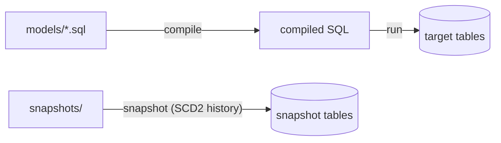

# How dbt actually builds the models (under the hood)

Human-verified source of truth for the dbt package's **"How the technology works"**
section. dbt turns the SQL in `models/` into physical relations on the target in
three moves. Branch the middle move on the **materialization**; add the snapshot
move only when the product has SCD2 datasets (`has_snapshots`).

## The moves

1. **compile** — dbt renders the Jinja + `ref()` / `source()` in each model into raw
   SQL for the target adapter (Postgres / Snowflake / Databricks / …). No data moves.
2. **run** — dbt executes each compiled model, materializing it per its config:
   - **table** (the DWB default) — a full `CREATE TABLE AS SELECT`, **rebuilt on every
     build**.
   - **incremental** — new/changed rows are `MERGE`d into the existing table instead of
     a full rebuild.
   - **view** — the model is registered as a database `view` (recomputed on read).
3. **snapshot** (SCD2 only) — dbt **snapshots** track row changes over time into a
   snapshot table, stamping `dbt_valid_from` / `dbt_valid_to` so history is preserved.

Per-model status lands in `target/run_results.json` (dbt's own machine-readable
result), which the package's `run.py` normalizes into `run_result.json`.

## Under-the-hood mermaid (table materialization, with snapshots)

Drop the `snapshots/ → snapshot tables` edge when the product has no SCD2 datasets.
Keep it to a short paragraph + the one matching mermaid. Do NOT restate the
orchestration diagram from the "How it works" section.
