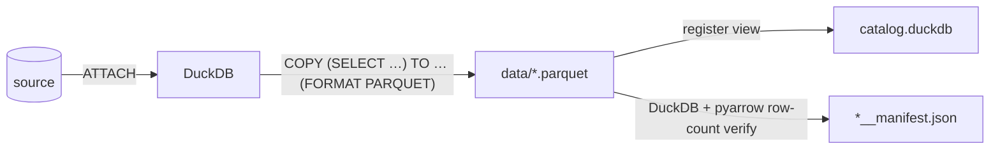

# How the lakehouse export actually works (under the hood)

Human-verified source of truth for the lakehouse package's **"How the technology
works"** section. The export runs entirely inside **DuckDB** — one fixed mechanic
regardless of the source (naming the source, when known, sharpens the prose).

## The mechanic

1. **ATTACH** — `run.py --mode export` ATTACHes the live source (Postgres / MySQL /
   …) to DuckDB.
2. **COPY → Parquet** — for each dataset DuckDB runs
   `COPY (SELECT …) TO 'data/<name>.parquet' (FORMAT PARQUET)`, streaming the query
   result straight to columnar **Parquet**. No intermediate load into DuckDB storage.
3. **register** — a DuckDB view over each Parquet file is registered in
   `catalog.duckdb`, so the export is queryable offline with zero source access.
4. **verify** — the row count is checked with **two independent engines** (DuckDB +
   pyarrow); on agreement a **TransferBatch v1** manifest is written per dataset
   (row counts, checksums, schema fingerprint).

## Under-the-hood mermaid

Keep it to a short paragraph + the one mermaid. Do NOT restate the orchestration
diagram from the "How it works" section.
