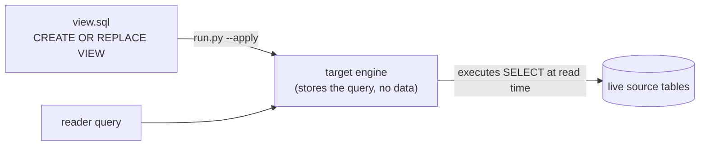

# How a virtual view actually works (under the hood)

Human-verified source of truth for the view package's **"How the technology works"**
section. A virtual view is **zero-copy** — one fixed mechanic; only the quoting /
namespacing detail branches per platform.

## The mechanic

1. **deploy** — `run.py --apply` sends `CREATE OR REPLACE VIEW` statements to the
   target engine. **No data is moved or duplicated** — a view is a *stored query*,
   not a table.
2. **read-time execution** — every time the view is queried, the target engine
   re-executes the underlying `SELECT` against the **live source tables**. Results are
   therefore always current; there is no refresh, no history, no storage cost.

Identifier quoting / namespacing is per-platform:

| Platform | Identifier quoting |
|---|---|
| Postgres | double-quoted (`"schema"."view"`) |
| Snowflake | double-quoted |
| MySQL | backtick-quoted (`` `schema`.`view` ``) |
| Databricks | backtick-quoted (catalog.schema namespace) |

## Under-the-hood mermaid

Keep it to a short paragraph + the one mermaid. Do NOT restate the orchestration
diagram from the "How it works" section.
