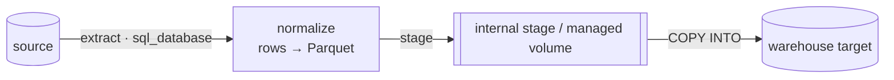
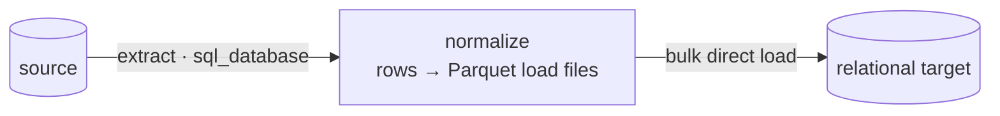

# How dlt actually moves the data (under the hood)

Human-verified source of truth for the migration package's **"How the technology
works"** section. `dlt` does **not** issue row-by-row `INSERT`s — it runs a
three-stage pipeline. Pick the **load** variant by the *target platform family*,
then state the write disposition.

## The three stages (always)

1. **extract** — the `sql_database` source reads the source tables over SQLAlchemy
   (streamed in batches, not one big result set).
2. **normalize** — extracted rows are written to local **Parquet** load files (dlt's
   intermediate columnar format), with schema inferred/normalized.
3. **load** — the Parquet load files are pushed into the target. This step is
   platform-specific (below).

## Load variant — branch on the TARGET family

### Warehouse targets → stage the Parquet, then bulk `COPY`
The engine never does row-by-row inserts. The normalized Parquet is uploaded to the
warehouse's staging area and pulled in with a single bulk copy command:

| Target | Staging area | Bulk load command |
|---|---|---|
| Snowflake | an internal Snowflake stage | `COPY INTO` |
| Databricks | a managed Unity Catalog volume | `COPY INTO` |
| Redshift | an S3 staging area | `COPY` |
| BigQuery | Google Cloud Storage | a BigQuery load job |

### Relational targets → direct bulk load (no external stage)
Postgres / MySQL / Oracle / SQL Server have no external stage; dlt bulk-loads the
Parquet load files straight into the target table.

## Write disposition (state exactly one)

- **replace** — the target table is dropped and rebuilt on every load (full refresh).
- **append** — each load appends new rows to the target table.
- **merge** — rows are upserted into the target on the **primary key** (`merge`).

Keep it to a short paragraph + the one matching mermaid. Do NOT restate the
orchestration diagram from the "How it works" section.
